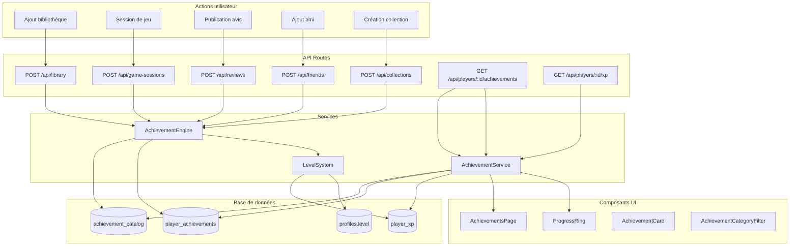

# Design — Système de Succès (Achievements)

## Overview

Le système de succès étend les fondations existantes (`player_achievements`,
`game_sessions`, `profiles.level`) avec un catalogue de succès en base de
données, un moteur d'évaluation automatique, un système XP/niveaux, et les
interfaces utilisateur associées (anneau de progression sur le profil, page
dédiée aux succès).

Actuellement, les succès sont définis en dur dans `ACHIEVEMENT_DEFINITIONS` (10
entrées dans `src/types/dashboard-stats.ts`) et évalués à la volée dans
`dashboardStatsCompute.ts`. Cette feature migre ces définitions vers une table
`achievement_catalog` en base, ajoute une table `player_xp` pour le suivi XP, et
introduit un `AchievementEngine` côté serveur qui évalue et attribue les succès
automatiquement lors d'actions utilisateur.

### Décisions clés

1. Le catalogue de succès est stocké en base (pas en dur dans le code) pour
   permettre l'ajout futur de succès sans déploiement.
2. L'évaluation des succès est déclenchée côté serveur après chaque action
   pertinente (ajout bibliothèque, session, avis, ami, collection), pas via des
   triggers SQL, pour garder la logique métier dans le code applicatif.
3. La formule de niveau `floor(0.3 × √(xp_total)) + 1` est implémentée comme
   fonction pure testable.
4. Le `Progress_Ring` est un composant SVG client-side utilisant le dégradé
   neon-violet → neon-cyan existant.

## Architecture



### Flux d'évaluation des succès

1. L'utilisateur effectue une action (ex: ajoute un jeu à sa bibliothèque)
2. La route API existante traite l'action principale
3. Après succès de l'action, la route appelle
   `AchievementEngine.evaluate(userId, category)`
4. L'engine récupère les succès du catalogue pour cette catégorie
5. Pour chaque succès non débloqué, l'engine vérifie si le seuil est atteint
6. Si oui, insertion dans `player_achievements` + ajout XP dans `player_xp`
7. Mise à jour du niveau dans `profiles.level` si le niveau change

## Components and Interfaces

### Services (src/lib/services/)

#### achievementEngine.ts — AchievementEngine

Responsable de l'évaluation et de l'attribution des succès.

```typescript
interface EvaluationResult {
  newlyUnlocked: Array<{ key: string; xpAwarded: number }>;
  totalXpAwarded: number;
  newLevel: number | null; // null si pas de changement
}

class AchievementEngine {
  /** Évalue les succès d'une catégorie pour un joueur */
  static async evaluate(
    userId: string,
    category: AchievementCategory
  ): Promise<EvaluationResult>;

  /** Récupère le compteur actuel d'un joueur pour une catégorie */
  static async getPlayerCount(
    userId: string,
    category: AchievementCategory
  ): Promise<number>;
}
```

#### levelSystem.ts — Fonctions pures pour le calcul XP/niveaux

```typescript
/** Calcule le niveau à partir de l'XP total */
function computeLevel(xpTotal: number): number;

/** Calcule l'XP requis pour atteindre un niveau donné */
function xpForLevel(level: number): number;

/** Calcule la progression vers le niveau suivant (0-100%) */
function computeLevelProgress(xpTotal: number): {
  level: number;
  currentLevelXp: number;
  nextLevelXp: number;
  progressPercent: number;
};
```

#### achievementService.ts — AchievementService

Service de lecture pour les API et composants.

```typescript
class AchievementService {
  /** Récupère tous les succès avec statut pour un joueur */
  static async fetchPlayerAchievements(
    playerId: string,
    locale: string
  ): Promise<PlayerAchievementWithDetails[]>;

  /** Récupère les stats XP/niveau d'un joueur */
  static async fetchPlayerXp(playerId: string): Promise<PlayerXpStats>;
}
```

### API Routes (src/app/api/)

#### GET /api/players/[id]/achievements

Retourne la liste complète des succès du catalogue avec le statut
débloqué/verrouillé pour le joueur.

#### GET /api/players/[id]/xp

Retourne les stats XP : total, niveau, progression vers le niveau suivant.

### Composants UI (src/components/)

#### achievements/ — Page de succès

- `AchievementsPageContent.tsx` — Composant principal de la page
- `AchievementsHeader.tsx` — En-tête avec stats globales (succès débloqués, XP,
  niveau)
- `AchievementCard.tsx` — Carte individuelle d'un succès (débloqué ou
  verrouillé)
- `AchievementCategoryFilter.tsx` — Filtres par catégorie

#### players/ — Composants profil

- `ProgressRing.tsx` — Anneau SVG circulaire autour de l'avatar avec dégradé
  neon

### Pages (src/app/[locale]/)

#### players/[id]/achievements/page.tsx

Page dédiée aux succès d'un joueur, accessible depuis le profil et la
navigation.

### Hooks (src/hooks/)

#### useAchievements.ts

Hook client pour récupérer les succès et stats XP d'un joueur.

```typescript
function useAchievements(playerId: string): {
  achievements: PlayerAchievementWithDetails[];
  xpStats: PlayerXpStats | null;
  isLoading: boolean;
  error: string | null;
};
```

## Data Models

### Table: achievement_catalog

| Colonne        | Type        | Contraintes                   | Description                                                 |
| -------------- | ----------- | ----------------------------- | ----------------------------------------------------------- |
| id             | UUID        | PK, DEFAULT gen_random_uuid() | Identifiant unique                                          |
| key            | VARCHAR(50) | UNIQUE, NOT NULL              | Clé unique du succès (ex: library_5)                        |
| category       | VARCHAR(30) | NOT NULL                      | Catégorie (library, playtime, reviews, social, collections) |
| tier           | VARCHAR(10) | NOT NULL                      | Palier (bronze, silver, gold)                               |
| threshold      | INTEGER     | NOT NULL                      | Seuil numérique de déclenchement                            |
| xp_value       | INTEGER     | NOT NULL                      | Points d'XP octroyés                                        |
| icon           | VARCHAR(50) | NOT NULL                      | Nom de l'icône (lucide-react)                               |
| name_fr        | TEXT        | NOT NULL                      | Nom en français                                             |
| name_en        | TEXT        | NOT NULL                      | Nom en anglais                                              |
| description_fr | TEXT        | NOT NULL                      | Description en français                                     |
| description_en | TEXT        | NOT NULL                      | Description en anglais                                      |
| sort_order     | INTEGER     | NOT NULL DEFAULT 0            | Ordre d'affichage dans la catégorie                         |
| created_at     | TIMESTAMPTZ | NOT NULL DEFAULT now()        | Date de création                                            |

Migration : `supabase/migrations/20240313000001_achievement_catalog.sql`

### Table: player_xp

| Colonne    | Type        | Contraintes                     | Description          |
| ---------- | ----------- | ------------------------------- | -------------------- |
| id         | UUID        | PK, DEFAULT gen_random_uuid()   | Identifiant unique   |
| user_id    | UUID        | UNIQUE, NOT NULL, FK auth.users | Joueur               |
| xp_total   | INTEGER     | NOT NULL DEFAULT 0              | Total d'XP accumulé  |
| updated_at | TIMESTAMPTZ | NOT NULL DEFAULT now()          | Dernière mise à jour |

Migration : `supabase/migrations/20240313000002_player_xp.sql`

### Modification: player_achievements (existante)

Aucune modification structurelle nécessaire. La table existante avec
`(user_id, achievement_key)` UNIQUE suffit.

### Types TypeScript (src/types/achievement.ts)

```typescript
type AchievementCategory =
  | "library"
  | "playtime"
  | "reviews"
  | "social"
  | "collections";
type AchievementTier = "bronze" | "silver" | "gold";

interface AchievementCatalogEntry {
  id: string;
  key: string;
  category: AchievementCategory;
  tier: AchievementTier;
  threshold: number;
  xpValue: number;
  icon: string;
  nameFr: string;
  nameEn: string;
  descriptionFr: string;
  descriptionEn: string;
  sortOrder: number;
}

interface PlayerAchievementWithDetails {
  key: string;
  category: AchievementCategory;
  tier: AchievementTier;
  threshold: number;
  xpValue: number;
  icon: string;
  name: string; // Localisé selon la langue active
  description: string; // Localisé selon la langue active
  unlockedAt: string | null;
  sortOrder: number;
}

interface PlayerXpStats {
  xpTotal: number;
  level: number;
  currentLevelXp: number;
  nextLevelXp: number;
  progressPercent: number;
}
```

### Seed data — Succès prédéfinis

Le catalogue sera peuplé via la migration avec les succès suivants :

| Catégorie   | Clé            | Seuil | Palier | XP  |
| ----------- | -------------- | ----- | ------ | --- |
| library     | library_1      | 1     | bronze | 10  |
| library     | library_5      | 5     | bronze | 25  |
| library     | library_10     | 10    | silver | 50  |
| library     | library_25     | 25    | silver | 100 |
| library     | library_50     | 50    | gold   | 200 |
| library     | library_100    | 100   | gold   | 500 |
| playtime    | playtime_10h   | 10    | bronze | 25  |
| playtime    | playtime_50h   | 50    | bronze | 50  |
| playtime    | playtime_100h  | 100   | silver | 100 |
| playtime    | playtime_500h  | 500   | gold   | 250 |
| playtime    | playtime_1000h | 1000  | gold   | 500 |
| reviews     | reviews_1      | 1     | bronze | 10  |
| reviews     | reviews_5      | 5     | bronze | 25  |
| reviews     | reviews_10     | 10    | silver | 50  |
| reviews     | reviews_25     | 25    | silver | 100 |
| reviews     | reviews_50     | 50    | gold   | 250 |
| social      | social_1       | 1     | bronze | 10  |
| social      | social_5       | 5     | bronze | 25  |
| social      | social_10      | 10    | silver | 50  |
| social      | social_25      | 25    | gold   | 100 |
| collections | collections_1  | 1     | bronze | 10  |
| collections | collections_3  | 3     | bronze | 25  |
| collections | collections_5  | 5     | silver | 50  |
| collections | collections_10 | 10    | gold   | 100 |

## Correctness Properties

_A property is a characteristic or behavior that should hold true across all
valid executions of a system — essentially, a formal statement about what the
system should do. Properties serve as the bridge between human-readable
specifications and machine-verifiable correctness guarantees._

### Property 1: Catalog entry completeness

_For any_ achievement catalog entry, all required fields (key, category, tier,
threshold, xpValue, icon, nameFr, nameEn, descriptionFr, descriptionEn) must be
non-null and non-empty strings (for text fields) or positive integers (for
numeric fields).

**Validates: Requirements 1.1, 1.2, 7.2**

### Property 2: Tier ordering by threshold within category

_For any_ achievement category containing multiple achievements, if achievement
A has a lower threshold than achievement B, then A's tier rank must be less than
or equal to B's tier rank (bronze < silver < gold).

**Validates: Requirements 2.6**

### Property 3: Achievement evaluation unlocks correctly and awards XP

_For any_ player and any achievement category, if the player's current count for
that category meets or exceeds the threshold of an achievement that is not yet
unlocked, then after evaluation: (a) the achievement appears in
player_achievements, (b) the player's XP total increases by exactly the
achievement's xp_value, and (c) the profile level is updated if the new XP
crosses a level boundary.

**Validates: Requirements 3.1, 3.2, 3.3, 3.4, 3.5, 3.6, 4.1, 4.3**

### Property 4: Achievement evaluation is idempotent

_For any_ player with already-unlocked achievements, re-evaluating the same
category should produce no new unlocks, no additional XP, and no changes to
existing records. Formally: evaluate(evaluate(state)) = evaluate(state).

**Validates: Requirements 3.7**

### Property 5: Level formula correctness

_For any_ non-negative integer xpTotal, `computeLevel(xpTotal)` must equal
`floor(0.3 × √(xpTotal)) + 1`, and `computeLevelProgress(xpTotal)` must return a
progressPercent between 0 and 99 (inclusive), with currentLevelXp < nextLevelXp,
and the level matching computeLevel(xpTotal).

**Validates: Requirements 4.2, 4.4, 4.6**

### Property 6: Progress ring arc proportionality

_For any_ progress percentage p in [0, 100], the SVG stroke-dashoffset computed
by the ProgressRing must produce a visible arc whose length is proportional to p
relative to the full circumference.

**Validates: Requirements 5.2**

### Property 7: Achievement list completeness

_For any_ player, the achievements endpoint must return exactly as many entries
as there are in the achievement catalog, each with a valid unlocked/locked
status (unlockedAt is either a valid ISO date string or null).

**Validates: Requirements 6.1, 8.1**

### Property 8: Category grouping preserves all achievements

_For any_ list of achievements, grouping by category must produce groups where
(a) every achievement in a group has the matching category, and (b) the sum of
all group sizes equals the total number of achievements.

**Validates: Requirements 6.4**

### Property 9: Category filtering correctness

_For any_ list of achievements and any selected category, filtering by that
category must return only achievements whose category matches the filter, and
must return all such achievements from the original list.

**Validates: Requirements 6.7**

### Property 10: XP stats response consistency

_For any_ valid xpTotal, the XP stats response must satisfy: level equals
computeLevel(xpTotal), progressPercent equals
computeLevelProgress(xpTotal).progressPercent, and currentLevelXp +
(progressPercent / 100 × (nextLevelXp - currentLevelXp)) approximates xpTotal
minus xpForLevel(level).

**Validates: Requirements 8.2**

## Error Handling

### AchievementEngine

| Scénario                            | Comportement                                                                              |
| ----------------------------------- | ----------------------------------------------------------------------------------------- |
| Catalogue vide pour la catégorie    | Retourne `{ newlyUnlocked: [], totalXpAwarded: 0, newLevel: null }` sans erreur (Req 3.8) |
| Erreur DB lors de l'évaluation      | Log l'erreur via `logger.error()`, ne bloque pas l'action principale de l'utilisateur     |
| Succès déjà débloqué                | Ignore silencieusement (UNIQUE constraint + vérification préalable)                       |
| XP négatif (impossible normalement) | `computeLevel` traite les valeurs < 0 comme 0, retourne niveau 1                          |

### API Routes

| Scénario                         | Code HTTP | Message                                 |
| -------------------------------- | --------- | --------------------------------------- |
| ID joueur invalide (pas un UUID) | 400       | `{ error: "Invalid player ID format" }` |
| Joueur inexistant                | 404       | `{ error: "Player not found" }`         |
| Erreur serveur                   | 500       | `{ error: "Internal server error" }`    |

### Stratégie de résilience

L'évaluation des succès est un effet secondaire non-bloquant. Si l'engine
échoue, l'action principale (ajout bibliothèque, publication avis, etc.) reste
réussie. L'évaluation sera retentée lors de la prochaine action pertinente.

```typescript
// Pattern dans les routes API existantes
try {
  await AchievementEngine.evaluate(userId, "library");
} catch (error) {
  logger.error("Achievement evaluation failed", { userId, error });
  // Ne pas propager l'erreur — l'action principale a déjà réussi
}
```

## Testing Strategy

### Approche duale : tests unitaires + tests property-based

Les deux types de tests sont complémentaires et nécessaires :

- **Tests unitaires** : exemples spécifiques, cas limites, intégration API
- **Tests property-based** : propriétés universelles sur des entrées générées
  aléatoirement

### Bibliothèque PBT

Le projet utilise déjà **fast-check** (présent dans
`node_modules/.fast-check-TOOnkLM8/`). Chaque test property-based doit exécuter
au minimum 100 itérations.

### Convention de fichiers

Conformément aux steering rules :

- Tests unitaires : `test/unit/lib/services/achievementEngine.test.ts`, etc.
- Tests property-based : `test/unit/lib/services/levelSystem.property.test.ts`,
  etc.
- Imports via alias `@/` (résolu par vitest.config.ts)
- Framework : Vitest uniquement
  (`import { describe, it, expect } from "vitest"`)

### Tagging des tests property-based

Chaque test PBT doit inclure un commentaire référençant la propriété du design :

```typescript
// Feature: achievements-system, Property 5: Level formula correctness
it("should compute level correctly for any XP", () => {
  fc.assert(
    fc.property(fc.nat(1000000), (xp) => {
      expect(computeLevel(xp)).toBe(Math.floor(0.3 * Math.sqrt(xp)) + 1);
    }),
    { numRuns: 100 }
  );
});
```

### Plan de tests

#### Tests property-based (fonctions pures)

| Propriété                 | Fichier                                                           | Fonction testée                            |
| ------------------------- | ----------------------------------------------------------------- | ------------------------------------------ |
| P2: Tier ordering         | `test/unit/lib/services/achievementCatalog.property.test.ts`      | Validation du seed data                    |
| P4: Idempotence           | `test/unit/lib/services/achievementEngine.property.test.ts`       | `evaluateAchievements()`                   |
| P5: Level formula         | `test/unit/lib/services/levelSystem.property.test.ts`             | `computeLevel()`, `computeLevelProgress()` |
| P6: Progress ring         | `test/unit/components/achievements/progressRing.property.test.ts` | `computeArcOffset()`                       |
| P8: Category grouping     | `test/unit/lib/utils/achievementGrouping.property.test.ts`        | `groupByCategory()`                        |
| P9: Category filtering    | `test/unit/lib/utils/achievementGrouping.property.test.ts`        | `filterByCategory()`                       |
| P10: XP stats consistency | `test/unit/lib/services/levelSystem.property.test.ts`             | `computeLevelProgress()`                   |

#### Tests unitaires

| Sujet                         | Fichier                                                              |
| ----------------------------- | -------------------------------------------------------------------- |
| AchievementEngine.evaluate    | `test/unit/lib/services/achievementEngine.test.ts`                   |
| AchievementService (API)      | `test/unit/lib/services/achievementService.test.ts`                  |
| API route /achievements       | `test/unit/api/players/achievements.test.ts`                         |
| API route /xp                 | `test/unit/api/players/xp.test.ts`                                   |
| Seed data validation (P1, P7) | `test/unit/lib/services/achievementCatalog.test.ts`                  |
| ProgressRing component        | `test/unit/components/achievements/ProgressRing.test.tsx`            |
| AchievementsPageContent       | `test/unit/components/achievements/AchievementsPageContent.test.tsx` |
| useAchievements hook          | `test/unit/hooks/useAchievements.test.ts`                            |
