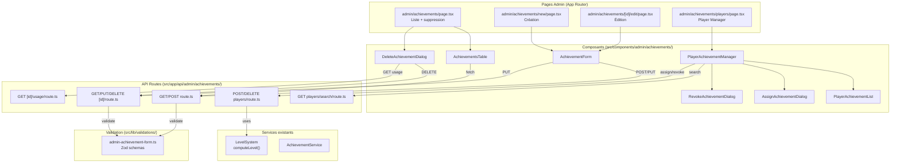

# Design — Gestion Admin des Succès

## Overview

Cette feature ajoute une interface d'administration CRUD complète pour le
catalogue de succès (`achievement_catalog`), ainsi qu'un gestionnaire
d'attribution/retrait manuel de succès pour les joueurs. Elle s'intègre dans
l'admin existant en suivant les mêmes patterns que les entités genres, companies
et languages : API routes protégées par `requireAdmin()`, validation Zod, hooks
de data fetching, composants table/form/dialog, et i18n FR/EN via `next-intl`.

Le design réutilise les services existants (`LevelSystem.computeLevel`,
`AchievementService`) et les types partagés (`AchievementCatalogEntry`,
`AchievementCategory`, `AchievementTier`) sans duplication.

## Architecture



## Components and Interfaces

### API Routes

Toutes les routes suivent le pattern existant : `requireAdmin()` en premier,
validation Zod, puis opération Supabase.

#### `GET /api/admin/achievements`

- Query params : `page`, `limit`, `search`, `sort_by`, `sort_order`, `locale`
- Retourne : `{ achievements: AdminAchievement[], pagination: PaginationInfo }`
- Recherche sur `key` et `name_fr`/`name_en` selon la locale

#### `POST /api/admin/achievements`

- Body validé par `adminAchievementFormSchema`
- Vérifie l'unicité de `key` (erreur 409 si doublon)
- Retourne le succès créé avec status 201

#### `GET /api/admin/achievements/[id]`

- Retourne un succès par son UUID

#### `PUT /api/admin/achievements/[id]`

- Body validé par `adminAchievementFormSchema`
- Vérifie l'unicité de `key` (exclut l'ID courant)
- Retourne le succès modifié

#### `DELETE /api/admin/achievements/[id]`

- Supporte `?force=true` pour suppression même si des joueurs l'ont débloqué
- Sans `force` et avec usage > 0 : retourne 409 avec `usageCount`

#### `GET /api/admin/achievements/[id]/usage`

- Retourne `{ usageCount: number }` (nombre de joueurs ayant débloqué ce succès)

#### `GET /api/admin/achievements/players/search`

- Query param : `q` (recherche par username ou ID)
- Retourne : `{ players: { id, username, avatarUrl }[] }`

#### `POST /api/admin/achievements/players`

- Body : `{ userId, achievementKey }`
- Insère dans `player_achievements`, ajoute XP, recalcule niveau via
  `computeLevel()`
- Erreur 409 si déjà attribué

#### `DELETE /api/admin/achievements/players`

- Body : `{ userId, achievementKey }`
- Supprime de `player_achievements`, soustrait XP (min 0), recalcule niveau
- Erreur 404 si non attribué

### Composants UI

Tous les composants utilisent les classes `.glass-*` et supportent le dark mode.

#### `AchievementsTable`

- Tableau paginé avec colonnes : key, category, tier, threshold, xp_value, name
  (localisé)
- Barre de recherche, tri par colonnes cliquables
- Boutons edit/delete par ligne
- État vide avec message i18n
- Loading skeleton pendant le fetch

#### `AchievementForm`

- Mode création et édition (prop `achievement?: AchievementCatalogEntry`)
- Champs : key, category (select), tier (select), threshold (number), xp_value
  (number), icon (text), name_fr, name_en, description_fr, description_en,
  sort_order (number)
- Validation côté client avec le même schéma Zod
- Toast de succès + redirection vers la liste

#### `DeleteAchievementDialog`

- Dialog de confirmation avec nom du succès
- Affiche le nombre de joueurs concernés (`usageCount`)
- Mode force si `usageCount > 0` (avertissement orange)

#### `PlayerAchievementManager`

- Champ de recherche joueur (debounced)
- Affiche la liste des résultats de recherche
- Quand un joueur est sélectionné, affiche `PlayerAchievementList`

#### `PlayerAchievementList`

- Liste tous les succès du catalogue pour le joueur sélectionné
- Distingue visuellement débloqués (avec date) vs verrouillés (grisés)
- Bouton "Attribuer" sur les verrouillés, "Retirer" sur les débloqués

#### `AssignAchievementDialog`

- Confirmation avec nom du succès, nom du joueur, XP à ajouter

#### `RevokeAchievementDialog`

- Confirmation avec nom du succès, nom du joueur, XP à retirer

### Hooks

#### `useAdminAchievements` (`src/hooks/useAdminAchievements.ts`)

- Même pattern que `useAdminGenres`
- Expose : `achievements`, `pagination`, `loading`, `fetchAchievements`,
  `deleteAchievement`, `checkUsage`

#### `usePlayerAchievementManager` (`src/hooks/usePlayerAchievementManager.ts`)

- Gère : recherche joueur, sélection, fetch des succès du joueur, attribution,
  retrait
- Expose : `players`, `selectedPlayer`, `playerAchievements`, `searchPlayers`,
  `selectPlayer`, `assignAchievement`, `revokeAchievement`

### Validation Zod

#### `src/lib/validations/admin-achievement-form.ts`

```typescript
const adminAchievementFormSchema = z.object({
  key: z
    .string()
    .min(1)
    .max(100)
    .regex(/^[a-z][a-z0-9_]*$/),
  category: z.enum(["library", "playtime", "reviews", "social", "collections"]),
  tier: z.enum(["bronze", "silver", "gold"]),
  threshold: z.number().int().positive(),
  xpValue: z.number().int().positive(),
  icon: z.string().min(1).max(50),
  nameFr: z.string().min(1).max(200),
  nameEn: z.string().min(1).max(200),
  descriptionFr: z.string().min(1).max(500),
  descriptionEn: z.string().min(1).max(500),
  sortOrder: z.number().int().min(0),
});

const achievementQuerySchema = z.object({
  page: z.coerce.number().int().min(1).default(1),
  limit: z.coerce.number().int().min(1).max(100).default(20),
  search: z.string().optional(),
  sort_by: z
    .enum(["key", "category", "tier", "threshold", "xp_value", "name"])
    .default("sort_order"),
  sort_order: z.enum(["asc", "desc"]).default("asc"),
  locale: z.string().default("fr"),
});

const playerAchievementActionSchema = z.object({
  userId: z.string().uuid(),
  achievementKey: z.string().min(1),
});
```

### Navigation Sidebar

Ajout d'une nouvelle catégorie "Succès" dans `AdminSidebar.tsx` avec une icône
`FaTrophy` et un lien vers `/admin/achievements`. Le lien actif est mis en
surbrillance via le pattern `isActive()` existant.

## Data Models

### Tables existantes (aucune migration nécessaire)

#### `achievement_catalog`

| Colonne        | Type          | Description                                     |
| -------------- | ------------- | ----------------------------------------------- |
| id             | uuid (PK)     | Identifiant unique                              |
| key            | text (UNIQUE) | Clé technique du succès                         |
| category       | text          | library, playtime, reviews, social, collections |
| tier           | text          | bronze, silver, gold                            |
| threshold      | integer       | Seuil de déclenchement                          |
| xp_value       | integer       | Points XP attribués                             |
| icon           | text          | Nom de l'icône                                  |
| name_fr        | text          | Nom en français                                 |
| name_en        | text          | Nom en anglais                                  |
| description_fr | text          | Description en français                         |
| description_en | text          | Description en anglais                          |
| sort_order     | integer       | Ordre d'affichage                               |
| created_at     | timestamptz   | Date de création                                |

#### `player_achievements`

| Colonne         | Type                                | Description       |
| --------------- | ----------------------------------- | ----------------- |
| user_id         | uuid (FK → profiles)                | Joueur            |
| achievement_key | text (FK → achievement_catalog.key) | Succès débloqué   |
| unlocked_at     | timestamptz                         | Date de déblocage |

#### `player_xp`

| Colonne    | Type                     | Description          |
| ---------- | ------------------------ | -------------------- |
| user_id    | uuid (PK, FK → profiles) | Joueur               |
| xp_total   | integer                  | XP total accumulé    |
| updated_at | timestamptz              | Dernière mise à jour |

### Types TypeScript

Les types existants dans `src/types/achievement.ts` sont réutilisés. Un nouveau
type admin est ajouté dans `src/types/admin-achievements.ts` :

```typescript
// Type pour la liste admin (inclut tous les champs non-localisés)
export interface AdminAchievement {
  id: string;
  key: string;
  category: AchievementCategory;
  tier: AchievementTier;
  threshold: number;
  xpValue: number;
  icon: string;
  nameFr: string;
  nameEn: string;
  descriptionFr: string;
  descriptionEn: string;
  sortOrder: number;
}

// Params pour le fetch paginé
export interface FetchAchievementsParams {
  page?: number;
  limit?: number;
  search?: string;
  sortBy?: string;
  sortOrder?: "asc" | "desc";
  locale?: string;
}

// Résultat de recherche joueur
export interface PlayerSearchResult {
  id: string;
  username: string;
  avatarUrl: string | null;
}
```

### Formule de niveau (rappel)

```
level = floor(0.3 × √(xp_total)) + 1
```

Implémentée dans `computeLevel()` de `src/lib/services/levelSystem.ts`.
Réutilisée directement par les routes d'attribution/retrait.

## Correctness Properties

_A property is a characteristic or behavior that should hold true across all
valid executions of a system — essentially, a formal statement about what the
system should do. Properties serve as the bridge between human-readable
specifications and machine-verifiable correctness guarantees._

### Property 1: Pagination returns correct page size and count

_For any_ list of achievements in the catalog and any valid `page`/`limit`
combination, the API should return at most `limit` items, and
`pagination.totalCount` should equal the total number of achievements in the
catalog.

**Validates: Requirements 1.2**

### Property 2: Search filter returns only matching results

_For any_ search term and any set of achievements in the catalog, all returned
achievements should contain the search term (case-insensitive) in either their
`key` or their localized name (`name_fr` or `name_en` depending on locale).

**Validates: Requirements 1.3**

### Property 3: Sort order is respected

_For any_ list of achievements and any valid `sort_by` column and `sort_order`
direction, the returned list should be sorted according to that column in the
specified order.

**Validates: Requirements 1.4**

### Property 4: Zod schema rejects invalid achievement data

_For any_ achievement form data where at least one required field is missing, or
where `threshold`/`xpValue` is not a positive integer, or where `key` does not
match the `^[a-z][a-z0-9_]*$` pattern, the Zod validation schema should reject
it and the API should return a 400 status.

**Validates: Requirements 2.2, 2.4, 3.2, 5.3, 5.4**

### Property 5: Achievement key uniqueness

_For any_ two achievement creation requests with the same `key`, the second
request should fail with a 409 status code, and the catalog should contain
exactly one entry with that key.

**Validates: Requirements 2.3, 2.6**

### Property 6: CRUD round-trip

_For any_ valid achievement data, creating an achievement then fetching it by
its returned ID should produce an object with equivalent field values.
Similarly, updating an achievement then fetching it should return the updated
values.

**Validates: Requirements 2.5, 3.1, 3.3**

### Property 7: Usage count accuracy

_For any_ achievement in the catalog, the usage count returned by the API should
equal the number of rows in `player_achievements` with that achievement's key.

**Validates: Requirements 4.2**

### Property 8: Delete with player usage requires force flag

_For any_ achievement that has been unlocked by at least one player, a DELETE
request without `?force=true` should return 409 with the correct `usageCount`. A
DELETE request with `?force=true` should succeed and remove the achievement.

**Validates: Requirements 4.4**

### Property 9: All admin endpoints require authentication

_For any_ API endpoint in the achievements admin routes and any HTTP method, a
request without admin authentication should return a 403 status code with the
message "Admin access required".

**Validates: Requirements 5.1, 5.2, 8.13**

### Property 10: i18n keys exist in both locales

_For any_ translation key used by the achievements admin components, both
`fr.json` and `en.json` should contain a non-empty value for that key.

**Validates: Requirements 7.1, 7.2, 7.3, 8.15**

### Property 11: Player achievements partition

_For any_ player and the full achievement catalog, the list returned by the
Player Achievement Manager should partition achievements into exactly two
groups: unlocked (those present in `player_achievements` for that user) and
locked (the rest), with no overlap and no missing entries.

**Validates: Requirements 8.2**

### Property 12: Assign then revoke round-trip

_For any_ player and any locked achievement, assigning the achievement then
revoking it should return the player's achievement list to its original state
(the achievement should be locked again).

**Validates: Requirements 8.4, 8.9**

### Property 13: XP and level correctness on assign and revoke

_For any_ player with `xp_total = X` and any achievement with `xp_value = V`:

- After assignment, `xp_total` should equal `X + V` and `level` should equal
  `computeLevel(X + V)`
- After revocation, `xp_total` should equal `max(0, X - V)` and `level` should
  equal `computeLevel(max(0, X - V))`

**Validates: Requirements 8.5, 8.10, 8.11**

### Property 14: Duplicate assignment returns 409

_For any_ player and any achievement already unlocked by that player, attempting
to assign the same achievement again should return a 409 status code, and the
player's XP should remain unchanged.

**Validates: Requirements 8.7**

### Property 15: Revoke non-assigned achievement returns 404

_For any_ player and any achievement not unlocked by that player, attempting to
revoke it should return a 404 status code, and the player's XP should remain
unchanged.

**Validates: Requirements 8.12**

## Error Handling

### API Error Responses

| Situation                         | Status | Body                                              |
| --------------------------------- | ------ | ------------------------------------------------- |
| Non authentifié / non admin       | 403    | `{ error: "Admin access required" }`              |
| Données invalides (Zod)           | 400    | `{ error: "Invalid input data", details: [...] }` |
| Clé déjà existante (création)     | 409    | `{ error: "Achievement key already exists" }`     |
| Succès non trouvé                 | 404    | `{ error: "Achievement not found" }`              |
| Suppression avec usage sans force | 409    | `{ error: "Achievement in use", usageCount: N }`  |
| Succès déjà attribué au joueur    | 409    | `{ error: "Achievement already assigned" }`       |
| Succès non attribué au joueur     | 404    | `{ error: "Achievement not assigned to player" }` |
| Joueur non trouvé                 | 404    | `{ error: "Player not found" }`                   |
| Erreur DB inattendue              | 500    | `{ error: "Internal server error" }`              |

### Gestion côté client

- Les erreurs API sont interceptées dans les hooks (`useAdminAchievements`,
  `usePlayerAchievementManager`) et exposées via un état `error`
- Les composants affichent des toasts via `toast()` pour les erreurs et succès
- Les formulaires affichent les erreurs de validation inline sous chaque champ
- Le pattern `try/catch` avec `logger.error()` est utilisé dans toutes les
  routes API, cohérent avec le reste du projet

### XP Floor à zéro

Lors du retrait d'un succès, si `xp_total - xp_value < 0`, le `xp_total` est
clampé à 0. Le niveau est recalculé avec `computeLevel(0) = 1`.

## Testing Strategy

### Approche duale

La stratégie de test combine tests unitaires et tests property-based pour une
couverture complète.

### Tests unitaires (`test/unit/`)

Focalisés sur les cas spécifiques, edge cases et intégrations :

- **Validation Zod** : cas limites (champs vides, valeurs négatives, clé
  invalide, types incorrects)
- **API routes** : réponses HTTP correctes pour chaque cas d'erreur (403, 400,
  404, 409, 500)
- **Composants** : rendu correct du tableau, formulaire, dialogues
- **Hooks** : gestion des états loading/error/success

Structure :

```
test/unit/
├── api/admin/achievements/
│   ├── route.test.ts           # GET/POST /api/admin/achievements
│   ├── id-route.test.ts        # GET/PUT/DELETE /api/admin/achievements/[id]
│   └── players-route.test.ts   # POST/DELETE players, GET search
├── lib/validations/
│   └── admin-achievement-form.test.ts
├── hooks/
│   ├── useAdminAchievements.test.ts
│   └── usePlayerAchievementManager.test.ts
└── components/admin/achievements/
    ├── AchievementsTable.test.tsx
    ├── AchievementForm.test.tsx
    └── DeleteAchievementDialog.test.tsx
```

### Tests property-based (`test/unit/`)

Bibliothèque : **fast-check** (déjà compatible avec Vitest). Minimum 100
itérations par test.

Fichiers :

```
test/unit/
├── lib/validations/
│   └── admin-achievement-form.property.test.ts
├── api/admin/achievements/
│   └── achievements-crud.property.test.ts
└── lib/services/
    └── player-achievement-xp.property.test.ts
```

Chaque test property-based référence sa propriété du design :

```typescript
// Feature: admin-achievements-management, Property 4: Zod schema rejects invalid data
it.prop([invalidAchievementArb], (data) => { ... });
```

### Mapping propriétés → tests

| Propriété                    | Type de test | Fichier                                 |
| ---------------------------- | ------------ | --------------------------------------- |
| P1 Pagination                | property     | achievements-crud.property.test.ts      |
| P2 Search filter             | property     | achievements-crud.property.test.ts      |
| P3 Sort order                | property     | achievements-crud.property.test.ts      |
| P4 Zod validation            | property     | admin-achievement-form.property.test.ts |
| P5 Key uniqueness            | property     | achievements-crud.property.test.ts      |
| P6 CRUD round-trip           | property     | achievements-crud.property.test.ts      |
| P7 Usage count               | property     | achievements-crud.property.test.ts      |
| P8 Delete with usage         | property     | achievements-crud.property.test.ts      |
| P9 Admin auth                | property     | achievements-crud.property.test.ts      |
| P10 i18n keys                | property     | admin-achievement-form.property.test.ts |
| P11 Player partition         | property     | player-achievement-xp.property.test.ts  |
| P12 Assign/revoke round-trip | property     | player-achievement-xp.property.test.ts  |
| P13 XP/level correctness     | property     | player-achievement-xp.property.test.ts  |
| P14 Duplicate assign 409     | property     | player-achievement-xp.property.test.ts  |
| P15 Revoke non-assigned 404  | property     | player-achievement-xp.property.test.ts  |
