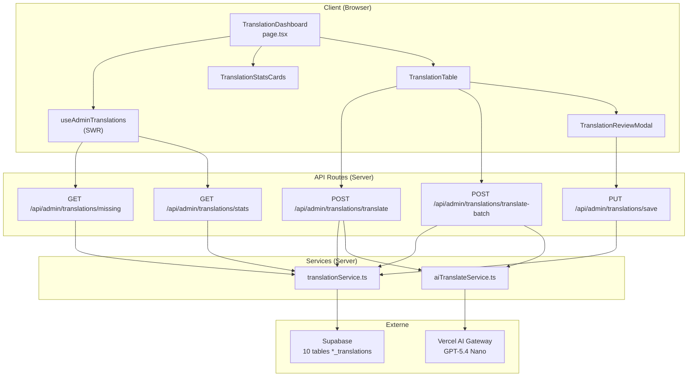
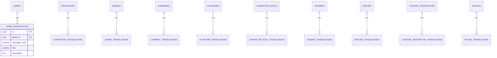

# Document de Design — Admin Translation Management

## Vue d'ensemble

Cette fonctionnalité ajoute une page d'administration `/admin/translations`
permettant de visualiser l'état des traductions pour toutes les entités du site
Game Universe, de déclencher des traductions automatiques via Vercel AI Gateway
(modèle GPT-5.4 Nano), et de sauvegarder les résultats en base de données. Le
système couvre 10 types d'entités traduisibles et supporte la traduction
bidirectionnelle entre toutes les langues configurées (actuellement fr/en).

L'architecture s'appuie sur les patterns existants du projet : API Routes
Next.js avec `requireAdmin()`, Supabase pour la persistance, SWR pour le
fetching côté client, Zod pour la validation, et le Vercel AI SDK (`ai` +
`@ai-sdk/openai`) pour l'appel au modèle de traduction.

## Architecture



### Flux principaux

1. **Consultation** : Le dashboard charge les stats via `GET /stats` et la liste
   des entités manquantes via `GET /missing`, le tout orchestré par un hook SWR.
2. **Traduction individuelle** : Clic sur "Traduire" → `POST /translate` → le
   service récupère le texte source en DB, appelle Vercel AI Gateway, sauvegarde
   le résultat, retourne la traduction.
3. **Traduction avec relecture** : Clic sur "Traduire et relire" →
   `POST /translate` avec `saveToDb: false` → ouverture de la modale de
   relecture → modification → `PUT /save`.
4. **Traduction par lot** : Sélection multiple → `POST /translate-batch` → flux
   NDJSON avec progression en temps réel → chaque traduction sauvegardée
   séquentiellement.

## Composants et Interfaces

### Structure des fichiers

```
src/app/[locale]/admin/translations/
  page.tsx                              # Page dashboard

src/app/api/admin/translations/
  missing/route.ts                      # GET — entités manquantes
  stats/route.ts                        # GET — statistiques
  translate/route.ts                    # POST — traduction individuelle
  translate-batch/route.ts              # POST — traduction par lot (NDJSON)
  save/route.ts                         # PUT — sauvegarde manuelle

src/components/admin/translations/
  TranslationDashboard.tsx              # Composant principal (orchestration)
  TranslationStatsCards.tsx             # Cartes de statistiques par type
  TranslationProgressBar.tsx            # Barre de progression globale
  TranslationTable.tsx                  # Tableau des entités à traduire
  TranslationTableRow.tsx               # Ligne du tableau avec actions
  TranslationReviewModal.tsx            # Modale de relecture/édition
  TranslationBatchProgress.tsx          # Barre de progression du lot

src/hooks/
  useAdminTranslations.ts              # Hook SWR pour stats + liste

src/lib/services/
  translationService.ts                # Requêtes DB (missing, stats, upsert)
  aiTranslateService.ts                # Appel Vercel AI Gateway

src/lib/validations/
  admin-translation.ts                 # Schémas Zod

src/types/
  admin-translations.ts                # Types partagés
```

### Composants React

#### `TranslationDashboard`

Composant principal orchestrant le dashboard. Gère le sélecteur de langue cible,
le filtre par type d'entité, et coordonne les sous-composants.

```typescript
interface TranslationDashboardProps {
  // Pas de props — composant autonome
}
```

#### `TranslationStatsCards`

Affiche une grille de cartes glassmorphism, une par type d'entité, avec le
total, le nombre traduit, et le pourcentage de couverture pour la langue
sélectionnée.

```typescript
interface TranslationStatsCardsProps {
  stats: TranslationStats[];
  targetLang: string;
  isLoading: boolean;
}
```

#### `TranslationProgressBar`

Barre de progression globale (gradient cyan → violet) indiquant le pourcentage
de traduction complète tous types confondus.

```typescript
interface TranslationProgressBarProps {
  translated: number;
  total: number;
}
```

#### `TranslationTable`

Tableau paginé et filtrable listant les entités avec traduction manquante ou
incomplète. Supporte la sélection multiple via checkboxes.

```typescript
interface TranslationTableProps {
  items: TranslationMissingItem[];
  pagination: PaginationInfo;
  entityType: EntityType;
  targetLang: string;
  selectedIds: Set<string>;
  onToggleSelect: (id: string) => void;
  onSelectAll: (ids: string[]) => void;
  onClearSelection: () => void;
  onTranslate: (item: TranslationMissingItem) => void;
  onTranslateAndReview: (item: TranslationMissingItem) => void;
  onPageChange: (page: number) => void;
  onSearch: (query: string) => void;
  isLoading: boolean;
  translatingIds: Set<string>;
}
```

#### `TranslationReviewModal`

Modale glassmorphism affichant côte à côte le texte source et la traduction
générée dans des champs éditables. Utilise React Hook Form + Zod pour la
validation.

```typescript
interface TranslationReviewModalProps {
  isOpen: boolean;
  onClose: () => void;
  item: TranslationMissingItem;
  translatedFields: Record<string, string>;
  entityType: EntityType;
  targetLang: string;
  onSave: (fields: Record<string, string>) => Promise<void>;
  isSaving: boolean;
}
```

#### `TranslationBatchProgress`

Affiche la progression du traitement par lot : barre de progression, compteur
x/total, bouton annuler, résumé final.

```typescript
interface TranslationBatchProgressProps {
  processed: number;
  total: number;
  succeeded: number;
  failed: number;
  isRunning: boolean;
  onCancel: () => void;
}
```

### Hook `useAdminTranslations`

Hook SWR centralisant le fetching des statistiques et de la liste des entités
manquantes, avec revalidation automatique après chaque action de traduction.

```typescript
interface UseAdminTranslationsParams {
  targetLang: string;
  entityType: EntityType;
  page?: number;
  search?: string;
}

interface UseAdminTranslationsReturn {
  stats: TranslationStats[] | undefined;
  items: TranslationMissingItem[];
  pagination: PaginationInfo;
  isLoadingStats: boolean;
  isLoadingItems: boolean;
  error: Error | null;
  mutateStats: () => void;
  mutateItems: () => void;
  translateOne: (
    entityId: string,
    opts?: { saveToDb?: boolean }
  ) => Promise<TranslateResult>;
  translateBatch: (
    entityIds: string[],
    onProgress: (event: BatchProgressEvent) => void,
    signal?: AbortSignal
  ) => Promise<BatchSummary>;
  saveTranslation: (
    entityId: string,
    fields: Record<string, string>
  ) => Promise<void>;
}
```

### Services

#### `translationService.ts`

Service côté serveur encapsulant les requêtes Supabase pour les traductions.
Fonctions principales :

```typescript
// Récupère les entités avec traduction manquante/incomplète
async function getMissingTranslations(params: {
  supabase: SupabaseClient;
  entityType: EntityType;
  targetLang: string;
  page: number;
  limit: number;
  search?: string;
}): Promise<{ items: TranslationMissingItem[]; totalCount: number }>;

// Calcule les statistiques de traduction pour tous les types et langues
async function getTranslationStats(params: {
  supabase: SupabaseClient;
  languages: string[];
}): Promise<TranslationStats[]>;

// Récupère le texte source d'une entité dans la meilleure langue disponible
async function getSourceText(params: {
  supabase: SupabaseClient;
  entityType: EntityType;
  entityId: string;
  excludeLang: string;
}): Promise<{ sourceLang: string; fields: Record<string, string> } | null>;

// Insère ou met à jour une traduction
async function upsertTranslation(params: {
  supabase: SupabaseClient;
  entityType: EntityType;
  entityId: string;
  targetLang: string;
  fields: Record<string, string>;
}): Promise<void>;
```

#### `aiTranslateService.ts`

Service côté serveur encapsulant l'appel à Vercel AI Gateway via le Vercel AI
SDK.

```typescript
import { generateObject } from "ai";
import { createOpenAI } from "@ai-sdk/openai";

// Traduit un ensemble de champs textuels d'une langue source vers une langue cible
async function translateFields(params: {
  sourceLang: string;
  targetLang: string;
  entityType: EntityType;
  fields: Record<string, string>;
}): Promise<Record<string, string>>;
```

Le service configure le provider OpenAI via Vercel AI Gateway :

```typescript
const openai = createOpenAI({
  apiKey: process.env.VERCEL_AI_GATEWAY_API_KEY,
  baseURL: "https://gateway.ai.vercel.app/v1",
});
```

Le prompt système inclut le contexte gaming et la paire de langues. La fonction
`generateObject` du Vercel AI SDK est utilisée avec un schéma Zod dynamique
correspondant aux champs de l'entité, garantissant un retour structuré.

### Routes API

| Route                                     | Méthode | Description                                         |
| ----------------------------------------- | ------- | --------------------------------------------------- |
| `/api/admin/translations/missing`         | GET     | Liste paginée des entités avec traduction manquante |
| `/api/admin/translations/stats`           | GET     | Statistiques de couverture par type et langue       |
| `/api/admin/translations/translate`       | POST    | Traduction individuelle (avec option `saveToDb`)    |
| `/api/admin/translations/translate-batch` | POST    | Traduction par lot en streaming NDJSON              |
| `/api/admin/translations/save`            | PUT     | Sauvegarde manuelle d'une traduction éditée         |

Toutes les routes utilisent `requireAdmin()` pour l'authentification et
retournent HTTP 401/403 si l'utilisateur n'est pas admin.

### Schémas de validation Zod (`admin-translation.ts`)

```typescript
// Les 10 types d'entités supportés
const entityTypeSchema = z.enum([
  "games",
  "characters",
  "genres",
  "companies",
  "platforms",
  "character_roles",
  "genders",
  "species",
  "content_descriptors",
  "ratings",
]);

// Paramètres de la route GET /missing
const missingQuerySchema = z.object({
  type: entityTypeSchema,
  targetLang: z.string().length(2).default("fr"),
  page: z.coerce.number().int().min(1).default(1),
  limit: z.coerce.number().int().min(1).max(100).default(20),
  search: z.string().optional(),
});

// Corps de la route POST /translate
const translateBodySchema = z.object({
  entityType: entityTypeSchema,
  entityId: z.string().uuid(),
  targetLang: z.string().length(2),
  saveToDb: z.boolean().default(true),
});

// Corps de la route POST /translate-batch
const translateBatchBodySchema = z.object({
  entityType: entityTypeSchema,
  entityIds: z.array(z.string().uuid()).min(1).max(50),
  targetLang: z.string().length(2),
});

// Corps de la route PUT /save
const saveTranslationBodySchema = z.object({
  entityType: entityTypeSchema,
  entityId: z.string().uuid(),
  targetLang: z.string().length(2),
  translations: z.record(z.string(), z.string()),
});
```

## Modèles de données

### Types partagés (`src/types/admin-translations.ts`)

```typescript
/** Les 10 types d'entités traduisibles */
export type EntityType =
  | "games"
  | "characters"
  | "genres"
  | "companies"
  | "platforms"
  | "character_roles"
  | "genders"
  | "species"
  | "content_descriptors"
  | "ratings";

/** Statut de traduction d'une entité */
export type TranslationStatus = "missing" | "partial" | "complete";

/** Champs obligatoires par type d'entité */
export const REQUIRED_FIELDS: Record<EntityType, string[]> = {
  games: ["title", "description"],
  characters: ["name", "description"],
  genres: ["name"],
  companies: ["description"],
  platforms: ["name"],
  character_roles: ["name"],
  genders: ["name"],
  species: ["name"],
  content_descriptors: ["name"],
  ratings: ["description"],
};

/** Tous les champs éditables par type d'entité (pour la modale de relecture) */
export const EDITABLE_FIELDS: Record<EntityType, string[]> = {
  games: ["title", "description"],
  characters: ["name", "description", "biography"],
  genres: ["name", "description"],
  companies: ["description"],
  platforms: ["name", "abbreviation"],
  character_roles: ["name", "description"],
  genders: ["name"],
  species: ["name"],
  content_descriptors: ["name", "description"],
  ratings: ["description"],
};

/** Mapping type d'entité → nom de la table de traduction */
export const TRANSLATION_TABLE_MAP: Record<EntityType, string> = {
  games: "game_translations",
  characters: "character_translations",
  genres: "genre_translations",
  companies: "company_translations",
  platforms: "platform_translations",
  character_roles: "character_role_translations",
  genders: "gender_translations",
  species: "species_translations",
  content_descriptors: "content_descriptor_translations",
  ratings: "rating_translations",
};

/** Mapping type d'entité → nom de la table parente */
export const ENTITY_TABLE_MAP: Record<EntityType, string> = {
  games: "games",
  characters: "characters",
  genres: "genres",
  companies: "companies",
  platforms: "platforms",
  character_roles: "character_roles",
  genders: "genders",
  species: "species",
  content_descriptors: "content_descriptors",
  ratings: "ratings",
};

/** Mapping type d'entité → nom de la colonne FK dans la table de traduction */
export const FK_COLUMN_MAP: Record<EntityType, string> = {
  games: "game_id",
  characters: "character_id",
  genres: "genre_id",
  companies: "company_id",
  platforms: "platform_id",
  character_roles: "character_role_id",
  genders: "gender_id",
  species: "species_id",
  content_descriptors: "content_descriptor_id",
  ratings: "rating_id",
};

/** Mapping type d'entité → champ d'identification lisible (slug, code, etc.) */
export const IDENTIFIER_FIELD_MAP: Record<EntityType, string> = {
  games: "slug",
  characters: "slug",
  genres: "slug",
  companies: "slug",
  platforms: "slug",
  character_roles: "slug",
  genders: "slug",
  species: "slug",
  content_descriptors: "code",
  ratings: "code",
};

/** Élément avec traduction manquante retourné par l'API */
export interface TranslationMissingItem {
  entityId: string;
  identifier: string; // slug ou code
  sourceText: Record<string, string>; // champs dans la langue source
  targetText: Record<string, string>; // champs dans la langue cible (peut être vide)
  sourceLang: string;
  status: TranslationStatus;
}

/** Statistiques de traduction pour un type d'entité et une langue */
export interface TranslationStats {
  entityType: EntityType;
  language: string;
  total: number;
  complete: number;
  partial: number;
  missing: number;
  percentage: number; // 0-100
}

/** Résultat d'une traduction individuelle */
export interface TranslateResult {
  entityId: string;
  translatedFields: Record<string, string>;
  saved: boolean;
}

/** Événement de progression pour le traitement par lot */
export interface BatchProgressEvent {
  entityId: string;
  status: "success" | "error";
  translatedFields?: Record<string, string>;
  error?: string;
}

/** Résumé du traitement par lot */
export interface BatchSummary {
  total: number;
  succeeded: number;
  failed: number;
}
```

### Schéma de la base de données

Aucune migration n'est nécessaire. Les 10 tables de traduction existent déjà
avec la structure suivante (exemple pour `game_translations`) :

```sql
-- Structure existante (pas de modification)
CREATE TABLE game_translations (
  id UUID PRIMARY KEY DEFAULT gen_random_uuid(),
  game_id UUID NOT NULL REFERENCES games(id) ON DELETE CASCADE,
  language_code VARCHAR(2) NOT NULL,
  title VARCHAR(255),
  description TEXT,
  created_at TIMESTAMPTZ DEFAULT now(),
  updated_at TIMESTAMPTZ DEFAULT now(),
  UNIQUE(game_id, language_code)
);
```

Chaque table de traduction suit le même pattern : une FK vers la table parente,
un `language_code`, et des champs textuels spécifiques au type d'entité. La
contrainte `UNIQUE(entity_id, language_code)` permet l'upsert via `ON CONFLICT`.

### Diagramme des relations



### Dépendances à installer

Les packages `ai` et `@ai-sdk/openai` ne sont pas encore dans le `package.json`.
Ils doivent être ajoutés :

```bash
bun add ai @ai-sdk/openai
```

### Variable d'environnement

Ajouter dans `.env.example` :

```
# Vercel AI Gateway (traduction automatique)
VERCEL_AI_GATEWAY_API_KEY=your_vercel_ai_gateway_api_key
```

## Propriétés de Correction

_Une propriété est une caractéristique ou un comportement qui doit rester vrai
pour toutes les exécutions valides d'un système — essentiellement, une
déclaration formelle de ce que le système doit faire. Les propriétés servent de
pont entre les spécifications lisibles par l'humain et les garanties de
correction vérifiables par la machine._

### Propriété 1 : Classification correcte du statut de traduction

_Pour tout_ type d'entité et _pour toute_ entité avec une combinaison quelconque
de champs remplis/vides dans la langue cible, le statut retourné doit être :
"missing" si la ligne de traduction n'existe pas, "complete" si tous les champs
obligatoires (définis dans `REQUIRED_FIELDS`) sont renseignés et non vides,
"partial" sinon.

**Valide : Requirements 1.4, 2.3**

### Propriété 2 : Invariant des statistiques de traduction

_Pour tout_ type d'entité et _pour toute_ langue supportée, la somme
`complete + partial + missing` doit être égale à `total`, et `percentage` doit
être égal à `Math.round((complete / total) * 100)` (ou 0 si total est 0).

**Valide : Requirements 2.2**

### Propriété 3 : Complétude des champs de traduction retournés

_Pour tout_ type d'entité, l'objet retourné par le service de traduction doit
contenir exactement les clés définies dans `EDITABLE_FIELDS[entityType]`, et
chaque valeur doit être une chaîne non vide.

**Valide : Requirements 1.5, 3.4, 3.5**

### Propriété 4 : Cohérence de la pagination

_Pour tout_ ensemble de données de taille N et _pour toute_ combinaison valide
de `page` et `limit`, le nombre d'éléments retournés doit être
`min(limit, N - (page-1)*limit)` si `page` est dans les bornes, et `totalPages`
doit être `Math.ceil(N / limit)`.

**Valide : Requirements 1.6**

### Propriété 5 : Filtrage par recherche

_Pour tout_ terme de recherche non vide et _pour toute_ liste d'entités, chaque
élément retourné par l'endpoint `/missing` avec le paramètre `search` doit
contenir le terme de recherche (insensible à la casse) dans au moins un de ses
champs textuels (source ou cible).

**Valide : Requirements 1.7**

### Propriété 6 : Détection automatique de la langue source

_Pour toute_ entité possédant des traductions dans au moins une langue
différente de `targetLang`, la langue source détectée doit être différente de
`targetLang` et doit correspondre à une traduction existante de l'entité.

**Valide : Requirements 4.2**

### Propriété 7 : Aller-retour de l'upsert de traduction

_Pour tout_ type d'entité, _pour tout_ identifiant d'entité valide, et _pour
tout_ ensemble de champs traduits valides, après un appel à `upsertTranslation`,
une requête `SELECT` sur la table de traduction correspondante avec le même
`entityId` et `targetLang` doit retourner exactement les champs sauvegardés.

**Valide : Requirements 4.4, 10.2**

### Propriété 8 : Complétude du traitement par lot

_Pour tout_ tableau d'identifiants d'entités de taille N (1 ≤ N ≤ 50), le flux
NDJSON retourné par `/translate-batch` doit contenir exactement N lignes,
chacune avec un `entityId` correspondant à un élément du tableau d'entrée et un
`status` de "success" ou "error".

**Valide : Requirements 5.2, 5.3**

### Propriété 9 : Résilience du traitement par lot

_Pour tout_ lot contenant au moins une entité dont la traduction échoue, le flux
NDJSON doit contenir une entrée d'erreur pour cette entité ET continuer à
traiter les entités suivantes. Le nombre total de lignes dans le flux doit
toujours être égal au nombre d'entités dans le lot.

**Valide : Requirements 5.5**

### Propriété 10 : Validation de la taille du lot

_Pour tout_ tableau `entityIds` de taille > 50, l'endpoint `/translate-batch`
doit retourner HTTP 400. _Pour tout_ tableau de taille entre 1 et 50 inclus, la
requête ne doit pas être rejetée pour raison de taille.

**Valide : Requirements 5.6, 5.7**

### Propriété 11 : Validation Zod des entrées

_Pour tout_ corps de requête ne respectant pas le schéma
`saveTranslationBodySchema` (entityType invalide, entityId non-UUID, targetLang
de longueur ≠ 2, ou translations manquant), l'endpoint `/save` doit retourner
HTTP 400 avec les erreurs de validation.

**Valide : Requirements 10.3, 10.4**

### Propriété 12 : Synchronisation des clés i18n

_Pour toute_ clé présente dans `fr.json` sous le namespace `admin.translations`,
la même clé doit exister dans `en.json` sous le même namespace, et vice versa.

**Valide : Requirements 6.10, 9.8, 12.2, 12.4**

### Propriété 13 : Correspondance des champs éditables par type d'entité

_Pour tout_ type d'entité, les champs affichés dans la modale de relecture
doivent correspondre exactement aux clés définies dans
`EDITABLE_FIELDS[entityType]`.

**Valide : Requirements 9.4**

## Gestion des erreurs

### Erreurs d'authentification

Toutes les routes API utilisent `requireAdmin()` en première instruction. Si
l'utilisateur n'est pas admin, une erreur `"Admin access required"` est levée et
interceptée dans le `catch` pour retourner HTTP 401/403.

### Erreurs de validation

Les paramètres de requête et corps JSON sont validés via Zod (`safeParse`). En
cas d'échec, HTTP 400 est retourné avec les détails des erreurs de validation
(`error.issues`).

### Erreurs Vercel AI Gateway

- **Erreur réseau/API** : Le service `aiTranslateService` propage l'erreur avec
  un message descriptif incluant le code d'erreur original.
- **Timeout** : Un `AbortController` avec un délai de 30 secondes est utilisé.
  Si le délai est dépassé, une erreur `TranslationTimeoutError` est levée.
- **Clé API manquante** : Si `VERCEL_AI_GATEWAY_API_KEY` n'est pas définie, le
  service lève une erreur explicite
  `"VERCEL_AI_GATEWAY_API_KEY is not configured"` avant tout appel.

### Erreurs de base de données

Les erreurs Supabase sont loguées via `logger.error()` et une réponse HTTP 500
générique est retournée au client. Les erreurs de contrainte (ex: entité
inexistante) sont détectées et retournent HTTP 404.

### Erreurs dans le traitement par lot

Chaque entité du lot est traitée dans un `try/catch` individuel. En cas d'échec,
l'erreur est incluse dans le flux NDJSON avec `status: "error"` et le traitement
continue avec l'entité suivante.

### Annulation du lot côté client

Le client utilise un `AbortController` pour annuler le flux NDJSON. Côté
serveur, le `ReadableStream` détecte l'annulation via le signal et arrête le
traitement. Les traductions déjà sauvegardées en base sont conservées.

### Tableau récapitulatif

| Scénario                       | Code HTTP | Message                                       |
| ------------------------------ | --------- | --------------------------------------------- |
| Utilisateur non-admin          | 401/403   | "Admin access required"                       |
| Paramètres invalides (Zod)     | 400       | Détails des erreurs de validation             |
| Entité inexistante             | 404       | "Entity not found"                            |
| Pas de texte source disponible | 400       | "No source translation available"             |
| Lot > 50 entités               | 400       | "Batch size exceeds maximum of 50"            |
| Erreur Vercel AI Gateway       | 502       | Message d'erreur original                     |
| Timeout Vercel AI Gateway      | 504       | "Translation timed out after 30s"             |
| Clé API manquante              | 500       | "VERCEL_AI_GATEWAY_API_KEY is not configured" |
| Erreur Supabase                | 500       | "Internal server error"                       |

## Stratégie de tests

### Approche duale

La stratégie de test combine des **tests unitaires** pour les cas spécifiques et
les cas limites, et des **tests basés sur les propriétés** (property-based
testing) pour vérifier les propriétés universelles sur un large éventail
d'entrées générées aléatoirement.

### Bibliothèque de tests basés sur les propriétés

Le projet utilise déjà **fast-check** (v4.6.0) comme bibliothèque PBT. Chaque
test de propriété sera configuré avec un minimum de **100 itérations**.

### Structure des fichiers de test

```
test/unit/
├── api/
│   └── admin/
│       └── translations/
│           ├── missing.test.ts
│           ├── stats.test.ts
│           ├── translate.test.ts
│           ├── translate-batch.test.ts
│           └── save.test.ts
├── lib/
│   └── services/
│       ├── translationService.test.ts
│       ├── aiTranslateService.test.ts
│       ├── translationService.property.test.ts
│       └── translationValidation.property.test.ts
└── components/
    └── translations/
        ├── TranslationStatsCards.test.tsx
        ├── TranslationTable.test.tsx
        └── TranslationReviewModal.test.tsx
```

### Tests unitaires (exemples et cas limites)

Les tests unitaires couvrent :

- Vérification de l'authentification admin sur chaque route (Requirements 1.8,
  2.5, 4.8, 5.8, 10.6)
- Réponse HTTP 404 pour entité inexistante (Requirements 4.6, 10.5)
- Réponse HTTP 400 pour entité sans texte source (Requirement 4.7)
- Erreur explicite si `VERCEL_AI_GATEWAY_API_KEY` manquante (Requirement 11.3)
- Timeout de 30 secondes sur l'appel AI (Requirement 3.7)
- Propagation des erreurs Vercel AI Gateway (Requirement 3.6)
- Rendu des composants UI (sélecteur de langue, cartes stats, tableau, modale)
- Interactions UI (clic traduire, sélection multiple, annulation)

### Tests basés sur les propriétés

Chaque propriété du document de design est implémentée par un **unique** test
PBT. Le tag de chaque test suit le format :

```
Feature: admin-translation-management, Property {N}: {titre}
```

| Propriété                    | Fichier de test                          | Description                                                                         |
| ---------------------------- | ---------------------------------------- | ----------------------------------------------------------------------------------- |
| 1 : Classification du statut | `translationService.property.test.ts`    | Génère des entités avec des champs aléatoirement remplis/vides et vérifie le statut |
| 2 : Invariant des stats      | `translationService.property.test.ts`    | Génère des ensembles d'entités et vérifie total = complete + partial + missing      |
| 3 : Complétude des champs    | `translationService.property.test.ts`    | Génère des types d'entités aléatoires et vérifie les clés retournées                |
| 4 : Cohérence pagination     | `translationService.property.test.ts`    | Génère des tailles de dataset et paramètres page/limit aléatoires                   |
| 5 : Filtrage recherche       | `translationService.property.test.ts`    | Génère des termes de recherche et vérifie que chaque résultat contient le terme     |
| 6 : Détection langue source  | `translationService.property.test.ts`    | Génère des entités avec traductions dans des langues aléatoires                     |
| 7 : Aller-retour upsert      | `translationService.property.test.ts`    | Génère des champs traduits aléatoires, upsert puis select                           |
| 8 : Complétude du lot        | `translationService.property.test.ts`    | Génère des lots de taille aléatoire (1-50) et vérifie le nombre de lignes NDJSON    |
| 9 : Résilience du lot        | `translationService.property.test.ts`    | Génère des lots avec des entités valides/invalides mélangées                        |
| 10 : Validation taille lot   | `translationValidation.property.test.ts` | Génère des tableaux de taille aléatoire et vérifie le rejet/acceptation             |
| 11 : Validation Zod          | `translationValidation.property.test.ts` | Génère des corps de requête invalides aléatoires                                    |
| 12 : Synchronisation i18n    | `translationValidation.property.test.ts` | Vérifie la symétrie des clés entre fr.json et en.json                               |
| 13 : Champs éditables        | `translationValidation.property.test.ts` | Génère des types d'entités aléatoires et vérifie EDITABLE_FIELDS                    |

### Configuration des tests PBT

```typescript
import fc from "fast-check";

// Minimum 100 itérations par test de propriété
const PBT_NUM_RUNS = 100;

// Exemple de structure de test
describe("translationService properties", () => {
  it("Property 1: Classification correcte du statut", () => {
    // Feature: admin-translation-management, Property 1: Classification correcte du statut de traduction
    fc.assert(
      fc.property(entityTypeArb, translationFieldsArb, (entityType, fields) => {
        const status = classifyTranslationStatus(entityType, fields);
        // ... assertions
      }),
      { numRuns: PBT_NUM_RUNS }
    );
  });
});
```
