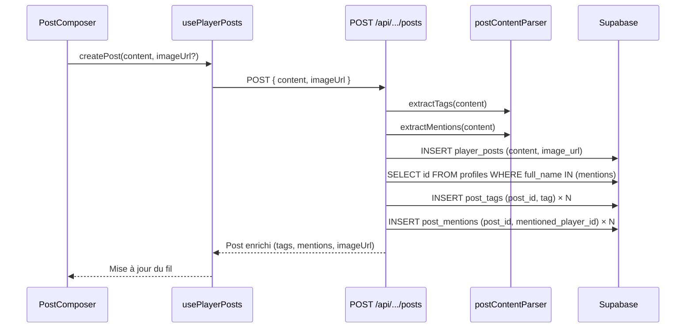

# Document de Design — Posts Enrichis (Images, Tags, Mentions, Recherche)

## Vue d'ensemble

Ce design étend le système de posts joueurs existant (`player_posts`) avec
quatre nouvelles capacités :

1. **Image URL** — Colonne `image_url` nullable sur `player_posts`, champ toggle
   dans `PostComposer`, affichage dans `PostCard`
2. **Tags (#hashtags)** — Table `post_tags`, extraction automatique depuis le
   contenu, badges cliquables dans `PostCard`
3. **Mentions (@joueur)** — Table `post_mentions`, résolution contre
   `profiles.full_name`, liens cliquables dans `PostCard`
4. **Recherche** — Composant `SearchBar`, paramètre `search` sur l'API GET,
   index GIN sur `content`

Le design s'appuie sur l'implémentation existante (spec `player-posts-tab`) sans
la recréer. Seuls les fichiers modifiés ou créés sont décrits.

### Décisions de design clés

- **Extraction côté serveur** : Les tags et mentions sont extraits du contenu
  par le serveur (dans la route POST), pas par le client. Cela garantit la
  cohérence et empêche la manipulation.
- **Utilitaire pur `postContentParser`** : La logique d'extraction tags/mentions
  est isolée dans `src/lib/utils/postContentParser.ts`, une fonction pure sans
  effets de bord, facilement testable.
- **Résolution des mentions côté serveur** : Seules les mentions correspondant à
  un `profiles.full_name` existant sont stockées. Les mentions invalides restent
  du texte brut.
- **Recherche côté serveur avec ILIKE** : La recherche utilise `ILIKE` sur la
  colonne `content` avec un index GIN `pg_trgm` pour la performance.

## Architecture

### Diagramme de flux

```mermaid
flowchart TD
    subgraph Client
        PC[PostComposer] -->|content + imageUrl| Hook[usePlayerPosts]
        SB[SearchBar] -->|searchTerm| Hook
        Hook -->|fetch/create| CS[PlayerPostsService]
    end

    subgraph API["API Route /api/players/[id]/posts"]
        GET_H[GET handler] -->|search param| SS[PlayerPostsServerService]
        POST_H[POST handler] -->|content, imageUrl| Parser[postContentParser]
        Parser -->|tags[], mentions[]| SS
        SS -->|query avec joins| DB[(Supabase)]
    end

    CS -->|HTTP| GET_H
    CS -->|HTTP| POST_H

    subgraph Database
        PP[player_posts<br/>+ image_url]
        PT[post_tags<br/>post_id, tag]
        PM[post_mentions<br/>post_id, mentioned_player_id]
        PP --- PT
        PP --- PM
    end

    DB --> PP
    DB --> PT
    DB --> PM
```

### Flux de création d'un post



## Composants et Interfaces

### Fichiers modifiés

| Fichier                                        | Modification                                                                                                               |
| ---------------------------------------------- | -------------------------------------------------------------------------------------------------------------------------- |
| `src/types/post.ts`                            | Ajout `imageUrl`, `tags`, `mentions` sur `Post` ; ajout `imageUrl` sur `CreatePostPayload` ; nouveau type `PostMention`    |
| `src/lib/services/playerPostsService.ts`       | `fetchPosts` accepte `search?` ; `createPost` accepte `imageUrl?`                                                          |
| `src/lib/services/playerPostsServerService.ts` | `fetchPosts` accepte `search?` avec ILIKE ; `createPost` accepte `imageUrl`, insère tags/mentions ; `transformRow` enrichi |
| `src/app/api/players/[id]/posts/route.ts`      | GET : paramètre `search` ; POST : champ `imageUrl`, extraction tags/mentions                                               |
| `src/hooks/usePlayerPosts.ts`                  | Ajout `searchTerm`, `setSearchTerm` avec debounce 300ms                                                                    |
| `src/components/players/PostComposer.tsx`      | Toggle image URL, champ de saisie URL, validation `https://`                                                               |
| `src/components/players/PostCard.tsx`          | Affichage image, rendu tags/mentions enrichis dans le contenu                                                              |
| `src/components/players/PostsFeed.tsx`         | Intégration `SearchBar` entre `PostComposer` et la liste                                                                   |
| `src/messages/fr.json`                         | Nouvelles clés `players.posts.*`                                                                                           |
| `src/messages/en.json`                         | Nouvelles clés `players.posts.*`                                                                                           |

### Fichiers créés

| Fichier                                                        | Rôle                                                                                         |
| -------------------------------------------------------------- | -------------------------------------------------------------------------------------------- |
| `src/lib/utils/postContentParser.ts`                           | Fonctions pures : `extractTags(content)`, `extractMentions(content)`, `isValidImageUrl(url)` |
| `src/components/players/SearchBar.tsx`                         | Composant barre de recherche glassmorphism                                                   |
| `src/components/players/PostContentRenderer.tsx`               | Composant de rendu du contenu avec tags/mentions stylisés                                    |
| `supabase/migrations/20240311000001_enhanced_player_posts.sql` | Migration : `image_url`, `post_tags`, `post_mentions`, index GIN                             |
| `test/unit/lib/utils/postContentParser.test.ts`                | Tests unitaires du parser                                                                    |
| `test/unit/lib/utils/postContentParser.property.test.ts`       | Tests property-based du parser                                                               |

### Interfaces des composants

```typescript
// src/lib/utils/postContentParser.ts

/** Extrait les tags (#mot) du contenu. Retourne max 10 tags normalisés en minuscules, sans doublons. */
export function extractTags(content: string): string[];

/** Extrait les mentions (@pseudo) du contenu. Retourne max 10 pseudos uniques. */
export function extractMentions(content: string): string[];

/** Valide qu'une URL est un lien https:// valide. */
export function isValidImageUrl(url: string): boolean;
```

```typescript
// src/components/players/SearchBar.tsx
interface SearchBarProps {
  value: string;
  onChange: (value: string) => void;
}
```

```typescript
// src/components/players/PostContentRenderer.tsx
interface PostContentRendererProps {
  content: string;
  tags: string[];
  mentions: PostMention[];
  locale: string;
}
```

## Modèles de données

### Types TypeScript (modifications de `src/types/post.ts`)

```typescript
export interface PostMention {
  playerId: string;
  username: string;
}

export interface Post {
  id: string;
  playerId: string;
  content: string;
  imageUrl: string | null; // NOUVEAU
  tags: string[]; // NOUVEAU
  mentions: PostMention[]; // NOUVEAU
  createdAt: string;
  updatedAt: string;
}

export interface CreatePostPayload {
  content: string;
  imageUrl?: string; // NOUVEAU
}
```

### Schéma de base de données (migration)

```sql
-- 1. Ajout colonne image_url sur player_posts
ALTER TABLE player_posts
  ADD COLUMN IF NOT EXISTS image_url TEXT;

COMMENT ON COLUMN player_posts.image_url IS 'Optional HTTPS URL to an image displayed with the post';

-- 2. Table post_tags
CREATE TABLE IF NOT EXISTS post_tags (
  id      UUID PRIMARY KEY DEFAULT gen_random_uuid(),
  post_id UUID NOT NULL REFERENCES player_posts(id) ON DELETE CASCADE,
  tag     TEXT NOT NULL CHECK (tag ~ '^[a-z0-9_-]+$'),
  UNIQUE (post_id, tag)
);

ALTER TABLE post_tags ENABLE ROW LEVEL SECURITY;

CREATE POLICY post_tags_select_all ON post_tags
  FOR SELECT USING (true);

CREATE POLICY post_tags_insert_own ON post_tags
  FOR INSERT WITH CHECK (
    EXISTS (SELECT 1 FROM player_posts WHERE id = post_id AND player_id = auth.uid())
  );

CREATE POLICY post_tags_delete_own ON post_tags
  FOR DELETE USING (
    EXISTS (SELECT 1 FROM player_posts WHERE id = post_id AND player_id = auth.uid())
  );

-- 3. Table post_mentions
CREATE TABLE IF NOT EXISTS post_mentions (
  id                  UUID PRIMARY KEY DEFAULT gen_random_uuid(),
  post_id             UUID NOT NULL REFERENCES player_posts(id) ON DELETE CASCADE,
  mentioned_player_id UUID NOT NULL REFERENCES profiles(id) ON DELETE CASCADE,
  UNIQUE (post_id, mentioned_player_id)
);

ALTER TABLE post_mentions ENABLE ROW LEVEL SECURITY;

CREATE POLICY post_mentions_select_all ON post_mentions
  FOR SELECT USING (true);

CREATE POLICY post_mentions_insert_own ON post_mentions
  FOR INSERT WITH CHECK (
    EXISTS (SELECT 1 FROM player_posts WHERE id = post_id AND player_id = auth.uid())
  );

CREATE POLICY post_mentions_delete_own ON post_mentions
  FOR DELETE USING (
    EXISTS (SELECT 1 FROM player_posts WHERE id = post_id AND player_id = auth.uid())
  );

-- 4. Index GIN pour la recherche textuelle (trigram)
CREATE EXTENSION IF NOT EXISTS pg_trgm;

CREATE INDEX IF NOT EXISTS idx_player_posts_content_trgm
  ON player_posts USING GIN (content gin_trgm_ops);
```

## Propriétés de Correction

_Une propriété est une caractéristique ou un comportement qui doit rester vrai
pour toutes les exécutions valides d'un système — essentiellement, une
déclaration formelle de ce que le système doit faire. Les propriétés servent de
pont entre les spécifications lisibles par l'humain et les garanties de
correction vérifiables par la machine._

Les propriétés suivantes sont dérivées de l'analyse des critères d'acceptation.
Après réflexion, les propriétés redondantes (6.2 ≡ 2.1, 6.3 ≡ 3.1, 4.5 ≡ 4.3)
ont été éliminées, et les invariants sur une même fonction ont été consolidés.

### Property 1 : Extraction correcte des tags

_Pour toute_ chaîne de contenu contenant des mots préfixés par `#` (ex : `#rpg`,
`#speed-run`), `extractTags(content)` doit retourner un tableau contenant chacun
de ces tags (sans le `#`). Autrement dit, tout tag présent dans le contenu doit
apparaître dans la sortie.

**Validates: Requirements 2.1**

### Property 2 : Invariants de sortie de extractTags

_Pour toute_ chaîne de contenu, le résultat de `extractTags(content)` doit
satisfaire simultanément :

- Chaque tag est en minuscules
- Aucun doublon dans le tableau
- Le tableau contient au plus 10 éléments
- Chaque tag correspond au pattern `^[a-z0-9_-]+$`

**Validates: Requirements 2.2, 2.4, 2.5, 2.6**

### Property 3 : Extraction correcte des mentions

_Pour toute_ chaîne de contenu contenant des mots préfixés par `@` (ex :
`@pseudo`), `extractMentions(content)` doit retourner un tableau contenant
chacun de ces pseudos (sans le `@`).

**Validates: Requirements 3.1**

### Property 4 : Invariants de sortie de extractMentions

_Pour toute_ chaîne de contenu, le résultat de `extractMentions(content)` doit
satisfaire simultanément :

- Aucun doublon dans le tableau
- Le tableau contient au plus 10 éléments

**Validates: Requirements 3.6, 3.7**

### Property 5 : Validation d'URL image

_Pour toute_ chaîne de caractères, `isValidImageUrl(url)` doit retourner `true`
si et seulement si la chaîne commence par `https://` et constitue une URL
syntaxiquement valide. Pour toute chaîne ne commençant pas par `https://` (y
compris `http://`, chaînes vides, chaînes aléatoires), la fonction doit
retourner `false`.

**Validates: Requirements 1.4**

### Property 6 : Filtrage de recherche par contenu

_Pour tout_ terme de recherche non vide et _pour tout_ ensemble de posts, le
filtrage par recherche (ILIKE) ne doit retourner que des posts dont le champ
`content` contient le terme recherché (comparaison insensible à la casse).
Autrement dit, chaque post retourné satisfait
`post.content.toLowerCase().includes(searchTerm.toLowerCase())`.

**Validates: Requirements 4.3, 4.5**

## Gestion des erreurs

| Scénario                                          | Comportement                                                                                                 | Code HTTP    |
| ------------------------------------------------- | ------------------------------------------------------------------------------------------------------------ | ------------ |
| URL d'image invalide (pas `https://`)             | Validation côté client dans `PostComposer`, message d'erreur i18n, soumission bloquée                        | N/A (client) |
| Image non chargeable (404, erreur réseau)         | `PostCard` masque le conteneur image via `onError` sur ``                                               | N/A (client) |
| Contenu vide                                      | Rejet par l'API existante                                                                                    | 400          |
| `imageUrl` fourni mais invalide                   | L'API valide côté serveur aussi, rejette si non-`https://`                                                   | 400          |
| Mention d'un joueur inexistant                    | Ignorée silencieusement, traitée comme texte normal                                                          | N/A          |
| Plus de 10 tags dans le contenu                   | Seuls les 10 premiers sont conservés, pas d'erreur                                                           | N/A          |
| Plus de 10 mentions dans le contenu               | Seules les 10 premières sont conservées, pas d'erreur                                                        | N/A          |
| Erreur Supabase lors de l'insertion tags/mentions | Log serveur, le post est quand même créé (tags/mentions en best-effort), réponse 201 avec données partielles | 201          |
| Paramètre `search` vide ou absent                 | Comportement standard, retourne tous les posts                                                               | 200          |
| Erreur serveur générale                           | Log + réponse 500 (pattern existant)                                                                         | 500          |

## Stratégie de tests

### Approche duale

Le projet utilise une approche complémentaire :

- **Tests unitaires** (`*.test.ts`) : exemples spécifiques, cas limites,
  conditions d'erreur
- **Tests property-based** (`*.property.test.ts`) : propriétés universelles sur
  des entrées générées

Les deux sont nécessaires pour une couverture complète.

### Configuration

- **Framework** : Vitest (seul runner autorisé, pas de `bun:test`)
- **Bibliothèque PBT** : `fast-check` pour les tests property-based
- **Itérations PBT** : minimum 100 par propriété
- **Emplacement** : `test/` (centralisé, pas de `__tests__/` dans `src/`)
- **Nommage** : `*.test.ts` pour les unitaires, `*.property.test.ts` pour les
  PBT

### Plan de tests

#### Tests unitaires

| Fichier                                                     | Cible                                               | Cas couverts                                                                                                                                                                             |
| ----------------------------------------------------------- | --------------------------------------------------- | ---------------------------------------------------------------------------------------------------------------------------------------------------------------------------------------- |
| `test/unit/lib/utils/postContentParser.test.ts`             | `extractTags`, `extractMentions`, `isValidImageUrl` | Exemples concrets : contenu sans tags, un tag, tags avec tirets/underscores, tags en majuscules, doublons, >10 tags, mentions basiques, mentions >10, URL valides/invalides, chaîne vide |
| `test/unit/components/players/SearchBar.test.tsx`           | `SearchBar`                                         | Rendu initial, debounce 300ms, effacement, aria-label                                                                                                                                    |
| `test/unit/components/players/PostContentRenderer.test.tsx` | `PostContentRenderer`                               | Rendu tags en badges, mentions en liens, texte mixte, mentions invalides en texte brut                                                                                                   |

#### Tests property-based

| Fichier                                                  | Propriétés     | Tag                                               |
| -------------------------------------------------------- | -------------- | ------------------------------------------------- |
| `test/unit/lib/utils/postContentParser.property.test.ts` | Properties 1–5 | `Feature: enhanced-player-posts, Property N: ...` |

Chaque test PBT doit :

- Référencer la propriété du design via un commentaire tag
- Utiliser `fc.assert(fc.property(...))` avec au moins 100 itérations
- Générer des entrées aléatoires via les arbitraires `fast-check`

Exemple de tag dans le code de test :

```typescript
// Feature: enhanced-player-posts, Property 1: Extraction correcte des tags
it("should extract all tags from any content string", () => {
  fc.assert(
    fc.property(fc.string(), (content) => {
      // ...
    }),
    { numRuns: 100 }
  );
});
```

#### Tests d'intégration (hors scope PBT)

Les tests d'intégration pour l'API (route handlers) et la résolution des
mentions contre la base de données sont recommandés mais ne font pas partie des
propriétés de correction formelles. Ils couvrent :

- Création d'un post avec image URL → réponse contient `imageUrl`
- Création d'un post avec tags → réponse contient `tags[]`
- Recherche avec paramètre `search` → résultats filtrés
- Suppression cascade (post supprimé → tags et mentions supprimés)
