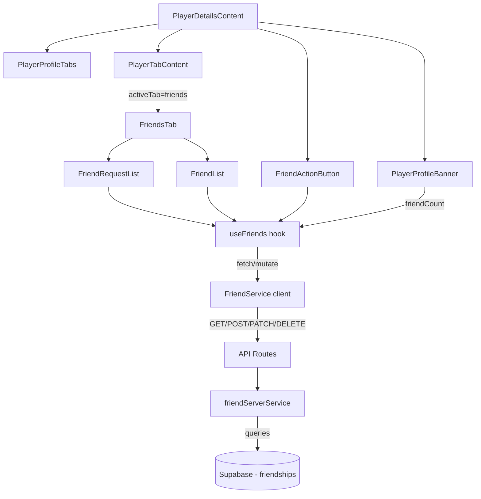

# Design — Système d'Amis

## Vue d'ensemble

Le système d'amis ajoute une couche sociale à Game Universe en permettant aux
joueurs de se connecter via des demandes d'amitié. Il s'appuie sur une nouvelle
table `friendships` dans Supabase, des endpoints API REST dans le dossier
`src/app/api/players/[id]/friends/`, un service client `friendService.ts`, un
hook `useFriends.ts`, et des composants UI dans `src/components/players/`.

Le flux principal est : un joueur authentifié envoie une demande → le
destinataire accepte ou refuse → les amis confirmés apparaissent dans l'onglet «
Amis » (déjà défini dans `PlayerProfileTabs` mais sans contenu) et le compteur
dans `PlayerProfileBanner` (actuellement codé en dur à 0) reflète le nombre
réel.

## Architecture



### Décisions architecturales

1. **Table unique `friendships`** : Une seule table stocke à la fois les
   demandes en attente et les amitiés confirmées via un champ `status`. Cela
   simplifie les requêtes et évite la synchronisation entre deux tables. La
   relation est directionnelle (sender → receiver) mais la lecture des amis
   confirmés est bidirectionnelle.

2. **Suppression physique pour refus et retrait** : Quand une demande est
   refusée ou qu'un ami est retiré, la ligne est supprimée (pas de soft delete).
   Cela permet au joueur de renvoyer une demande ultérieurement et simplifie la
   contrainte d'unicité.

3. **API sous `/api/players/[id]/friends`** : Les endpoints sont imbriqués sous
   le joueur cible, cohérent avec le pattern existant
   (`/api/players/[id]/activity`, `/api/players/[id]/collections`). Les
   mutations (POST, PATCH, DELETE) vérifient l'authentification via
   `createRouteHandlerClient` + `supabase.auth.getUser()`.

4. **Hook centralisé `useFriends`** : Un seul hook gère l'état des amis, des
   demandes en attente, du statut de relation, et des mutations. Il expose des
   méthodes pour envoyer, accepter, refuser et supprimer, avec mise à jour
   optimiste du compteur dans la bannière.

5. **Scroll infini pour la liste d'amis** : Cohérent avec le pattern utilisé
   dans `ActivityFeed`. Le hook gère la pagination incrémentale via
   `IntersectionObserver`.

6. **Recherche côté client** : La recherche d'amis par nom filtre la liste déjà
   chargée côté client (le nombre d'amis par joueur est modéré). Si le volume
   augmente, on pourra migrer vers un filtrage côté serveur.

## Composants et Interfaces

### Nouveaux fichiers

```
supabase/migrations/
├── 20240307000001_friendships_table.sql     # Table, contraintes, index, RLS

src/types/
├── friendship.ts                            # Types partagés

src/lib/services/
├── friendService.ts                         # Service client (fetch API)
├── friendServerService.ts                   # Service serveur (Supabase queries)

src/hooks/
├── useFriends.ts                            # Hook de gestion des amis

src/app/api/players/[id]/friends/
├── route.ts                                 # GET liste + POST envoi demande

src/app/api/players/[id]/friends/[friendshipId]/
├── route.ts                                 # PATCH accepter + DELETE refuser/supprimer

src/components/players/
├── FriendsTab.tsx                           # Orchestrateur de l'onglet Amis
├── FriendList.tsx                           # Liste des amis confirmés
├── FriendCard.tsx                           # Carte d'un ami
├── FriendRequestList.tsx                    # Liste des demandes en attente
├── FriendRequestCard.tsx                    # Carte d'une demande
├── FriendActionButton.tsx                   # Bouton d'action sur le profil
├── FriendSearchBar.tsx                      # Barre de recherche dans la liste

src/messages/
├── en.json                                  # Clés friends.* ajoutées
├── fr.json                                  # Clés friends.* ajoutées
```

### Fichiers modifiés

```
src/components/players/PlayerTabContent.tsx  # Ajout du case "friends"
src/components/players/PlayerDetailsContent.tsx  # Passer friendCount dynamique
src/components/players/PlayerProfileBanner.tsx   # Aucun changement structurel
                                                  # (reçoit déjà friendCount en prop)
```

### Composants

**FriendsTab** : Orchestrateur de l'onglet. Affiche `FriendRequestList` (si
propriétaire et demandes en attente) puis `FriendSearchBar` et `FriendList`.
Utilise le hook `useFriends`.

**FriendList** : Grille de `FriendCard`. Gère le scroll infini via
`IntersectionObserver`. Affiche un skeleton pendant le chargement et un message
vide si aucun ami. Attributs ARIA : `role="list"`, `aria-label`.

**FriendCard** : Carte d'un ami avec avatar, nom, niveau, lien vers le profil.
Chaque carte est un lien focusable et activable au clavier.

**FriendRequestList** : Section des demandes en attente reçues. Affiche une
liste de `FriendRequestCard`. Masquée si aucune demande. Attribut
`aria-busy="true"` pendant les opérations.

**FriendRequestCard** : Carte d'une demande avec avatar, nom de l'expéditeur,
date, boutons « Accepter » et « Refuser » avec `aria-label` incluant le nom du
joueur. Les boutons sont désactivés pendant l'opération avec spinner.

**FriendActionButton** : Bouton contextuel affiché dans `PlayerDetailsContent`
(à côté de la bannière). Affiche un état différent selon le statut de relation :
aucune relation → « Ajouter en ami », demande envoyée → « Demande envoyée »
(désactivé), demande reçue → « Accepter » / « Refuser », amis → « Retirer des
amis » (avec confirmation). Masqué si non authentifié ou profil propre. Feedback
via `aria-live`.

**FriendSearchBar** : Input de recherche avec icône. Filtre la liste d'amis côté
client par nom d'affichage.

### Hook

**useFriends(playerId, currentUserId, locale)** : Gère l'état complet :

- `friends: FriendSummary[]` — liste cumulée des amis (scroll infini)
- `pendingRequests: FriendRequest[]` — demandes en attente reçues
- `friendCount: number` — compteur total d'amis confirmés
- `relationshipStatus: RelationshipStatus` — statut entre currentUser et player
- `isLoading: boolean` — chargement initial
- `isLoadingMore: boolean` — chargement page suivante
- `hasNextPage: boolean` — indicateur de page suivante
- `sendRequest()` — envoyer une demande
- `acceptRequest(friendshipId)` — accepter une demande
- `declineRequest(friendshipId)` — refuser une demande
- `removeFriend(friendshipId)` — retirer un ami
- `loadMore()` — charger la page suivante

## Modèles de données

### Table SQL `friendships`

```sql
CREATE TABLE public.friendships (
  id UUID PRIMARY KEY DEFAULT gen_random_uuid(),
  sender_id UUID NOT NULL REFERENCES public.profiles(id) ON DELETE CASCADE,
  receiver_id UUID NOT NULL REFERENCES public.profiles(id) ON DELETE CASCADE,
  status TEXT NOT NULL DEFAULT 'pending' CHECK (status IN ('pending', 'accepted', 'declined')),
  created_at TIMESTAMPTZ DEFAULT NOW(),
  updated_at TIMESTAMPTZ DEFAULT NOW(),

  CONSTRAINT friendships_no_self_friend CHECK (sender_id != receiver_id),
  CONSTRAINT friendships_unique_pair UNIQUE (sender_id, receiver_id)
);

-- Index pour les requêtes fréquentes
CREATE INDEX idx_friendships_receiver_status ON friendships(receiver_id, status);
CREATE INDEX idx_friendships_sender_status ON friendships(sender_id, status);
CREATE INDEX idx_friendships_status_updated ON friendships(status, updated_at DESC);
```

### Politiques RLS

```sql
-- Lecture publique des amitiés acceptées
CREATE POLICY "Accepted friendships are viewable by everyone"
  ON friendships FOR SELECT
  USING (status = 'accepted');

-- Lecture des demandes en attente par les joueurs concernés
CREATE POLICY "Pending requests viewable by involved players"
  ON friendships FOR SELECT
  USING (status = 'pending' AND (sender_id = auth.uid() OR receiver_id = auth.uid()));

-- Insertion par l'expéditeur authentifié
CREATE POLICY "Authenticated users can send friend requests"
  ON friendships FOR INSERT
  WITH CHECK (sender_id = auth.uid());

-- Mise à jour par le destinataire (accepter/refuser)
CREATE POLICY "Receiver can update pending requests"
  ON friendships FOR UPDATE
  USING (receiver_id = auth.uid() AND status = 'pending');

-- Suppression par l'un des deux joueurs (retirer un ami ou annuler)
CREATE POLICY "Involved players can delete friendships"
  ON friendships FOR DELETE
  USING (sender_id = auth.uid() OR receiver_id = auth.uid());
```

### Types TypeScript

```typescript
// src/types/friendship.ts

/** Statut d'une relation d'amitié */
export type FriendshipStatus = "pending" | "accepted" | "declined";

/** Statut de relation entre le joueur courant et un joueur cible */
export type RelationshipStatus =
  | "none"
  | "pending_sent" // demande envoyée par le joueur courant
  | "pending_received" // demande reçue par le joueur courant
  | "accepted"; // amis confirmés

/** Résumé d'un ami pour l'affichage dans la liste */
export interface FriendSummary {
  id: string; // ID du profil de l'ami
  friendshipId: string; // ID de la ligne friendships
  displayName: string;
  avatarUrl: string | null;
  level: number;
  acceptedAt: string; // ISO 8601
}

/** Demande d'amitié en attente */
export interface FriendRequest {
  friendshipId: string;
  sender: {
    id: string;
    displayName: string;
    avatarUrl: string | null;
  };
  createdAt: string; // ISO 8601
}

/** Réponse de l'API pour la liste d'amis */
export interface FriendsListResponse {
  friends: FriendSummary[];
  totalCount: number;
  pagination: {
    currentPage: number;
    totalPages: number;
    hasNextPage: boolean;
  };
  pendingRequests?: FriendRequest[]; // uniquement pour le propriétaire
}

/** Réponse de l'API pour le statut de relation */
export interface RelationshipStatusResponse {
  status: RelationshipStatus;
  friendshipId?: string; // présent si relation existe
}

/** Paramètres de requête pour la liste d'amis */
export interface FriendsQueryParams {
  page?: number;
  limit?: number;
}
```

### Endpoints API

| Méthode | Route                                      | Description                   | Auth  |
| ------- | ------------------------------------------ | ----------------------------- | ----- |
| GET     | `/api/players/[id]/friends`                | Liste amis + demandes (owner) | Non\* |
| POST    | `/api/players/[id]/friends`                | Envoyer demande d'ami         | Oui   |
| GET     | `/api/players/[id]/friends/status`         | Statut de relation            | Oui   |
| PATCH   | `/api/players/[id]/friends/[friendshipId]` | Accepter une demande          | Oui   |
| DELETE  | `/api/players/[id]/friends/[friendshipId]` | Refuser demande / retirer ami | Oui   |

\* GET liste : public pour les amis acceptés, les demandes en attente ne sont
incluses que si le requêteur est le propriétaire du profil.

## Propriétés de Correction

_Une propriété est une caractéristique ou un comportement qui doit rester vrai
pour toutes les exécutions valides d'un système — essentiellement, une
déclaration formelle sur ce que le système doit faire. Les propriétés servent de
pont entre les spécifications lisibles par l'humain et les garanties de
correction vérifiables par la machine._

### Propriété 1 : Prévention des demandes en double

_Pour toute_ paire de joueurs (A, B) où une relation existe déjà (pending ou
accepted), tenter d'envoyer une nouvelle demande de A vers B doit être rejeté
avec une erreur, et la relation existante doit rester inchangée.

**Valide : Exigences 1.2, 2.2**

### Propriété 2 : Prévention de l'auto-amitié

_Pour tout_ joueur, tenter d'envoyer une demande d'ami à soi-même doit être
rejeté avec une erreur, et aucune ligne ne doit être créée dans la table
friendships.

**Valide : Exigences 1.3, 2.3**

### Propriété 3 : Transition d'acceptation

_Pour toute_ demande d'amitié en attente (status=pending), l'acceptation par le
destinataire doit changer le statut à `accepted` et la relation doit apparaître
dans la liste d'amis des deux joueurs.

**Valide : Exigence 2.4**

### Propriété 4 : Suppression par refus ou retrait

_Pour toute_ relation d'amitié (pending ou accepted), le refus d'une demande ou
le retrait d'un ami doit supprimer la ligne de la table friendships, et les deux
joueurs doivent pouvoir recréer une relation ultérieurement.

**Valide : Exigences 2.5, 2.6**

### Propriété 5 : Tri chronologique décroissant de la liste d'amis

_Pour toute_ liste d'amis retournée par l'API, chaque ami à l'index `i` doit
avoir une date d'acceptation supérieure ou égale à celle de l'ami à l'index
`i+1`.

**Valide : Exigence 3.1**

### Propriété 6 : Complétude des données d'un ami

_Pour tout_ ami dans la réponse de l'API ou dans le rendu d'une `FriendCard`,
l'objet doit contenir : un identifiant, un nom d'affichage (chaîne non vide),
une URL d'avatar (chaîne ou null), un niveau (entier ≥ 0), et une date
d'acceptation (chaîne ISO 8601 valide).

**Valide : Exigences 3.2, 4.2**

### Propriété 7 : Correction de la pagination

_Pour tout_ nombre total d'amis `N` et tout numéro de page `p` (avec une taille
de page de 20), la page retournée doit contenir au plus 20 amis, le nombre total
de pages doit être `ceil(N / 20)`, et `hasNextPage` doit être `true` si et
seulement si `p < ceil(N / 20)`.

**Valide : Exigences 3.3, 3.4**

### Propriété 8 : Demandes en attente visibles uniquement par le propriétaire

_Pour toute_ requête de liste d'amis, le champ `pendingRequests` doit être
présent et non vide uniquement lorsque le requêteur est le propriétaire du
profil et qu'il existe des demandes en attente reçues. Pour tout autre
requêteur, le champ doit être absent ou undefined.

**Valide : Exigence 3.5**

### Propriété 9 : Filtrage de recherche d'amis côté client

_Pour toute_ liste d'amis et toute chaîne de recherche, la liste filtrée ne doit
contenir que des amis dont le nom d'affichage contient la chaîne de recherche
(insensible à la casse), et tous les amis correspondants doivent être présents
dans le résultat.

**Valide : Exigence 4.6**

### Propriété 10 : Mapping statut de relation → état du bouton

_Pour tout_ statut de relation (`none`, `pending_sent`, `pending_received`,
`accepted`) et tout état d'authentification, la fonction de mapping doit
retourner l'état de bouton correct :

- `none` + authentifié → « Ajouter en ami » (actif)
- `pending_sent` → « Demande envoyée » (désactivé)
- `pending_received` → « Accepter » + « Refuser » (actifs)
- `accepted` → « Retirer des amis » (actif)
- non authentifié → bouton masqué

**Valide : Exigences 6.1, 6.3, 6.4, 6.5, 6.6**

### Propriété 11 : Compteur d'amis égal au nombre réel

_Pour tout_ joueur, le compteur d'amis affiché dans la bannière doit être égal
au nombre de lignes dans la table friendships avec status=accepted où le joueur
est sender_id ou receiver_id.

**Valide : Exigence 7.1**

### Propriété 12 : Propagation d'erreur avec message descriptif

_Pour tout_ appel API qui échoue (status ≥ 400), le `FriendService` doit lever
une erreur dont le message contient une description non vide du problème.

**Valide : Exigence 8.2**

### Propriété 13 : Aria-label des boutons d'action inclut le nom du joueur

_Pour toute_ demande d'amitié affichée dans `FriendRequestCard`, les attributs
`aria-label` des boutons « Accepter » et « Refuser » doivent contenir le nom
d'affichage du joueur expéditeur.

**Valide : Exigence 10.2**

## Gestion des erreurs

| Scénario                               | Code | Comportement                                                                                                     |
| -------------------------------------- | ---- | ---------------------------------------------------------------------------------------------------------------- |
| Utilisateur non authentifié (mutation) | 401  | L'API retourne `{ error: "Unauthorized" }`. Le service propage l'erreur.                                         |
| Demande à soi-même                     | 400  | L'API retourne `{ error: "Cannot send friend request to yourself" }`.                                            |
| Joueur cible inexistant                | 404  | L'API retourne `{ error: "Player not found" }`.                                                                  |
| Relation déjà existante                | 409  | L'API retourne `{ error: "Friendship already exists" }` avec le statut actuel.                                   |
| Demande/amitié introuvable             | 404  | L'API retourne `{ error: "Friendship not found" }`.                                                              |
| Opération non autorisée                | 403  | L'API retourne `{ error: "Forbidden" }` (ex: accepter une demande qu'on n'a pas reçue).                          |
| Erreur serveur                         | 500  | L'API retourne `{ error: "Internal server error" }`. Le service propage. Le composant affiche un toast d'erreur. |
| Erreur réseau                          | —    | Le service lève une exception. Le hook capture et expose `error`. Le composant affiche un message de réessai.    |

## Stratégie de tests

### Tests unitaires (Vitest)

Les tests unitaires vérifient des exemples spécifiques, des cas limites et des
conditions d'erreur :

- **API Routes** (`test/unit/api/players/friends.test.ts`) : Vérifie les
  réponses pour les opérations CRUD (201 création, 200 acceptation, 200
  suppression), les erreurs (401, 400, 404, 409), et la pagination.
- **Composants** :
  - `test/unit/components/players/FriendList.test.tsx` : Rendu avec amis, état
    vide, skeleton, attributs ARIA.
  - `test/unit/components/players/FriendRequestList.test.tsx` : Rendu des
    demandes, boutons accepter/refuser, états de chargement.
  - `test/unit/components/players/FriendActionButton.test.tsx` : États du bouton
    selon le statut de relation, masquage si non authentifié.
- **Service client** (`test/unit/lib/services/friendService.test.ts`) :
  Construction des URLs, propagation d'erreurs, appels API.

### Tests property-based (fast-check + Vitest)

Les tests property-based vérifient les propriétés universelles sur des entrées
générées aléatoirement. Chaque test doit exécuter au minimum 100 itérations.

- **Fichier** : `test/unit/lib/services/friendService.property.test.ts`
- **Bibliothèque** : `fast-check` (déjà installé dans le projet)
- **Convention de tag** : Chaque test est annoté avec un commentaire référençant
  la propriété du design :
  `// Feature: friends-system, Property N: [description]`

Les propriétés testées en property-based :

| Propriété | Description                        | Fonction testée                |
| --------- | ---------------------------------- | ------------------------------ |
| 5         | Tri chronologique décroissant      | Fonction de tri des amis       |
| 6         | Complétude des données d'un ami    | Fonction de transformation     |
| 7         | Correction de la pagination        | `computePagination()`          |
| 9         | Filtrage de recherche côté client  | `filterFriendsByName()`        |
| 10        | Mapping statut → état du bouton    | `getButtonState()`             |
| 11        | Compteur = nombre d'amis acceptés  | `countAcceptedFriends()`       |
| 12        | Propagation d'erreur avec message  | `FriendService` error handling |
| 13        | Aria-label inclut le nom du joueur | `getAriaLabel()`               |

Les propriétés 1–4 (prévention doublons, auto-amitié, transitions d'état) sont
mieux couvertes par des tests d'intégration avec la base de données, car elles
dépendent des contraintes SQL et des politiques RLS.

### Approche complémentaire

- Les tests unitaires couvrent les cas concrets, les intégrations API, le rendu
  des composants et la gestion d'erreurs.
- Les tests property-based couvrent les invariants universels sur les fonctions
  pures (tri, pagination, filtrage, mapping, transformation).
- Ensemble, ils assurent une couverture complète : les tests unitaires attrapent
  les bugs concrets, les tests property-based vérifient la correction générale.
- Chaque propriété de correction est implémentée par un SEUL test
  property-based.
