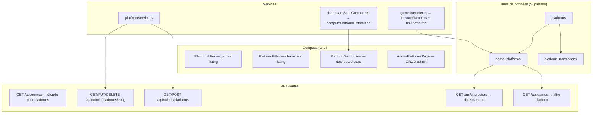

# Design Document — Game Platforms

## Overview

Cette feature ajoute la gestion des plateformes de jeux vidéo (PS5, Xbox, PC,
Switch, etc.) au site Game Universe. Elle s'articule autour de :

1. Un modèle de données avec traductions i18n (pattern identique aux genres)
2. Une relation many-to-many `game_platforms` entre jeux et plateformes
3. Des filtres plateforme sur les listings jeux et personnages
4. Une section statistiques "répartition par plateforme" dans le dashboard
   joueur
5. L'import automatique des plateformes depuis l'API IGDB
6. Un CRUD admin complet pour la gestion des plateformes

Le design suit les patterns existants du projet : service layer via API routes,
types partagés dans `src/types/`, composants glassmorphism, traductions FR/EN
via `next-intl`, migrations SQL dans `supabase/migrations/`.

## Architecture



### Décisions architecturales

- **Pattern genres répliqué** : Les plateformes suivent exactement le même
  pattern que les genres (table principale + table traductions + table de
  liaison). Cela garantit la cohérence et permet de réutiliser les patterns de
  code existants.
- **Filtrage côté serveur** : Les filtres plateforme sont appliqués dans les API
  routes via des JOINs SQL, comme les filtres genre existants. Pas de filtrage
  côté client.
- **Plateformes déduites pour les personnages** : Les plateformes d'un
  personnage sont calculées à la volée via ses jeux associés (pas de table
  `character_platforms`).
- **Import IGDB upsert** : Les plateformes sont créées à la demande lors de
  l'import, identifiées par `igdb_id` pour éviter les doublons.

## Components and Interfaces

### Nouveaux fichiers

| Fichier                                                 | Rôle                                                                 |
| ------------------------------------------------------- | -------------------------------------------------------------------- |
| `src/types/platform.ts`                                 | Types `Platform`, `PlatformSummary`                                  |
| `src/types/admin-platforms.ts`                          | Types `AdminPlatform`, `PlatformTranslation`, `FetchPlatformsParams` |
| `src/lib/services/platformService.ts`                   | Service client pour fetch plateformes (pattern `GenreService`)       |
| `src/lib/validations/admin-platform-form.ts`            | Schémas Zod pour validation admin                                    |
| `src/app/api/admin/platforms/route.ts`                  | GET (list) + POST (create) admin                                     |
| `src/app/api/admin/platforms/[slug]/route.ts`           | GET + PUT + DELETE admin par slug                                    |
| `src/app/api/platforms/route.ts`                        | GET public — liste des plateformes avec game count                   |
| `src/app/[locale]/admin/platforms/page.tsx`             | Page admin listing plateformes                                       |
| `src/components/admin/platforms/PlatformList.tsx`       | Composant liste admin                                                |
| `src/components/admin/platforms/PlatformForm.tsx`       | Formulaire création/édition                                          |
| `src/components/games/PlatformFilter.tsx`               | Filtre plateforme pour games listing                                 |
| `src/components/characters/CharacterPlatformFilter.tsx` | Filtre plateforme pour characters listing                            |
| `src/components/dashboard/PlatformDistribution.tsx`     | Stats répartition par plateforme                                     |
| `supabase/migrations/20240317000001_game_platforms.sql` | Migration SQL complète                                               |

### Fichiers modifiés

| Fichier                                          | Modification                                                             |
| ------------------------------------------------ | ------------------------------------------------------------------------ |
| `src/types/game.ts`                              | Ajout champ `platforms` dans `GameDetails` et `GameSummary`              |
| `src/types/character.ts`                         | Ajout champ `platforms` dans `CharacterDetails`                          |
| `src/types/dashboard-stats.ts`                   | Ajout `PlatformDistributionEntry` et champ dans `DashboardStatsResponse` |
| `src/lib/services/dashboardStatsCompute.ts`      | Ajout `computePlatformDistribution()`                                    |
| `src/lib/services/dashboardStatsService.ts`      | Intégration platform distribution                                        |
| `src/app/api/games/route.ts`                     | Support filtre `platforms` query param                                   |
| `src/app/api/characters/route.ts`                | Support filtre `platforms` query param                                   |
| `src/app/api/games/[slug]/route.ts`              | Inclure plateformes dans GameDetails                                     |
| `src/components/games/AllGamesContent.tsx`       | Intégration `PlatformFilter`                                             |
| `src/components/characters/CharacterFilters.tsx` | Intégration filtre plateforme                                            |
| `scripts/igdb-import/game-importer.ts`           | Ajout `ensurePlatforms()` + `linkPlatforms()`                            |
| `scripts/igdb-import/game-sync.ts`               | Sync des plateformes lors du sync                                        |
| `src/types/igdb.ts`                              | Ajout champ `platforms` dans `IGDBGame`                                  |
| `src/messages/fr.json`                           | Clés i18n plateformes                                                    |
| `src/messages/en.json`                           | Clés i18n plateformes                                                    |

### Interfaces des composants

```typescript
// PlatformFilter (games + characters)
interface PlatformFilterProps {
  selectedPlatforms: string[]; // slugs sélectionnés
  onPlatformsChange: (slugs: string[]) => void;
  locale?: string;
}

// PlatformDistribution (dashboard)
interface PlatformDistributionProps {
  data: PlatformDistributionEntry[];
  loading?: boolean;
}
```

## Data Models

### Tables SQL

```sql
-- Table principale des plateformes
CREATE TABLE platforms (
  id UUID PRIMARY KEY DEFAULT gen_random_uuid(),
  slug TEXT NOT NULL UNIQUE,
  igdb_id INTEGER UNIQUE,
  icon_url TEXT,
  created_at TIMESTAMPTZ NOT NULL DEFAULT now(),
  updated_at TIMESTAMPTZ NOT NULL DEFAULT now()
);

-- Traductions des plateformes (FR/EN)
CREATE TABLE platform_translations (
  id UUID PRIMARY KEY DEFAULT gen_random_uuid(),
  platform_id UUID NOT NULL REFERENCES platforms(id) ON DELETE CASCADE,
  language_code TEXT NOT NULL,
  name TEXT NOT NULL,
  abbreviation TEXT,
  UNIQUE(platform_id, language_code)
);

-- Association many-to-many jeux ↔ plateformes
CREATE TABLE game_platforms (
  game_id UUID NOT NULL REFERENCES games(id) ON DELETE CASCADE,
  platform_id UUID NOT NULL REFERENCES platforms(id) ON DELETE CASCADE,
  PRIMARY KEY (game_id, platform_id)
);

-- Index pour les requêtes de filtrage
CREATE INDEX idx_game_platforms_game_id ON game_platforms(game_id);
CREATE INDEX idx_game_platforms_platform_id ON game_platforms(platform_id);
```

### Politiques RLS

```sql
-- Lecture publique sur les 3 tables
ALTER TABLE platforms ENABLE ROW LEVEL SECURITY;
ALTER TABLE platform_translations ENABLE ROW LEVEL SECURITY;
ALTER TABLE game_platforms ENABLE ROW LEVEL SECURITY;

CREATE POLICY "Public read platforms" ON platforms FOR SELECT USING (true);
CREATE POLICY "Public read platform_translations" ON platform_translations FOR SELECT USING (true);
CREATE POLICY "Public read game_platforms" ON game_platforms FOR SELECT USING (true);

-- Écriture admin uniquement
CREATE POLICY "Admin write platforms" ON platforms
  FOR ALL USING (auth.jwt() ->> 'is_admin' = 'true');
CREATE POLICY "Admin write platform_translations" ON platform_translations
  FOR ALL USING (auth.jwt() ->> 'is_admin' = 'true');
CREATE POLICY "Admin write game_platforms" ON game_platforms
  FOR ALL USING (auth.jwt() ->> 'is_admin' = 'true');
```

### Types TypeScript

```typescript
// src/types/platform.ts
export interface PlatformSummary {
  id: string;
  slug: string;
  name: string;
  abbreviation?: string;
  iconUrl?: string;
}

// Ajout dans GameDetails.platforms
export interface GamePlatform {
  id: string;
  slug: string;
  name: string;
  abbreviation?: string;
  iconUrl?: string;
}

// Ajout dans GameSummary.platforms
export interface GameSummaryPlatform {
  name: string;
  slug: string;
}

// src/types/admin-platforms.ts
export interface PlatformTranslation {
  language_code: string;
  name: string;
  abbreviation?: string;
}

export interface AdminPlatform {
  id: string;
  slug: string;
  iconUrl?: string;
  gameCount: number;
  translations: PlatformTranslation[];
}

export interface FetchPlatformsParams {
  page?: number;
  limit?: number;
  search?: string;
  sortBy?: string;
  sortOrder?: "asc" | "desc";
  locale?: string;
}

// src/types/dashboard-stats.ts (ajout)
export interface PlatformDistributionEntry {
  platform: string;
  count: number;
  percentage: number;
}
```

### Modification des types existants

```typescript
// GameDetails — ajout du champ platforms
interface GameDetails {
  // ... champs existants
  platforms: GamePlatform[];
}

// GameSummary — ajout du champ platforms
interface GameSummary {
  // ... champs existants
  platforms?: GameSummaryPlatform[];
}

// CharacterDetails — ajout du champ platforms
interface CharacterDetails {
  // ... champs existants
  platforms: PlatformSummary[];
}

// DashboardStatsResponse — ajout
interface DashboardStatsResponse {
  // ... champs existants
  platformDistribution: PlatformDistributionEntry[];
}
```

### Clés i18n

```json
// Ajout dans fr.json et en.json
{
  "platforms": {
    "title": "Plateformes" / "Platforms",
    "filter": {
      "title": "Plateformes" / "Platforms",
      "placeholder": "Filtrer par plateforme..." / "Filter by platform...",
      "selected": "{count} sélectionnée(s)" / "{count} selected",
      "clearAll": "Tout effacer" / "Clear all"
    },
    "distribution": {
      "title": "Répartition par plateforme" / "Platform distribution",
      "empty": "Aucune donnée de plateforme" / "No platform data",
      "emptyDescription": "Ajoutez des jeux à votre bibliothèque pour voir la répartition par plateforme." / "Add games to your library to see platform distribution.",
      "games": "{count} jeu(x)" / "{count} game(s)",
      "percentage": "{value}%" / "{value}%"
    },
    "empty": "Aucune plateforme" / "No platforms"
  },
  "admin": {
    "platforms": {
      "title": "Gestion des plateformes" / "Platform management",
      "create": "Nouvelle plateforme" / "New platform",
      "edit": "Modifier la plateforme" / "Edit platform",
      "delete": "Supprimer la plateforme" / "Delete platform",
      "deleteConfirm": "Êtes-vous sûr de vouloir supprimer cette plateforme ? Toutes les associations seront supprimées." / "Are you sure you want to delete this platform? All associations will be removed.",
      "slug": "Slug",
      "slugPlaceholder": "ex: playstation-5" / "e.g.: playstation-5",
      "iconUrl": "URL de l'icône" / "Icon URL",
      "nameFr": "Nom (FR)",
      "nameEn": "Nom (EN)" / "Name (EN)",
      "abbreviation": "Abréviation" / "Abbreviation",
      "gameCount": "Jeux associés" / "Associated games",
      "errors": {
        "slugExists": "Une plateforme avec ce slug existe déjà." / "A platform with this slug already exists.",
        "nameRequired": "Au moins un nom (FR ou EN) est requis." / "At least one name (FR or EN) is required.",
        "loadError": "Erreur lors du chargement des plateformes." / "Error loading platforms.",
        "createError": "Erreur lors de la création de la plateforme." / "Error creating platform.",
        "updateError": "Erreur lors de la modification de la plateforme." / "Error updating platform.",
        "deleteError": "Erreur lors de la suppression de la plateforme." / "Error deleting platform."
      }
    }
  }
}
```

## Correctness Properties

_A property is a characteristic or behavior that should hold true across all
valid executions of a system — essentially, a formal statement about what the
system should do. Properties serve as the bridge between human-readable
specifications and machine-verifiable correctness guarantees._

### Property 1: Platform data shape in game and character responses

_For any_ game with associated platforms, the returned `platforms` array in
`GameDetails` must contain objects with `id`, `slug`, `name`, `abbreviation`,
and `iconUrl` fields. _For any_ game summary, the `platforms` array must contain
objects with `name` and `slug`. _For any_ character with associated games, the
returned `platforms` array in `CharacterDetails` must contain objects with `id`,
`slug`, `name`, and `iconUrl`.

**Validates: Requirements 2.1, 2.3, 2.4, 3.2**

### Property 2: Character platform deduplication

_For any_ character associated with multiple games that share common platforms,
the returned `platforms` array must contain no duplicate entries (unique by
`id`).

**Validates: Requirements 3.1**

### Property 3: Game platform filter correctness

_For any_ set of selected platform slugs and any game returned by the filtered
Games_Listing, that game must be associated with at least one of the selected
platforms.

**Validates: Requirements 4.1**

### Property 4: Character platform filter correctness

_For any_ set of selected platform slugs and any character returned by the
filtered Characters_Listing, that character must have at least one associated
game available on one of the selected platforms.

**Validates: Requirements 4.2**

### Property 5: Combined filter intersection

_For any_ combination of platform filter and genre filter applied to the
Games_Listing, the result set must be a subset of the intersection of the
results from applying each filter independently. When no platform filter is
selected, the result set must equal the unfiltered result set.

**Validates: Requirements 4.3, 4.4**

### Property 6: Platform distribution computation

_For any_ non-empty player library with games having platform associations,
`computePlatformDistribution` must return entries where the sum of all `count`
values equals the total number of game-platform assignments in the library, and
all `percentage` values sum to approximately 100% (within rounding tolerance).
The entries must be sorted by count descending.

**Validates: Requirements 5.1, 5.3**

### Property 7: IGDB platform upsert idempotence

_For any_ IGDB platform data, importing the same platform (identified by
`igdb_id`) multiple times must result in exactly one platform row in the
database. The platform's slug and English translation must match the IGDB data.

**Validates: Requirements 6.2, 6.3**

### Property 8: IGDB import creates correct game-platform associations

_For any_ IGDB game with a non-empty `platforms` array, after import, the game
must be associated with exactly the platforms listed in the IGDB data (matched
by `igdb_id`).

**Validates: Requirements 6.1, 6.4**

### Property 9: IGDB sync preserves existing and adds new platforms

_For any_ existing game being synced, the set of platforms after sync must be a
superset of the platforms before sync. New platforms from IGDB are added,
existing associations are preserved.

**Validates: Requirements 6.5**

### Property 10: Admin platform validation

_For any_ platform creation payload, the validation schema must reject payloads
missing a slug or missing all translations (at least one of FR or EN name is
required). Valid payloads with a unique slug and at least one translation must
be accepted.

**Validates: Requirements 7.2**

### Property 11: Admin slug uniqueness enforcement

_For any_ two platform creation attempts with the same slug, the second attempt
must fail with a conflict error, and only one platform with that slug must exist
in the database.

**Validates: Requirements 7.5**

### Property 12: Locale translation with English fallback

_For any_ platform and any supported locale, the service must return the
translation for that locale if it exists. If the translation does not exist for
the requested locale, the service must return the English translation as
fallback.

**Validates: Requirements 8.1, 8.2**

## Error Handling

| Scénario                                                    | Comportement attendu                                   |
| ----------------------------------------------------------- | ------------------------------------------------------ |
| Jeu sans plateformes associées                              | Retourne `platforms: []` (pas d'erreur)                |
| Personnage sans jeux                                        | Retourne `platforms: []` (pas d'erreur)                |
| Bibliothèque vide (dashboard stats)                         | Retourne `platformDistribution: []` avec état vide UI  |
| Slug admin en doublon (POST)                                | HTTP 409 Conflict avec message explicite               |
| Validation admin échouée (slug manquant, pas de traduction) | HTTP 400 Bad Request avec détails Zod                  |
| Plateforme non trouvée (GET/PUT/DELETE par slug)            | HTTP 404 Not Found                                     |
| Utilisateur non-admin tente écriture                        | HTTP 403 Forbidden (via `requireAdmin()`)              |
| IGDB ne retourne aucune plateforme pour un jeu              | Import continue sans erreur, aucune association créée  |
| IGDB retourne une plateforme sans nom                       | Utilise le slug IGDB comme nom fallback                |
| Traduction manquante dans la locale demandée                | Fallback vers la traduction anglaise                   |
| Traduction anglaise aussi manquante                         | Retourne le slug comme nom de dernier recours          |
| Erreur réseau lors du fetch des plateformes (client)        | Toast d'erreur, données précédentes préservées         |
| Suppression d'une plateforme avec jeux associés             | Cascade SQL supprime les associations `game_platforms` |

## Testing Strategy

### Approche duale : tests unitaires + tests property-based

Les deux types de tests sont complémentaires :

- **Tests unitaires** : exemples spécifiques, edge cases, intégration API
- **Tests property-based** : propriétés universelles vérifiées sur des entrées
  générées aléatoirement

### Bibliothèque PBT

Le projet utilise **fast-check** comme bibliothèque de property-based testing,
intégrée avec Vitest.

### Configuration PBT

- Minimum **100 itérations** par test property
- Chaque test property référence sa propriété du design via un tag commentaire
- Format du tag : `Feature: game-platforms, Property {number}: {title}`

### Tests unitaires (Vitest)

| Fichier                                                 | Couverture                            |
| ------------------------------------------------------- | ------------------------------------- |
| `test/unit/lib/services/platformService.test.ts`        | Service fetch plateformes             |
| `test/unit/lib/services/dashboardStatsCompute.test.ts`  | `computePlatformDistribution` (ajout) |
| `test/unit/api/admin/platforms.test.ts`                 | Routes admin CRUD                     |
| `test/unit/api/platforms.test.ts`                       | Route publique GET                    |
| `test/unit/lib/validations/admin-platform-form.test.ts` | Validation Zod                        |
| `test/scripts/igdb-import/platforms.test.ts`            | Import/sync plateformes IGDB          |

### Tests property-based (fast-check + Vitest)

| Fichier                                                              | Propriétés couvertes                  |
| -------------------------------------------------------------------- | ------------------------------------- |
| `test/unit/lib/services/platformDistribution.property.test.ts`       | Property 6 (distribution computation) |
| `test/unit/lib/services/platformFiltering.property.test.ts`          | Properties 3, 4, 5 (filtering)        |
| `test/unit/lib/validations/adminPlatformValidation.property.test.ts` | Property 10 (validation)              |
| `test/unit/lib/services/platformTranslation.property.test.ts`        | Property 12 (locale fallback)         |

### Edge cases couverts par les tests unitaires

- Jeu avec 0 plateformes → `platforms: []`
- Personnage avec 0 jeux → `platforms: []`
- Bibliothèque vide → `platformDistribution: []`
- Import IGDB sans plateformes → pas d'erreur
- Slug en doublon → erreur 409
- Traduction manquante → fallback EN → fallback slug
