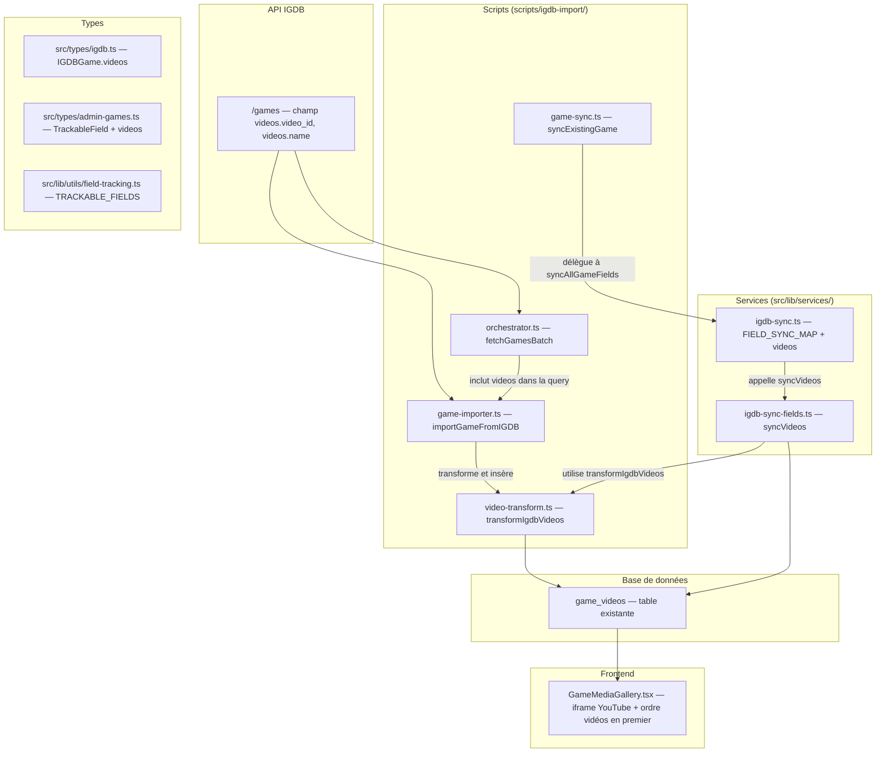

# Design Document — IGDB Video Sync

## Overview

Cette feature complète le pipeline d'import IGDB en ajoutant la synchronisation
des vidéos YouTube associées aux jeux. L'API IGDB expose les vidéos via le champ
`videos` sur l'endpoint `/games`, chaque vidéo contenant un `video_id`
(identifiant YouTube) et un `name` (titre).

La table `game_videos` existe déjà dans Supabase et le frontend
(`GameMediaGallery`) affiche déjà les vidéos. Cependant :

1. Le script d'import bulk (`scripts/igdb-import/`) ne récupère pas les vidéos
2. Le service de sync (`igdb-sync`) ne synchronise pas les vidéos
3. Le composant `GameMediaGallery` utilise un élément `<video>` HTML au lieu
   d'un iframe YouTube
4. Les vidéos ne sont pas affichées en premier dans la galerie média

Le design s'articule autour de 4 axes :

- **Backend import** : Ajout du champ `videos` dans les requêtes IGDB et
  insertion dans `game_videos` lors de l'import
- **Backend sync** : Ajout de `"videos"` comme `TrackableField` et fonction
  `syncVideos` dans le service de sync
- **Fonction utilitaire partagée** : Fonction pure `transformIgdbVideos` pour
  centraliser la transformation IGDB → `game_videos`
- **Frontend** : Modification de `GameMediaGallery` pour afficher les vidéos en
  premier via iframe YouTube

## Architecture



### Décisions architecturales

- **Fonction de transformation partagée** : `transformIgdbVideos` est une
  fonction pure dans `scripts/igdb-import/video-transform.ts`, réutilisée par le
  game-importer et le sync service. Cela évite la duplication de la logique de
  construction des URLs YouTube et des thumbnails.
- **Pas de migration SQL** : La table `game_videos` existe déjà avec toutes les
  colonnes nécessaires (`url`, `thumbnail_url`, `title`, `video_type`,
  `display_order`, `is_featured`). Aucune modification de schéma requise.
- **Delete + re-insert pour le sync** : Comme pour les screenshots et artworks,
  la synchronisation des vidéos supprime les vidéos existantes puis réinsère
  depuis IGDB. C'est le pattern établi dans `igdb-sync-fields.ts`.
- **iframe YouTube** : Le composant `GameMediaGallery` utilise actuellement un
  élément `<video>` HTML qui ne fonctionne pas avec les URLs YouTube. Le
  remplacement par un iframe YouTube embed est nécessaire.
- **Vidéos en premier** : L'ordre d'affichage dans la galerie est modifié pour
  placer les vidéos avant les artworks et screenshots, conformément au
  requirement 6.

## Components and Interfaces

### Nouveaux fichiers

| Fichier                                  | Rôle                                                     |
| ---------------------------------------- | -------------------------------------------------------- |
| `scripts/igdb-import/video-transform.ts` | Fonction pure `transformIgdbVideos` (IGDB → game_videos) |

### Fichiers modifiés

| Fichier                                             | Modification                                                           |
| --------------------------------------------------- | ---------------------------------------------------------------------- |
| `src/types/igdb.ts`                                 | Ajout `videos?: IGDBVideo[]` dans `IGDBGame`                           |
| `src/types/admin-games.ts`                          | Ajout `"videos"` dans le type union `TrackableField`                   |
| `src/lib/utils/field-tracking.ts`                   | Ajout `"videos"` dans `TRACKABLE_FIELDS`                               |
| `src/lib/services/igdb-sync.ts`                     | Ajout entrée `videos` dans `FIELD_SYNC_MAP`                            |
| `src/lib/services/igdb-sync-fields.ts`              | Ajout export `syncVideos`                                              |
| `src/lib/services/igdbService.ts`                   | Ajout `videos.video_id, videos.name` dans `getGameDetails` query       |
| `scripts/igdb-import/orchestrator.ts`               | Ajout `videos.video_id, videos.name` dans `fetchGamesBatch` query      |
| `scripts/igdb-import/game-importer.ts`              | Appel `transformIgdbVideos` + insertion dans `game_videos` après media |
| `src/components/games/details/GameMediaGallery.tsx` | Vidéos en premier + iframe YouTube au lieu de `<video>`                |

### Interface de la fonction de transformation

```typescript
// scripts/igdb-import/video-transform.ts

export interface IGDBVideo {
  video_id: string;
  name: string;
}

export interface GameVideoRow {
  game_id: string;
  url: string;
  thumbnail_url: string;
  title: string;
  video_type: string;
  display_order: number;
  is_featured: boolean;
}

/**
 * Transforme un tableau de vidéos IGDB en lignes game_videos.
 * Fonction pure, réutilisée par le game-importer et le sync service.
 */
export function transformIgdbVideos(
  videos: IGDBVideo[],
  gameId: string
): GameVideoRow[];
```

## Data Models

### Table existante `game_videos` (pas de modification)

```sql
CREATE TABLE public.game_videos (
  id UUID PRIMARY KEY DEFAULT gen_random_uuid(),
  game_id UUID REFERENCES games(id) ON DELETE CASCADE NOT NULL,
  url TEXT NOT NULL,
  thumbnail_url TEXT,
  title TEXT NOT NULL,
  description TEXT,
  video_type VARCHAR(50) DEFAULT 'trailer',
  duration_seconds INTEGER,
  display_order INTEGER DEFAULT 0,
  is_featured BOOLEAN DEFAULT FALSE,
  created_at TIMESTAMP DEFAULT NOW()
);
```

### Mapping IGDB → game_videos

| Champ IGDB    | Champ game_videos | Transformation                                            |
| ------------- | ----------------- | --------------------------------------------------------- |
| `video_id`    | `url`             | `https://www.youtube.com/watch?v={video_id}`              |
| `video_id`    | `thumbnail_url`   | `https://img.youtube.com/vi/{video_id}/maxresdefault.jpg` |
| `name`        | `title`           | Copie directe                                             |
| —             | `video_type`      | Toujours `"trailer"`                                      |
| (index)       | `display_order`   | Index séquentiel à partir de 0                            |
| (index === 0) | `is_featured`     | `true` uniquement pour le premier (display_order 0)       |

### Modification du type `IGDBGame`

```typescript
// Ajout dans src/types/igdb.ts
export interface IGDBGame {
  // ... champs existants
  videos?: Array<{ video_id: string; name: string }>;
}
```

### Modification du type `TrackableField`

```typescript
// src/types/admin-games.ts
export type TrackableField =
  | "translations"
  | "cover_image"
  | "background_image"
  | "release_date"
  | "metascore"
  | "genres"
  | "companies"
  | "platforms"
  | "screenshots"
  | "artworks"
  | "age_ratings"
  | "versions"
  | "languages"
  | "playtime"
  | "videos"; // AJOUT
```

## Correctness Properties

_A property is a characteristic or behavior that should hold true across all
valid executions of a system — essentially, a formal statement about what the
system should do. Properties serve as the bridge between human-readable
specifications and machine-verifiable correctness guarantees._

### Property 1: Video transformation correctness

_For any_ valid array of IGDB videos (each with a non-empty `video_id` and
`name`) and any valid `game_id`, `transformIgdbVideos` shall produce an output
array where:

- Each row's `url` equals `https://www.youtube.com/watch?v={video_id}`
- Each row's `thumbnail_url` equals
  `https://img.youtube.com/vi/{video_id}/maxresdefault.jpg`
- Each row's `title` equals the corresponding input `name`
- Each row's `video_type` equals `"trailer"`
- Each row's `display_order` equals its index (0, 1, 2, ...)
- `is_featured` is `true` only for the first row (index 0) and `false` for all
  others
- Each row's `game_id` equals the provided `game_id`

**Validates: Requirements 2.2, 2.3, 2.4, 2.5, 2.6, 2.7, 5.4**

### Property 2: Video ID round-trip

_For any_ valid array of IGDB videos, transforming them with
`transformIgdbVideos` and then extracting the `video_id` from each resulting
YouTube URL (by parsing the `v` query parameter) shall produce the original
`video_id` values in the same order.

**Validates: Requirements 5.2**

### Property 3: Transformation length preservation

_For any_ valid array of IGDB videos, the output array of `transformIgdbVideos`
shall have the same length as the input array.

**Validates: Requirements 5.3**

### Property 4: Override skips video synchronization

_For any_ game that has a `Field_Override` for `"videos"`, calling
`syncAllGameFields` shall not modify the `game_videos` rows for that game. The
videos before and after sync shall be identical.

**Validates: Requirements 3.4**

### Property 5: Video insertion error resilience

_For any_ game where video insertion into `game_videos` fails (e.g., database
error), the overall `importGameFromIGDB` function shall still return
`success: true` for the game itself, and the error shall be logged without
propagating.

**Validates: Requirements 4.3**

### Property 6: YouTube embed URL extraction

_For any_ YouTube watch URL of the form
`https://www.youtube.com/watch?v={video_id}`, extracting the video identifier
and constructing the embed URL shall produce
`https://www.youtube.com/embed/{video_id}`.

**Validates: Requirements 6.2, 6.3**

## Error Handling

| Scénario                                          | Comportement attendu                                              |
| ------------------------------------------------- | ----------------------------------------------------------------- |
| Jeu IGDB sans champ `videos`                      | Import continue normalement, aucune vidéo insérée                 |
| Jeu IGDB avec `videos: []` (tableau vide)         | Import continue normalement, aucune vidéo insérée                 |
| Échec d'insertion d'une vidéo dans `game_videos`  | Erreur loggée, import du jeu continue et retourne `success: true` |
| Override `"videos"` existant lors du sync         | Vidéos ignorées par `syncAllGameFields`, pas de modification      |
| URL YouTube malformée dans les données existantes | `GameMediaGallery` affiche un fallback (icône Play sans iframe)   |
| Aucune vidéo pour un jeu (frontend)               | Section vidéos non rendue, pas de conteneur vide                  |
| Vidéo sans `thumbnail_url`                        | `GameMediaGallery` affiche un placeholder avec icône Play         |

## Testing Strategy

### Approche duale : tests unitaires + tests property-based

Les deux types de tests sont complémentaires :

- **Tests unitaires** : exemples spécifiques, edge cases, intégration
- **Tests property-based** : propriétés universelles vérifiées sur des entrées
  générées aléatoirement

### Bibliothèque PBT

Le projet utilise **fast-check** comme bibliothèque de property-based testing,
intégrée avec Vitest.

### Configuration PBT

- Minimum **100 itérations** par test property
- Chaque test property référence sa propriété du design via un tag commentaire
- Format du tag : `Feature: igdb-video-sync, Property {number}: {title}`
- Chaque propriété de correctness est implémentée par un **seul** test
  property-based

### Tests unitaires (Vitest)

| Fichier                                                        | Couverture                                                |
| -------------------------------------------------------------- | --------------------------------------------------------- |
| `test/scripts/igdb-import/video-transform.test.ts`             | `transformIgdbVideos` — exemples, edge cases (vide, 1, N) |
| `test/unit/lib/services/igdb-sync-videos.test.ts`              | `syncVideos` — delete+reinsert, override skip             |
| `test/unit/components/games/details/GameMediaGallery.test.tsx` | Iframe YouTube, ordre sections, vidéo absente             |

### Tests property-based (fast-check + Vitest)

| Fichier                                                                | Propriétés couvertes                                      |
| ---------------------------------------------------------------------- | --------------------------------------------------------- |
| `test/scripts/igdb-import/video-transform.property.test.ts`            | Properties 1, 2, 3 (transformation, round-trip, longueur) |
| `test/unit/lib/services/igdb-sync-videos.property.test.ts`             | Property 4 (override skip)                                |
| `test/unit/components/games/details/GameMediaGallery.property.test.ts` | Property 6 (embed URL extraction)                         |

### Edge cases couverts par les tests unitaires

- Tableau de vidéos vide → aucune insertion, pas d'erreur
- Une seule vidéo → `is_featured: true`, `display_order: 0`
- Vidéo avec `video_id` contenant des caractères spéciaux
- Échec d'insertion DB → erreur loggée, import continue
- URL YouTube sans paramètre `v` → fallback dans le composant
- Jeu sans vidéos dans le frontend → section non rendue
