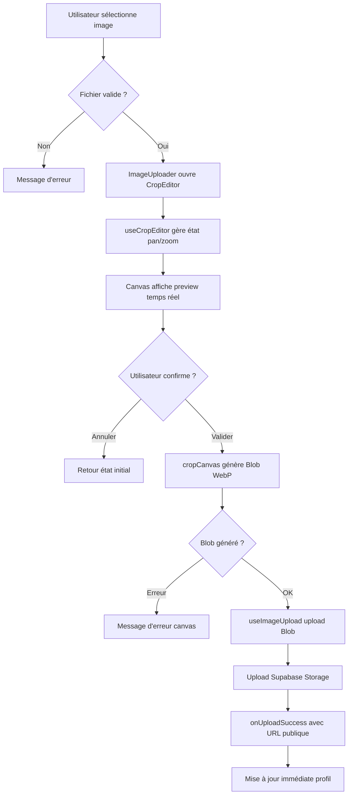
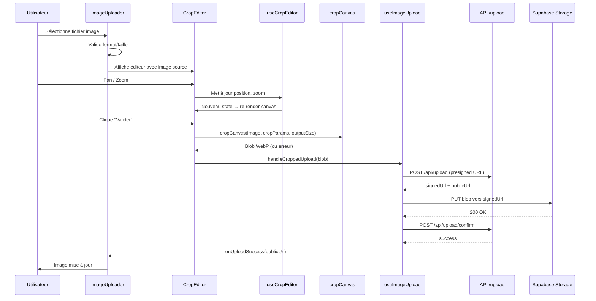

# Document de Design — Recadrage d'Image à l'Upload

## Vue d'ensemble

Cette fonctionnalité ajoute un éditeur de recadrage interactif au composant
`ImageUploader` existant. Après sélection d'un fichier image, l'utilisateur peut
déplacer (pan), zoomer et prévisualiser le résultat avant de confirmer l'upload.
Le recadrage génère un `Blob` WebP aux dimensions cibles (256×256 pour avatars,
1280×400 pour bannières) via un `<canvas>` HTML côté client. Le `Blob` recadré
est ensuite uploadé vers Supabase Storage en lieu et place du fichier original,
en s'intégrant au flux d'upload existant (`useImageUpload`).

### Décisions clés

- **Pas de bibliothèque tierce de crop** : l'éditeur est implémenté avec un
  `<canvas>` HTML natif et des event handlers (mouse, touch, wheel). Cela évite
  une dépendance supplémentaire et offre un contrôle total sur le rendu
  glassmorphism.
- **Logique de crop extraite dans un hook dédié** (`useCropEditor`) : sépare la
  logique d'état (position, zoom, contraintes) du rendu visuel, conformément aux
  règles de qualité du projet.
- **Utilitaire pur pour la génération du Blob** (`cropCanvas.ts`) : fonction
  pure testable qui prend les paramètres de crop et retourne un `Blob` via
  `OffscreenCanvas` ou `<canvas>`.
- **Modification minimale du hook existant** : `useImageUpload` accepte un
  `Blob | File` au lieu de `File` uniquement, sans changer l'API publique du
  composant.

## Architecture



### Flux de données



## Composants et Interfaces

### Nouveaux fichiers

| Fichier                                | Responsabilité                                                       |
| -------------------------------------- | -------------------------------------------------------------------- |
| `src/components/shared/CropEditor.tsx` | Composant UI de l'éditeur de recadrage (canvas, overlay, contrôles)  |
| `src/hooks/useCropEditor.ts`           | Hook gérant l'état du crop (position, zoom, contraintes, événements) |
| `src/lib/utils/cropCanvas.ts`          | Fonction pure : génère un Blob recadré via canvas                    |
| `src/types/crop.ts`                    | Types partagés pour le système de crop                               |

### Fichiers modifiés

| Fichier                                   | Modification                                                   |
| ----------------------------------------- | -------------------------------------------------------------- |
| `src/components/shared/ImageUploader.tsx` | Intègre `CropEditor` entre sélection et upload                 |
| `src/hooks/useImageUpload.ts`             | Accepte `Blob \| File` dans `handleUpload` / `uploadToStorage` |
| `src/types/upload.ts`                     | Ajout constantes dimensions de sortie                          |
| `src/messages/fr.json`                    | Nouvelles clés `upload.crop.*`                                 |
| `src/messages/en.json`                    | Nouvelles clés `upload.crop.*`                                 |

### Interface : CropEditor

```tsx
interface CropEditorProps {
  /** Image source (Object URL du fichier sélectionné) */
  imageSrc: string;
  /** Ratio d'aspect de la zone de crop */
  aspectRatio: "1:1" | "16:5";
  /** Dimensions de sortie en pixels */
  outputSize: { width: number; height: number };
  /** Callback quand l'utilisateur valide le crop */
  onConfirm: (blob: Blob) => void;
  /** Callback quand l'utilisateur annule */
  onCancel: () => void;
  /** Désactive les interactions (pendant l'upload) */
  disabled?: boolean;
}
```

### Interface : useCropEditor

```tsx
interface CropState {
  /** Position X de l'image (offset en pixels CSS) */
  x: number;
  /** Position Y de l'image (offset en pixels CSS) */
  y: number;
  /** Niveau de zoom (1.0 = taille minimale pour remplir la zone) */
  zoom: number;
}

interface UseCropEditorParams {
  /** Dimensions naturelles de l'image source */
  imageSize: { width: number; height: number };
  /** Dimensions de la zone de crop affichée (pixels CSS) */
  viewportSize: { width: number; height: number };
  /** Ratio d'aspect numérique (ex: 1 pour 1:1, 3.2 pour 16:5) */
  aspectRatio: number;
}

interface UseCropEditorReturn {
  /** État courant du crop */
  state: CropState;
  /** Handlers d'événements pour le canvas */
  handlers: {
    onMouseDown: (e: React.MouseEvent) => void;
    onMouseMove: (e: React.MouseEvent) => void;
    onMouseUp: () => void;
    onWheel: (e: React.WheelEvent) => void;
    onTouchStart: (e: React.TouchEvent) => void;
    onTouchMove: (e: React.TouchEvent) => void;
    onTouchEnd: () => void;
  };
  /** Met à jour le zoom (pour le slider) */
  setZoom: (zoom: number) => void;
  /** Paramètres de crop pour la génération du Blob */
  getCropParams: () => CropParams;
}
```

### Interface : cropCanvas

```tsx
interface CropParams {
  /** Position X du coin supérieur gauche du crop dans l'image source (pixels naturels) */
  sourceX: number;
  /** Position Y du coin supérieur gauche du crop dans l'image source (pixels naturels) */
  sourceY: number;
  /** Largeur du crop dans l'image source (pixels naturels) */
  sourceWidth: number;
  /** Hauteur du crop dans l'image source (pixels naturels) */
  sourceHeight: number;
}

interface CropOutputConfig {
  width: number;
  height: number;
  format?: string; // défaut: "image/webp"
  quality?: number; // défaut: 0.9
}

/**
 * Génère un Blob recadré à partir d'une image source et de paramètres de crop.
 * Fonction pure, testable unitairement.
 */
function cropCanvas(
  image: HTMLImageElement,
  cropParams: CropParams,
  output: CropOutputConfig
): Promise<Blob>;
```

## Modèles de données

### Types partagés (`src/types/crop.ts`)

```typescript
/** Dimensions d'une image en pixels */
export interface ImageDimensions {
  width: number;
  height: number;
}

/** Paramètres de crop dans le référentiel de l'image source (pixels naturels) */
export interface CropParams {
  sourceX: number;
  sourceY: number;
  sourceWidth: number;
  sourceHeight: number;
}

/** Configuration de sortie pour la génération du Blob */
export interface CropOutputConfig {
  width: number;
  height: number;
  format: string; // "image/webp"
  quality: number; // 0.9
}

/** État interne de l'éditeur de crop */
export interface CropState {
  x: number; // offset X en pixels CSS
  y: number; // offset Y en pixels CSS
  zoom: number; // 1.0 = zoom minimum (image remplit la zone)
}

/** Ratios d'aspect supportés */
export type CropAspectRatio = "1:1" | "16:5";

/** Mapping ratio → valeur numérique */
export const ASPECT_RATIO_VALUES: Record<CropAspectRatio, number> = {
  "1:1": 1,
  "16:5": 3.2,
};
```

### Constantes ajoutées à `src/types/upload.ts`

```typescript
/** Dimensions de sortie par contexte d'upload */
export const OUTPUT_DIMENSIONS: Record<
  UploadContext,
  { width: number; height: number }
> = {
  avatars: { width: 256, height: 256 },
  banners: { width: 1280, height: 400 },
};

/** Configuration WebP par défaut pour le crop */
export const CROP_OUTPUT_FORMAT = "image/webp";
export const CROP_OUTPUT_QUALITY = 0.9;

/** Limites de zoom */
export const ZOOM_MIN = 1;
export const ZOOM_MAX = 3;
export const ZOOM_STEP = 0.01;
```

### Modification de `useImageUpload`

Le hook existant stocke un `File | null` dans `selectedFile`. La modification
consiste à :

1. Ajouter une méthode `handleCroppedUpload(blob: Blob)` qui :
   - Stocke le Blob en interne
   - Déclenche le même flux d'upload (presigned URL → PUT → confirm)
2. Adapter `uploadToStorage` pour accepter `Blob | File` (le `Blob` n'a pas de
   `.type`, on passe `"image/webp"` explicitement)
3. Adapter le body de la requête presigned pour envoyer
   `contentType: "image/webp"` et `fileSize: blob.size`

Le type `selectedFile` passe de `File | null` à `File | Blob | null`.

### Traductions i18n

Nouvelles clés sous le namespace `upload.crop` :

```json
{
  "upload": {
    "crop": {
      "title": "Recadrer l'image",
      "zoom": "Zoom",
      "confirm": "Valider le recadrage",
      "cancel": "Annuler",
      "errorCanvasFailed": "Impossible de générer l'image recadrée. Veuillez réessayer."
    }
  }
}
```

Équivalent anglais :

```json
{
  "upload": {
    "crop": {
      "title": "Crop image",
      "zoom": "Zoom",
      "confirm": "Confirm crop",
      "cancel": "Cancel",
      "errorCanvasFailed": "Unable to generate cropped image. Please try again."
    }
  }
}
```

## Propriétés de Correction

_Une propriété est une caractéristique ou un comportement qui doit rester vrai
pour toutes les exécutions valides d'un système — essentiellement, une
déclaration formelle de ce que le système doit faire. Les propriétés servent de
pont entre les spécifications lisibles par l'humain et les garanties de
correction vérifiables par la machine._

### Propriété 1 : Invariant de clamping de position — pas de zone vide

_Pour tout_ couple (taille d'image source, taille de viewport), _pour tout_
niveau de zoom dans [1, 3], et _pour toute_ position (x, y) après application de
la fonction de clamping, l'image transformée (décalée et zoomée) doit couvrir
entièrement la zone de recadrage — aucun pixel de la zone de crop ne doit être
en dehors de l'image.

Concrètement : `clampPosition(x, y, zoom, imageSize, viewportSize)` doit
garantir que les bords de l'image zoomée ne laissent jamais apparaître de vide
dans le viewport.

**Valide : Exigences 2.3, 3.5**

### Propriété 2 : Invariant de bornes du zoom

_Pour toute_ valeur de zoom produite par le hook `useCropEditor` (que ce soit
via le slider, la molette, ou le pinch), la valeur résultante doit être comprise
dans l'intervalle [ZOOM_MIN, ZOOM_MAX] (soit [1, 3]).

**Valide : Exigence 3.1**

### Propriété 3 : Stabilité du centre lors du zoom

_Pour tout_ état de crop (position, zoom) et _pour tout_ changement de zoom Δ,
le point central de la zone visible dans le référentiel de l'image source doit
rester identique avant et après le changement de zoom (aux ajustements de
clamping près).

**Valide : Exigence 3.4**

### Propriété 4 : Dimensions de sortie conformes au contexte

_Pour tout_ contexte d'upload (`"avatars"` ou `"banners"`) et _pour tout_
ensemble valide de paramètres de crop, le Blob généré par `cropCanvas` doit
avoir les dimensions exactes attendues : 256×256 pour les avatars, 1280×400 pour
les bannières.

**Valide : Exigences 6.1, 6.2**

### Propriété 5 : cropCanvas produit un Blob WebP valide

_Pour toute_ image source valide et _pour tout_ ensemble de paramètres de crop
valides (sourceX, sourceY, sourceWidth, sourceHeight tous positifs et dans les
limites de l'image), `cropCanvas` doit retourner un Blob non-null de type
`"image/webp"` avec une taille > 0.

**Valide : Exigences 5.1, 5.2**

### Propriété 6 : Upload accepte Blob et File de manière interchangeable

_Pour tout_ objet de type `Blob` ou `File` avec un contenu image valide, la
fonction `uploadToStorage` de `useImageUpload` doit compléter l'upload avec
succès (status 2xx) sans distinction de type d'entrée.

**Valide : Exigence 7.1**

### Propriété 7 : Synchronisation des clés de traduction FR/EN

_Pour toute_ clé de traduction présente dans le namespace `upload.crop` de
`fr.json`, cette même clé doit exister dans `en.json`, et vice-versa. Les deux
fichiers doivent avoir exactement le même ensemble de clés pour ce namespace.

**Valide : Exigence 9.2**

## Gestion des erreurs

| Scénario                                | Comportement attendu                                   | Message utilisateur             |
| --------------------------------------- | ------------------------------------------------------ | ------------------------------- |
| Fichier invalide (format non supporté)  | `handleFileSelect` rejette, crop editor ne s'ouvre pas | `upload.errorInvalidFormat`     |
| Fichier trop volumineux (> 5 Mo)        | `handleFileSelect` rejette, crop editor ne s'ouvre pas | `upload.errorFileTooLarge`      |
| Échec génération canvas (CORS tainted)  | `cropCanvas` rejette la Promise, erreur affichée       | `upload.crop.errorCanvasFailed` |
| Échec `canvas.toBlob()` (null retourné) | `cropCanvas` rejette la Promise                        | `upload.crop.errorCanvasFailed` |
| Échec presigned URL (API 4xx/5xx)       | `handleUpload` catch, erreur affichée                  | `upload.errorUploadFailed`      |
| Échec upload Storage (PUT échoue)       | `handleUpload` catch, erreur affichée                  | `upload.errorUploadFailed`      |
| Échec confirmation (API 4xx/5xx)        | `handleUpload` catch, image précédente conservée       | `upload.errorConfirmFailed`     |

### Stratégie de gestion

- Les erreurs de validation (format, taille) sont interceptées **avant**
  l'ouverture du crop editor, dans le flux existant de
  `useImageUpload.handleFileSelect`.
- Les erreurs de génération canvas sont interceptées dans `CropEditor` lors du
  clic "Valider", et propagées via un état d'erreur local.
- Les erreurs d'upload sont gérées par le flux existant de `useImageUpload`
  (try/catch dans `handleUpload`).
- En cas d'erreur à n'importe quelle étape, l'image précédente est conservée
  (pas de remplacement partiel).

## Stratégie de tests

### Approche duale

La stratégie combine tests unitaires (exemples spécifiques, cas limites) et
tests property-based (propriétés universelles sur des entrées générées).

### Bibliothèque PBT

Le projet utilise déjà **fast-check** (v4.5.3) comme bibliothèque de
property-based testing. Chaque test property-based doit :

- Exécuter un minimum de **100 itérations**
- Être tagué avec un commentaire référençant la propriété du design
- Format du tag : `Feature: image-crop-upload, Property {N}: {titre}`

### Tests property-based (`test/unit/lib/utils/cropCanvas.property.test.ts`)

| Propriété  | Description                                | Générateurs                                                                         |
| ---------- | ------------------------------------------ | ----------------------------------------------------------------------------------- |
| Property 1 | Clamping de position — pas de zone vide    | `fc.record({ imageW, imageH, viewportW, viewportH, zoom, x, y })` avec contraintes  |
| Property 2 | Bornes du zoom [1, 3]                      | `fc.double({ min: -10, max: 10 })` pour tester le clamping                          |
| Property 3 | Stabilité du centre lors du zoom           | `fc.record({ state, deltaZoom })`                                                   |
| Property 4 | Dimensions de sortie conformes au contexte | `fc.oneof(fc.constant("avatars"), fc.constant("banners"))` + crop params aléatoires |
| Property 5 | cropCanvas produit un Blob WebP valide     | Images source aléatoires + crop params valides                                      |
| Property 7 | Synchronisation clés FR/EN                 | Lecture des fichiers JSON, comparaison des clés                                     |

**Note** : La propriété 6 (upload Blob/File) est un test d'intégration avec mock
API, plus adapté à un test unitaire classique qu'à du PBT.

### Tests unitaires

| Fichier                                              | Couverture                                                                                         |
| ---------------------------------------------------- | -------------------------------------------------------------------------------------------------- |
| `test/unit/lib/utils/cropCanvas.test.ts`             | `cropCanvas` : cas nominaux, erreurs canvas, format WebP                                           |
| `test/unit/hooks/useCropEditor.test.ts`              | Hook : initialisation, pan, zoom slider/wheel, clamping aux limites                                |
| `test/unit/components/shared/CropEditor.test.tsx`    | Composant : rendu, interactions souris/touch, boutons valider/annuler, état disabled               |
| `test/unit/components/shared/ImageUploader.test.tsx` | Intégration : ouverture crop editor après sélection, flux complet crop→upload, annulation, erreurs |
| `test/unit/hooks/useImageUpload.test.ts`             | Hook modifié : upload Blob, upload File, gestion erreurs                                           |

### Cas limites à couvrir (unit tests)

- Image source plus petite que les dimensions de sortie (upscale)
- Zoom au minimum (1×) et au maximum (3×)
- Pan aux limites extrêmes de l'image
- Annulation pendant un upload en cours
- Double-clic rapide sur "Valider"
- Image avec ratio très différent du ratio cible (ex: image très large en mode
  avatar 1:1)
