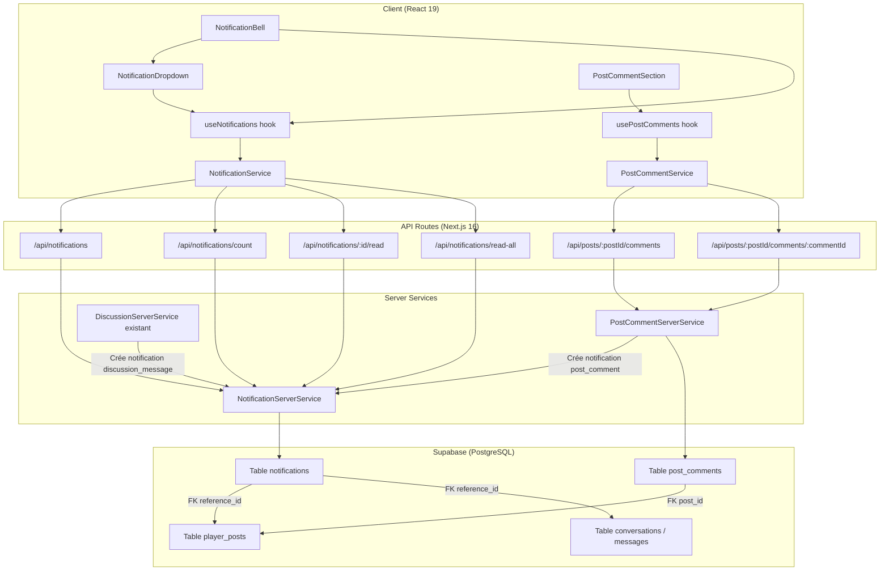
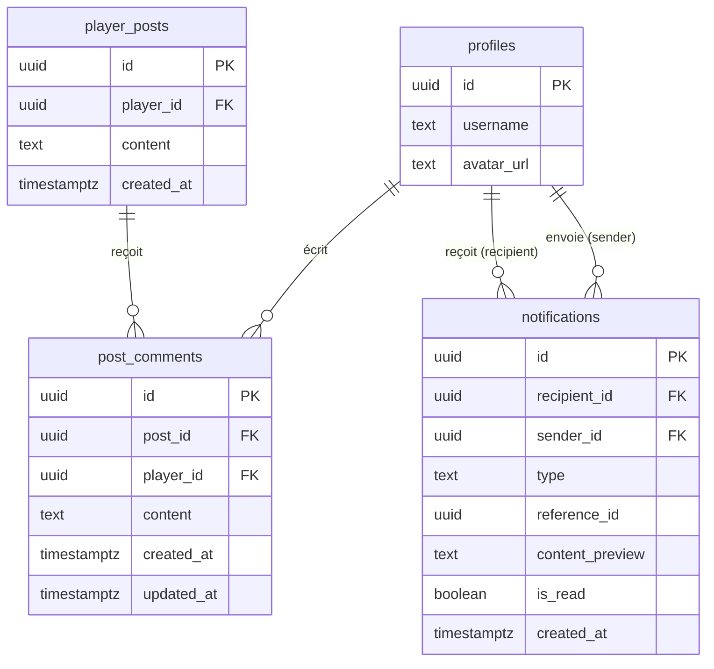

# Document de Design — Système de Notifications

## Vue d'ensemble

Ce document décrit l'architecture technique du système de notifications et du
système de commentaires sur les posts de joueurs pour Gamers Universe. Le
système comprend deux sous-systèmes interdépendants :

1. **Post Comment System** : table `post_comments`, API CRUD, hook SWR
   `usePostComments`, service `PostCommentService`, intégration UI dans l'onglet
   Posts du profil joueur.
2. **Notification System** : table `notifications`, API de gestion, hook SWR
   `useNotifications`, service `NotificationService`, composant
   `NotificationBell` avec dropdown dans le header global (TopBar +
   LandingHeader).

Les notifications sont déclenchées pour deux types d'événements uniquement :
`post_comment` (commentaire sur un post) et `discussion_message` (message dans
une conversation). L'icône de cloche est positionnée à gauche du
`LanguageSwitcher` dans les deux headers.

## Architecture



### Points d'intégration

- **TopBar.tsx** : ajout du composant `NotificationBell` à gauche du
  `LanguageSwitcher`, conditionné à `isAuthenticated`.
- **LandingHeader.tsx** : ajout du composant `NotificationBell` à gauche du
  `LanguageSwitcher`, conditionné à `user` non null.
- **POST /api/posts/:postId/comments** : après création du commentaire, appel à
  `NotificationServerService.create()` pour créer une notification
  `post_comment` (sauf auto-notification).
- **POST /api/discussions/:conversationId/messages** : après envoi du message,
  appel à `NotificationServerService.create()` pour créer une notification
  `discussion_message`.

## Composants et Interfaces

### Nouveaux composants

| Composant              | Emplacement                                      | Responsabilité                                 |
| ---------------------- | ------------------------------------------------ | ---------------------------------------------- |
| `NotificationBell`     | `src/components/shared/NotificationBell.tsx`     | Icône cloche + badge compteur, toggle dropdown |
| `NotificationDropdown` | `src/components/shared/NotificationDropdown.tsx` | Liste des 5 dernières notifications non lues   |
| `NotificationItem`     | `src/components/shared/NotificationItem.tsx`     | Ligne individuelle dans le dropdown            |
| `PostCommentSection`   | `src/components/players/PostCommentSection.tsx`  | Section commentaires sous un post              |
| `PostCommentForm`      | `src/components/players/PostCommentForm.tsx`     | Formulaire d'ajout de commentaire              |
| `PostCommentItem`      | `src/components/players/PostCommentItem.tsx`     | Commentaire individuel                         |

### Nouveaux hooks

| Hook               | Emplacement                     | Responsabilité                                     |
| ------------------ | ------------------------------- | -------------------------------------------------- |
| `useNotifications` | `src/hooks/useNotifications.ts` | SWR : notifications non lues + compteur, mutations |
| `usePostComments`  | `src/hooks/usePostComments.ts`  | SWR : commentaires d'un post, ajout/suppression    |

### Nouveaux services (client)

| Service               | Emplacement                               | Responsabilité                |
| --------------------- | ----------------------------------------- | ----------------------------- |
| `NotificationService` | `src/lib/services/notificationService.ts` | Appels API notifications      |
| `PostCommentService`  | `src/lib/services/postCommentService.ts`  | Appels API commentaires posts |

### Nouveaux services (serveur)

| Service                     | Emplacement                                     | Responsabilité                       |
| --------------------------- | ----------------------------------------------- | ------------------------------------ |
| `NotificationServerService` | `src/lib/services/notificationServerService.ts` | CRUD notifications côté serveur      |
| `PostCommentServerService`  | `src/lib/services/postCommentServerService.ts`  | CRUD commentaires posts côté serveur |

### Nouvelles routes API

| Route                                      | Méthode | Description                                            |
| ------------------------------------------ | ------- | ------------------------------------------------------ |
| `/api/notifications`                       | GET     | Notifications non lues (limit configurable, défaut 20) |
| `/api/notifications/count`                 | GET     | Compteur de notifications non lues                     |
| `/api/notifications/[id]/read`             | PATCH   | Marquer une notification comme lue                     |
| `/api/notifications/read-all`              | PATCH   | Marquer toutes les notifications comme lues            |
| `/api/posts/[postId]/comments`             | GET     | Commentaires d'un post (triés par date croissante)     |
| `/api/posts/[postId]/comments`             | POST    | Créer un commentaire + notification                    |
| `/api/posts/[postId]/comments/[commentId]` | DELETE  | Supprimer un commentaire                               |

### Interface du hook `useNotifications`

```typescript
interface UseNotificationsReturn {
  notifications: Notification[];
  unreadCount: number;
  isLoading: boolean;
  error: string | null;
  markAsRead: (notificationId: string) => Promise<void>;
  markAllAsRead: () => Promise<void>;
  mutate: () => Promise<void>;
}
```

### Interface du hook `usePostComments`

```typescript
interface UsePostCommentsReturn {
  comments: PostComment[];
  totalCount: number;
  isLoading: boolean;
  error: string | null;
  isSubmitting: boolean;
  addComment: (content: string) => Promise<boolean>;
  deleteComment: (commentId: string) => Promise<boolean>;
}
```

## Modèles de données

### Table `post_comments`

```sql
CREATE TABLE IF NOT EXISTS post_comments (
  id          UUID PRIMARY KEY DEFAULT gen_random_uuid(),
  post_id     UUID NOT NULL REFERENCES player_posts(id) ON DELETE CASCADE,
  player_id   UUID NOT NULL REFERENCES profiles(id) ON DELETE CASCADE,
  content     TEXT NOT NULL CHECK (char_length(content) BETWEEN 1 AND 500),
  created_at  TIMESTAMPTZ NOT NULL DEFAULT now(),
  updated_at  TIMESTAMPTZ NOT NULL DEFAULT now()
);

COMMENT ON TABLE post_comments IS 'Commentaires des joueurs sur les posts';
COMMENT ON COLUMN post_comments.id IS 'Identifiant unique du commentaire (UUID)';
COMMENT ON COLUMN post_comments.post_id IS 'Référence au post commenté';
COMMENT ON COLUMN post_comments.player_id IS 'Référence au joueur auteur du commentaire';
COMMENT ON COLUMN post_comments.content IS 'Contenu du commentaire (1-500 caractères)';
COMMENT ON COLUMN post_comments.created_at IS 'Date de création';
COMMENT ON COLUMN post_comments.updated_at IS 'Date de dernière modification';

-- Index pour récupérer les commentaires d'un post
CREATE INDEX IF NOT EXISTS idx_post_comments_post_id ON post_comments(post_id);

-- RLS
ALTER TABLE post_comments ENABLE ROW LEVEL SECURITY;

-- Lecture : tous les utilisateurs authentifiés
CREATE POLICY "post_comments_select" ON post_comments
  FOR SELECT TO authenticated USING (true);

-- Insertion : uniquement l'auteur du commentaire
CREATE POLICY "post_comments_insert" ON post_comments
  FOR INSERT TO authenticated WITH CHECK (auth.uid() = player_id);

-- Suppression : auteur du commentaire OU propriétaire du post
CREATE POLICY "post_comments_delete" ON post_comments
  FOR DELETE TO authenticated USING (
    auth.uid() = player_id
    OR auth.uid() = (SELECT pp.player_id FROM player_posts pp WHERE pp.id = post_id)
  );
```

### Table `notifications`

```sql
CREATE TABLE IF NOT EXISTS notifications (
  id              UUID PRIMARY KEY DEFAULT gen_random_uuid(),
  recipient_id    UUID NOT NULL REFERENCES profiles(id) ON DELETE CASCADE,
  sender_id       UUID NOT NULL REFERENCES profiles(id) ON DELETE CASCADE,
  type            TEXT NOT NULL CHECK (type IN ('post_comment', 'discussion_message')),
  reference_id    UUID NOT NULL,
  content_preview TEXT NOT NULL DEFAULT '',
  is_read         BOOLEAN NOT NULL DEFAULT false,
  created_at      TIMESTAMPTZ NOT NULL DEFAULT now()
);

COMMENT ON TABLE notifications IS 'Notifications des joueurs';
COMMENT ON COLUMN notifications.id IS 'Identifiant unique de la notification (UUID)';
COMMENT ON COLUMN notifications.recipient_id IS 'Joueur destinataire de la notification';
COMMENT ON COLUMN notifications.sender_id IS 'Joueur émetteur de la notification';
COMMENT ON COLUMN notifications.type IS 'Type de notification (post_comment, discussion_message)';
COMMENT ON COLUMN notifications.reference_id IS 'ID de la ressource liée (post_id ou conversation_id)';
COMMENT ON COLUMN notifications.content_preview IS 'Aperçu du contenu (max 100 caractères)';
COMMENT ON COLUMN notifications.is_read IS 'Statut de lecture (false = non lue)';
COMMENT ON COLUMN notifications.created_at IS 'Date de création';

-- Index composite pour les requêtes de notifications non lues
CREATE INDEX IF NOT EXISTS idx_notifications_recipient_unread
  ON notifications(recipient_id, is_read) WHERE is_read = false;

-- RLS
ALTER TABLE notifications ENABLE ROW LEVEL SECURITY;

-- Lecture : uniquement ses propres notifications
CREATE POLICY "notifications_select" ON notifications
  FOR SELECT TO authenticated USING (auth.uid() = recipient_id);

-- Mise à jour : uniquement ses propres notifications
CREATE POLICY "notifications_update" ON notifications
  FOR UPDATE TO authenticated USING (auth.uid() = recipient_id);

-- Insertion : le service serveur insère via service_role,
-- mais on autorise aussi l'insertion authentifiée pour le sender
CREATE POLICY "notifications_insert" ON notifications
  FOR INSERT TO authenticated WITH CHECK (auth.uid() = sender_id);
```

### Types TypeScript

```typescript
// src/types/notification.ts
export type NotificationType = "post_comment" | "discussion_message";

export interface Notification {
  id: string;
  recipientId: string;
  senderId: string;
  type: NotificationType;
  referenceId: string;
  contentPreview: string;
  isRead: boolean;
  createdAt: string;
  sender?: {
    username: string;
    avatarUrl: string | null;
  };
}

export interface NotificationsResponse {
  notifications: Notification[];
}

export interface NotificationCountResponse {
  count: number;
}
```

```typescript
// src/types/post-comment.ts
export interface PostComment {
  id: string;
  postId: string;
  playerId: string;
  content: string;
  createdAt: string;
  updatedAt: string;
  player?: {
    username: string;
    avatarUrl: string | null;
  };
}

export interface PostCommentsResponse {
  comments: PostComment[];
  totalCount: number;
}
```

### Diagramme de relations



## Propriétés de Correction

_Une propriété est une caractéristique ou un comportement qui doit rester vrai
pour toutes les exécutions valides d'un système — essentiellement, une
déclaration formelle de ce que le système doit faire. Les propriétés servent de
pont entre les spécifications lisibles par l'humain et les garanties de
correction vérifiables par la machine._

### Propriété 1 : Validation du contenu des commentaires

_Pour toute_ chaîne de caractères, la création d'un commentaire doit réussir si
et seulement si la longueur est comprise entre 1 et 500 caractères (après trim).
Les chaînes vides, composées uniquement d'espaces, ou dépassant 500 caractères
doivent être rejetées.

**Valide : Exigences 1.9**

### Propriété 2 : Tri des commentaires par date croissante

_Pour tout_ ensemble de commentaires associés à un post, la récupération via
l'API doit retourner les commentaires triés par `created_at` croissant, et
chaque commentaire doit inclure les informations du joueur auteur (`username`,
`avatar_url`).

**Valide : Exigences 1.4**

### Propriété 3 : Autorisation de suppression de commentaire

_Pour tout_ triplet (utilisateur, commentaire, post), la suppression du
commentaire doit réussir si et seulement si l'utilisateur est l'auteur du
commentaire ou le propriétaire du post. Tout autre utilisateur doit recevoir une
erreur 403.

**Valide : Exigences 1.6, 1.8**

### Propriété 4 : Création de notification sur commentaire de post

_Pour tout_ commentaire créé sur le post d'un autre joueur, une notification de
type `post_comment` doit être créée avec le `recipient_id` égal au propriétaire
du post, le `sender_id` égal à l'auteur du commentaire, et un `content_preview`
tronqué à 100 caractères maximum. Si l'auteur du commentaire est le propriétaire
du post, aucune notification ne doit être créée.

**Valide : Exigences 3.1, 3.3, 3.4**

### Propriété 5 : Création de notification sur message de discussion

_Pour tout_ message envoyé dans une conversation, une notification de type
`discussion_message` doit être créée avec le `recipient_id` égal à l'autre
participant de la conversation, et un `content_preview` tronqué à 100 caractères
maximum.

**Valide : Exigences 3.2, 3.4**

### Propriété 6 : Notifications triées par date décroissante avec limite

_Pour tout_ ensemble de notifications non lues d'un joueur, la récupération via
l'API doit retourner les notifications triées par `created_at` décroissant,
limitées au nombre demandé (défaut 20, dropdown 5).

**Valide : Exigences 4.1, 6.1**

### Propriété 7 : Compteur de notifications non lues

_Pour tout_ ensemble de notifications d'un joueur avec des statuts `is_read`
mixtes, le compteur retourné par l'API doit être exactement égal au nombre de
notifications où `is_read = false`.

**Valide : Exigences 4.2**

### Propriété 8 : Transition d'état — marquer comme lue

_Pour toute_ notification non lue appartenant à un joueur, l'appel PATCH pour la
marquer comme lue doit résulter en `is_read = true` pour cette notification, et
ne doit pas affecter les autres notifications.

**Valide : Exigences 4.3**

### Propriété 9 : Transition d'état — marquer toutes comme lues

_Pour tout_ ensemble de notifications non lues d'un joueur, l'appel PATCH
read-all doit résulter en `is_read = true` pour toutes les notifications du
joueur, sans affecter les notifications des autres joueurs.

**Valide : Exigences 4.4**

### Propriété 10 : Affichage du badge et aria-label

_Pour tout_ nombre de notifications non lues, le composant `NotificationBell`
doit : ne pas afficher de badge si le nombre est 0, afficher le nombre exact si
entre 1 et 9, afficher "9+" si supérieur à 9. L'attribut `aria-label` doit
toujours inclure le nombre exact de notifications non lues.

**Valide : Exigences 5.2, 5.3, 5.4, 10.1**

### Propriété 11 : Affichage complet des éléments de notification

_Pour toute_ notification dans le dropdown, l'élément rendu doit contenir le nom
du joueur émetteur, une icône distincte selon le type, l'aperçu du contenu
(`content_preview`), et la date relative.

**Valide : Exigences 6.3**

### Propriété 12 : Compteur de commentaires affiché

_Pour tout_ post avec un ensemble de commentaires, le nombre affiché à côté du
post doit être exactement égal au nombre total de commentaires de ce post.

**Valide : Exigences 1.11**

## Gestion des erreurs

| Scénario                                   | Code HTTP | Message                                        | Action                                            |
| ------------------------------------------ | --------- | ---------------------------------------------- | ------------------------------------------------- |
| Utilisateur non authentifié                | 401       | `Authentication required`                      | Retourner erreur, pas de redirection              |
| Accès à une notification d'un autre joueur | 403       | `Forbidden`                                    | Retourner erreur                                  |
| Suppression commentaire non autorisée      | 403       | `Forbidden`                                    | Retourner erreur                                  |
| Contenu commentaire vide ou > 500 chars    | 400       | `Content must be between 1 and 500 characters` | Retourner erreur, ne pas créer                    |
| Post introuvable                           | 404       | `Post not found`                               | Retourner erreur                                  |
| Notification introuvable                   | 404       | `Notification not found`                       | Retourner erreur                                  |
| Erreur serveur Supabase                    | 500       | `Internal server error`                        | Logger l'erreur, retourner 500                    |
| Échec mutation optimiste SWR               | —         | —                                              | Rollback automatique SWR, afficher toast d'erreur |

### Stratégie de résilience

- Les erreurs de création de notification (dans les routes commentaires et
  messages) sont loguées mais ne bloquent pas l'opération principale. Un
  commentaire ou message est créé même si la notification échoue.
- Les mutations optimistes SWR utilisent `optimisticData` + `rollbackOnError`
  pour garantir la cohérence de l'UI en cas d'échec réseau.

## Stratégie de tests

### Approche duale

Le projet utilise **Vitest** + **Testing Library** pour les tests unitaires et
**fast-check** pour les tests property-based. Les deux approches sont
complémentaires :

- **Tests unitaires** : cas spécifiques, edge cases, erreurs, intégration
  composants
- **Tests property-based** : propriétés universelles sur des entrées générées
  aléatoirement

### Configuration property-based

- Bibliothèque : **fast-check** (déjà installée dans le projet)
- Minimum **100 itérations** par test property-based
- Chaque test property-based référence sa propriété du design document
- Format de tag : `Feature: notifications-system, Property {N}: {titre}`
- Fichiers : `test/unit/**/*.property.test.ts`

### Plan de tests

#### Tests property-based (fichiers `*.property.test.ts`)

| Propriété | Fichier test                                                        | Description                    |
| --------- | ------------------------------------------------------------------- | ------------------------------ |
| P1        | `test/unit/lib/services/postCommentServerService.property.test.ts`  | Validation contenu 1-500 chars |
| P2        | `test/unit/api/posts-comments.property.test.ts`                     | Tri commentaires croissant     |
| P3        | `test/unit/api/posts-comments.property.test.ts`                     | Autorisation suppression       |
| P4        | `test/unit/lib/services/notificationServerService.property.test.ts` | Notification sur commentaire   |
| P5        | `test/unit/lib/services/notificationServerService.property.test.ts` | Notification sur message       |
| P6        | `test/unit/api/notifications.property.test.ts`                      | Tri décroissant + limite       |
| P7        | `test/unit/api/notifications.property.test.ts`                      | Compteur non lues              |
| P8        | `test/unit/api/notifications.property.test.ts`                      | Mark as read                   |
| P9        | `test/unit/api/notifications.property.test.ts`                      | Mark all as read               |
| P10       | `test/unit/components/NotificationBell.property.test.ts`            | Badge + aria-label             |
| P11       | `test/unit/components/NotificationDropdown.property.test.ts`        | Affichage complet items        |
| P12       | `test/unit/components/PostCommentSection.property.test.ts`          | Compteur commentaires          |

#### Tests unitaires (fichiers `*.test.ts`)

| Domaine               | Fichier test                                         | Cas couverts                                                        |
| --------------------- | ---------------------------------------------------- | ------------------------------------------------------------------- |
| API commentaires      | `test/unit/api/posts-comments.test.ts`               | 401 non auth, 404 post introuvable, création OK, suppression OK     |
| API notifications     | `test/unit/api/notifications.test.ts`                | 401 non auth, 403 autre joueur, 404 notification introuvable        |
| Hook usePostComments  | `test/unit/hooks/usePostComments.test.ts`            | Chargement, ajout, suppression, erreurs                             |
| Hook useNotifications | `test/unit/hooks/useNotifications.test.ts`           | Chargement, revalidation 30s, mutation optimiste, erreurs           |
| NotificationBell      | `test/unit/components/NotificationBell.test.ts`      | Visibilité auth/non-auth, clic ouvre dropdown                       |
| NotificationDropdown  | `test/unit/components/NotificationDropdown.test.ts`  | État vide, fermeture clic extérieur, navigation clavier, ARIA roles |
| PostCommentSection    | `test/unit/components/PostCommentSection.test.ts`    | Affichage commentaires, formulaire, accessibilité                   |
| Services client       | `test/unit/lib/services/notificationService.test.ts` | Appels API corrects                                                 |
| Services client       | `test/unit/lib/services/postCommentService.test.ts`  | Appels API corrects                                                 |
| i18n                  | `test/unit/lib/i18n-notifications.test.ts`           | Clés FR/EN présentes et synchronisées                               |
