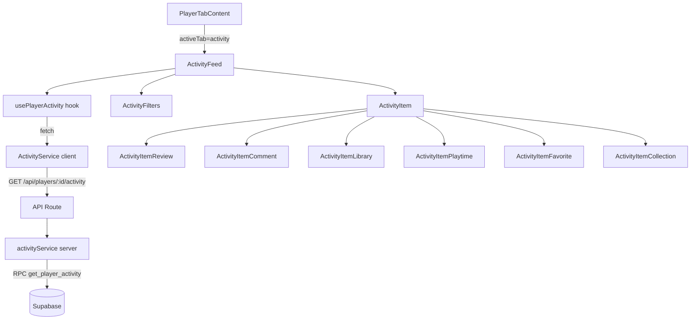

# Design — Onglet Activité du Profil Joueur

## Vue d'ensemble

L'onglet Activité affiche un flux chronologique des actions d'un joueur sur Game
Universe. Il agrège 6 types d'événements provenant de tables existantes
(`game_reviews`, `character_comments`, `user_library`, `character_favorites`,
`game_collections`) et les présente dans une timeline paginée avec scroll infini
et filtrage par type.

Aucune nouvelle table n'est nécessaire : l'agrégation se fait côté serveur via
une requête SQL `UNION ALL` dans une fonction Supabase, triée par date
décroissante avec pagination par offset/limit.

## Architecture



### Décisions architecturales

1. **Agrégation côté serveur via SQL `UNION ALL`** : Plutôt que de faire N
   requêtes côté client, une seule fonction RPC Supabase agrège les 6 sources.
   Cela réduit les allers-retours réseau et permet une pagination correcte sur
   l'ensemble des événements.

2. **Pas de table de matérialisation** : Le volume d'activité par joueur est
   modéré (centaines d'événements, pas des millions). Une vue SQL avec
   `UNION ALL` est suffisante. Si les performances deviennent un problème, on
   pourra ajouter une table matérialisée plus tard.

3. **Scroll infini avec `IntersectionObserver`** : Plutôt qu'une pagination
   classique, le scroll infini offre une meilleure UX pour un flux d'activité.
   Le hook `usePlayerActivity` gère l'état de pagination et le chargement
   incrémental.

4. **Filtrage côté serveur** : Le paramètre `type` est passé à la fonction RPC
   pour filtrer en SQL, évitant de charger tous les événements puis de filtrer
   côté client.

## Composants et Interfaces

### Nouveaux fichiers

```
src/components/players/
├── ActivityFeed.tsx           # Composant principal du flux
├── ActivityFilters.tsx        # Boutons de filtre par type
├── ActivityItem.tsx           # Dispatch vers le bon sous-composant
├── ActivityItemReview.tsx     # Rendu d'une review
├── ActivityItemComment.tsx    # Rendu d'un commentaire
├── ActivityItemLibrary.tsx    # Rendu d'un ajout bibliothèque
├── ActivityItemPlaytime.tsx   # Rendu d'un temps de jeu
├── ActivityItemFavorite.tsx   # Rendu d'un favori personnage
├── ActivityItemCollection.tsx # Rendu d'une collection créée

src/hooks/
├── usePlayerActivity.ts       # Hook de gestion du flux + pagination

src/lib/services/
├── activityService.ts         # Service client (fetch API)
├── activityServerService.ts   # Service serveur (Supabase RPC)

src/app/api/players/[id]/activity/
├── route.ts                   # Endpoint API GET

src/types/
├── activity.ts                # Types partagés pour l'activité

supabase/migrations/
├── 20240306000001_player_activity_function.sql  # Fonction RPC
```

### Composants

**ActivityFeed** : Composant principal. Utilise `usePlayerActivity` pour charger
les données. Affiche `ActivityFilters` en haut, puis la liste des
`ActivityItem`. Gère le scroll infini via un `IntersectionObserver` sur un
élément sentinelle en bas de liste. Affiche un skeleton pendant le chargement et
un message vide si aucune activité. Attributs ARIA : `role="feed"`, `aria-busy`,
`aria-label`.

**ActivityFilters** : Barre de boutons toggle pour filtrer par type d'événement.
Types : tous, reviews, commentaires, bibliothèque, temps de jeu, favoris,
collections. Chaque bouton a une icône et un libellé traduit.

**ActivityItem** : Composant de dispatch qui rend le sous-composant approprié
selon `event.type`. Affiche la date relative et l'icône du type.

**ActivityItem[Type]** : Chaque sous-composant rend les données spécifiques au
type d'événement. Les noms de jeux/personnages sont des liens cliquables vers
les pages de détail.

### Hook

**usePlayerActivity(playerId, locale)** : Gère l'état du flux d'activité :

- `events: ActivityEvent[]` — liste cumulée des événements
- `isLoading: boolean` — chargement initial
- `isLoadingMore: boolean` — chargement page suivante
- `hasNextPage: boolean` — indicateur de page suivante
- `activeFilter: ActivityEventType | 'all'` — filtre actif
- `setFilter(type)` — change le filtre (reset la pagination)
- `loadMore()` — charge la page suivante

## Modèles de données

### Types TypeScript

```typescript
// src/types/activity.ts

/** Types d'événements d'activité */
export type ActivityEventType =
  | "review"
  | "comment"
  | "library"
  | "playtime"
  | "favorite"
  | "collection";

/** Événement d'activité générique */
export interface ActivityEvent {
  id: string;
  type: ActivityEventType;
  date: string; // ISO 8601
  data: ActivityEventData;
}

/** Union discriminée des données par type */
export type ActivityEventData =
  | ReviewEventData
  | CommentEventData
  | LibraryEventData
  | PlaytimeEventData
  | FavoriteEventData
  | CollectionEventData;

export interface ReviewEventData {
  type: "review";
  gameId: string;
  gameSlug: string;
  gameName: string;
  rating: number;
  contentExcerpt: string;
}

export interface CommentEventData {
  type: "comment";
  characterId: string;
  characterSlug: string;
  characterName: string;
  contentExcerpt: string;
}

export interface LibraryEventData {
  type: "library";
  gameId: string;
  gameSlug: string;
  gameName: string;
  coverImage: string | null;
  status: string;
}

export interface PlaytimeEventData {
  type: "playtime";
  gameId: string;
  gameSlug: string;
  gameName: string;
  playTimeHastily: number | null;
  playTimeNormally: number | null;
  playTimeCompletely: number | null;
}

export interface FavoriteEventData {
  type: "favorite";
  characterId: string;
  characterSlug: string;
  characterName: string;
}

export interface CollectionEventData {
  type: "collection";
  collectionId: string;
  collectionSlug: string;
  collectionName: string;
  gamesCount: number;
}

/** Réponse de l'API d'activité */
export interface ActivityResponse {
  events: ActivityEvent[];
  pagination: {
    currentPage: number;
    totalPages: number;
    hasNextPage: boolean;
  };
}

/** Paramètres de requête pour l'API d'activité */
export interface ActivityQueryParams {
  page?: number;
  type?: ActivityEventType;
  locale?: string;
}
```

### Fonction SQL RPC

La fonction `get_player_activity` effectue un `UNION ALL` sur les 5 tables
sources, avec jointures pour récupérer les noms traduits. Elle accepte :

- `player_uuid UUID` — ID du joueur
- `locale_code TEXT` — code langue pour les traductions
- `event_type TEXT DEFAULT NULL` — filtre optionnel par type
- `page_number INT DEFAULT 1` — numéro de page
- `page_size INT DEFAULT 20` — taille de page

Elle retourne un tableau de `JSONB` avec les champs `id`, `type`, `date`,
`data`, plus un champ `total_count` pour la pagination.

## Propriétés de Correction

_Une propriété est une caractéristique ou un comportement qui doit rester vrai
pour toutes les exécutions valides d'un système — essentiellement, une
déclaration formelle sur ce que le système doit faire. Les propriétés servent de
pont entre les spécifications lisibles par l'humain et les garanties de
correction vérifiables par la machine._

### Propriété 1 : Tri chronologique décroissant

_Pour toute_ liste d'événements d'activité retournée par la fonction
d'agrégation, chaque événement à l'index `i` doit avoir une date supérieure ou
égale à celle de l'événement à l'index `i+1`.

**Valide : Exigence 1.1**

### Propriété 2 : Correction de la pagination

_Pour tout_ nombre total d'événements `N` et tout numéro de page `p` (avec une
taille de page de 20), la page retournée doit contenir au plus 20 événements, le
nombre total de pages doit être `ceil(N / 20)`, et `hasNextPage` doit être
`true` si et seulement si `p < ceil(N / 20)`.

**Valide : Exigences 1.3, 1.6**

### Propriété 3 : Complétude des données par type d'événement

_Pour tout_ événement d'activité, après transformation, l'objet résultant doit
contenir tous les champs requis pour son type :

- `review` : gameSlug, gameName, rating, contentExcerpt
- `comment` : characterSlug, characterName, contentExcerpt
- `library` : gameSlug, gameName, coverImage, status
- `playtime` : gameSlug, gameName, playTimeHastily/Normally/Completely
- `favorite` : characterSlug, characterName
- `collection` : collectionSlug, collectionName, gamesCount

**Valide : Exigences 3.1, 3.2, 3.3, 3.4, 3.5, 3.6**

### Propriété 4 : Unicité du mapping d'icônes

_Pour tout_ couple de types d'événements distincts, la fonction de mapping
d'icônes doit retourner des icônes différentes.

**Valide : Exigence 2.2**

### Propriété 5 : Correction du filtrage par type

_Pour toute_ liste d'événements d'activité et tout type de filtre, la liste
filtrée ne doit contenir que des événements dont le type correspond au filtre
sélectionné. Si le filtre est « tous », la liste filtrée doit être identique à
la liste originale.

**Valide : Exigences 4.2, 4.3**

## Gestion des erreurs

| Scénario                   | Comportement                                                                                                                                                            |
| -------------------------- | ----------------------------------------------------------------------------------------------------------------------------------------------------------------------- |
| Joueur inexistant (404)    | L'API retourne `{ error: "Player not found" }` avec status 404. Le composant affiche un message d'erreur.                                                               |
| Erreur serveur (500)       | L'API retourne `{ error: "Internal server error" }` avec status 500. Le service client propage l'erreur. Le composant affiche un message d'erreur générique.            |
| Erreur réseau              | Le service client lève une exception. Le hook `usePlayerActivity` capture l'erreur et expose un état `error`. Le composant affiche un message avec option de réessayer. |
| Page invalide              | L'API normalise le paramètre `page` via `parsePaginationParams` (fallback à 1).                                                                                         |
| Type de filtre invalide    | L'API ignore le filtre invalide et retourne tous les événements.                                                                                                        |
| Table manquante (PGRST205) | Le service serveur gère gracieusement l'erreur et retourne une liste vide (pattern existant dans le projet).                                                            |

## Stratégie de tests

### Tests unitaires (Vitest)

Les tests unitaires vérifient des exemples spécifiques, des cas limites et des
conditions d'erreur :

- **API Route** (`test/unit/api/players/activity.test.ts`) : Vérifie les
  réponses pour joueur valide, joueur inexistant (404), paramètres de pagination
  invalides, et erreurs serveur.
- **Composants** (`test/unit/components/players/ActivityFeed.test.tsx`) :
  Vérifie le rendu avec des événements, l'état vide, l'état de chargement, les
  attributs ARIA, et le filtrage.
- **Service client** (`test/unit/lib/services/activityService.test.ts`) :
  Vérifie la propagation d'erreurs et la construction des URLs.

### Tests property-based (fast-check + Vitest)

Les tests property-based vérifient les propriétés universelles sur des entrées
générées aléatoirement. Chaque test doit exécuter au minimum 100 itérations.

- **Fichier** : `test/unit/lib/services/activityService.property.test.ts`
- **Bibliothèque** : `fast-check` (déjà installé dans le projet)
- **Convention de tag** : Chaque test est annoté avec un commentaire référençant
  la propriété du design :
  `// Feature: player-activity-tab, Property N: [description]`

Les 5 propriétés identifiées dans la section Correctness Properties seront
implémentées comme des tests property-based, testant les fonctions pures de
transformation, pagination, filtrage et mapping d'icônes.

### Approche complémentaire

- Les tests unitaires couvrent les cas concrets et les intégrations (API routes,
  rendu de composants, gestion d'erreurs).
- Les tests property-based couvrent les invariants universels sur les fonctions
  pures (tri, pagination, transformation, filtrage).
- Ensemble, ils assurent une couverture complète : les tests unitaires attrapent
  les bugs concrets, les tests property-based vérifient la correction générale.
