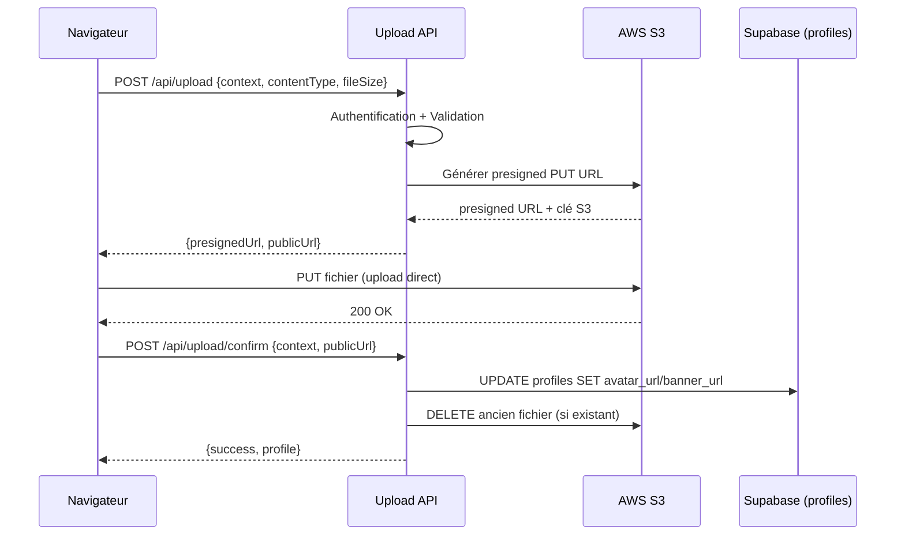

# Document de Design — Upload Avatar & Bannière Joueur

## Vue d'ensemble

Cette fonctionnalité ajoute un système d'upload d'images (avatar et bannière)
pour les joueurs, basé sur AWS S3 avec des URLs pré-signées. L'architecture est
conçue en trois couches :

1. **Upload Service** (`src/lib/services/uploadService.ts`) — Service générique
   côté serveur pour interagir avec S3 (génération d'URLs pré-signées,
   suppression de fichiers). Réutilisable pour tout contexte d'upload futur.
2. **Upload API** (`src/app/api/upload/route.ts`) — Route API Next.js qui
   authentifie l'utilisateur, valide la requête, délègue au service S3, et met à
   jour le profil Supabase.
3. **Image Uploader** (`src/components/shared/ImageUploader.tsx`) — Composant
   React réutilisable pour la sélection, prévisualisation et upload d'images via
   presigned URL.

Le flux d'upload utilise le pattern **presigned URL** : le client demande une
URL pré-signée au serveur, puis uploade directement vers S3 depuis le
navigateur, évitant de faire transiter le fichier par le serveur Next.js.



## Architecture

### Décisions techniques

1. **Presigned URL (upload direct)** plutôt que proxy serveur : réduit la charge
   serveur, évite les limites de taille de body Next.js, et offre de meilleures
   performances pour l'utilisateur.

2. **Flux en deux étapes (request + confirm)** : la première requête génère
   l'URL pré-signée, la seconde confirme l'upload et met à jour le profil. Cela
   permet de ne mettre à jour la base de données qu'après un upload S3 réussi.

3. **AWS SDK v3 (`@aws-sdk/client-s3` + `@aws-sdk/s3-request-presigner`)** : SDK
   modulaire, tree-shakable, adapté aux environnements serverless.

4. **Validation côté client ET serveur** : le composant `ImageUploader` valide
   le type MIME et la taille avant l'envoi. L'API re-valide côté serveur pour la
   sécurité.

5. **Noms de fichiers uniques** : pattern `{timestamp}-{randomId}.{extension}`
   pour éviter les collisions et l'énumération.

6. **Nettoyage des anciens fichiers** : lors d'un remplacement, l'ancien fichier
   S3 est supprimé pour éviter l'accumulation de fichiers orphelins.

### Structure des fichiers

```
src/
├── lib/
│   ├── services/
│   │   └── uploadService.ts          # Service S3 générique
│   ├── validations/
│   │   └── uploadValidation.ts       # Schémas Zod pour validation upload
│   └── utils/
│       └── uploadUtils.ts            # Utilitaires (extraction clé S3, etc.)
├── app/
│   └── api/
│       └── upload/
│           ├── route.ts              # POST: génération presigned URL
│           └── confirm/
│               └── route.ts          # POST: confirmation + mise à jour profil
├── components/
│   ├── shared/
│   │   └── ImageUploader.tsx         # Composant d'upload réutilisable
│   └── settings/
│       └── AppearanceSection.tsx     # Section Apparence dans les paramètres
├── types/
│   └── upload.ts                     # Types partagés pour l'upload
└── messages/
    ├── fr.json                       # + clés namespace "upload"
    └── en.json                       # + clés namespace "upload"

test/
├── unit/
│   ├── lib/
│   │   ├── services/
│   │   │   └── uploadService.test.ts
│   │   ├── utils/
│   │   │   └── uploadUtils.test.ts
│   │   └── validations/
│   │       └── uploadValidation.test.ts
│   └── api/
│       └── upload/
│           ├── upload.test.ts
│           └── uploadConfirm.test.ts
└── unit/
    └── lib/
        └── services/
            └── uploadService.property.test.ts
```

## Composants et Interfaces

### 1. Upload Service (`uploadService.ts`)

Service générique pour les opérations S3. Ne connaît pas les détails métier
(profils, etc.).

```typescript
// Interface publique
interface UploadService {
  generatePresignedUrl(params: PresignedUrlParams): Promise<PresignedUrlResult>;
  deleteFile(fileUrl: string): Promise<void>;
  extractS3KeyFromUrl(url: string): string | null;
}

interface PresignedUrlParams {
  context: UploadContext;
  userId: string;
  contentType: string;
  extension: string;
}

interface PresignedUrlResult {
  presignedUrl: string;
  publicUrl: string;
  s3Key: string;
}
```

### 2. Upload API — Route presigned (`/api/upload`)

```typescript
// POST /api/upload
// Request body
interface UploadRequest {
  context: UploadContext; // "avatars" | "banners"
  contentType: string; // "image/jpeg" | "image/png" | "image/webp" | "image/gif"
  fileSize: number; // en octets, max 5 Mo
}

// Response 200
interface UploadResponse {
  presignedUrl: string;
  publicUrl: string;
}
```

### 3. Upload API — Route confirm (`/api/upload/confirm`)

```typescript
// POST /api/upload/confirm
// Request body
interface UploadConfirmRequest {
  context: UploadContext; // "avatars" | "banners"
  publicUrl: string; // URL publique du fichier uploadé
}

// Response 200
interface UploadConfirmResponse {
  success: boolean;
  profile: Profile;
}
```

### 4. Image Uploader Component (`ImageUploader.tsx`)

```typescript
interface ImageUploaderProps {
  context: UploadContext;
  currentImageUrl: string | null;
  aspectRatio: "1:1" | "16:5";
  maxSizeMB?: number; // défaut: 5
  onUploadSuccess: (url: string) => void;
  onDelete?: () => void;
}
```

Le composant gère :

- Sélection de fichier via input file ou drag & drop
- Prévisualisation de l'image actuelle et de la nouvelle sélection
- Validation côté client (type MIME, taille)
- Upload vers S3 via presigned URL avec indicateur de progression
- Appel à `/api/upload/confirm` après upload réussi
- Suppression de l'image actuelle

### 5. Appearance Section (`AppearanceSection.tsx`)

Nouvelle section dans `SettingsContent.tsx`, insérée entre "Profil" et
"Sécurité". Contient deux instances d'`ImageUploader` :

- Avatar : ratio 1:1, aperçu circulaire
- Bannière : ratio 16:5, aperçu rectangulaire

## Modèles de données

### Table `profiles` (existante)

La table `profiles` possède déjà les colonnes `avatar_url` et `banner_url`.
Aucune migration n'est nécessaire.

```sql
-- Colonnes pertinentes (déjà existantes)
avatar_url  TEXT  -- URL de l'avatar S3
banner_url  TEXT  -- URL de la bannière S3 (ajoutée par migration 20240305000001)
```

### Types TypeScript

```typescript
// src/types/upload.ts
export type UploadContext = "avatars" | "banners";

export const ALLOWED_CONTEXTS: UploadContext[] = ["avatars", "banners"];

export const ALLOWED_MIME_TYPES = [
  "image/jpeg",
  "image/png",
  "image/webp",
  "image/gif",
] as const;

export type AllowedMimeType = (typeof ALLOWED_MIME_TYPES)[number];

export const MAX_FILE_SIZE_BYTES = 5 * 1024 * 1024; // 5 Mo

export const CONTEXT_TO_PROFILE_FIELD: Record<
  UploadContext,
  "avatar_url" | "banner_url"
> = {
  avatars: "avatar_url",
  banners: "banner_url",
};
```

### Schéma de validation Zod

```typescript
// src/lib/validations/uploadValidation.ts
import { z } from "zod";

export const uploadRequestSchema = z.object({
  context: z.enum(["avatars", "banners"]),
  contentType: z.enum(["image/jpeg", "image/png", "image/webp", "image/gif"]),
  fileSize: z
    .number()
    .int()
    .positive()
    .max(5 * 1024 * 1024),
});

export const uploadConfirmSchema = z.object({
  context: z.enum(["avatars", "banners"]),
  publicUrl: z.string().url(),
});
```

### Structure S3

```
gameuniverse-uploads/
└── public/
    ├── avatars/
    │   └── {userId}/
    │       └── {timestamp}-{randomId}.webp
    └── banners/
        └── {userId}/
            └── {timestamp}-{randomId}.webp
```

### Configuration `next.config.js`

Ajout du hostname S3 dans `remotePatterns` pour `next/image` :

```javascript
{
  protocol: "https",
  hostname: "gameuniverse-uploads.s3.eu-west-3.amazonaws.com",
  port: "",
  pathname: "/public/**",
}
```

## Propriétés de Correction

_Une propriété est une caractéristique ou un comportement qui doit rester vrai
pour toutes les exécutions valides d'un système — essentiellement, une
déclaration formelle sur ce que le système doit faire. Les propriétés servent de
pont entre les spécifications lisibles par l'humain et les garanties de
correction vérifiables par la machine._

### Propriété 1 : Le chemin S3 généré respecte le pattern attendu

_Pour tout_ contexte valide (`avatars` | `banners`), tout userId (UUID), et
toute extension d'image valide, le chemin S3 généré doit correspondre au pattern
`public/{context}/{userId}/{timestamp}-{randomId}.{extension}` où le timestamp
est un entier positif et le randomId est une chaîne non vide.

**Valide : Exigences 1.2, 1.4, 1.5**

### Propriété 2 : La validation MIME accepte uniquement les types autorisés

_Pour toute_ chaîne de caractères, la validation du type MIME doit retourner
`true` si et seulement si la chaîne est l'un des types autorisés (`image/jpeg`,
`image/png`, `image/webp`, `image/gif`). Toute autre chaîne doit être rejetée.

**Valide : Exigences 2.3, 3.1**

### Propriété 3 : La validation de taille rejette les fichiers dépassant 5 Mo

_Pour tout_ entier positif représentant une taille de fichier en octets, la
validation doit accepter les valeurs ≤ 5 242 880 (5 Mo) et rejeter les valeurs >
5 242 880. Les valeurs ≤ 0 doivent également être rejetées.

**Valide : Exigences 2.4, 3.2**

### Propriété 4 : La validation de contexte rejette les contextes invalides

_Pour toute_ chaîne de caractères, la validation du contexte doit retourner
`true` si et seulement si la chaîne est `avatars` ou `banners`. Toute autre
chaîne doit être rejetée.

**Valide : Exigences 2.5, 7.5**

### Propriété 5 : Le mapping contexte → champ profil est correct

_Pour tout_ contexte valide, le mapping vers le champ profil doit retourner
`avatar_url` pour `avatars` et `banner_url` pour `banners`. L'ensemble des
contextes valides doit couvrir exactement les clés du mapping.

**Valide : Exigences 2.6**

### Propriété 6 : Les noms de fichiers générés sont uniques

_Pour tout_ couple d'appels à la génération de chemin S3 avec les mêmes
paramètres (contexte, userId, extension), les deux chemins générés doivent être
différents.

**Valide : Exigences 7.2**

### Propriété 7 : Round-trip de validation du schéma d'upload

_Pour tout_ objet `UploadRequest` valide (contexte valide, type MIME valide,
taille valide), la sérialisation en JSON puis la validation via le schéma Zod
doit produire un objet équivalent à l'original.

**Valide : Exigences 2.3, 2.4, 2.5**

### Propriété 8 : Les clés de traduction upload existent dans les deux locales

_Pour toute_ clé de traduction définie dans le namespace `upload` de `fr.json`,
cette même clé doit exister dans `en.json`, et vice-versa. Les deux fichiers
doivent avoir exactement le même ensemble de clés pour ce namespace.

**Valide : Exigences 6.1, 6.2, 6.3**

## Gestion des erreurs

### Erreurs côté client (ImageUploader)

| Situation                        | Comportement                               | Message (FR/EN)                                                                        |
| -------------------------------- | ------------------------------------------ | -------------------------------------------------------------------------------------- |
| Fichier trop volumineux (> 5 Mo) | Rejet avant upload, message d'erreur       | "La taille maximale est de 5 Mo" / "Maximum file size is 5 MB"                         |
| Format non autorisé              | Rejet avant upload, message d'erreur       | "Formats acceptés : JPEG, PNG, WebP, GIF" / "Accepted formats: JPEG, PNG, WebP, GIF"   |
| Échec de l'upload S3 (réseau)    | Message d'erreur, possibilité de réessayer | "Erreur lors de l'upload. Veuillez réessayer." / "Upload failed. Please try again."    |
| Échec de la confirmation API     | Message d'erreur                           | "Erreur lors de la sauvegarde. Veuillez réessayer." / "Save failed. Please try again." |

### Erreurs côté serveur (Upload API)

| Code HTTP | Situation                     | Corps de la réponse                            |
| --------- | ----------------------------- | ---------------------------------------------- |
| 400       | Contexte invalide ou manquant | `{ error: "Invalid context" }`                 |
| 400       | Type MIME non autorisé        | `{ error: "Invalid content type" }`            |
| 400       | Taille de fichier dépassée    | `{ error: "File too large" }`                  |
| 401       | Utilisateur non authentifié   | `{ error: "Unauthorized" }`                    |
| 503       | Échec connexion S3            | `{ error: "Service temporarily unavailable" }` |
| 500       | Erreur interne                | `{ error: "Internal server error" }`           |

### Stratégie de rollback

Si la mise à jour du profil Supabase échoue après un upload S3 réussi :

1. L'API tente de supprimer le fichier uploadé sur S3
2. Si la suppression échoue aussi, l'erreur est loguée (le fichier orphelin sera
   nettoyé ultérieurement)
3. L'API retourne une erreur 500 au client

## Stratégie de tests

### Approche duale

La stratégie de test combine des **tests unitaires** pour les cas spécifiques et
des **tests property-based** pour les propriétés universelles.

### Tests property-based

Bibliothèque : **fast-check** (déjà installé dans le projet, v4.5.3)

Chaque test property-based doit :

- Exécuter un minimum de **100 itérations**
- Référencer la propriété du design via un commentaire tag
- Format du tag : **Feature: player-avatar-upload, Property {number}: {titre}**

Tests property-based prévus :

1. **S3 key pattern** — Génère des contextes, userIds et extensions aléatoires,
   vérifie le pattern du chemin
   - Tag: `Feature: player-avatar-upload, Property 1: S3 key pattern`

2. **MIME validation** — Génère des chaînes aléatoires, vérifie que seuls les 4
   types autorisés passent
   - Tag: `Feature: player-avatar-upload, Property 2: MIME validation`

3. **File size validation** — Génère des entiers aléatoires, vérifie le seuil de
   5 Mo
   - Tag: `Feature: player-avatar-upload, Property 3: File size validation`

4. **Context validation** — Génère des chaînes aléatoires, vérifie que seuls
   avatars/banners passent
   - Tag: `Feature: player-avatar-upload, Property 4: Context validation`

5. **Context-to-field mapping** — Vérifie la bijection contexte ↔ champ profil
   - Tag: `Feature: player-avatar-upload, Property 5: Context-to-field mapping`

6. **Unique file names** — Génère des paires d'appels identiques, vérifie
   l'unicité
   - Tag: `Feature: player-avatar-upload, Property 6: Unique file names`

7. **Upload request schema round-trip** — Génère des requêtes valides,
   sérialise/parse via Zod
   - Tag: `Feature: player-avatar-upload, Property 7: Schema round-trip`

8. **Translation key parity** — Vérifie que les clés FR et EN sont identiques
   pour le namespace upload
   - Tag: `Feature: player-avatar-upload, Property 8: Translation key parity`

### Tests unitaires

Les tests unitaires couvrent les cas spécifiques et les scénarios d'erreur :

- **Upload API** : authentification requise (401), upload réussi, erreur S3
  (503), rollback après échec profil
- **Upload Service** : génération presigned URL, suppression de fichier,
  extraction de clé S3
- **ImageUploader** : rendu avec/sans image existante, affichage des erreurs de
  validation, état de chargement, suppression d'image
- **AppearanceSection** : rendu de la section entre Profil et Sécurité, avatar
  par défaut, bannière par défaut

### Fichiers de test

```
test/unit/lib/services/uploadService.test.ts           # Tests unitaires du service
test/unit/lib/services/uploadService.property.test.ts   # Tests property-based
test/unit/lib/utils/uploadUtils.test.ts                 # Tests utilitaires
test/unit/lib/validations/uploadValidation.test.ts      # Tests validation Zod
test/unit/api/upload/upload.test.ts                     # Tests route presigned
test/unit/api/upload/uploadConfirm.test.ts              # Tests route confirm
```
