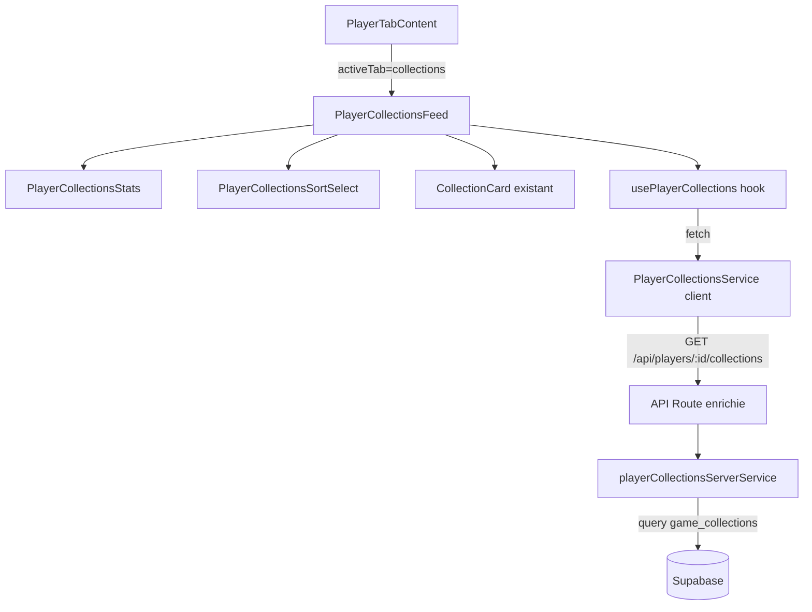

# Design — Onglet Collections du Profil Joueur

## Vue d'ensemble

L'onglet « Collections » du profil joueur transforme l'aperçu limité actuel (4
collections via `PlayerCollections`) en un onglet complet avec pagination par
scroll infini, tri, statistiques agrégées et gestion de la visibilité
(publique/privée selon le visiteur).

Aucune nouvelle table n'est nécessaire : les données proviennent de la table
existante `game_collections` avec une jointure sur `game_collection_items` pour
compter les jeux et récupérer les images de couverture. Les statistiques sont
calculées côté serveur. L'endpoint API existant
(`/api/players/[id]/collections`) est enrichi avec pagination, tri et stats.

L'architecture suit le pattern établi par les onglets Activité et Avis : un
composant principal (`PlayerCollectionsFeed`) utilise un hook
(`usePlayerCollections`) qui appelle un service client
(`playerCollectionsService`), lequel communique avec l'endpoint API enrichi.
L'API interroge Supabase via le service serveur existant (`collectionQueries`)
étendu avec pagination et statistiques.

## Architecture



### Décisions architecturales

1. **Enrichissement de l'endpoint existant** : Plutôt que de créer un nouvel
   endpoint, on enrichit le GET existant `/api/players/[id]/collections` avec
   des paramètres optionnels `page` et `sort`. Sans ces paramètres, le
   comportement reste identique (rétrocompatibilité avec `PlayerCollections` et
   `useCollections`). Quand `page` est fourni, la réponse inclut la pagination
   et les statistiques.

2. **Service serveur dédié** : On crée un `playerCollectionsServerService`
   séparé du `collectionQueries` existant. Le service existant sert le CRUD
   complet des collections (création, détail, modification). Le nouveau service
   est spécialisé pour l'onglet profil joueur : pagination, tri, stats agrégées.
   Cela respecte le principe de responsabilité unique.

3. **Réutilisation du `CollectionCard` existant** : Contrairement à l'onglet
   Avis qui nécessitait un composant carte dédié, ici le `CollectionCard`
   existant affiche déjà toutes les informations nécessaires (nom, description,
   nombre de jeux, couvertures, date, badge de visibilité). On le réutilise
   directement.

4. **Scroll infini avec `IntersectionObserver`** : Même pattern que
   `ActivityFeed` et `PlayerReviewsFeed` — un élément sentinelle en bas de liste
   déclenche le chargement de la page suivante.

5. **Tri côté serveur** : Le paramètre `sort` est passé à l'API qui applique
   l'`ORDER BY` correspondant en SQL. Changer le tri reset la pagination.

6. **Statistiques calculées côté serveur** : Le nombre total de collections, le
   nombre total de jeux et la collection la plus grande sont calculés en une
   requête séparée. Les stats sont retournées uniquement avec la première page.

7. **Pas de migration SQL** : La table `game_collections` existe déjà avec les
   index nécessaires. Aucune modification de schéma n'est requise.

## Composants et Interfaces

### Nouveaux fichiers

```
src/components/players/
├── PlayerCollectionsFeed.tsx       # Composant principal (stats + tri + grille + scroll infini)
├── PlayerCollectionsStats.tsx      # Bloc statistiques agrégées (3 métriques)
├── PlayerCollectionsSortSelect.tsx # Sélecteur de tri

src/hooks/
├── usePlayerCollections.ts         # Hook de gestion des collections + pagination + tri

src/lib/services/
├── playerCollectionsService.ts     # Service client (fetch API)
├── playerCollectionsServerService.ts # Service serveur (Supabase queries paginées + stats)

src/types/
├── playerCollection.ts             # Types partagés pour l'onglet collections joueur
```

### Fichiers modifiés

- `src/app/api/players/[id]/collections/route.ts` : Enrichir le handler GET avec
  pagination, tri et statistiques.
- `src/components/players/PlayerTabContent.tsx` : Remplacer `PlayerCollections`
  par `PlayerCollectionsFeed` dans le case `"collections"`.
- `src/messages/fr.json` : Ajouter les clés `players.collectionsTab.*`.
- `src/messages/en.json` : Ajouter les clés `players.collectionsTab.*`.

### Composants

**PlayerCollectionsFeed** : Composant principal de l'onglet. Utilise
`usePlayerCollections` pour charger les données. Affiche
`PlayerCollectionsStats` en haut, puis `PlayerCollectionsSortSelect`, puis la
grille de `CollectionCard`. Gère le scroll infini via un `IntersectionObserver`
sur un élément sentinelle. Affiche un skeleton pendant le chargement initial et
un message vide si aucune collection. Grille responsive : 2 colonnes mobile, 3
tablette, 4 desktop. Attributs ARIA : `role="feed"`, `aria-busy`, `aria-label`.

**PlayerCollectionsStats** : Bloc glassmorphism affichant 3 métriques dans des
cartes `.glass-card` : nombre total de collections, nombre total de jeux dans
toutes les collections, nom de la collection contenant le plus de jeux. Affiché
en haut de l'onglet, avant la grille.

**PlayerCollectionsSortSelect** : Menu déroulant avec 4 options de tri : « Plus
récentes » (défaut, `updated_at DESC`), « Nom A-Z » (`name ASC`), « Nom Z-A »
(`name DESC`), « Plus de jeux » (`games_count DESC`). Utilise la classe
`.glass-dropdown` pour le style.

### Hook

**usePlayerCollections(playerId, locale, isOwner)** : Gère l'état des
collections du joueur :

- `collections: CollectionSummary[]` — liste cumulée des collections
- `stats: PlayerCollectionsStatsData | null` — statistiques agrégées
- `isLoading: boolean` — chargement initial
- `isLoadingMore: boolean` — chargement page suivante
- `hasNextPage: boolean` — indicateur de page suivante
- `sortOption: CollectionSortOption` — tri actif
- `error: string | null` — message d'erreur
- `setSort(option)` — change le tri (reset la pagination)
- `loadMore()` — charge la page suivante

Les stats sont chargées une seule fois avec la première page et conservées lors
du chargement des pages suivantes.

## Modèles de données

### Types TypeScript

```typescript
// src/types/playerCollection.ts

/** Options de tri des collections */
export type CollectionSortOption =
  | "updated_at_desc"
  | "name_asc"
  | "name_desc"
  | "games_count_desc";

/** Statistiques agrégées des collections d'un joueur */
export interface PlayerCollectionsStatsData {
  totalCollections: number;
  totalGames: number;
  largestCollection: string | null; // nom de la collection la plus grande
}

/** Réponse de l'API des collections joueur (mode paginé) */
export interface PlayerCollectionsResponse {
  collections: CollectionSummary[];
  stats: PlayerCollectionsStatsData;
  pagination: {
    currentPage: number;
    totalPages: number;
    totalCollections: number;
    hasNextPage: boolean;
  };
}

/** Paramètres de requête pour l'API */
export interface PlayerCollectionsQueryParams {
  page?: number;
  sort?: CollectionSortOption;
  locale?: string;
}
```

Le type `CollectionSummary` existant dans `src/types/collection.ts` est
réutilisé tel quel — il contient déjà `id`, `name`, `slug`, `description`,
`isPublic`, `gamesCount`, `updatedAt`, `coverImages`, `coverImageUrl`.

### Requête Supabase (service serveur)

Le service serveur effectue deux opérations :

1. **Requête paginée des collections** : Interroge `game_collections` filtré par
   `user_id`, avec jointure sur
   `game_collection_items(game_id, games(cover_image_url))` pour les couvertures
   et le comptage. Applique le filtre de visibilité (`is_public = true` si
   non-propriétaire). Applique l'`ORDER BY` selon le paramètre `sort` et la
   pagination `offset/limit` (12 par page).

2. **Calcul des statistiques** : Requête sur `game_collections` filtré par
   `user_id` (et visibilité) pour obtenir le nombre total de collections, le
   nombre total de jeux (somme des items), et le nom de la collection avec le
   plus de jeux. Exécutée uniquement pour la page 1.

### Mapping sort → ORDER BY

| `sort` param       | SQL ORDER BY                         |
| ------------------ | ------------------------------------ |
| `updated_at_desc`  | `updated_at DESC` (défaut)           |
| `name_asc`         | `name ASC`                           |
| `name_desc`        | `name DESC`                          |
| `games_count_desc` | tri applicatif par `gamesCount DESC` |

Note : Le tri par nombre de jeux nécessite un tri applicatif après récupération
car Supabase ne permet pas de trier directement sur un champ calculé (count de
la relation). La requête récupère toutes les collections visibles, les trie en
mémoire, puis applique la pagination. Pour les joueurs avec un nombre modéré de
collections (< 1000), cette approche est performante.

## Propriétés de Correction

_Une propriété est une caractéristique ou un comportement qui doit rester vrai
pour toutes les exécutions valides d'un système — essentiellement, une
déclaration formelle sur ce que le système doit faire. Les propriétés servent de
pont entre les spécifications lisibles par l'humain et les garanties de
correction vérifiables par la machine._

### Propriété 1 : Correction du tri

_Pour toute_ liste de collections et _pour toute_ option de tri
(`updated_at_desc`, `name_asc`, `name_desc`, `games_count_desc`), la liste
retournée par la fonction de tri doit être correctement ordonnée selon le
critère choisi :

- `updated_at_desc` : chaque collection à l'index `i` a une date `updatedAt` ≥
  celle de l'index `i+1`
- `name_asc` : chaque collection à l'index `i` a un nom ≤ (comparaison locale)
  celui de l'index `i+1`
- `name_desc` : chaque collection à l'index `i` a un nom ≥ (comparaison locale)
  celui de l'index `i+1`
- `games_count_desc` : chaque collection à l'index `i` a un `gamesCount` ≥ celui
  de l'index `i+1`

**Valide : Exigences 1.1, 1.5, 1.6**

### Propriété 2 : Correction de la pagination

_Pour tout_ nombre total de collections `N` et _pour tout_ numéro de page `p`
(avec une taille de page de 12), la page retournée doit contenir au plus 12
collections, le nombre total de pages doit être `ceil(N / 12)`, et `hasNextPage`
doit être `true` si et seulement si `p < ceil(N / 12)`.

**Valide : Exigences 1.2, 1.4**

### Propriété 3 : Correction des statistiques agrégées

_Pour tout_ ensemble de collections avec des nombres de jeux (`gamesCount`) :

- `totalCollections` doit être égal au nombre de collections
- `totalGames` doit être égal à la somme de tous les `gamesCount`
- `largestCollection` doit être le nom de la collection ayant le `gamesCount` le
  plus élevé (ou `null` si aucune collection)

**Valide : Exigence 1.7**

### Propriété 4 : Correction du filtrage par visibilité

_Pour tout_ ensemble de collections avec des visibilités mixtes (publiques et
privées), le filtrage par visibilité doit respecter :

- Si le visiteur est le propriétaire (`isOwner = true`), toutes les collections
  sont retournées (publiques et privées)
- Si le visiteur n'est pas le propriétaire (`isOwner = false`), seules les
  collections avec `isPublic = true` sont retournées

**Valide : Exigences 1.8, 1.9**

### Propriété 5 : Construction correcte de l'URL du service

_Pour tout_ identifiant de joueur et _pour tout_ ensemble de paramètres de
requête (page, sort, locale), l'URL construite par le service client doit
contenir le bon chemin `/api/players/{playerId}/collections` et inclure
uniquement les query params non-undefined.

**Valide : Exigence 6.1**

### Propriété 6 : Propagation des erreurs du service

_Pour tout_ code de statut HTTP d'erreur (4xx, 5xx), le service client doit
lever une exception avec un message descriptif contenant soit le message
d'erreur du body de la réponse, soit le statut HTTP.

**Valide : Exigence 6.3**

## Gestion des erreurs

| Scénario                | Comportement                                                                                                                                             |
| ----------------------- | -------------------------------------------------------------------------------------------------------------------------------------------------------- |
| Joueur inexistant (404) | L'API retourne `{ error: "Player not found" }` avec status 404. Le hook expose `error`. Le composant affiche un message d'erreur.                        |
| Erreur serveur (500)    | L'API retourne `{ error: "Internal server error" }` avec status 500. Le service client propage l'erreur. Le composant affiche un message générique.      |
| Erreur réseau           | Le service client lève une exception. Le hook capture l'erreur et expose un état `error`. Le composant affiche un message avec possibilité de réessayer. |
| Page invalide           | L'API normalise le paramètre `page` via `parsePaginationParams` (fallback à 1).                                                                          |
| Sort invalide           | L'API ignore le paramètre `sort` invalide et utilise le tri par défaut (`updated_at_desc`).                                                              |
| UUID invalide           | L'API valide le format via `PlayerService.validatePlayerId` et retourne 400 si invalide.                                                                 |
| Table manquante         | Le service serveur gère gracieusement l'erreur PGRST205 et retourne une liste vide (pattern existant).                                                   |
| Aucune collection       | Le composant affiche un message vide avec icône, traduit via `next-intl`.                                                                                |

## Stratégie de tests

### Tests unitaires (Vitest)

Les tests unitaires vérifient des exemples spécifiques, des cas limites et des
conditions d'erreur :

- **API Route** (`test/unit/api/players/collections.test.ts`) : Vérifie les
  réponses pour joueur valide avec pagination et stats, joueur inexistant (404),
  UUID invalide (400), paramètre sort invalide (fallback défaut), visibilité
  propriétaire vs visiteur, et erreurs serveur.
- **Composants** (`test/unit/components/players/PlayerCollectionsFeed.test.tsx`)
  : Vérifie le rendu avec des collections, l'état vide, l'état de chargement
  (skeleton), les attributs ARIA (`role="feed"`, `aria-busy`), le sélecteur de
  tri, et le passage de `isOwner` aux `CollectionCard`.
- **Service client** (`test/unit/lib/services/playerCollectionsService.test.ts`)
  : Vérifie la propagation d'erreurs et la construction des URLs avec des cas
  concrets.

### Tests property-based (fast-check + Vitest)

Les tests property-based vérifient les propriétés universelles sur des entrées
générées aléatoirement. Chaque test doit exécuter au minimum 100 itérations.

- **Fichier** :
  `test/unit/lib/services/playerCollectionsService.property.test.ts`
- **Bibliothèque** : `fast-check` (déjà installé dans le projet)
- **Convention de tag** : Chaque test est annoté avec un commentaire référençant
  la propriété du design :
  `// Feature: player-collections-tab, Property N: [description]`

Les 6 propriétés identifiées dans la section Propriétés de Correction seront
implémentées comme des tests property-based, testant les fonctions pures de tri,
pagination, statistiques, filtrage par visibilité et construction d'URL.

### Fonctions pures testables

Pour permettre les tests property-based, les fonctions suivantes seront
extraites comme fonctions pures dans le service :

- `sortCollections(collections, sortOption)` — tri d'une liste de collections
- `computeCollectionsPagination(totalCount, page, pageSize)` — calcul pagination
- `computeCollectionsStats(collections)` — calcul des statistiques agrégées
- `filterCollectionsByVisibility(collections, isOwner)` — filtrage par
  visibilité
- `buildCollectionsUrl(playerId, params)` — construction de l'URL API

### Approche complémentaire

- Les tests unitaires couvrent les cas concrets et les intégrations (API routes,
  rendu de composants, gestion d'erreurs).
- Les tests property-based couvrent les invariants universels sur les fonctions
  pures (tri, pagination, statistiques, visibilité, URL building).
- Ensemble, ils assurent une couverture complète : les tests unitaires attrapent
  les bugs concrets, les tests property-based vérifient la correction générale.
