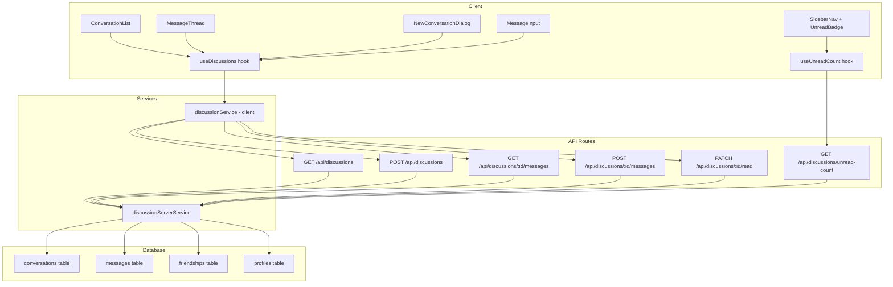

# Design Document — Player Discussions

## Overview

Le module Player Discussions ajoute une messagerie privée entre joueurs amis. Il
s'intègre dans le dashboard existant via un lien dans la sidebar (section "Mon
espace") avec un badge de messages non lus, et expose une page dédiée
`/discussions` avec une vue split : liste des conversations à gauche, fil de
messages à droite.

Le système repose sur deux tables Supabase (`conversations`, `messages`),
protégées par RLS, et communique via des API Routes Next.js. Côté client, un
hook `useDiscussions` orchestre l'état, et un hook `useUnreadCount` alimente le
badge sidebar.

### Décisions techniques clés

- **Pas de temps réel (WebSocket/Realtime)** dans cette itération. Le
  rafraîchissement se fait par polling ou action utilisateur. Cela simplifie
  l'implémentation initiale et pourra être ajouté ultérieurement.
- **Pagination cursor-based** pour les messages (par `created_at`) afin de
  supporter efficacement le scroll infini.
- **Contrainte d'unicité ordonnée** (`participant_1 < participant_2`) pour
  éviter les doublons de conversations.
- **Validation Zod** côté API pour le contenu des messages (1–2000 caractères,
  non-whitespace).

## Architecture



### Flux principal

1. Le joueur clique sur "Discussions" dans la sidebar
2. `GET /api/discussions` charge la liste des conversations avec dernier message
   et compteur non lus
3. Le joueur sélectionne une conversation → `GET /api/discussions/:id/messages`
   charge les messages paginés
4. `PATCH /api/discussions/:id/read` marque les messages comme lus
5. Le joueur tape un message → `POST /api/discussions/:id/messages` l'enregistre
6. Le badge sidebar se met à jour via `GET /api/discussions/unread-count`

## Components and Interfaces

### Nouveaux fichiers

```
src/app/[locale]/discussions/
  page.tsx                          # Page principale (délègue au composant)

src/components/discussions/
  DiscussionsPage.tsx               # Orchestrateur : layout split
  ConversationList.tsx              # Liste des conversations (panneau gauche)
  ConversationItem.tsx              # Ligne d'une conversation
  MessageThread.tsx                 # Fil de messages (panneau droit)
  MessageBubble.tsx                 # Bulle d'un message (envoyé/reçu)
  MessageInput.tsx                  # Champ de saisie + bouton envoi
  NewConversationDialog.tsx         # Modal de sélection d'ami
  FriendSearchItem.tsx              # Ligne d'un ami dans la recherche
  EmptyConversationState.tsx        # État vide (aucune conversation)
  UnreadBadge.tsx                   # Badge compteur non lus (réutilisable)

src/hooks/
  useDiscussions.ts                 # État conversations + messages + mutations
  useUnreadCount.ts                 # Compteur global non lus pour sidebar

src/lib/services/
  discussionServerService.ts        # Requêtes Supabase côté serveur
  discussionService.ts              # Client API (fetch vers /api/discussions)

src/lib/validations/
  discussion.ts                     # Schémas Zod (message, création conversation)

src/types/
  discussion.ts                     # Types partagés (Conversation, Message, etc.)

src/app/api/discussions/
  route.ts                          # GET (liste) + POST (créer conversation)
  unread-count/route.ts             # GET (compteur non lus)
  [conversationId]/
    messages/route.ts               # GET (messages paginés) + POST (envoyer)
    read/route.ts                   # PATCH (marquer comme lus)

supabase/migrations/
  20240314000001_player_discussions.sql  # Tables, index, RLS
```

### Fichiers modifiés

```
src/lib/utils/navigation-utils.ts   # Ajout du lien "Discussions" dans NAV_LINKS
src/components/layout/dashboard/SidebarNav.tsx  # Intégration UnreadBadge
src/messages/fr.json                 # Namespace "discussions"
src/messages/en.json                 # Namespace "discussions"
```

### Interfaces des composants

```typescript
// DiscussionsPage — aucune prop, utilise useDiscussions en interne

// ConversationList
interface ConversationListProps {
  conversations: ConversationSummary[];
  selectedId: string | null;
  onSelect: (id: string) => void;
  onNewConversation: () => void;
  isLoading: boolean;
}

// MessageThread
interface MessageThreadProps {
  messages: Message[];
  currentUserId: string;
  isLoading: boolean;
  hasMore: boolean;
  onLoadMore: () => void;
}

// MessageInput
interface MessageInputProps {
  onSend: (content: string) => Promise<void>;
  isSending: boolean;
  maxLength: number; // 2000
}

// NewConversationDialog
interface NewConversationDialogProps {
  open: boolean;
  onClose: () => void;
  onSelectFriend: (friendId: string) => void;
}

// UnreadBadge
interface UnreadBadgeProps {
  count: number;
}
```

## Data Models

### Table `conversations`

| Colonne         | Type        | Contraintes                          |
| --------------- | ----------- | ------------------------------------ |
| `id`            | UUID        | PK, default `gen_random_uuid()`      |
| `participant_1` | UUID        | FK → profiles(id), ON DELETE CASCADE |
| `participant_2` | UUID        | FK → profiles(id), ON DELETE CASCADE |
| `created_at`    | TIMESTAMPTZ | DEFAULT NOW()                        |
| `updated_at`    | TIMESTAMPTZ | DEFAULT NOW()                        |

Contraintes :

- `CHECK (participant_1 < participant_2)` — ordre canonique
- `UNIQUE (participant_1, participant_2)` — pas de doublon
- `CHECK (participant_1 != participant_2)` — pas d'auto-conversation

### Table `messages`

| Colonne           | Type        | Contraintes                               |
| ----------------- | ----------- | ----------------------------------------- |
| `id`              | UUID        | PK, default `gen_random_uuid()`           |
| `conversation_id` | UUID        | FK → conversations(id), ON DELETE CASCADE |
| `sender_id`       | UUID        | FK → profiles(id), ON DELETE CASCADE      |
| `content`         | TEXT        | NOT NULL, CHECK length between 1 and 2000 |
| `created_at`      | TIMESTAMPTZ | DEFAULT NOW()                             |
| `read_at`         | TIMESTAMPTZ | NULLABLE (null = non lu)                  |

### Index

- `idx_messages_conversation_created` ON `messages(conversation_id, created_at)`
  — chargement chronologique des messages
- `idx_messages_conversation_read` ON `messages(conversation_id, read_at)` —
  comptage efficace des non lus
- `idx_conversations_participant_1` ON `conversations(participant_1)`
- `idx_conversations_participant_2` ON `conversations(participant_2)`

### Politiques RLS

**Table `conversations`** :

- SELECT : `auth.uid() IN (participant_1, participant_2)`
- INSERT : `auth.uid() IN (participant_1, participant_2)`
- UPDATE : `auth.uid() IN (participant_1, participant_2)` (pour `updated_at`)
- DELETE : aucune (les conversations ne sont pas supprimables dans cette
  version)

**Table `messages`** :

- SELECT : l'utilisateur participe à la conversation du message
- INSERT : `sender_id = auth.uid()` ET l'utilisateur participe à la conversation
- UPDATE : pour `read_at` uniquement, le destinataire peut marquer comme lu
- DELETE : aucune

### Types TypeScript

```typescript
// src/types/discussion.ts

export interface Conversation {
  id: string;
  participant1: string;
  participant2: string;
  createdAt: string;
  updatedAt: string;
}

export interface ConversationSummary {
  id: string;
  friend: {
    id: string;
    displayName: string;
    avatarUrl: string | null;
  };
  lastMessage: {
    content: string;
    senderId: string;
    createdAt: string;
  } | null;
  unreadCount: number;
}

export interface Message {
  id: string;
  conversationId: string;
  senderId: string;
  content: string;
  createdAt: string;
  readAt: string | null;
}

export interface ConversationListResponse {
  conversations: ConversationSummary[];
}

export interface MessagesResponse {
  messages: Message[];
  hasMore: boolean;
  nextCursor: string | null; // ISO timestamp du plus ancien message
}

export interface UnreadCountResponse {
  count: number;
}

export interface CreateConversationRequest {
  friendId: string;
}

export interface SendMessageRequest {
  content: string;
}
```

### Schéma de validation Zod

```typescript
// src/lib/validations/discussion.ts

import { z } from "zod";

export const sendMessageSchema = z.object({
  content: z
    .string()
    .min(1, "Le message est requis")
    .refine((val) => val.trim().length > 0, "Le message ne peut pas être vide")
    .refine(
      (val) => val.trim().length <= 2000,
      "Le message ne doit pas dépasser 2000 caractères"
    ),
});

export const createConversationSchema = z.object({
  friendId: z.string().uuid("ID d'ami invalide"),
});

export type SendMessageInput = z.infer<typeof sendMessageSchema>;
export type CreateConversationInput = z.infer<typeof createConversationSchema>;
```

## Correctness Properties

_A property is a characteristic or behavior that should hold true across all
valid executions of a system — essentially, a formal statement about what the
system should do. Properties serve as the bridge between human-readable
specifications and machine-verifiable correctness guarantees._

### Property 1: Unread badge displays correct count

_For any_ non-negative integer `count`, the UnreadBadge component should render
the exact number when `count <= 99`, and render `"99+"` when `count > 99`. When
`count` is `0`, the badge should not be visible.

**Validates: Requirements 1.4, 1.5, 2.3**

### Property 2: Conversations are sorted by most recent message

_For any_ list of conversation summaries with last message timestamps, the
displayed order should be strictly descending by `lastMessage.createdAt` (most
recent first).

**Validates: Requirements 2.1**

### Property 3: Last message preview is truncated at 80 characters

_For any_ message content string, the conversation list preview should display
at most 80 characters. If the original content exceeds 80 characters, the
preview should be truncated and end with an ellipsis (`…`).

**Validates: Requirements 2.2**

### Property 4: Conversation creation is restricted to accepted friends

_For any_ pair of player IDs, creating a conversation should succeed only if
there exists an accepted friendship between them. Attempting to create a
conversation with a non-friend should be rejected.

**Validates: Requirements 3.2**

### Property 5: Conversation creation is idempotent

_For any_ pair of friends, calling the create conversation endpoint multiple
times should always return the same conversation ID. No duplicate conversations
should be created.

**Validates: Requirements 3.3, 3.4**

### Property 6: Friend search filters by display name

_For any_ search query string and list of friends, the filtered results should
contain only friends whose display name includes the query (case-insensitive),
and no matching friend should be excluded.

**Validates: Requirements 3.5**

### Property 7: Message validation rejects invalid content

_For any_ string that is empty, composed entirely of whitespace, or exceeds 2000
characters, the `sendMessageSchema` Zod validation should reject it. _For any_
non-empty, non-whitespace string of 1–2000 characters, validation should pass.

**Validates: Requirements 4.4, 4.5, 4.6**

### Property 8: Messages are ordered chronologically

_For any_ list of messages returned by the API for a conversation, the messages
should be sorted by `created_at` in ascending order (oldest first).

**Validates: Requirements 4.2**

### Property 9: Message alignment depends on sender

_For any_ message and current user ID, the message should be aligned right if
`senderId === currentUserId`, and aligned left otherwise.

**Validates: Requirements 4.3**

### Property 10: Marking as read only affects recipient's messages

_For any_ conversation and current user, calling the mark-as-read endpoint
should set `read_at` only on messages where `sender_id != current_user_id`.
Messages sent by the current user should remain unchanged.

**Validates: Requirements 5.1, 5.2, 5.3**

### Property 11: Canonical participant ordering

_For any_ two distinct user UUIDs `a` and `b`, the conversation row should
always store them as `(min(a, b), max(a, b))` in
`(participant_1, participant_2)`. This ensures the uniqueness constraint
prevents duplicate conversations regardless of who initiates.

**Validates: Requirements 6.3**

### Property 12: RLS isolation — users see only their conversations

_For any_ authenticated user, querying the conversations table should return
only rows where the user is `participant_1` or `participant_2`. No conversation
involving two other users should be visible.

**Validates: Requirements 6.4**

### Property 13: Unauthenticated API calls return 401

_For any_ API route in the discussions module (`GET /api/discussions`,
`POST /api/discussions`, etc.), calling it without a valid authentication token
should return HTTP 401.

**Validates: Requirements 7.7**

### Property 14: Message round-trip persistence

_For any_ valid message content sent to a conversation, retrieving the messages
of that conversation should include a message with the same content, the correct
sender ID, and a non-null `created_at` timestamp.

**Validates: Requirements 4.1**

### Property 15: Unread count consistency after mark-as-read

_For any_ conversation with `n` unread messages (where the current user is the
recipient), after calling mark-as-read, the unread count for that conversation
should be `0`, and the global unread count should decrease by exactly `n`.

**Validates: Requirements 5.2**

## Error Handling

### API Errors

| Scénario                                  | Code HTTP | Message                                     |
| ----------------------------------------- | --------- | ------------------------------------------- |
| Utilisateur non authentifié               | 401       | `"Authentication required"`                 |
| Conversation introuvable ou non autorisée | 404       | `"Conversation not found"`                  |
| Ami non trouvé ou amitié non confirmée    | 403       | `"Cannot create conversation: not friends"` |
| Contenu du message invalide (Zod)         | 400       | Détail de l'erreur Zod                      |
| friendId invalide (non UUID)              | 400       | `"Invalid friend ID"`                       |
| Erreur serveur Supabase                   | 500       | `"Internal server error"`                   |

### Gestion côté client

- Les erreurs réseau sont capturées dans les services client et remontées via
  l'état `error` du hook `useDiscussions`.
- Les erreurs de validation (message vide, trop long) sont gérées localement
  dans `MessageInput` avant l'appel API.
- Le hook `useUnreadCount` retourne `0` en cas d'erreur (fallback silencieux),
  comme le pattern existant de `usePendingRequestCount`.

### Cas limites

- Si un ami supprime son compte (CASCADE), les conversations et messages
  associés sont supprimés automatiquement via les FK.
- Si deux joueurs tentent de créer une conversation simultanément, la contrainte
  UNIQUE + l'ordre canonique garantissent qu'une seule conversation est créée.
  Le second appel retournera la conversation existante.

## Testing Strategy

### Approche duale

Le testing combine des tests unitaires (exemples spécifiques, cas limites) et
des tests property-based (propriétés universelles sur des entrées générées).

### Tests unitaires (Vitest)

Placés dans `test/unit/` selon la structure du projet :

```
test/unit/
├── lib/
│   ├── services/
│   │   └── discussionServerService.test.ts
│   ├── utils/
│   │   └── discussion-utils.test.ts
│   └── validations/
│       └── discussion.test.ts
├── hooks/
│   ├── useDiscussions.test.ts
│   └── useUnreadCount.test.ts
└── components/
    └── discussions/
        ├── UnreadBadge.test.tsx
        ├── ConversationList.test.tsx
        ├── MessageThread.test.tsx
        ├── MessageInput.test.tsx
        └── MessageBubble.test.tsx
```

Focus des tests unitaires :

- Validation Zod : exemples concrets (message valide, vide, trop long)
- Composants : rendu correct, interactions utilisateur, états vides
- Hooks : appels API mockés, gestion d'erreurs
- Services serveur : requêtes Supabase mockées, vérification des paramètres

### Tests property-based (Vitest + fast-check)

Placés dans `test/unit/` avec le suffixe `.property.test.ts` :

```
test/unit/
├── lib/
│   ├── validations/
│   │   └── discussion.property.test.ts
│   └── utils/
│       └── discussion-utils.property.test.ts
└── components/
    └── discussions/
        └── UnreadBadge.property.test.ts
```

Bibliothèque : **fast-check** (déjà compatible avec Vitest). Configuration :
minimum **100 itérations** par test property.

Chaque test property doit référencer la propriété du design :

```typescript
// Feature: player-discussions, Property 7: Message validation rejects invalid content
```

### Mapping propriétés → tests

| Propriété | Type de test     | Fichier                           |
| --------- | ---------------- | --------------------------------- |
| 1         | Property (UI)    | UnreadBadge.property.test.ts      |
| 2         | Property (logic) | discussion-utils.property.test.ts |
| 3         | Property (logic) | discussion-utils.property.test.ts |
| 7         | Property (Zod)   | discussion.property.test.ts       |
| 8         | Property (logic) | discussion-utils.property.test.ts |
| 9         | Property (UI)    | MessageBubble.test.tsx (unit)     |
| 11        | Property (logic) | discussion-utils.property.test.ts |
| 4, 5, 6   | Unit + Property  | discussionServerService.test.ts   |
| 10, 12    | Unit             | discussionServerService.test.ts   |
| 13        | Unit             | API route tests                   |
| 14, 15    | Unit             | discussionServerService.test.ts   |
