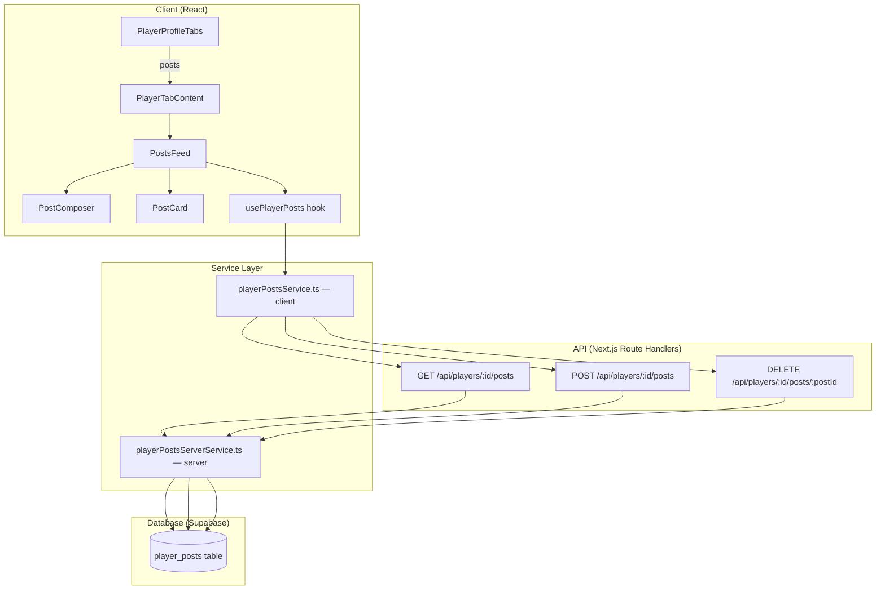

# Design — Onglet Posts du Profil Joueur

## Overview

L'onglet « Posts » remplace l'onglet « Aperçu » (overview) sur le profil joueur.
Il fonctionne comme un fil d'actualité de réseau social : les posts sont
affichés par ordre chronologique inversé, le propriétaire du profil peut publier
et supprimer ses posts, et les visiteurs peuvent consulter le fil. Le scroll
infini via `IntersectionObserver` charge les pages suivantes automatiquement,
suivant le pattern déjà établi par `PlayerReviewsFeed`.

### Décisions de design clés

- **Remplacement, pas ajout** : l'onglet `overview` est supprimé du type
  `ProfileTab` et remplacé par `posts`. L'onglet par défaut devient `posts`.
- **Pattern existant réutilisé** : la pagination côté API, le service client, le
  hook custom et le composant feed suivent exactement les patterns de
  `PlayerReviewsFeed` / `PlayerReviewsService`.
- **Scroll infini** : `IntersectionObserver` sur un élément sentinelle,
  identique à `PlayerReviewsFeed`.
- **RLS Supabase** : lecture publique, écriture/suppression réservée à l'auteur.
- **i18n** : toutes les chaînes via `next-intl`, clés ajoutées dans `fr.json` et
  `en.json`.

## Architecture



### Flux de données

1. `PostsFeed` monte → `usePlayerPosts` appelle
   `PlayerPostsService.fetchPosts(playerId, page=1)`
2. Le service client fait un `fetch` vers `GET /api/players/:id/posts?page=1`
3. La route API utilise `PlayerPostsServerService` pour requêter Supabase avec
   pagination
4. Les posts sont retournés avec les métadonnées de pagination
5. Le scroll infini déclenche `loadMore()` qui incrémente la page et concatène
   les résultats
6. La création d'un post fait un `POST` puis insère le post retourné en tête de
   la liste locale (optimistic-like)
7. La suppression fait un `DELETE` puis retire le post de la liste locale

## Components and Interfaces

### Nouveaux fichiers

| Fichier                                               | Responsabilité                                                                                |
| ----------------------------------------------------- | --------------------------------------------------------------------------------------------- |
| `src/components/players/PostsFeed.tsx`                | Composant principal du fil de posts (orchestration, scroll infini, états vide/loading/erreur) |
| `src/components/players/PostComposer.tsx`             | Formulaire de création de post (textarea, compteur, bouton publier)                           |
| `src/components/players/PostCard.tsx`                 | Carte d'affichage d'un post individuel (contenu, date relative, bouton supprimer)             |
| `src/hooks/usePlayerPosts.ts`                         | Hook custom gérant l'état du fil (posts, pagination, loading, CRUD)                           |
| `src/lib/services/playerPostsService.ts`              | Service client — appels fetch vers l'API                                                      |
| `src/lib/services/playerPostsServerService.ts`        | Service serveur — requêtes Supabase                                                           |
| `src/app/api/players/[id]/posts/route.ts`             | Route GET (liste paginée) + POST (création)                                                   |
| `src/app/api/players/[id]/posts/[postId]/route.ts`    | Route DELETE (suppression)                                                                    |
| `src/types/post.ts`                                   | Types partagés (Post, PostsResponse, CreatePostPayload)                                       |
| `supabase/migrations/20240310000001_player_posts.sql` | Migration : table, index, RLS                                                                 |

### Fichiers modifiés

| Fichier                                           | Modification                                                                                   |
| ------------------------------------------------- | ---------------------------------------------------------------------------------------------- |
| `src/components/players/PlayerProfileTabs.tsx`    | Remplacer `overview` par `posts` dans `ProfileTab` et `TAB_DEFINITIONS`, icône `MessageSquare` |
| `src/components/players/PlayerTabContent.tsx`     | Remplacer le case `overview` par `posts` → `PostsFeed`, supprimer `OverviewTab`                |
| `src/components/players/PlayerDetailsContent.tsx` | Changer l'état initial de `activeTab` de `"overview"` à `"posts"`                              |
| `src/messages/fr.json`                            | Ajouter namespace `players.posts`, remplacer `players.tabs.overview` par `players.tabs.posts`  |
| `src/messages/en.json`                            | Idem en anglais                                                                                |

### Interfaces des composants

```typescript
// PostsFeed
interface PostsFeedProps {
  playerId: string;
  locale: string;
  isOwner: boolean;
}

// PostComposer
interface PostComposerProps {
  onPostCreated: (post: Post) => void;
  playerId: string;
}

// PostCard
interface PostCardProps {
  post: Post;
  locale: string;
  isOwner: boolean;
  onDelete: (postId: string) => void;
}
```

### Interface du hook

```typescript
interface UsePlayerPostsReturn {
  posts: Post[];
  isLoading: boolean;
  isLoadingMore: boolean;
  isCreating: boolean;
  hasNextPage: boolean;
  error: string | null;
  loadMore: () => void;
  createPost: (content: string) => Promise<void>;
  deletePost: (postId: string) => Promise<void>;
}

function usePlayerPosts(playerId: string, locale: string): UsePlayerPostsReturn;
```

### Interface du service client

```typescript
class PlayerPostsService {
  static async fetchPosts(
    playerId: string,
    page?: number
  ): Promise<PostsResponse>;
  static async createPost(playerId: string, content: string): Promise<Post>;
  static async deletePost(playerId: string, postId: string): Promise<void>;
}
```

## Data Models

### Table `player_posts`

| Colonne      | Type          | Contraintes                                     | Description                           |
| ------------ | ------------- | ----------------------------------------------- | ------------------------------------- |
| `id`         | `uuid`        | PK, default `gen_random_uuid()`                 | Identifiant unique du post            |
| `player_id`  | `uuid`        | FK → `profiles(id)` ON DELETE CASCADE, NOT NULL | Auteur du post                        |
| `content`    | `text`        | NOT NULL, CHECK `char_length(content) <= 2000`  | Contenu textuel (max 2000 caractères) |
| `created_at` | `timestamptz` | NOT NULL, default `now()`                       | Date de création                      |
| `updated_at` | `timestamptz` | NOT NULL, default `now()`                       | Date de dernière modification         |

### Index

- `idx_player_posts_player_created` sur `(player_id, created_at DESC)` — requête
  principale du fil
- PK index sur `id` (automatique)

### Politiques RLS

| Politique                 | Opération | Condition                 |
| ------------------------- | --------- | ------------------------- |
| `player_posts_select_all` | SELECT    | `true` (lecture publique) |
| `player_posts_insert_own` | INSERT    | `auth.uid() = player_id`  |
| `player_posts_delete_own` | DELETE    | `auth.uid() = player_id`  |

### Types TypeScript

```typescript
// src/types/post.ts

export interface Post {
  id: string;
  playerId: string;
  content: string;
  createdAt: string;
  updatedAt: string;
}

export interface PostsResponse {
  posts: Post[];
  pagination: {
    currentPage: number;
    totalPages: number;
    totalCount: number;
    hasNextPage: boolean;
  };
}

export interface CreatePostPayload {
  content: string;
}
```

### Réponses API

**GET /api/players/:id/posts?page=1**

```json
{
  "posts": [
    {
      "id": "uuid",
      "playerId": "uuid",
      "content": "Mon premier post...",
      "createdAt": "2024-03-10T12:00:00Z",
      "updatedAt": "2024-03-10T12:00:00Z"
    }
  ],
  "pagination": {
    "currentPage": 1,
    "totalPages": 3,
    "totalCount": 52,
    "hasNextPage": true
  }
}
```

**POST /api/players/:id/posts** — Body: `{ "content": "..." }` → retourne le
`Post` créé

**DELETE /api/players/:id/posts/:postId** → `204 No Content`

## Correctness Properties

_A property is a characteristic or behavior that should hold true across all
valid executions of a system — essentially, a formal statement about what the
system should do. Properties serve as the bridge between human-readable
specifications and machine-verifiable correctness guarantees._

### Property 1: Post creation round-trip

_For any_ valid post content (non-empty, non-whitespace-only, ≤ 2000
characters), creating a post via the API and then fetching the player's posts
should return a post with the same content, a valid UUID `id`, and valid
`createdAt` / `updatedAt` timestamps.

**Validates: Requirements 1.1, 2.2, 3.1, 3.5**

### Property 2: Content length validation

_For any_ string of length > 2000 characters, the post creation API should
reject it with a 400 error. _For any_ string of length ≤ 2000 and
non-empty/non-whitespace, the API should accept it.

**Validates: Requirements 1.4, 3.3**

### Property 3: Whitespace content rejection

_For any_ string composed entirely of whitespace characters (spaces, tabs,
newlines), the post creation API should reject it with a 400 error, and the post
list should remain unchanged.

**Validates: Requirements 3.2**

### Property 4: Posts sorted by date descending

_For any_ player with multiple posts, the API should return posts where each
post's `createdAt` is greater than or equal to the next post's `createdAt` in
the list.

**Validates: Requirements 2.1**

### Property 5: Pagination invariants

_For any_ page of posts returned by the API, the number of posts should be ≤ 20,
the response should include `currentPage`, `totalPages`, `totalCount`, and
`hasNextPage`, and `hasNextPage` should be `true` if and only if
`currentPage < totalPages`.

**Validates: Requirements 2.3, 2.4**

### Property 6: Post deletion removes post

_For any_ post created by a player, after the owner deletes it via the API,
fetching the player's posts should not contain that post's `id`.

**Validates: Requirements 4.1**

### Property 7: Composer visibility based on ownership

_For any_ player profile, the `PostComposer` component should be rendered if and
only if `isOwner` is `true`.

**Validates: Requirements 7.1, 7.8**

### Property 8: Character counter accuracy

_For any_ string of length N where 0 ≤ N ≤ 2000, the character counter should
display `2000 - N` as the remaining count.

**Validates: Requirements 7.3**

### Property 9: Publish button disabled for whitespace input

_For any_ string composed entirely of whitespace characters (including the empty
string), the publish button should be in a disabled state.

**Validates: Requirements 7.4**

### Property 10: Delete button visibility based on ownership

_For any_ post card, the delete button should be rendered if and only if
`isOwner` is `true`.

**Validates: Requirements 8.1, 8.5**

### Property 11: New post prepended to list

_For any_ existing list of posts and a newly created post, the new post should
appear at index 0 of the updated list, and the rest of the list should remain
unchanged.

**Validates: Requirements 7.5**

### Property 12: Service error propagation

_For any_ failed API response (non-2xx status), the `PlayerPostsService` should
throw an `Error` with a non-empty message string.

**Validates: Requirements 9.4**

## Error Handling

| Scénario                                  | Couche         | Comportement                                               |
| ----------------------------------------- | -------------- | ---------------------------------------------------------- |
| Joueur inexistant (GET posts)             | API route      | 404 avec `{ error: "Player not found" }`                   |
| Contenu vide / whitespace (POST)          | API route      | 400 avec `{ error: "Content is required" }`                |
| Contenu > 2000 caractères (POST)          | API route      | 400 avec `{ error: "Content exceeds 2000 characters" }`    |
| Utilisateur non authentifié (POST/DELETE) | API route      | 401 avec `{ error: "Authentication required" }`            |
| Suppression d'un post inexistant          | API route      | 404 avec `{ error: "Post not found" }`                     |
| Suppression d'un post d'un autre joueur   | API route      | 403 avec `{ error: "Forbidden" }`                          |
| UUID invalide dans l'URL                  | API route      | 400 avec `{ error: "Invalid player ID format" }`           |
| Erreur Supabase inattendue                | API route      | 500 avec `{ error: "Internal server error" }`, log serveur |
| Échec fetch côté client                   | Service client | `throw new Error(message)` propagé au hook                 |
| Échec création de post                    | Hook → UI      | Toast d'erreur via le système de toast existant            |
| Échec suppression de post                 | Hook → UI      | Toast d'erreur via le système de toast existant            |

### Validation côté client (PostComposer)

- Le bouton « Publier » est désactivé si le contenu est vide ou whitespace-only
  → empêche les requêtes inutiles
- Le compteur de caractères passe en rouge si > 2000 → feedback visuel avant
  soumission
- Double-soumission empêchée par l'état `isCreating` qui désactive le bouton
  pendant l'envoi

## Testing Strategy

### Approche duale : tests unitaires + tests property-based

Les deux types de tests sont complémentaires :

- **Tests unitaires** : exemples spécifiques, cas limites, conditions d'erreur,
  intégration entre composants
- **Tests property-based** : propriétés universelles vérifiées sur des entrées
  générées aléatoirement

### Bibliothèque property-based testing

- **fast-check** (`fc`) pour Vitest — bibliothèque PBT standard pour TypeScript
- Chaque test property-based doit exécuter **minimum 100 itérations**
- Chaque test doit être tagué avec un commentaire référençant la propriété du
  design : `// Feature: player-posts-tab, Property {N}: {titre}`

### Fichiers de test

| Fichier                                                      | Type     | Contenu                                                   |
| ------------------------------------------------------------ | -------- | --------------------------------------------------------- |
| `test/unit/lib/services/playerPostsService.test.ts`          | Unit     | Tests du service client (fetch, create, delete, erreurs)  |
| `test/unit/components/players/PostComposer.test.tsx`         | Unit     | Tests du formulaire (rendu, validation, soumission)       |
| `test/unit/components/players/PostCard.test.tsx`             | Unit     | Tests de la carte (rendu, bouton supprimer, confirmation) |
| `test/unit/components/players/PostsFeed.test.tsx`            | Unit     | Tests du fil (états loading/empty/error, scroll infini)   |
| `test/unit/api/players/posts.test.ts`                        | Unit     | Tests des routes API (GET, POST, DELETE, erreurs)         |
| `test/unit/lib/services/playerPostsService.property.test.ts` | Property | Properties 1-6, 12 (logique API/service)                  |
| `test/unit/components/players/posts.property.test.ts`        | Property | Properties 7-11 (logique UI/composants)                   |

### Mapping propriétés → tests

| Propriété                                          | Fichier de test                       | Type     |
| -------------------------------------------------- | ------------------------------------- | -------- |
| Property 1: Post creation round-trip               | `playerPostsService.property.test.ts` | Property |
| Property 2: Content length validation              | `playerPostsService.property.test.ts` | Property |
| Property 3: Whitespace content rejection           | `playerPostsService.property.test.ts` | Property |
| Property 4: Posts sorted by date descending        | `playerPostsService.property.test.ts` | Property |
| Property 5: Pagination invariants                  | `playerPostsService.property.test.ts` | Property |
| Property 6: Post deletion removes post             | `playerPostsService.property.test.ts` | Property |
| Property 7: Composer visibility                    | `posts.property.test.ts`              | Property |
| Property 8: Character counter accuracy             | `posts.property.test.ts`              | Property |
| Property 9: Publish button disabled for whitespace | `posts.property.test.ts`              | Property |
| Property 10: Delete button visibility              | `posts.property.test.ts`              | Property |
| Property 11: New post prepended to list            | `posts.property.test.ts`              | Property |
| Property 12: Service error propagation             | `playerPostsService.property.test.ts` | Property |

### Tests unitaires (exemples et edge cases)

- Joueur inexistant → 404 (Req 2.5)
- Utilisateur non authentifié → 401 (Req 3.4, 4.4)
- Suppression d'un post d'un autre joueur → 403 (Req 4.3)
- Suppression d'un post inexistant → 404 (Req 4.2)
- Onglet « Posts » présent et actif par défaut (Req 5.1, 5.2, 5.3)
- État vide du fil (Req 6.5)
- Confirmation de suppression affichée (Req 8.2)
- Attributs ARIA présents (Req 11.3, 11.4)
- Toast d'erreur affiché en cas d'échec (Req 7.7, 8.4)
- Clé de traduction `players.tabs.posts` présente (Req 10.4)
