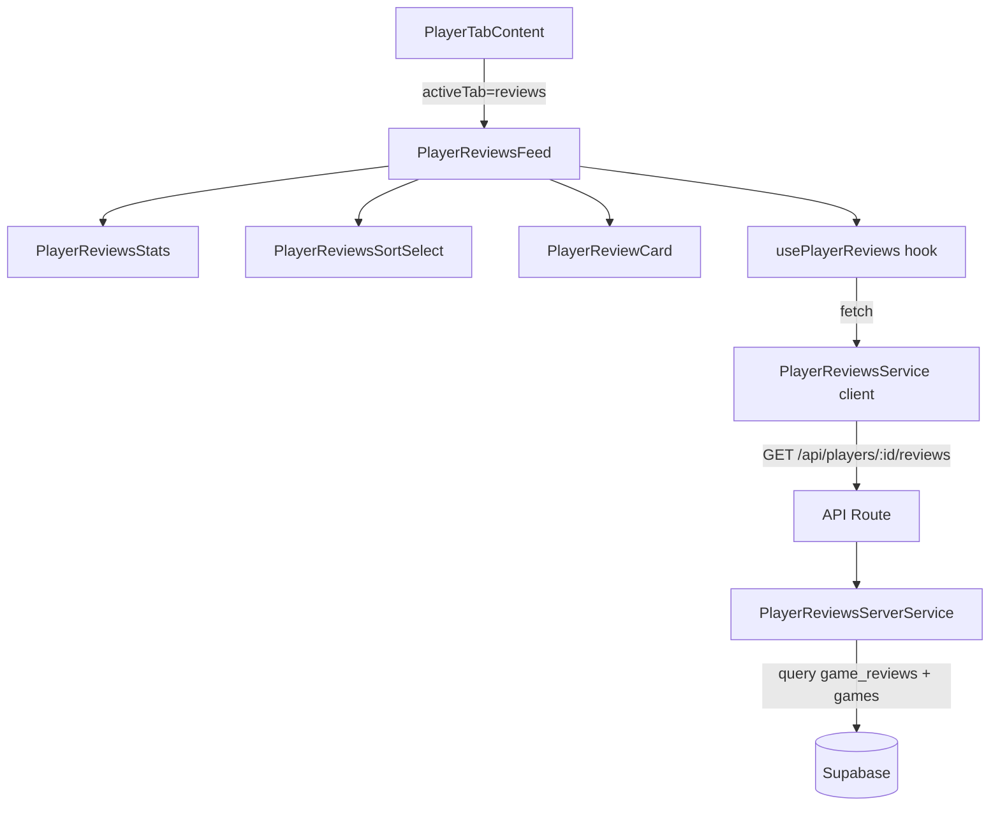

# Design — Onglet Avis du Profil Joueur

## Vue d'ensemble

L'onglet « Avis » du profil joueur affiche la liste paginée des reviews de jeux
rédigées par un joueur, accompagnée de statistiques agrégées (nombre total, note
moyenne, distribution des notes). Le visiteur peut trier les avis par date ou
par note. Le chargement se fait en scroll infini.

Aucune nouvelle table n'est nécessaire : les données proviennent de la table
existante `game_reviews` avec une jointure sur `games` et `game_translations`
pour récupérer le nom et le slug du jeu dans la locale courante. Les
statistiques sont calculées côté serveur dans la même requête API.

L'architecture suit le pattern établi par l'onglet Activité : un composant
principal (`PlayerReviewsFeed`) utilise un hook (`usePlayerReviews`) qui appelle
un service client (`playerReviewsService`), lequel communique avec un endpoint
API dédié (`/api/players/[id]/reviews`). L'API interroge directement Supabase
via un service serveur (`playerReviewsServerService`).

## Architecture



### Décisions architecturales

1. **Requête directe Supabase (pas de RPC)** : Contrairement à l'onglet Activité
   qui agrège 6 tables via `UNION ALL`, ici on interroge une seule table
   (`game_reviews`) avec des jointures simples. Une requête Supabase standard
   avec `.select()` et jointures suffit, pas besoin de fonction RPC.

2. **Statistiques calculées côté serveur** : La note moyenne et la distribution
   des notes sont calculées sur l'ensemble des reviews du joueur (pas seulement
   la page courante). Le service serveur fait une requête séparée pour compter
   et agréger, puis retourne les stats avec la première page. Les pages
   suivantes ne recalculent pas les stats (elles sont stables).

3. **Scroll infini avec `IntersectionObserver`** : Même pattern que
   `ActivityFeed` — un élément sentinelle en bas de liste déclenche le
   chargement de la page suivante.

4. **Tri côté serveur** : Le paramètre `sort` est passé à l'API qui applique
   l'`ORDER BY` correspondant en SQL. Changer le tri reset la pagination.

5. **Composant `PlayerReviewCard` dédié** : Le `ReviewCard` existant dans
   `src/components/games/reviews/` est conçu pour le contexte d'une page jeu
   (affiche le nom du joueur, les votes). Ici, dans le contexte du profil
   joueur, on affiche le nom du jeu (pas du joueur) et on n'a pas besoin des
   votes. Un composant dédié est plus adapté.

6. **Pas de migration SQL** : La table `game_reviews` existe déjà avec les index
   nécessaires (`idx_game_reviews_user_id`, `idx_game_reviews_created_at`).
   Aucune modification de schéma n'est requise.

## Composants et Interfaces

### Nouveaux fichiers

```
src/components/players/
├── PlayerReviewsFeed.tsx       # Composant principal (liste + scroll infini)
├── PlayerReviewsStats.tsx      # Bloc statistiques agrégées
├── PlayerReviewsSortSelect.tsx # Sélecteur de tri
├── PlayerReviewCard.tsx        # Carte d'un avis individuel

src/hooks/
├── usePlayerReviews.ts         # Hook de gestion des avis + pagination + tri

src/lib/services/
├── playerReviewsService.ts     # Service client (fetch API)
├── playerReviewsServerService.ts # Service serveur (Supabase queries)

src/app/api/players/[id]/reviews/
├── route.ts                    # Endpoint API GET

src/types/
├── playerReview.ts             # Types partagés pour les avis joueur
```

### Composants

**PlayerReviewsFeed** : Composant principal de l'onglet. Utilise
`usePlayerReviews` pour charger les données. Affiche `PlayerReviewsStats` en
haut, puis `PlayerReviewsSortSelect`, puis la liste de `PlayerReviewCard`. Gère
le scroll infini via un `IntersectionObserver` sur un élément sentinelle.
Affiche un skeleton pendant le chargement initial et un message vide si aucun
avis. Attributs ARIA : `role="feed"`, `aria-busy`, `aria-label`.

**PlayerReviewsStats** : Bloc glassmorphism affichant 3 métriques : nombre total
d'avis, note moyenne (avec `getRatingColor`), et distribution des notes en 4
barres horizontales (0-5, 6-10, 11-15, 16-20). Chaque barre montre le
pourcentage et le nombre d'avis dans la tranche.

**PlayerReviewsSortSelect** : Menu déroulant avec 4 options de tri : « Plus
récents » (défaut), « Plus anciens », « Meilleures notes », « Notes les plus
basses ». Utilise la classe `.glass-dropdown` pour le style.

**PlayerReviewCard** : Carte glassmorphism affichant un avis individuel.
Contient l'image de couverture du jeu (miniature), le nom du jeu (lien vers
`/[locale]/games/[slug]`), la note sur 20 avec code couleur (`getRatingColor`),
un extrait du contenu HTML (tronqué), les points positifs/négatifs, et la date
formatée selon la locale.

### Hook

**usePlayerReviews(playerId, locale)** : Gère l'état des avis du joueur :

- `reviews: PlayerReviewItem[]` — liste cumulée des avis
- `stats: PlayerReviewsStatsData | null` — statistiques agrégées
- `isLoading: boolean` — chargement initial
- `isLoadingMore: boolean` — chargement page suivante
- `hasNextPage: boolean` — indicateur de page suivante
- `sortOption: ReviewSortOption` — tri actif
- `error: string | null` — message d'erreur
- `setSort(option)` — change le tri (reset la pagination)
- `loadMore()` — charge la page suivante

Les stats sont chargées une seule fois avec la première page et conservées lors
du chargement des pages suivantes.

### Fichiers modifiés

- `src/components/players/PlayerTabContent.tsx` : Ajouter le case `"reviews"`
  dans le switch pour rendre `PlayerReviewsFeed`.
- `src/messages/fr.json` : Ajouter les clés `players.reviews.*`.
- `src/messages/en.json` : Ajouter les clés `players.reviews.*`.

## Modèles de données

### Types TypeScript

```typescript
// src/types/playerReview.ts

/** Options de tri des avis */
export type ReviewSortOption =
  | "date_desc"
  | "date_asc"
  | "rating_desc"
  | "rating_asc";

/** Avis d'un joueur tel qu'affiché dans l'onglet */
export interface PlayerReviewItem {
  id: string;
  gameId: string;
  gameSlug: string;
  gameName: string;
  gameCoverUrl: string | null;
  rating: number;
  content: string;
  positivePoints: string[];
  negativePoints: string[];
  createdAt: string;
  updatedAt: string;
}

/** Distribution des notes par tranche */
export interface RatingDistribution {
  range: string; // "0-5", "6-10", "11-15", "16-20"
  count: number;
  percentage: number; // 0-100
}

/** Statistiques agrégées des avis d'un joueur */
export interface PlayerReviewsStatsData {
  totalCount: number;
  averageRating: number | null;
  distribution: RatingDistribution[];
}

/** Réponse de l'API des avis joueur */
export interface PlayerReviewsResponse {
  reviews: PlayerReviewItem[];
  stats: PlayerReviewsStatsData;
  pagination: {
    currentPage: number;
    totalPages: number;
    hasNextPage: boolean;
  };
}

/** Paramètres de requête pour l'API */
export interface PlayerReviewsQueryParams {
  page?: number;
  sort?: ReviewSortOption;
  locale?: string;
}
```

### Requête Supabase (service serveur)

Le service serveur effectue deux opérations :

1. **Requête paginée des avis** : Interroge `game_reviews` filtré par `user_id`,
   avec jointure sur `games(slug, cover_image_url)` et
   `game_translations(title)` filtré par `language_code`. Applique l'`ORDER BY`
   selon le paramètre `sort` et la pagination `offset/limit` (10 par page).

2. **Calcul des statistiques** : Requête sur `game_reviews` filtré par `user_id`
   pour obtenir le `count(*)`, `avg(rating)`, et la distribution via un
   `CASE WHEN` groupé par tranche. Cette requête est exécutée uniquement pour la
   page 1 (les stats ne changent pas entre les pages).

### Mapping sort → ORDER BY

| `sort` param  | SQL ORDER BY                   |
| ------------- | ------------------------------ |
| `date_desc`   | `created_at DESC` (défaut)     |
| `date_asc`    | `created_at ASC`               |
| `rating_desc` | `rating DESC, created_at DESC` |
| `rating_asc`  | `rating ASC, created_at DESC`  |

## Propriétés de Correction

_Une propriété est une caractéristique ou un comportement qui doit rester vrai
pour toutes les exécutions valides d'un système — essentiellement, une
déclaration formelle sur ce que le système doit faire. Les propriétés servent de
pont entre les spécifications lisibles par l'humain et les garanties de
correction vérifiables par la machine._

### Propriété 1 : Correction du tri

_Pour toute_ liste d'avis et _pour toute_ option de tri (`date_desc`,
`date_asc`, `rating_desc`, `rating_asc`), la liste retournée par la fonction de
tri doit être correctement ordonnée selon le critère choisi :

- `date_desc` : chaque avis à l'index `i` a une date ≥ celle de l'index `i+1`
- `date_asc` : chaque avis à l'index `i` a une date ≤ celle de l'index `i+1`
- `rating_desc` : chaque avis à l'index `i` a une note ≥ celle de l'index `i+1`
- `rating_asc` : chaque avis à l'index `i` a une note ≤ celle de l'index `i+1`

**Valide : Exigences 1.1, 1.7, 4.2**

### Propriété 2 : Complétude des données après transformation

_Pour tout_ enregistrement brut de review provenant de la base de données (avec
jointures jeu/traduction), l'objet `PlayerReviewItem` résultant de la
transformation doit contenir tous les champs requis : `id`, `gameSlug`,
`gameName`, `rating`, `content`, `positivePoints`, `negativePoints`,
`createdAt`.

**Valide : Exigence 1.2**

### Propriété 3 : Correction de la pagination

_Pour tout_ nombre total d'avis `N` et _pour tout_ numéro de page `p` (avec une
taille de page de 10), la page retournée doit contenir au plus 10 avis, le
nombre total de pages doit être `ceil(N / 10)`, et `hasNextPage` doit être
`true` si et seulement si `p < ceil(N / 10)`.

**Valide : Exigences 1.3, 1.5**

### Propriété 4 : Correction des statistiques agrégées

_Pour tout_ ensemble d'avis avec des notes entre 0 et 20 :

- `totalCount` doit être égal au nombre d'avis
- `averageRating` doit être égal à la somme des notes divisée par le nombre
  d'avis (null si aucun avis)
- La distribution doit répartir chaque note dans la bonne tranche (0-5, 6-10,
  11-15, 16-20)
- La somme des `count` de toutes les tranches doit être égale à `totalCount`

**Valide : Exigences 1.4, 3.3**

### Propriété 5 : Construction correcte de l'URL du service

_Pour tout_ identifiant de joueur et _pour tout_ ensemble de paramètres de
requête (page, sort, locale), l'URL construite par le service client doit
contenir le bon chemin `/api/players/{playerId}/reviews` et inclure uniquement
les query params non-undefined.

**Valide : Exigence 5.1**

### Propriété 6 : Propagation des erreurs du service

_Pour tout_ code de statut HTTP d'erreur (4xx, 5xx), le service client doit
lever une exception avec un message descriptif contenant soit le message
d'erreur du body de la réponse, soit le statut HTTP.

**Valide : Exigence 5.2**

## Gestion des erreurs

| Scénario                | Comportement                                                                                                                                             |
| ----------------------- | -------------------------------------------------------------------------------------------------------------------------------------------------------- |
| Joueur inexistant (404) | L'API retourne `{ error: "Player not found" }` avec status 404. Le hook expose `error`. Le composant affiche un message d'erreur.                        |
| Erreur serveur (500)    | L'API retourne `{ error: "Internal server error" }` avec status 500. Le service client propage l'erreur. Le composant affiche un message générique.      |
| Erreur réseau           | Le service client lève une exception. Le hook capture l'erreur et expose un état `error`. Le composant affiche un message avec possibilité de réessayer. |
| Page invalide           | L'API normalise le paramètre `page` via `parsePaginationParams` (fallback à 1).                                                                          |
| Sort invalide           | L'API ignore le paramètre `sort` invalide et utilise le tri par défaut (`date_desc`).                                                                    |
| UUID invalide           | L'API valide le format via `PlayerService.validatePlayerId` et retourne 400 si invalide.                                                                 |
| Table manquante         | Le service serveur gère gracieusement l'erreur PGRST205 et retourne une liste vide (pattern existant).                                                   |

## Stratégie de tests

### Tests unitaires (Vitest)

Les tests unitaires vérifient des exemples spécifiques, des cas limites et des
conditions d'erreur :

- **API Route** (`test/unit/api/players/reviews.test.ts`) : Vérifie les réponses
  pour joueur valide, joueur inexistant (404), UUID invalide (400), paramètres
  de tri invalides, et erreurs serveur.
- **Composants** (`test/unit/components/players/PlayerReviewsFeed.test.tsx`) :
  Vérifie le rendu avec des avis, l'état vide, l'état de chargement, les
  attributs ARIA (`role="feed"`, `aria-busy`), et le sélecteur de tri.
- **Service client** (`test/unit/lib/services/playerReviewsService.test.ts`) :
  Vérifie la propagation d'erreurs et la construction des URLs avec des cas
  concrets.

### Tests property-based (fast-check + Vitest)

Les tests property-based vérifient les propriétés universelles sur des entrées
générées aléatoirement. Chaque test doit exécuter au minimum 100 itérations.

- **Fichier** : `test/unit/lib/services/playerReviewsService.property.test.ts`
- **Bibliothèque** : `fast-check` (déjà installé dans le projet)
- **Convention de tag** : Chaque test est annoté avec un commentaire référençant
  la propriété du design :
  `// Feature: player-reviews-tab, Property N: [description]`

Les 6 propriétés identifiées dans la section Correctness Properties seront
implémentées comme des tests property-based, testant les fonctions pures de tri,
transformation, pagination, statistiques et construction d'URL.

### Approche complémentaire

- Les tests unitaires couvrent les cas concrets et les intégrations (API routes,
  rendu de composants, gestion d'erreurs).
- Les tests property-based couvrent les invariants universels sur les fonctions
  pures (tri, pagination, transformation, statistiques, URL building).
- Ensemble, ils assurent une couverture complète : les tests unitaires attrapent
  les bugs concrets, les tests property-based vérifient la correction générale.
