# Design Document — Player Stats Dashboard

## Overview

Ce design remplace l'onglet "stats" existant (qui affiche des `EnrichedStats`
basiques via `PlayerEnrichedStats.tsx`) par un dashboard riche organisé en
sections thématiques. Le dashboard exploite les données existantes en base
(Requirements 1-10) et introduit trois nouvelles tables pour les fonctionnalités
avancées (Requirements 11-13).

Le dashboard est servi par un unique endpoint API
`GET /api/players/[id]/stats/dashboard` qui agrège toutes les données en
parallèle. Le composant principal `StatsDashboard.tsx` orchestre les
sous-composants de chaque section, chacun dans son propre fichier (< 150 lignes)
conformément aux règles de qualité du projet.

### Décisions clés

- **Recharts** (déjà installé v3.7.0) pour les graphiques (donut, barres,
  histogramme)
- **Un seul appel API** pour tout le dashboard — les requêtes DB sont
  parallélisées côté serveur via `Promise.all`
- **Fonctions pures exportées** pour chaque calcul statistique — testables en
  property-based sans accès DB
- **Remplacement de `PlayerEnrichedStats`** dans l'onglet "stats" — l'onglet
  "overview" conserve l'ancien composant pour ne pas casser l'existant
- **Privacy** : le champ `stats_private` existant sur `profiles` contrôle la
  visibilité pour les visiteurs

## Architecture

```mermaid
graph TD
    subgraph Client
        A[PlayerTabContent] -->|activeTab=stats| B[StatsDashboard]
        B --> C[StatsOverviewCards]
        B --> D[GenreDistributionChart]
        B --> E[CompletionTracker]
        B --> F[ReviewAnalytics]
        B --> G[SocialStats]
        B --> H[ActivityTimeline]
        B --> I[PlaytimeStats]
        B --> J[AchievementsList]
        B --> K[SessionStats]
        B --> L[PersonalGoals]
    end

    subgraph API
        M[GET /api/players/:id/stats/dashboard]
    end

    subgraph Services
        N[DashboardStatsService]
        N --> N1[fetchOverviewMetrics]
        N --> N2[fetchGenreDistribution]
        N --> N3[fetchCompletionStats]
        N --> N4[fetchReviewAnalytics]
        N --> N5[fetchSocialStats]
        N --> N6[fetchActivityTimeline]
        N --> N7[fetchAchievements]
        N --> N8[fetchSessionStats]
        N --> N9[fetchPlayerGoals]
    end

    subgraph Pure Functions
        P1[computeOverviewMetrics]
        P2[computeGenreDistribution]
        P3[computeCompletionStats]
        P4[computeReviewDistribution]
        P5[computeActivityByMonth]
        P6[computeAveragePlaytime]
        P7[computeAchievementProgress]
        P8[computeSessionFrequency]
        P9[computeGoalProgress]
    end

    subgraph Database
        DB1[(profiles)]
        DB2[(user_library)]
        DB3[(game_genres / genre_translations)]
        DB4[(game_reviews / review_votes)]
        DB5[(friendships)]
        DB6[(character_comments)]
        DB7[(character_favorites)]
        DB8[(game_collections)]
        DB9[(player_achievements — NEW)]
        DB10[(game_sessions — NEW)]
        DB11[(player_goals — NEW)]
    end

    B -->|fetch| M
    M --> N
    N --> P1 & P2 & P3 & P4 & P5 & P6 & P7 & P8 & P9
    N1 --> DB1 & DB2 & DB4
    N2 --> DB2 & DB3
    N3 --> DB2
    N4 --> DB4
    N5 --> DB5 & DB6 & DB7 & DB8
    N6 --> DB2
    N7 --> DB9
    N8 --> DB10
    N9 --> DB11
```



### Flux de données

1. `PlayerTabContent` rend `StatsDashboard` quand `activeTab === "stats"`
2. `StatsDashboard` appelle `GET /api/players/:id/stats/dashboard?locale=fr`
3. L'API route vérifie la privacy, puis appelle `DashboardStatsService` qui
   exécute toutes les requêtes en parallèle
4. Chaque requête DB passe par une fonction pure de calcul avant d'être
   retournée
5. Le composant reçoit la réponse JSON et distribue les données aux
   sous-composants

## Components and Interfaces

### Structure des fichiers

```
src/components/players/stats/
├── StatsDashboard.tsx              # Orchestrateur principal (fetch + layout)
├── StatsOverviewCards.tsx          # Grille de métriques clés (Req 1)
├── GenreDistributionChart.tsx      # Donut chart genres (Req 2)
├── CompletionTracker.tsx           # Barre de progression (Req 3)
├── ReviewAnalytics.tsx             # Histogramme + stats avis (Req 4)
├── SocialStats.tsx                 # Métriques sociales (Req 5)
├── ActivityTimeline.tsx            # Barres activité 12 mois (Req 6)
├── PlaytimeStats.tsx               # Temps moyen + top game (Req 7)
├── AchievementsList.tsx            # Badges/succès (Req 11)
├── SessionStats.tsx                # Stats sessions (Req 12)
├── PersonalGoals.tsx               # Objectifs personnels (Req 13)
└── StatsEmptyState.tsx             # État vide réutilisable

src/lib/services/
├── dashboardStatsService.ts        # Service DB — requêtes parallèles
└── dashboardStatsCompute.ts        # Fonctions pures de calcul

src/lib/utils/
└── statsFormatters.ts              # Formatage nombres localisés

src/types/
└── dashboard-stats.ts              # Types partagés du dashboard

src/app/api/players/[id]/stats/
└── dashboard/route.ts              # Endpoint API dashboard
```

### Composants principaux

**StatsDashboard** — Composant orchestrateur

- Props : `playerId: string`, `locale: string`, `isOwnProfile: boolean`,
  `statsPrivate: boolean`
- Gère le fetch, les états loading/error/private
- Distribue les données aux sous-composants
- Utilise le pattern existant de `PlayerEnrichedStats` (FetchState)

**StatsOverviewCards** — Grille de métriques (Req 1)

- Props : `metrics: OverviewMetrics`, `locale: string`
- 6 cartes `.glass-card` : total jeux, temps de jeu, avis, note moyenne,
  collections, amis
- État vide si aucune donnée

**GenreDistributionChart** — Donut chart (Req 2)

- Props : `distribution: GenreDistributionEntry[]`, `locale: string`
- Recharts `PieChart` avec `innerRadius` pour l'effet donut
- Top 5 genres + "Autres"
- Tooltip au survol

**CompletionTracker** — Progression (Req 3)

- Props : `completion: CompletionStats`
- Barre de progression avec couleurs par statut
- Compteurs par statut

**ReviewAnalytics** — Analyse avis (Req 4)

- Props : `analytics: ReviewAnalyticsData`, `locale: string`
- Recharts `BarChart` pour la distribution par tranches
- Métriques : moyenne, médiane, mode, total, votes helpful

**SocialStats** — Stats sociales (Req 5)

- Props : `social: SocialStatsData`
- 4 cartes : amis, commentaires, favoris, collections

**ActivityTimeline** — Chronologie (Req 6)

- Props : `timeline: MonthlyActivity[]`, `locale: string`
- Recharts `BarChart` — 12 derniers mois
- Noms de mois localisés via `Intl.DateTimeFormat`

**PlaytimeStats** — Temps de jeu (Req 7)

- Props : `playtime: PlaytimeData`, `locale: string`
- Temps moyen + top game avec cover

**AchievementsList** — Succès (Req 11)

- Props : `achievements: AchievementData[]`, `totalCount: number`
- Liste de badges avec statut débloqué/verrouillé
- Barre de progression globale

**SessionStats** — Sessions (Req 12)

- Props : `sessions: SessionStatsData`
- Métriques + graphique fréquence par jour de semaine

**PersonalGoals** — Objectifs (Req 13)

- Props : `goals: PlayerGoal[]`, `isOwnProfile: boolean`
- CRUD via API séparée (POST/PUT/DELETE)
- Masqué pour les visiteurs

### Intégration dans l'existant

Le composant `PlayerTabContent.tsx` sera modifié pour importer `StatsDashboard`
au lieu de `PlayerEnrichedStats` dans le case `"stats"`. L'onglet `"overview"`
conserve `PlayerEnrichedStats` inchangé.

## Data Models

### Types TypeScript (`src/types/dashboard-stats.ts`)

```typescript
/** Métriques résumées du dashboard (Req 1) */
export interface OverviewMetrics {
  totalGames: number;
  totalPlayTimeHours: number;
  reviewCount: number;
  averageRating: number | null;
  collectionsCount: number;
  friendsCount: number;
}

/** Entrée de répartition par genre (Req 2) */
export interface GenreDistributionEntry {
  genre: string;
  count: number;
  percentage: number;
}

/** Stats de complétion (Req 3) */
export interface CompletionStats {
  total: number;
  owned: number;
  playing: number;
  completed: number;
  wishlist: number;
  completionPercentage: number;
}

/** Analyse des avis (Req 4) */
export interface ReviewAnalyticsData {
  distribution: ReviewBucket[];
  averageRating: number | null;
  medianRating: number | null;
  modeRating: number | null;
  totalReviews: number;
  helpfulVotesReceived: number;
}

export interface ReviewBucket {
  range: string; // "0-5", "6-10", "11-15", "16-20"
  min: number;
  max: number;
  count: number;
}

/** Stats sociales (Req 5) */
export interface SocialStatsData {
  friendsCount: number;
  commentsCount: number;
  favoritesCount: number;
  collectionsCount: number;
}

/** Activité mensuelle (Req 6) */
export interface MonthlyActivity {
  month: number; // 1-12
  year: number;
  label: string; // Nom du mois localisé
  gamesAdded: number;
}

/** Temps de jeu (Req 7) */
export interface PlaytimeData {
  averagePlayTimeHours: number | null;
  topGame: {
    id: string;
    title: string;
    coverImage: string | null;
    playTimeHours: number;
  } | null;
}

/** Succès/Achievement (Req 11) */
export interface AchievementData {
  key: string;
  unlockedAt: string | null; // ISO date or null if locked
}

export interface AchievementDefinition {
  key: string;
  threshold: number;
  category: "library" | "reviews" | "social" | "playtime";
}

/** Stats de sessions (Req 12) */
export interface SessionStatsData {
  totalSessions: number;
  averageDurationMinutes: number | null;
  longestSessionMinutes: number | null;
  frequencyByDayOfWeek: DayFrequency[];
}

export interface DayFrequency {
  day: number; // 0=lundi, 6=dimanche
  label: string;
  sessionCount: number;
}

/** Objectif personnel (Req 13) */
export interface PlayerGoal {
  id: string;
  goalType:
    | "games_to_complete"
    | "play_time_hours"
    | "reviews_to_write"
    | "collections_to_create";
  targetValue: number;
  currentValue: number;
  deadline: string | null; // ISO date
  createdAt: string;
}

/** Réponse complète de l'API dashboard */
export interface DashboardStatsResponse {
  overview: OverviewMetrics;
  genreDistribution: GenreDistributionEntry[];
  completion: CompletionStats;
  reviewAnalytics: ReviewAnalyticsData;
  social: SocialStatsData;
  activityTimeline: MonthlyActivity[];
  playtime: PlaytimeData;
  achievements: AchievementData[];
  achievementDefinitions: AchievementDefinition[];
  sessions: SessionStatsData;
  goals: PlayerGoal[];
}

/** Réponse API quand stats privées */
export interface DashboardStatsPrivateResponse {
  stats: null;
  private: true;
}
```

### Nouvelles tables SQL

**`player_achievements`** (Req 11)

```sql
CREATE TABLE public.player_achievements (
  id UUID PRIMARY KEY DEFAULT gen_random_uuid(),
  user_id UUID NOT NULL REFERENCES auth.users(id) ON DELETE CASCADE,
  achievement_key VARCHAR(50) NOT NULL,
  unlocked_at TIMESTAMPTZ NOT NULL DEFAULT now(),
  UNIQUE(user_id, achievement_key)
);
```

**`game_sessions`** (Req 12)

```sql
CREATE TABLE public.game_sessions (
  id UUID PRIMARY KEY DEFAULT gen_random_uuid(),
  user_id UUID NOT NULL REFERENCES auth.users(id) ON DELETE CASCADE,
  game_id UUID NOT NULL REFERENCES games(id) ON DELETE CASCADE,
  started_at TIMESTAMPTZ NOT NULL,
  ended_at TIMESTAMPTZ NOT NULL,
  duration_minutes INTEGER NOT NULL
    GENERATED ALWAYS AS (
      EXTRACT(EPOCH FROM (ended_at - started_at)) / 60
    )::INTEGER STORED,
  CONSTRAINT game_sessions_valid_range CHECK (ended_at > started_at)
);
```

> Note : `duration_minutes` est une colonne générée pour garantir la cohérence
> avec `started_at`/`ended_at` (Req 12.5). Si le moteur Supabase ne supporte pas
> `GENERATED ALWAYS AS` avec cette expression, on utilisera un trigger
> `BEFORE INSERT OR UPDATE` à la place.

**`player_goals`** (Req 13)

```sql
CREATE TABLE public.player_goals (
  id UUID PRIMARY KEY DEFAULT gen_random_uuid(),
  user_id UUID NOT NULL REFERENCES auth.users(id) ON DELETE CASCADE,
  goal_type VARCHAR(30) NOT NULL
    CHECK (goal_type IN (
      'games_to_complete', 'play_time_hours',
      'reviews_to_write', 'collections_to_create'
    )),
  target_value INTEGER NOT NULL CHECK (target_value > 0),
  current_value INTEGER NOT NULL DEFAULT 0,
  created_at TIMESTAMPTZ NOT NULL DEFAULT now(),
  deadline DATE
);
```

### Migrations

Trois fichiers de migration dans `supabase/migrations/` :

- `20240310000001_player_achievements.sql`
- `20240310000002_game_sessions.sql`
- `20240310000003_player_goals.sql`

Chaque migration inclut : table, index, RLS policies, `COMMENT ON`.

### Définitions des succès (constante applicative)

Les définitions de succès sont stockées en constante TypeScript (pas en DB) pour
simplifier le déploiement :

```typescript
export const ACHIEVEMENT_DEFINITIONS: AchievementDefinition[] = [
  { key: "first_game", threshold: 1, category: "library" },
  { key: "library_10", threshold: 10, category: "library" },
  { key: "library_50", threshold: 50, category: "library" },
  { key: "first_review", threshold: 1, category: "reviews" },
  { key: "reviews_10", threshold: 10, category: "reviews" },
  { key: "playtime_100h", threshold: 100, category: "playtime" },
  { key: "playtime_500h", threshold: 500, category: "playtime" },
  { key: "first_friend", threshold: 1, category: "social" },
  { key: "friends_10", threshold: 10, category: "social" },
  { key: "first_collection", threshold: 1, category: "social" },
];
```

## Correctness Properties

_A property is a characteristic or behavior that should hold true across all
valid executions of a system — essentially, a formal statement about what the
system should do. Properties serve as the bridge between human-readable
specifications and machine-verifiable correctness guarantees._

### Property 1: Genre distribution counts each game once per genre

_For any_ set of library entries where each game has one or more genres, the
`computeGenreDistribution` function should produce a distribution where the
count for each genre equals the number of games in the library that have that
genre. A game with N genres contributes 1 to each of those N genre counts.

**Validates: Requirements 2.2, 2.3**

### Property 2: Genre distribution truncation preserves total

_For any_ genre distribution with more than 5 genres, truncating to top 5 +
"Autres" should produce at most 6 entries, and the sum of all entry counts
should equal the sum of the original distribution counts.

**Validates: Requirements 2.4**

### Property 3: Completion stats are consistent with library

_For any_ set of library entries with statuses in {owned, playing, completed,
wishlist}, the `computeCompletionStats` function should produce counts where:
`owned + playing + completed + wishlist == total`, and
`completionPercentage == round(completed / total * 100)` (0 when total is 0).

**Validates: Requirements 3.1, 3.2, 3.3**

### Property 4: Review rating distribution bucketing is exhaustive

_For any_ set of ratings in [0, 20], the `computeReviewDistribution` function
should assign each rating to exactly one bucket (0-5, 6-10, 11-15, 16-20), and
the sum of all bucket counts should equal the total number of ratings.

**Validates: Requirements 4.1, 4.2**

### Property 5: Review statistical measures are correct

_For any_ non-empty set of integer ratings in [0, 20], the computed average
should equal `sum / count` rounded to 1 decimal, the median should be the middle
value of the sorted list, and the mode should be the most frequent value
(smallest in case of tie).

**Validates: Requirements 4.3**

### Property 6: Activity timeline always has 12 entries

_For any_ set of library entries with `added_at` dates and a reference date, the
`computeActivityByMonth` function should return exactly 12 entries (one per
month for the last 12 months), and the sum of `gamesAdded` across all entries
should equal the number of input entries that fall within the 12-month window.

**Validates: Requirements 6.1, 6.2, 6.3**

### Property 7: Month labels match locale

_For any_ month number (1-12) and locale ("fr" or "en"), the localized month
label should match the output of `Intl.DateTimeFormat` for that month and
locale.

**Validates: Requirements 6.4, 10.4**

### Property 8: Average playtime excludes zero-time games

_For any_ set of play time values, the `computeAveragePlaytime` function should
return the average of only the non-zero values, rounded to 1 decimal. If all
values are zero or the set is empty, it should return null.

**Validates: Requirements 7.1, 7.2**

### Property 9: Top game has maximum play time

_For any_ non-empty set of games with play times where at least one has play
time > 0, the `computeTopGame` function should return the game with the highest
play time.

**Validates: Requirements 7.3**

### Property 10: Stats visibility follows privacy rule

_For any_ combination of `isOwnProfile` (boolean) and `statsPrivate` (boolean),
stats should be visible if and only if `isOwnProfile || !statsPrivate`.

**Validates: Requirements 8.1, 8.2, 8.3, 8.4**

### Property 11: UUID validation rejects non-UUID strings

_For any_ string that does not match the UUID v4 format, `validatePlayerId`
should return false. For any valid UUID v4 string, it should return true.

**Validates: Requirements 9.4**

### Property 12: Number formatting respects locale

_For any_ number and locale ("fr" or "en"), the formatted string should use the
locale-appropriate decimal separator ("," for fr, "." for en).

**Validates: Requirements 10.3**

### Property 13: Achievement unlock check is correct

_For any_ set of achievement definitions (key + threshold + category) and player
activity counts per category, the `computeAchievementProgress` function should
mark an achievement as unlocked if and only if the player's count for that
category meets or exceeds the threshold. The global progress ratio should equal
`unlockedCount / totalDefinitions`.

**Validates: Requirements 11.3, 11.6**

### Property 14: Session statistics are correct

_For any_ non-empty set of sessions with positive `duration_minutes`, the total
sessions should equal the count, the average duration should equal
`sum / count`, and the longest session should equal the maximum duration.

**Validates: Requirements 12.2, 12.5**

### Property 15: Session frequency by day of week has 7 entries

_For any_ set of sessions with `started_at` dates, the `computeSessionFrequency`
function should return exactly 7 entries (Monday through Sunday), and the sum of
session counts should equal the total number of sessions.

**Validates: Requirements 12.3**

### Property 16: Goal progress computation

_For any_ goal with `target_value > 0` and `current_value >= 0`, the progress
ratio should equal `min(current_value / target_value, 1)`, and `isCompleted`
should be true if and only if `current_value >= target_value`. The `goal_type`
must be one of the 4 allowed values.

**Validates: Requirements 13.2, 13.3, 13.4**

### Property 17: Personal goals are hidden for visitors

_For any_ profile visit where `isOwnProfile` is false, the goals section should
not be rendered, regardless of the value of `statsPrivate`.

**Validates: Requirements 13.6**

## Error Handling

### API Errors

| Condition                    | HTTP Status | Response                                     |
| ---------------------------- | ----------- | -------------------------------------------- |
| Invalid player ID (not UUID) | 400         | `{ error: "Format d'identifiant invalide" }` |
| Player not found             | 404         | `{ error: "Joueur non trouvé" }`             |
| Stats private for visitor    | 200         | `{ stats: null, private: true }`             |
| Internal server error        | 500         | `{ error: "Internal server error" }`         |

### Client-Side Error States

- **Loading** : Skeleton cards (même pattern que `PlayerEnrichedStats`)
- **Error** : Message d'erreur avec bouton "Réessayer" (retry via re-fetch)
- **Private** : Icône cadenas + message "Statistiques privées" (même pattern que
  l'existant)
- **Empty sections** : Chaque sous-composant gère son propre état vide avec
  `StatsEmptyState` (message contextuel + icône)

### Robustesse des calculs

- Division par zéro : toutes les fonctions de moyenne retournent `null` quand le
  dénominateur est 0
- Données manquantes : `play_time_hours` null traité comme 0, `rating` null
  exclu des calculs
- Dates invalides : entrées avec `added_at` invalide ignorées dans le calcul de
  timeline
- Sessions invalides : `ended_at <= started_at` rejeté par la contrainte DB
  `CHECK`

### Goals API Errors (CRUD)

| Condition         | HTTP Status | Response                                |
| ----------------- | ----------- | --------------------------------------- |
| Not authenticated | 401         | `{ error: "Non authentifié" }`          |
| Not own profile   | 403         | `{ error: "Non autorisé" }`             |
| Invalid goal_type | 400         | `{ error: "Type d'objectif invalide" }` |
| target_value <= 0 | 400         | `{ error: "Valeur cible invalide" }`    |
| Goal not found    | 404         | `{ error: "Objectif non trouvé" }`      |

## Testing Strategy

### Dual Testing Approach

Ce projet utilise une approche de test duale :

- **Tests unitaires** (Vitest) : exemples spécifiques, edge cases, intégration
  API
- **Tests property-based** (fast-check + Vitest) : propriétés universelles sur
  les fonctions pures de calcul

Les deux sont complémentaires : les tests unitaires vérifient des cas concrets,
les tests property-based vérifient la correction sur des milliers d'entrées
aléatoires.

### Property-Based Testing Configuration

- Bibliothèque : **fast-check** (déjà installé v4.5.3)
- Runner : **Vitest** (conformément aux steering rules)
- Minimum **100 itérations** par test property
- Chaque test property référence sa propriété du design document via un
  commentaire tag : `// Feature: player-stats-dashboard, Property N: <titre>`
- Chaque propriété de correction est implémentée par **un seul** test
  property-based
- Fichiers : `test/unit/lib/services/*.property.test.ts`

### Structure des tests

```
test/unit/lib/services/
├── dashboardStatsCompute.property.test.ts   # Properties 1-9, 13-16
├── dashboardStatsCompute.test.ts            # Unit tests edge cases
├── dashboardStatsService.test.ts            # Service integration (mocked DB)
└── statsFormatters.test.ts                  # Properties 7, 12 + unit tests

test/unit/lib/utils/
└── statsVisibility.test.ts                  # Property 10, 11, 17

test/unit/api/players/
└── statsDashboard.test.ts                   # API route tests (examples)
```

### Unit Tests (exemples et edge cases)

- API route retourne 400 pour un ID invalide (Req 9.4)
- API route retourne 404 pour un joueur inexistant (Req 9.5)
- API route retourne `{ stats: null, private: true }` pour un visiteur avec
  stats privées (Req 8.2)
- Réponse API contient tous les champs requis (Req 9.2)
- Genre distribution retourne un tableau vide pour une bibliothèque vide (Req
  2.6)
- Completion stats retourne 0% pour une bibliothèque vide (Req 3.4)
- Review analytics retourne des valeurs null pour zéro avis (Req 4.4)
- Social stats retourne zéro pour chaque métrique sans activité (Req 5.5)
- Activity timeline retourne 12 entrées à zéro sans activité (Req 6.5)
- Average playtime retourne null sans temps de jeu (Req 7.4)
- Session stats retourne un état vide sans sessions (Req 12.4)
- Achievement definitions contient les 10 succès attendus (Req 11.1)

### Property Tests (propriétés universelles)

Chaque propriété du design document (Properties 1-17) est implémentée par un
test property-based unique utilisant fast-check avec des générateurs
personnalisés pour :

- Listes de library entries avec statuts et genres aléatoires
- Listes de ratings entiers dans [0, 20]
- Dates aléatoires sur les 24 derniers mois
- Sessions avec durées positives
- Goals avec types et valeurs aléatoires
- Combinaisons booléennes pour les tests de visibilité
