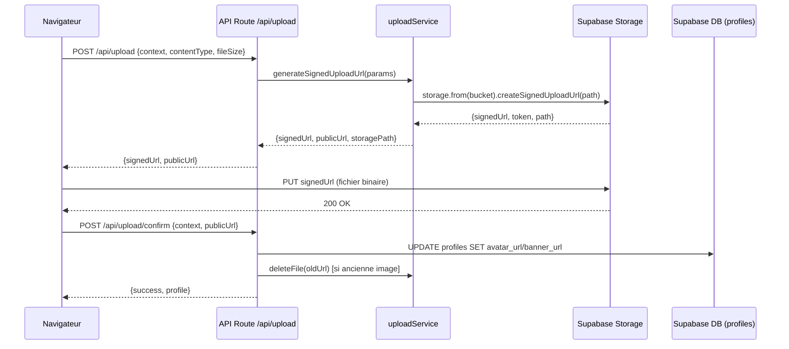

# Design : Migration vers Supabase Storage

## Overview

Ce design décrit la migration du système d'upload d'images depuis AWS S3 vers
Supabase Storage. Le système actuel repose sur un flux en 3 étapes : génération
d'une URL présignée S3, upload direct du navigateur vers S3, puis confirmation
côté serveur avec mise à jour du profil. Le nouveau système conserve ce même
flux mais remplace le backend S3 par Supabase Storage, avec deux buckets dédiés
(`avatars` et `banners`).

### Décisions clés

1. **Deux buckets séparés** plutôt qu'un bucket unique avec préfixes : simplifie
   les politiques RLS et l'organisation.
2. **URL signées Supabase** (`createSignedUploadUrl`) : remplacent les URL
   présignées S3, permettant l'upload direct depuis le navigateur.
3. **Client Supabase admin** (service role) côté serveur : nécessaire pour
   générer les URL signées et supprimer des fichiers sans contrainte RLS.
4. **Aucun changement d'interface utilisateur** : le composant `ImageUploader`
   et le flux UX restent identiques.
5. **Migration SQL** pour créer les buckets et les politiques RLS directement
   dans Supabase.

### Portée

- Remplacement de `uploadService.ts` (S3 → Supabase Storage)
- Adaptation de `uploadUtils.ts` (chemins et URLs Supabase)
- Adaptation des routes API (`/api/upload` et `/api/upload/confirm`)
- Adaptation du hook `useImageUpload` (upload via `fetch PUT` vers URL signée
  Supabase)
- Mise à jour des types (`s3Key` → `storagePath`)
- Migration SQL pour buckets + politiques RLS
- Suppression des packages `@aws-sdk/client-s3` et
  `@aws-sdk/s3-request-presigner`
- Mise à jour de tous les tests existants

## Architecture



### Différences avec le flux S3 actuel

| Aspect         | S3 (actuel)                                        | Supabase Storage (cible)                                                 |
| -------------- | -------------------------------------------------- | ------------------------------------------------------------------------ |
| Client serveur | `S3Client` (AWS SDK)                               | `createClient` (supabase-js, service role)                               |
| URL signée     | `getSignedUrl(PutObjectCommand)`                   | `storage.from(bucket).createSignedUploadUrl(path)`                       |
| URL publique   | `https://{bucket}.s3.{region}.amazonaws.com/{key}` | `https://{project}.supabase.co/storage/v1/object/public/{bucket}/{path}` |
| Suppression    | `DeleteObjectCommand`                              | `storage.from(bucket).remove([path])`                                    |
| Sécurité       | IAM credentials                                    | RLS policies + service role key                                          |

## Components and Interfaces

### 1. uploadService.ts (serveur)

Remplace le client S3 par un client Supabase admin (service role).

```typescript
// Nouveau client Supabase admin (lazy-initialized)
function getSupabaseAdmin(): SupabaseClient;

// Génère une URL signée pour upload direct
async function generateSignedUploadUrl(
  params: SignedUploadUrlParams
): Promise<SignedUploadUrlResult>;

// Supprime un fichier depuis son URL publique
async function deleteFile(fileUrl: string): Promise<void>;
```

Le client admin utilise `SUPABASE_SERVICE_ROLE_KEY` pour contourner les
politiques RLS lors de la génération d'URL signées et de la suppression de
fichiers.

### 2. uploadUtils.ts (utilitaires)

Adapte la génération de chemins et l'extraction d'URLs au format Supabase.

```typescript
// Génère un chemin de stockage : {userId}/{timestamp}-{randomId}.{extension}
function generateStoragePath(userId: string, extension: string): string;

// Résout le nom du bucket depuis le contexte
function getBucketName(context: UploadContext): string;

// Extrait le bucket et le chemin depuis une URL publique Supabase
function extractStoragePathFromUrl(
  url: string
): { bucket: string; path: string } | null;

// Inchangé
function getExtensionFromMimeType(mimeType: string): string;
```

### 3. Routes API

Les routes `/api/upload` et `/api/upload/confirm` conservent la même interface
HTTP. Seule l'implémentation interne change (appels à `uploadService` mis à
jour).

### 4. useImageUpload hook (client)

Le hook conserve la même interface publique. La méthode d'upload interne passe
de `uploadToS3` à `uploadToStorage`, utilisant `fetch PUT` vers l'URL signée
Supabase avec le header `Content-Type`.

### 5. ImageUploader composant

Aucune modification nécessaire. Le composant délègue entièrement au hook
`useImageUpload`.

### 6. Migration SQL

Fichier `supabase/migrations/YYYYMMDD000001_create_storage_buckets.sql` :

- Création des buckets `avatars` et `banners` (publics)
- Politiques RLS : SELECT public, INSERT authenticated, DELETE owner-only
- Contraintes MIME types et taille max

## Data Models

### Types modifiés

```typescript
// src/types/upload.ts

// Remplace PresignedUrlParams
interface SignedUploadUrlParams {
  context: UploadContext;
  userId: string;
  contentType: string;
  extension: string;
}

// Remplace PresignedUrlResult (s3Key → storagePath)
interface SignedUploadUrlResult {
  signedUrl: string;
  publicUrl: string;
  storagePath: string;
}

// Inchangés : UploadContext, AllowedMimeType, MAX_FILE_SIZE_BYTES,
// ALLOWED_CONTEXTS, ALLOWED_MIME_TYPES, CONTEXT_TO_PROFILE_FIELD,
// UploadRequest, UploadResponse, UploadConfirmRequest, UploadConfirmResponse
```

### Structure des buckets Supabase Storage

```
avatars/
  {userId}/
    {timestamp}-{randomId}.jpg
    {timestamp}-{randomId}.png

banners/
  {userId}/
    {timestamp}-{randomId}.webp
```

### URL publique Supabase Storage

Format :
`https://{SUPABASE_PROJECT_REF}.supabase.co/storage/v1/object/public/{bucket}/{path}`

Exemple :
`https://abc123.supabase.co/storage/v1/object/public/avatars/user-uuid/1700000000-abc123.webp`

### Variables d'environnement

**Ajoutées :**

- `SUPABASE_SERVICE_ROLE_KEY` — clé service role pour le client admin

**Supprimées :**

- `AWS_S3_ACCESS_KEY_ID`
- `AWS_S3_SECRET_ACCESS_KEY`
- `AWS_S3_BUCKET_NAME`
- `AWS_S3_REGION`

## Correctness Properties

_Une propriété est une caractéristique ou un comportement qui doit rester vrai
pour toutes les exécutions valides d'un système — essentiellement, une
déclaration formelle de ce que le système doit faire. Les propriétés servent de
pont entre les spécifications lisibles par l'humain et les garanties de
correction vérifiables par la machine._

### Property 1 : Pattern de chemin de stockage

_Pour tout_ userId valide (UUID) et toute extension d'image valide (jpg, png,
webp, gif), `generateStoragePath(userId, extension)` doit produire un chemin
correspondant au pattern `{userId}/{timestamp}-{randomId}.{extension}` où
timestamp est un entier positif et randomId est une chaîne alphanumérique.

**Validates: Requirements 1.3, 1.4, 6.1**

### Property 2 : Résolution du nom de bucket

_Pour tout_ `UploadContext` valide, `getBucketName(context)` doit retourner le
nom de bucket correspondant : `"avatars"` → `"avatars"`, `"banners"` →
`"banners"`.

**Validates: Requirements 2.2, 6.2**

### Property 3 : Validation des types MIME

_Pour toute_ chaîne de caractères, `isAllowedMimeType(s)` retourne `true` si et
seulement si `s` est l'un des quatre types autorisés (`image/jpeg`, `image/png`,
`image/webp`, `image/gif`).

**Validates: Requirements 3.3, 5.1, 10.4**

### Property 4 : Validation de la taille de fichier

_Pour tout_ entier positif `n`, `isValidFileSize(n)` retourne `true` si et
seulement si `0 < n <= 5_242_880` (5 Mo).

**Validates: Requirements 3.4, 10.5**

### Property 5 : Round-trip URL publique ↔ extraction

_Pour tout_ nom de bucket valide et tout chemin de stockage valide, construire
l'URL publique Supabase puis appeler `extractStoragePathFromUrl` sur cette URL
doit retourner le bucket et le chemin d'origine. Inversement, pour toute chaîne
ne correspondant pas au format Supabase Storage, `extractStoragePathFromUrl`
doit retourner `null`.

**Validates: Requirements 6.3, 6.4**

### Property 6 : Unicité des chemins générés

_Pour tout_ userId et extension, deux appels successifs à `generateStoragePath`
ne doivent jamais produire le même chemin (unicité garantie par le composant
timestamp + randomId).

**Validates: Requirements 1.3, 1.4**

## Error Handling

### uploadService.ts

| Erreur                             | Comportement                             |
| ---------------------------------- | ---------------------------------------- |
| `createSignedUploadUrl` échoue     | Propage l'erreur avec message descriptif |
| `remove` échoue                    | Propage l'erreur avec message descriptif |
| URL invalide passée à `deleteFile` | Log warning, retourne sans erreur        |

### Route API `/api/upload`

| Erreur                                         | Code HTTP | Message                           |
| ---------------------------------------------- | --------- | --------------------------------- |
| Utilisateur non authentifié                    | 401       | `Unauthorized`                    |
| Body JSON invalide                             | 400       | `Invalid request body`            |
| Validation Zod échoue (MIME, taille, contexte) | 400       | Message de l'issue Zod            |
| Génération URL signée échoue                   | 503       | `Service temporarily unavailable` |

### Route API `/api/upload/confirm`

| Erreur                            | Code HTTP | Comportement                                           |
| --------------------------------- | --------- | ------------------------------------------------------ |
| Utilisateur non authentifié       | 401       | `Unauthorized`                                         |
| Validation Zod échoue             | 400       | Message de l'issue Zod                                 |
| Mise à jour profil échoue         | 500       | Rollback : suppression du fichier uploadé, puis erreur |
| Rollback suppression échoue       | 500       | Log erreur rollback, retourne erreur originale         |
| Suppression ancienne image échoue | —         | Log erreur, réponse succès (fire-and-forget)           |

### Hook useImageUpload

| Erreur                     | État exposé                    |
| -------------------------- | ------------------------------ |
| Type MIME non autorisé     | `error: "invalidFormat"`       |
| Taille fichier dépassée    | `error: "fileTooLarge"`        |
| Requête URL signée échoue  | `error: "presignedFailed"`     |
| Upload vers Storage échoue | `error: "storageUploadFailed"` |
| Confirmation échoue        | `error: "confirmFailed"`       |

## Testing Strategy

### Approche duale

Le projet utilise une approche complémentaire :

- **Tests unitaires** (Vitest) : exemples spécifiques, cas d'erreur, intégration
  mockée
- **Tests de propriétés** (fast-check + Vitest) : propriétés universelles sur
  entrées générées

### Bibliothèque PBT

Le projet utilise déjà `fast-check` comme bibliothèque de property-based
testing. Chaque test de propriété doit exécuter au minimum 100 itérations.

### Emplacement des tests

Conformément aux règles du projet, tous les tests sont dans `test/` :

```
test/unit/lib/
├── services/
│   ├── uploadService.test.ts          # Tests unitaires (mocks Supabase)
│   └── uploadService.property.test.ts # Tests de propriétés
├── utils/
│   └── uploadUtils.test.ts            # Tests unitaires + propriétés
└── validations/
    └── uploadValidation.test.ts       # Tests unitaires (URLs Supabase)
```

### Convention de tag

Chaque test de propriété doit être annoté avec un commentaire référençant la
propriété du design :

```typescript
// Feature: supabase-storage-migration, Property 1: Storage path pattern
```

### Tests unitaires

- `uploadService.test.ts` : mock du client Supabase Storage, vérification des
  appels `createSignedUploadUrl`, `remove`, gestion d'erreurs
- `uploadUtils.test.ts` : `generateStoragePath`, `getBucketName`,
  `extractStoragePathFromUrl`, `getExtensionFromMimeType`
- `uploadValidation.test.ts` : schémas Zod avec URLs Supabase Storage

### Tests de propriétés

Chaque propriété du design (P1–P6) est implémentée par un SEUL test de propriété
dans `uploadService.property.test.ts` ou `uploadUtils.test.ts` selon le module
testé :

- **P1** : Générateur `fc.uuid()` × `fc.constantFrom("jpg","png","webp","gif")`
  → vérification regex du pattern
- **P2** : Générateur `fc.constantFrom("avatars","banners")` → vérification
  mapping
- **P3** : Générateur `fc.string()` → `isAllowedMimeType` retourne true ssi dans
  la liste
- **P4** : Générateur `fc.integer()` → `isValidFileSize` retourne true ssi dans
  (0, 5_242_880]
- **P5** : Générateur bucket × path → round-trip construction/extraction
- **P6** : Générateur userId × extension → deux appels consécutifs produisent
  des chemins différents
