# Document de conception — Administration des classifications d'âge

## Vue d'ensemble

Cette fonctionnalité ajoute une section d'administration complète pour gérer les
classifications d'âge des jeux vidéo. Elle suit le pattern CRUD admin existant
du projet (langues, genres, entreprises) et s'organise autour de trois entités
hiérarchiques :

1. **Systèmes de classification** (PEGI, ESRB, CERO, USK…) — entité racine
2. **Notes** (PEGI 3, ESRB E…) — enfants d'un système
3. **Descripteurs de contenu** (Violence, Langage…) — enfants d'un système, avec
   traductions multilingues

La page principale affiche les systèmes de classification sous forme de tableau
avec recherche, tri et pagination. Chaque système donne accès à ses notes et
descripteurs via des onglets dans le formulaire d'édition ou via une page
dédiée.

## Architecture

```mermaid
graph TD
    subgraph Pages["Pages Next.js"]
        LP["/admin/age-classifications<br/>Liste des systèmes"]
        NP["/admin/age-classifications/new<br/>Créer un système"]
        EP["/admin/age-classifications/[id]/edit<br/>Éditer un système"]
    end

    subgraph API["Routes API"]
        AS["/api/admin/age-classifications<br/>GET (liste) / POST (créer)"]
        ASI["/api/admin/age-classifications/[id]<br/>GET / PUT / DELETE"]
        AR["/api/admin/age-classifications/[id]/ratings<br/>GET / POST"]
        ARI["/api/admin/age-classifications/[id]/ratings/[ratingId]<br/>GET / PUT / DELETE"]
        AD["/api/admin/age-classifications/[id]/descriptors<br/>GET / POST"]
        ADI["/api/admin/age-classifications/[id]/descriptors/[descriptorId]<br/>GET / PUT / DELETE"]
    end

    subgraph Components["Composants"]
        RT["RatingSystemsTable"]
        RSF["RatingSystemForm"]
        DRS["DeleteRatingSystemDialog"]
        RaT["RatingsTable"]
        RF["RatingForm"]
        DR["DeleteRatingDialog"]
        DT["DescriptorsTable"]
        DF["DescriptorForm"]
        DD["DeleteDescriptorDialog"]
    end

    LP --> AS
    NP --> AS
    EP --> ASI
    EP --> AR
    EP --> AD

    LP --> RT
    NP --> RSF
    EP --> RSF
    EP --> RaT
    EP --> DT
```



```

## Composants et interfaces

### Structure des fichiers

```

src/components/admin/age-classifications/ ├── RatingSystemsTable.tsx # Tableau
des systèmes (recherche, tri, pagination) ├── RatingSystemForm.tsx # Formulaire
création/édition d'un système ├── DeleteRatingSystemDialog.tsx # Dialogue de
confirmation suppression système ├── RatingsTable.tsx # Tableau des notes d'un
système ├── RatingForm.tsx # Formulaire création/édition d'une note ├──
DeleteRatingDialog.tsx # Dialogue de confirmation suppression note ├──
DescriptorsTable.tsx # Tableau des descripteurs d'un système ├──
DescriptorForm.tsx # Formulaire création/édition d'un descripteur ├──
DescriptorFormTranslations.tsx # Section traductions du formulaire descripteur
└── DeleteDescriptorDialog.tsx # Dialogue de confirmation suppression
descripteur

src/app/[locale]/admin/age-classifications/ ├── page.tsx # Page liste des
systèmes ├── new/page.tsx # Page création système └── [id]/edit/page.tsx # Page
édition système (avec onglets notes/descripteurs)

src/app/api/admin/age-classifications/ ├── route.ts # GET (liste systèmes), POST
(créer système) └── [id]/ ├── route.ts # GET, PUT, DELETE système ├── ratings/ │
├── route.ts # GET (liste notes), POST (créer note) │ └── [ratingId]/route.ts #
GET, PUT, DELETE note └── descriptors/ ├── route.ts # GET (liste descripteurs),
POST (créer descripteur) └── [descriptorId]/route.ts # GET, PUT, DELETE
descripteur

src/hooks/ ├── useAdminRatingSystems.ts # Hook fetch/pagination systèmes ├──
useRatingSystemForm.ts # Hook formulaire système ├── useAdminRatings.ts # Hook
fetch/pagination notes ├── useRatingForm.ts # Hook formulaire note ├──
useAdminDescriptors.ts # Hook fetch/pagination descripteurs └──
useDescriptorForm.ts # Hook formulaire descripteur

src/types/ └── admin-age-classifications.ts # Types partagés

src/lib/validations/ ├── admin-rating-system-form.ts # Schéma Zod système ├──
admin-rating-form.ts # Schéma Zod note └── admin-descriptor-form.ts # Schéma Zod
descripteur

````

### Composants principaux

**RatingSystemsTable** — Suit le pattern `AdminLanguagesTable` :
- Props : `systems`, `pagination`, `onPageChange`, `onSearch`, `onSort`, `onEdit`, `onDelete`, `isLoading`, `currentSort`, `currentSearch`
- Colonnes : Code, Nom, Pays, Site web, Actions (éditer/supprimer)
- Recherche par code ou nom, tri par code ou nom

**RatingSystemForm** — Suit le pattern `LanguageForm` :
- Champs : `code` (VARCHAR 10, unique), `name` (VARCHAR 100), `description` (TEXT, optionnel), `country_codes` (tableau de codes pays), `website_url` (URL, optionnel)
- Mode création : tous les champs éditables
- Mode édition : code en lecture seule

**RatingsTable** — Tableau des notes dans la page d'édition d'un système :
- Colonnes : Code, Nom d'affichage, Âge minimum, Couleur, Ordre de tri, Actions
- Recherche par code ou nom d'affichage

**RatingForm** — Formulaire modal ou inline pour une note :
- Champs : `code` (VARCHAR 10), `display_name` (VARCHAR 50), `minimum_age` (INTEGER ≥ 0), `color_hex` (VARCHAR 7, optionnel), `icon_url` (URL, optionnel), `description` (TEXT, optionnel), `sort_order` (INTEGER)

**DescriptorsTable** — Tableau des descripteurs dans la page d'édition d'un système :
- Colonnes : Code, Nom (locale courante), Actions
- Recherche par code ou nom traduit

**DescriptorForm** — Formulaire pour un descripteur avec traductions :
- Champs : `code` (VARCHAR 30), `icon_url` (URL, optionnel)
- Section traductions : nom et description pour chaque langue supportée (suit le pattern `GenreFormTranslations`)

### Navigation dans la sidebar

Ajout d'un lien « Classifications d'âge » dans la catégorie « Jeux » du `AdminSidebar`, après « Langues », avec l'icône `FaShieldAlt` de react-icons.

## Modèles de données

Les tables existent déjà en base. Aucune migration n'est nécessaire.

### Types TypeScript

```typescript
// src/types/admin-age-classifications.ts

export interface AdminRatingSystem {
  id: string;
  code: string;
  name: string;
  description: string | null;
  country_codes: string[];
  website_url: string | null;
  ratingsCount: number;
  descriptorsCount: number;
}

export interface AdminRating {
  id: string;
  rating_system_id: string;
  code: string;
  display_name: string;
  minimum_age: number;
  color_hex: string | null;
  icon_url: string | null;
  description: string | null;
  sort_order: number;
  gameCount: number;
}

export interface AdminContentDescriptor {
  id: string;
  rating_system_id: string;
  code: string;
  icon_url: string | null;
  translations: ContentDescriptorTranslation[];
  gameCount: number;
}

export interface ContentDescriptorTranslation {
  language_code: string;
  name: string;
  description: string;
}

export interface FetchRatingSystemsParams {
  page?: number;
  limit?: number;
  search?: string;
  sortBy?: string;
  sortOrder?: "asc" | "desc";
}

export interface FetchRatingsParams {
  ratingSystemId: string;
  page?: number;
  limit?: number;
  search?: string;
  sortBy?: string;
  sortOrder?: "asc" | "desc";
}

export interface FetchDescriptorsParams {
  ratingSystemId: string;
  page?: number;
  limit?: number;
  search?: string;
  locale?: string;
}
````

### Schémas de validation Zod

```typescript
// src/lib/validations/admin-rating-system-form.ts
export const adminRatingSystemFormSchema = z.object({
  code: z
    .string()
    .min(1)
    .max(10)
    .regex(/^[A-Z][A-Z0-9_]*$/),
  name: z.string().min(1).max(100),
  description: z.string().max(500).optional().or(z.literal("")),
  country_codes: z.array(z.string().length(2)).default([]),
  website_url: z.string().url().optional().or(z.literal("")),
});

// src/lib/validations/admin-rating-form.ts
export const adminRatingFormSchema = z.object({
  code: z.string().min(1).max(10),
  display_name: z.string().min(1).max(50),
  minimum_age: z.coerce.number().int().min(0),
  color_hex: z
    .string()
    .regex(/^#[0-9A-Fa-f]{6}$/)
    .optional()
    .or(z.literal("")),
  icon_url: z.string().url().optional().or(z.literal("")),
  description: z.string().max(500).optional().or(z.literal("")),
  sort_order: z.coerce.number().int().min(0).default(0),
});

// src/lib/validations/admin-descriptor-form.ts
export const descriptorTranslationSchema = z.object({
  language_code: z.string().min(1),
  name: z.string().min(1).max(100),
  description: z.string().max(500).optional().or(z.literal("")),
});

export const adminDescriptorFormSchema = z.object({
  code: z.string().min(1).max(30),
  icon_url: z.string().url().optional().or(z.literal("")),
  translations: z.array(descriptorTranslationSchema).min(1),
});
```

### Routes API — Résumé

| Route                                                            | Méthode | Description                |
| ---------------------------------------------------------------- | ------- | -------------------------- |
| `/api/admin/age-classifications`                                 | GET     | Liste paginée des systèmes |
| `/api/admin/age-classifications`                                 | POST    | Créer un système           |
| `/api/admin/age-classifications/[id]`                            | GET     | Détail d'un système        |
| `/api/admin/age-classifications/[id]`                            | PUT     | Modifier un système        |
| `/api/admin/age-classifications/[id]`                            | DELETE  | Supprimer un système       |
| `/api/admin/age-classifications/[id]/ratings`                    | GET     | Liste des notes du système |
| `/api/admin/age-classifications/[id]/ratings`                    | POST    | Créer une note             |
| `/api/admin/age-classifications/[id]/ratings/[ratingId]`         | GET     | Détail d'une note          |
| `/api/admin/age-classifications/[id]/ratings/[ratingId]`         | PUT     | Modifier une note          |
| `/api/admin/age-classifications/[id]/ratings/[ratingId]`         | DELETE  | Supprimer une note         |
| `/api/admin/age-classifications/[id]/descriptors`                | GET     | Liste des descripteurs     |
| `/api/admin/age-classifications/[id]/descriptors`                | POST    | Créer un descripteur       |
| `/api/admin/age-classifications/[id]/descriptors/[descriptorId]` | GET     | Détail d'un descripteur    |
| `/api/admin/age-classifications/[id]/descriptors/[descriptorId]` | PUT     | Modifier un descripteur    |
| `/api/admin/age-classifications/[id]/descriptors/[descriptorId]` | DELETE  | Supprimer un descripteur   |

Chaque route suit le pattern existant :

- `requireAdmin()` en début de handler
- Validation Zod des paramètres de requête et du body
- `createRouteHandlerClient()` pour l'accès Supabase
- Codes de retour : 200/201 (succès), 400 (validation), 403 (non-admin), 404
  (introuvable), 409 (conflit/en usage), 500 (erreur serveur)

## Propriétés de correction

_Une propriété est une caractéristique ou un comportement qui doit rester vrai
pour toutes les exécutions valides d'un système — essentiellement, une
déclaration formelle de ce que le système doit faire. Les propriétés servent de
pont entre les spécifications lisibles par l'humain et les garanties de
correction vérifiables par la machine._

### Propriété 1 : Aller-retour création/lecture d'un système de classification

_Pour tout_ système de classification valide (code unique, nom non vide), le
créer via POST puis le lire via GET doit retourner un objet équivalent aux
données soumises.

**Valide : Exigences 3.1, 4.2**

### Propriété 2 : Aller-retour création/lecture d'une note

_Pour toute_ note valide (code unique dans le système, nom d'affichage non vide,
âge minimum ≥ 0), la créer via POST puis la lire via GET doit retourner un objet
équivalent aux données soumises.

**Valide : Exigences 7.1, 8.2**

### Propriété 3 : Aller-retour création/lecture d'un descripteur avec traductions

_Pour tout_ descripteur valide (code unique dans le système) avec au moins une
traduction, le créer via POST puis le lire via GET doit retourner un objet avec
le même code et les mêmes traductions.

**Valide : Exigences 11.1, 11.3, 12.2**

### Propriété 4 : Rejet des doublons de code (contrainte d'unicité)

_Pour tout_ type d'entité (système, note, descripteur), tenter de créer une
entité avec un code déjà existant dans le même périmètre doit retourner une
erreur 409.

**Valide : Exigences 3.2, 7.2, 11.2, 14.4**

### Propriété 5 : Rejet des données invalides (validation Zod)

_Pour toute_ requête API avec des données ne respectant pas le schéma Zod
(champs obligatoires manquants, types incorrects, âge minimum négatif), le
système doit retourner une erreur 400 avec le détail des erreurs.

**Valide : Exigences 3.3, 7.3, 14.1**

### Propriété 6 : Filtrage par recherche des systèmes

_Pour tout_ terme de recherche et tout ensemble de systèmes en base, tous les
systèmes retournés doivent avoir un code ou un nom contenant le terme de
recherche (insensible à la casse).

**Valide : Exigence 2.2**

### Propriété 7 : Tri des systèmes

_Pour tout_ champ de tri valide (code, nom) et tout ordre (asc, desc), la liste
retournée doit être triée selon le champ et l'ordre spécifiés.

**Valide : Exigence 2.3**

### Propriété 8 : Cohérence de la pagination

_Pour tout_ ensemble de systèmes en base et toute taille de page, les
métadonnées de pagination (totalCount, totalPages, hasNextPage, hasPreviousPage)
doivent être cohérentes avec le nombre total d'éléments et la page courante.

**Valide : Exigence 2.4**

### Propriété 9 : Suppression conditionnelle d'un système

_Pour tout_ système de classification, la suppression doit réussir uniquement si
le système n'a ni notes ni descripteurs associés. Si des enfants existent, la
suppression doit retourner une erreur 409.

**Valide : Exigences 5.2, 5.3**

### Propriété 10 : Suppression conditionnelle d'une note

_Pour toute_ note, la suppression doit réussir uniquement si la note n'est pas
associée à des jeux via `game_ratings`. Si des associations existent, la
suppression doit retourner une erreur 409.

**Valide : Exigences 9.2, 9.3**

### Propriété 11 : Suppression conditionnelle d'un descripteur

_Pour tout_ descripteur, la suppression doit réussir uniquement si le
descripteur n'est pas associé à des jeux via `game_rating_descriptors`. Si des
associations existent, la suppression doit retourner une erreur 409.

**Valide : Exigences 13.2, 13.3**

### Propriété 12 : Accès refusé pour les non-admins

_Pour toute_ route API de cette fonctionnalité, une requête sans
authentification admin doit retourner une erreur 403.

**Valide : Exigences 1.2, 14.2**

### Propriété 13 : Erreur 404 pour ressource inexistante

_Pour tout_ identifiant ne correspondant à aucune ressource existante, les
opérations GET, PUT et DELETE doivent retourner une erreur 404.

**Valide : Exigences 4.3, 14.3**

### Propriété 14 : Filtrage par recherche des notes

_Pour tout_ terme de recherche et tout ensemble de notes d'un système, toutes
les notes retournées doivent avoir un code ou un nom d'affichage contenant le
terme de recherche.

**Valide : Exigence 6.2**

### Propriété 15 : Filtrage par recherche des descripteurs

_Pour tout_ terme de recherche et tout ensemble de descripteurs d'un système,
tous les descripteurs retournés doivent avoir un code ou un nom traduit
contenant le terme de recherche.

**Valide : Exigence 10.2**

## Gestion des erreurs

| Situation                    | Code HTTP | Comportement                                                           |
| ---------------------------- | --------- | ---------------------------------------------------------------------- |
| Données invalides (Zod)      | 400       | Retourne `{ error, details: ZodIssue[] }`                              |
| Non authentifié admin        | 403       | Retourne `{ error: "Admin access required" }`                          |
| Ressource introuvable        | 404       | Retourne `{ error: "[Entity] not found" }`                             |
| Doublon (contrainte unique)  | 409       | Retourne `{ error: "[Entity] already exists" }`                        |
| Suppression avec dépendances | 409       | Retourne `{ error: "[Entity] is in use", type: "IN_USE", usageCount }` |
| Erreur serveur               | 500       | Retourne `{ error: "Internal server error" }`, log côté serveur        |

Côté client :

- Les erreurs API sont interceptées dans les hooks de formulaire et affichées
  via toast
- Les erreurs de validation Zod côté client sont affichées inline sur les champs
  du formulaire
- Les erreurs réseau sont capturées avec un message générique

## Stratégie de tests

### Tests unitaires

- Validation Zod des schémas (cas limites : code vide, âge négatif, URL
  invalide, code trop long)
- Logique de transformation des données API (mapping des réponses Supabase vers
  les types TypeScript)
- Logique de pagination (calcul totalPages, hasNextPage, hasPreviousPage)

### Tests property-based

Bibliothèque : **fast-check** (déjà utilisée dans le projet) Framework : **Bun
test runner** (pas Vitest) Minimum : 100 itérations par propriété

Chaque test property-based doit être annoté avec un commentaire référençant la
propriété du design :

```
// Feature: admin-age-classification, Property N: [titre de la propriété]
```

Les propriétés 1-3 (aller-retour) valident la cohérence des opérations CRUD. Les
propriétés 4-5 valident le rejet des entrées invalides. Les propriétés 6-8,
14-15 valident la recherche, le tri et la pagination. Les propriétés 9-11
valident la logique de suppression conditionnelle. Les propriétés 12-13 valident
la sécurité et la gestion des erreurs.

### Emplacement des tests

```
test/
├── unit/
│   └── lib/
│       └── validations/
│           ├── admin-rating-system-form.test.ts
│           ├── admin-rating-form.test.ts
│           └── admin-descriptor-form.test.ts
│       └── services/
│           └── admin-age-classifications.test.ts  # Logique de transformation
├── property/
│   └── admin-age-classifications.property.test.ts  # Tests property-based
```

Les tests property-based se concentrent sur les schémas de validation Zod
(propriétés 4, 5) et la logique de transformation/filtrage/tri/pagination
(propriétés 6, 7, 8, 14, 15). Les propriétés impliquant des appels Supabase
(1-3, 9-13) sont mieux couvertes par des tests d'intégration avec mocks.
