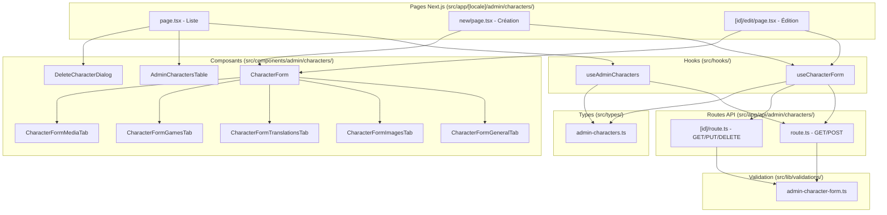

# Document de Design : Gestion Admin des Personnages

## Vue d'ensemble

Cette fonctionnalité ajoute une section CRUD complète pour les personnages dans
le panneau d'administration existant. L'architecture suit exactement le même
modèle que la gestion des jeux (`admin/games`), en réutilisant les patterns
établis : pages Next.js avec hooks custom, composants de formulaire
multi-onglets, routes API sécurisées avec validation Zod, et types centralisés.

Le schéma de base de données pour les personnages existe déjà (tables
`characters`, `character_translations`, `character_games`, `character_media`).
Cette fonctionnalité se concentre sur la couche d'administration (UI + API).

## Architecture



## Composants et Interfaces

### Pages

| Page     | Chemin                                                 | Rôle                                                      |
| -------- | ------------------------------------------------------ | --------------------------------------------------------- |
| Liste    | `src/app/[locale]/admin/characters/page.tsx`           | Affiche le tableau paginé, gère recherche/tri/suppression |
| Création | `src/app/[locale]/admin/characters/new/page.tsx`       | Formulaire de création avec redirection après succès      |
| Édition  | `src/app/[locale]/admin/characters/[id]/edit/page.tsx` | Charge les données existantes, formulaire de modification |

### Composants UI

| Composant                      | Fichier                                                            | Responsabilité                                   |
| ------------------------------ | ------------------------------------------------------------------ | ------------------------------------------------ |
| `AdminCharactersTable`         | `src/components/admin/characters/AdminCharactersTable.tsx`         | Tableau avec recherche, tri, pagination, actions |
| `DeleteCharacterDialog`        | `src/components/admin/characters/DeleteCharacterDialog.tsx`        | Dialogue de confirmation de suppression          |
| `CharacterForm`                | `src/components/admin/characters/CharacterForm.tsx`                | Orchestrateur du formulaire multi-onglets        |
| `CharacterFormGeneralTab`      | `src/components/admin/characters/CharacterFormGeneralTab.tsx`      | Slug, couleur de fond                            |
| `CharacterFormImagesTab`       | `src/components/admin/characters/CharacterFormImagesTab.tsx`       | Image principale, image de fond                  |
| `CharacterFormTranslationsTab` | `src/components/admin/characters/CharacterFormTranslationsTab.tsx` | Nom, rôle, description, biographie par langue    |
| `CharacterFormGamesTab`        | `src/components/admin/characters/CharacterFormGamesTab.tsx`        | Sélection des jeux associés avec jeu principal   |
| `CharacterFormMediaTab`        | `src/components/admin/characters/CharacterFormMediaTab.tsx`        | Screenshots, artwork, vidéos                     |

### Hooks

| Hook                 | Fichier                           | Responsabilité                                                                    |
| -------------------- | --------------------------------- | --------------------------------------------------------------------------------- |
| `useAdminCharacters` | `src/hooks/useAdminCharacters.ts` | Fetch liste paginée, suppression, refetch                                         |
| `useCharacterForm`   | `src/hooks/useCharacterForm.ts`   | Gestion du formulaire (react-hook-form + Zod), chargement des options, soumission |

### Routes API

| Route                        | Méthode | Responsabilité                          |
| ---------------------------- | ------- | --------------------------------------- |
| `/api/admin/characters`      | GET     | Liste paginée avec recherche/tri/locale |
| `/api/admin/characters`      | POST    | Création d'un personnage avec relations |
| `/api/admin/characters/[id]` | GET     | Détails d'un personnage pour édition    |
| `/api/admin/characters/[id]` | PUT     | Mise à jour complète d'un personnage    |
| `/api/admin/characters/[id]` | DELETE  | Suppression d'un personnage             |

### Interfaces clés

```typescript
// src/types/admin-characters.ts

interface AdminCharacter {
  id: string;
  slug: string;
  name: string;
  role: string | null;
  mainImage: string | null;
  primaryGame: string;
  updatedAt: string;
}

interface FetchCharactersParams {
  page?: number;
  limit?: number;
  search?: string;
  sortBy?: string;
  sortOrder?: "asc" | "desc";
}

interface CharacterFormTabProps {
  form: UseFormReturn<AdminCharacterFormData>;
  t: (key: string) => string;
}

type CharacterTabId = "general" | "images" | "translations" | "games" | "media";
```

```typescript
// src/lib/validations/admin-character-form.ts

const adminCharacterFormSchema = z.object({
  slug: z
    .string()
    .min(1)
    .max(255)
    .regex(/^[a-z0-9-]+$/),
  background_color: z
    .string()
    .regex(/^#[0-9a-fA-F]{6}$/)
    .or(z.literal(""))
    .optional(),
  main_image_url: z.string().url().or(z.literal("")).optional(),
  background_image_url: z.string().url().or(z.literal("")).optional(),
  translations: z
    .array(
      z.object({
        language_code: z.string().length(2),
        name: z.string().max(255).optional().or(z.literal("")),
        role: z.string().max(100).optional().or(z.literal("")),
        description: z.string().max(5000).optional().or(z.literal("")),
        biography: z.string().max(10000).optional().or(z.literal("")),
      })
    )
    .min(1)
    .refine(
      (t) => t.some((tr) => (tr.name ?? "").trim().length > 0),
      "Au moins une traduction doit avoir un nom"
    ),
  games: z
    .array(
      z.object({
        game_id: z.string().uuid(),
        is_primary: z.boolean(),
      })
    )
    .default([]),
  media: z
    .array(
      z.object({
        type: z.enum(["screenshot", "artwork", "video"]),
        url: z.string().url(),
        thumbnail_url: z.string().url().or(z.literal("")).optional(),
        title: z.string().max(255).optional().or(z.literal("")),
        description: z.string().max(500).optional().or(z.literal("")),
        alt_text: z.string().max(255).optional().or(z.literal("")),
        is_featured: z.boolean().default(false),
        display_order: z.number().int().min(0).optional(),
      })
    )
    .default([]),
});
```

## Modèles de données

### Tables existantes (déjà en base)

Les tables suivantes existent déjà via la migration
`20240112000001_character_schema.sql` :

| Table                    | Colonnes clés                                                                                    | Rôle                   |
| ------------------------ | ------------------------------------------------------------------------------------------------ | ---------------------- |
| `characters`             | id, slug, main_image, background_image, background_color, created_at, updated_at                 | Table principale       |
| `character_translations` | character_id, language_code, name, role, description, biography                                  | Traductions FR/EN      |
| `character_games`        | character_id, game_id, is_primary                                                                | Liaison personnage-jeu |
| `character_media`        | character_id, type, url, thumbnail_url, title, description, alt_text, is_featured, display_order | Médias associés        |

### Payload API (création/modification)

```typescript
interface CharacterPayload {
  character: {
    slug: string;
    main_image: string | null;
    background_image: string | null;
    background_color: string | null;
  };
  translations: Array<{
    language_code: string;
    name: string;
    role: string | null;
    description: string | null;
    biography: string | null;
  }>;
  games: Array<{
    game_id: string;
    is_primary: boolean;
  }>;
  media: Array<{
    type: "screenshot" | "artwork" | "video";
    url: string;
    thumbnail_url: string | null;
    title: string | null;
    description: string | null;
    alt_text: string | null;
    is_featured: boolean;
    display_order: number;
  }>;
}
```

### Réponse API (liste)

```typescript
interface CharacterListResponse {
  characters: AdminCharacter[];
  pagination: {
    currentPage: number;
    totalPages: number;
    totalCount: number;
    limit: number;
    hasNextPage: boolean;
    hasPreviousPage: boolean;
  };
}
```

## Propriétés de Correction

_Une propriété est une caractéristique ou un comportement qui doit rester vrai
pour toutes les exécutions valides d'un système — essentiellement, une
déclaration formelle de ce que le système doit faire. Les propriétés servent de
pont entre les spécifications lisibles par l'humain et les garanties de
correction vérifiables par la machine._

### Property 1 : Validation du slug

_Pour tout_ slug composé uniquement de lettres minuscules, chiffres et tirets,
d'une longueur entre 1 et 255 caractères, le schéma de validation DOIT
l'accepter. _Pour toute_ chaîne contenant des caractères majuscules, des
espaces, des caractères spéciaux, ou d'une longueur de 0 ou supérieure à 255, le
schéma DOIT la rejeter.

**Validates: Requirements 5.1**

### Property 2 : Validation du nom de traduction

_Pour tout_ tableau de traductions où tous les champs `name` sont vides ou
composés uniquement d'espaces, le schéma de validation DOIT rejeter les données.
_Pour tout_ tableau contenant au moins une traduction avec un `name` non vide
(après trim), le schéma DOIT accepter les données (si les autres champs sont
valides).

**Validates: Requirements 5.2, 2.4**

### Property 3 : Round-trip sérialisation formulaire ↔ payload API

_Pour toute_ donnée de formulaire valide (`AdminCharacterFormData`), la
conversion en payload API (`CharacterPayload`) puis la reconversion en données
de formulaire DOIT produire des données équivalentes aux données d'origine.

**Validates: Requirements 5.5**

### Property 4 : Filtrage par recherche

_Pour tout_ ensemble de personnages et tout terme de recherche non vide, tous
les personnages retournés par le filtre de recherche DOIVENT avoir un nom
contenant le terme recherché (insensible à la casse). Aucun personnage dont le
nom contient le terme ne DOIT être exclu des résultats.

**Validates: Requirements 1.2**

### Property 5 : Validation des URLs et couleurs

_Pour toute_ URL valide (commençant par `http://` ou `https://`), les champs
`main_image_url` et `background_image_url` DOIVENT être acceptés par le schéma.
_Pour toute_ chaîne qui n'est ni une URL valide ni une chaîne vide, le schéma
DOIT la rejeter. De même, _pour tout_ code hexadécimal de 7 caractères (format
`#XXXXXX`), le champ `background_color` DOIT être accepté, et _pour toute_
chaîne ne respectant pas ce format (sauf chaîne vide), le schéma DOIT la
rejeter.

**Validates: Requirements 5.3, 5.4**

### Property 6 : Rejet des requêtes non authentifiées

_Pour toute_ requête API vers les endpoints d'administration des personnages
sans authentification admin valide, le système DOIT retourner un statut
HTTP 403.

**Validates: Requirements 7.5**

## Gestion des erreurs

| Scénario                                     | Comportement attendu                                                            |
| -------------------------------------------- | ------------------------------------------------------------------------------- |
| Slug en doublon (création/modification)      | Erreur 400 avec message "slug already exists", toast d'erreur côté client       |
| Données de formulaire invalides              | Erreur 400 avec détails de validation Zod, affichage des erreurs sur les champs |
| Personnage introuvable (édition/suppression) | Erreur 404, redirection vers la liste                                           |
| Échec de connexion Supabase                  | Erreur 500, toast d'erreur générique côté client                                |
| Requête sans authentification admin          | Erreur 403 "Admin access required"                                              |
| Échec de suppression (contrainte FK)         | Erreur 500, toast d'erreur, personnage conservé dans la liste                   |

Les erreurs côté client sont affichées via le système de toast existant
(`useToast`). Les erreurs de validation du formulaire sont affichées inline sur
les champs concernés via `react-hook-form`.

## Stratégie de test

### Approche duale

Les tests combinent tests unitaires (exemples spécifiques, cas limites) et tests
property-based (propriétés universelles sur des entrées générées).

### Tests unitaires

Placés dans `test/unit/lib/validations/` et `test/isolated/api/` selon les
conventions du projet :

- Validation du schéma Zod : cas valides, cas invalides, cas limites (slug vide,
  slug trop long, caractères spéciaux)
- Sérialisation du payload : conversion formulaire → API et retour
- Composants : rendu du tableau, dialogue de suppression

### Tests property-based

Bibliothèque : `fast-check` (déjà installée dans le projet) Framework de test :
`bun:test` (pas Vitest) Fichiers : `*.property.test.ts` dans
`test/unit/lib/validations/` Minimum 100 itérations par propriété.

Chaque test property-based référence sa propriété du design :

- **Feature: admin-character-management, Property 1: Slug validation** →
  `admin-character-form.property.test.ts`
- **Feature: admin-character-management, Property 2: Translation name
  validation** → `admin-character-form.property.test.ts`
- **Feature: admin-character-management, Property 3: Round-trip serialization**
  → `admin-character-form.property.test.ts`
- **Feature: admin-character-management, Property 4: Search filter** →
  `admin-character-search.property.test.ts`
- **Feature: admin-character-management, Property 5: URL and color validation**
  → `admin-character-form.property.test.ts`
- **Feature: admin-character-management, Property 6: Auth rejection** → placé
  dans `test/isolated/api/` car nécessite du mocking de modules

### Structure des fichiers de test

```
test/
├── unit/
│   └── lib/
│       └── validations/
│           ├── admin-character-form.test.ts
│           └── admin-character-form.property.test.ts
├── isolated/
│   └── api/
│       └── admin-characters.test.ts
```
