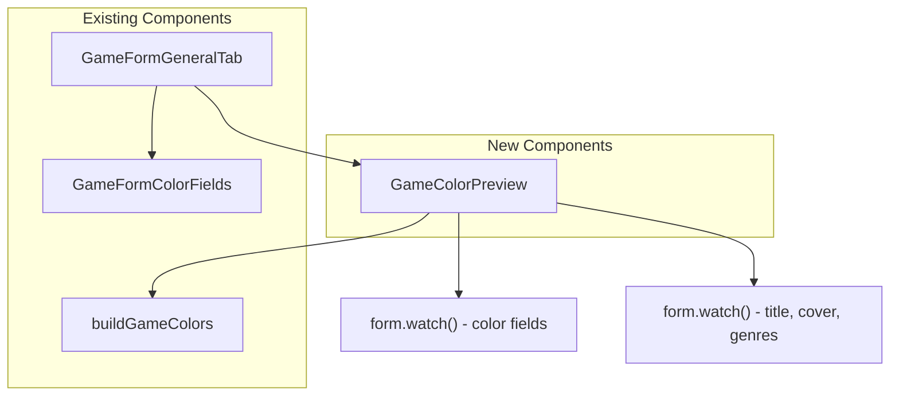

# Design Document: Admin Game Color Preview

## Overview

Cette fonctionnalité ajoute un composant d'aperçu visuel en temps réel dans
l'onglet "Général" du formulaire d'édition de jeu admin. Le composant
`GameColorPreview` simule le rendu de la page détail publique en utilisant les
couleurs actuellement saisies dans le formulaire, permettant aux administrateurs
de visualiser immédiatement l'impact de leurs choix de couleurs.

L'approche consiste à créer un composant React autonome qui :

1. Observe les valeurs des champs couleur via `react-hook-form` `watch()`
2. Passe ces valeurs à `buildGameColors()` pour obtenir un objet `GameColors`
3. Rend un aperçu miniature fidèle au style de la page détail publique

Aucune modification de base de données n'est nécessaire — cette fonctionnalité
est purement front-end.

## Architecture



Le composant `GameColorPreview` est intégré dans `GameFormGeneralTab`,
positionné juste après `GameFormColorFields`. Il lit les valeurs du formulaire
via `form.watch()` et utilise `buildGameColors()` pour dériver les couleurs,
exactement comme le fait `GameDetailsContent` côté public.

### Décision de design : composant autonome vs réutilisation des composants publics

Réutiliser directement `GameHeroSection` ou `GameOverviewSection` nécessiterait
de construire un objet `GameDetails` complet avec de nombreux champs
obligatoires non pertinents. Un composant d'aperçu dédié et simplifié est
préférable car :

- Il ne dépend que des données disponibles dans le formulaire
- Il reste léger et rapide à rendre
- Il reproduit fidèlement les patterns visuels sans la complexité des composants
  publics

## Components and Interfaces

### GameColorPreview

Nouveau composant : `src/components/admin/games/GameColorPreview.tsx`

```typescript
interface GameColorPreviewProps {
  form: UseFormReturn<AdminGameFormData>;
  genres: AdminGenre[];
  t: (key: string) => string;
}
```

Ce composant :

- Accepte le `form` pour observer les champs via `watch()`
- Accepte `genres` pour résoudre les noms de genres à partir des IDs
  sélectionnés
- Accepte `t` pour les traductions des labels

Valeurs observées du formulaire :

- `background_color`, `accent_color`, `label_color`, `text_color` → passées à
  `buildGameColors()`
- `translations.0.title` → titre affiché dans l'aperçu
- `cover_image_url` → image de couverture dans l'aperçu
- `genres` → badges de genres dans l'aperçu

### Modifications aux composants existants

**GameFormGeneralTab** (`src/components/admin/games/GameFormGeneralTab.tsx`) :

- Ajout de la prop `genres: AdminGenre[]`
- Rendu de `<GameColorPreview>` après `<GameFormColorFields>`

**GameForm** (`src/components/admin/games/GameForm.tsx`) :

- Passage de `genres` à `GameFormGeneralTab`

### Structure du rendu de l'aperçu

L'aperçu reproduit une version miniature de la page détail avec :

1. **Zone hero** : fond avec `backgroundColor`, gradient overlay, image de
   couverture (si disponible), titre en `textColor`, badges de genres
2. **Cartes overview** : 2-3 cartes simulées avec bordure `border-slate-700`,
   fond `bg-slate-800/50`, icônes en `accent`, labels en `labelColor`, texte en
   `textColor`
3. **Éléments accent** : boutons/badges utilisant la couleur `accent`

```
┌─────────────────────────────────────────┐
│  [backgroundColor + gradient]           │
│  ┌──────┐                               │
│  │cover │  Titre du jeu (textColor)     │
│  │image │  Genre1  Genre2               │
│  └──────┘  Label info (labelColor)      │
│─────────────────────────────────────────│
│  ┌─────────┐  ┌─────────┐              │
│  │ 🎮 Dev  │  │ 📅 Date │              │
│  │ Studio  │  │ 2024    │              │
│  └─────────┘  └─────────┘              │
└─────────────────────────────────────────┘
```

## Data Models

Aucun nouveau modèle de données n'est nécessaire. La fonctionnalité utilise
exclusivement les structures existantes :

- **`AdminGameFormData`** : schéma Zod existant contenant les champs
  `background_color`, `accent_color`, `label_color`, `text_color`
- **`GameColors`** : interface existante retournée par `buildGameColors()`,
  contenant `primary`, `secondary`, `accent`, `bg`, `backgroundColor`,
  `labelColor`, `textColor`
- **`AdminGenre`** : type existant avec `id`, `slug`, `name`

La fonction `buildGameColors()` existante gère déjà les valeurs
`null`/`undefined` avec des défauts sensibles, ce qui couvre le Requirement 5
sans code supplémentaire.

## Correctness Properties

_A property is a characteristic or behavior that should hold true across all
valid executions of a system — essentially, a formal statement about what the
system should do. Properties serve as the bridge between human-readable
specifications and machine-verifiable correctness guarantees._

Les propriétés suivantes sont dérivées de l'analyse des critères d'acceptation.
Plusieurs critères redondants (4.1, 4.3, 4.4 subsumés par 1.4 ; 1.3 et 5.2
combinés) ont été consolidés.

### Property 1: buildGameColors default merging

_For any_ combination of color inputs where each of `accentColor`,
`backgroundColor`, `labelColor`, `textColor` is either a valid hex string or
null/undefined, `buildGameColors()` SHALL return a `GameColors` object where
each color field equals the provided value when present, or the corresponding
default value (`backgroundColor=#0f172a`, `accent=#8b5cf6`,
`labelColor=#94a3b8`, `textColor=#e2e8f0`) when absent.

**Validates: Requirements 1.3, 5.1, 5.2**

### Property 2: All four color roles applied in preview

_For any_ `GameColors` object, the rendered `GameColorPreview` component SHALL
contain at least one DOM element styled with `backgroundColor` as a background,
at least one element styled with `textColor` as text color, at least one element
styled with `labelColor` as text color, and at least one element styled with
`accent` as color.

**Validates: Requirements 1.4, 4.1, 4.3, 4.4**

### Property 3: Gradient overlay contains backgroundColor

_For any_ `backgroundColor` hex value, the gradient overlay element in
`GameColorPreview` SHALL contain a CSS `background` or `style` value that
includes the `backgroundColor` string, matching the gradient pattern used in
`GameHeroSection`.

**Validates: Requirements 4.2**

## Error Handling

Cette fonctionnalité est purement visuelle et côté client. Les cas d'erreur sont
limités :

| Cas                            | Comportement                                                                                                                                                                                                 |
| ------------------------------ | ------------------------------------------------------------------------------------------------------------------------------------------------------------------------------------------------------------ |
| Champs couleur vides           | `buildGameColors()` retourne les couleurs par défaut — aucune erreur                                                                                                                                         |
| Valeur hex invalide saisie     | Le color picker HTML natif empêche les valeurs invalides ; le champ texte accepte toute chaîne mais `buildGameColors()` la passe telle quelle — le navigateur ignore les valeurs CSS invalides gracieusement |
| Image de couverture URL cassée | L'aperçu affiche un placeholder à la place — pas de crash                                                                                                                                                    |
| Aucun genre sélectionné        | L'aperçu n'affiche pas de badges de genre — comportement normal                                                                                                                                              |
| Aucun titre saisi              | L'aperçu affiche un texte placeholder en italique                                                                                                                                                            |

Aucune gestion d'erreur explicite n'est nécessaire au-delà du comportement par
défaut de React et du navigateur.

## Testing Strategy

### Framework

- **Bun test runner** (`bun:test`) exclusivement — pas de Vitest
- **Property-based testing** : `fast-check` pour les tests de propriétés
- Tests placés dans `test/unit/components/admin/games/`

### Property-Based Tests

Chaque propriété du design est implémentée par un test property-based unique
avec minimum 100 itérations.

| Test                                      | Propriété  | Fichier                                                              |
| ----------------------------------------- | ---------- | -------------------------------------------------------------------- |
| buildGameColors default merging           | Property 1 | `test/unit/lib/utils/game-utils.property.test.ts`                    |
| All four color roles applied              | Property 2 | `test/unit/components/admin/games/GameColorPreview.property.test.ts` |
| Gradient overlay contains backgroundColor | Property 3 | `test/unit/components/admin/games/GameColorPreview.property.test.ts` |

Chaque test est annoté avec :
`Feature: admin-game-color-preview, Property N: <title>`

### Unit Tests

Les tests unitaires couvrent les exemples spécifiques et cas limites :

- Rendu du composant avec titre, image, genres (Requirements 2.1, 2.2, 2.3)
- Rendu avec placeholder quand aucune donnée contextuelle (Requirement 2.4)
- Rendu des cartes overview avec les classes CSS correctes (Requirement 4.5)
- Mise à jour réactive quand les couleurs changent (Requirement 1.2)

Fichier : `test/unit/components/admin/games/GameColorPreview.test.tsx`

### Approche complémentaire

- **Unit tests** : exemples concrets, cas limites, intégration DOM
- **Property tests** : propriétés universelles sur toutes les combinaisons de
  couleurs
- Les deux sont nécessaires pour une couverture complète
