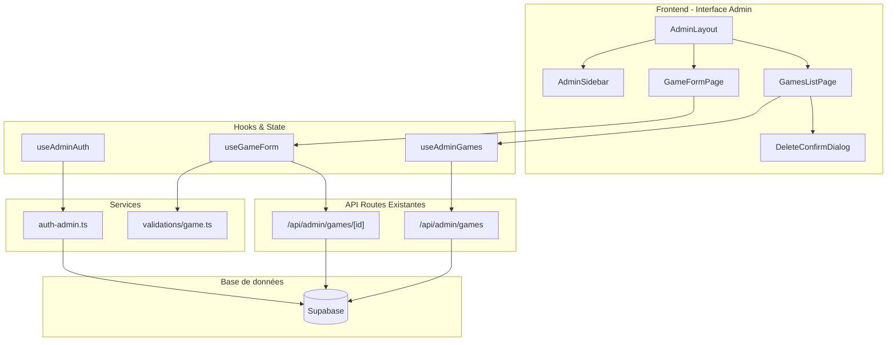

# Document de Conception

## Vue d'ensemble

Cette conception décrit l'interface d'administration pour la gestion des jeux
(CRUD) dans l'application GameUniverse. L'interface sera construite en utilisant
les patterns et composants existants du projet (Next.js, Supabase, React Hook
Form, Zod).

L'architecture s'appuie sur les API admin existantes (`/api/admin/games/`) et
étend le système d'authentification actuel pour supporter les rôles
administrateur et contributeur.

## Architecture



## Composants et Interfaces

### Structure des Routes

```
src/app/[locale]/admin/
├── layout.tsx              # Layout admin avec protection de route
├── page.tsx                # Redirection vers /admin/games
└── games/
    ├── page.tsx            # Liste des jeux (GamesListPage)
    ├── new/
    │   └── page.tsx        # Création de jeu (GameFormPage mode create)
    └── [id]/
        └── edit/
            └── page.tsx    # Modification de jeu (GameFormPage mode edit)
```

### Composants Principaux

#### 1. AdminLayout (`src/components/layout/admin/AdminLayout.tsx`)

Layout principal de l'interface admin avec:

- Vérification des permissions (admin/contributeur)
- Sidebar de navigation
- Affichage du rôle utilisateur
- Gestion du responsive

```typescript
interface AdminLayoutProps {
  children: React.ReactNode;
}

interface AdminUser {
  id: string;
  email: string;
  role: "admin" | "contributor";
}
```

#### 2. AdminSidebar (`src/components/layout/admin/AdminSidebar.tsx`)

Navigation latérale avec:

- Liens vers les sections admin
- Indicateur de section active
- Affichage du rôle utilisateur
- Support mobile (drawer)

#### 3. AdminGamesTable (`src/components/admin/games/AdminGamesTable.tsx`)

Tableau de liste des jeux avec:

- Colonnes: image, titre, date de sortie, date de modification, actions
- Pagination
- Recherche par titre
- Tri par colonnes
- Actions: éditer, supprimer (admin uniquement)

```typescript
interface AdminGame {
  id: string;
  slug: string;
  title: string;
  coverImage: string | null;
  releaseDate: string | null;
  updatedAt: string;
}

interface AdminGamesTableProps {
  games: AdminGame[];
  pagination: PaginationInfo;
  onPageChange: (page: number) => void;
  onSearch: (query: string) => void;
  onSort: (field: string, order: "asc" | "desc") => void;
  onEdit: (id: string) => void;
  onDelete: (game: AdminGame) => void;
  canDelete: boolean;
  isLoading: boolean;
}
```

#### 4. GameForm (`src/components/admin/games/GameForm.tsx`)

Formulaire de création/modification avec:

- Champs: slug, titre (multilingue), description (multilingue), image de
  couverture, date de sortie
- Sélection de genres (multi-select)
- Sélection d'entreprises (développeur/éditeur)
- Validation Zod
- Mode création et édition

```typescript
interface GameFormProps {
  mode: "create" | "edit";
  initialData?: GameFormData;
  onSubmit: (data: GameFormData) => Promise<void>;
  isSubmitting: boolean;
}

interface GameFormData {
  slug: string;
  translations: Array<{
    language_code: string;
    title: string;
    description?: string;
  }>;
  cover_image_url?: string;
  release_date?: string;
  genres: Array<{ genre_id: string }>;
  companies: Array<{
    company_id: string;
    role: "developer" | "publisher";
    is_primary: boolean;
  }>;
}
```

#### 5. DeleteGameDialog (`src/components/admin/games/DeleteGameDialog.tsx`)

Modale de confirmation de suppression:

- Affichage du titre du jeu
- Avertissement d'action irréversible
- Boutons confirmer/annuler

```typescript
interface DeleteGameDialogProps {
  game: AdminGame | null;
  isOpen: boolean;
  onClose: () => void;
  onConfirm: () => Promise<void>;
  isDeleting: boolean;
}
```

### Hooks Personnalisés

#### 1. useAdminAuth (`src/hooks/useAdminAuth.ts`)

```typescript
interface UseAdminAuthReturn {
  user: AdminUser | null;
  isAdmin: boolean;
  isContributor: boolean;
  canDelete: boolean;
  loading: boolean;
  error: Error | null;
}
```

Logique:

- Vérifie l'authentification via Supabase
- Détermine le rôle basé sur le domaine email ou une table de rôles
- Expose les permissions

#### 2. useAdminGames (`src/hooks/useAdminGames.ts`)

```typescript
interface UseAdminGamesReturn {
  games: AdminGame[];
  pagination: PaginationInfo;
  loading: boolean;
  error: Error | null;
  fetchGames: (params: FetchGamesParams) => Promise<void>;
  deleteGame: (id: string) => Promise<void>;
  refetch: () => Promise<void>;
}

interface FetchGamesParams {
  page?: number;
  limit?: number;
  search?: string;
  sortBy?: string;
  sortOrder?: "asc" | "desc";
  locale?: string;
}
```

#### 3. useGameForm (`src/hooks/useGameForm.ts`)

```typescript
interface UseGameFormReturn {
  form: UseFormReturn<GameFormData>;
  genres: Genre[];
  companies: Company[];
  loadingOptions: boolean;
  submitGame: (data: GameFormData) => Promise<void>;
  isSubmitting: boolean;
}
```

## Modèles de Données

### Extension du Système de Rôles

Le système actuel vérifie le domaine email (`@admin.gamesuniverse.com`). Pour
supporter les contributeurs, nous ajoutons une vérification supplémentaire:

```typescript
// Extension de src/lib/auth-admin.ts

type UserRole = "admin" | "contributor" | "user";

interface RoleCheck {
  role: UserRole;
  canCreate: boolean;
  canRead: boolean;
  canUpdate: boolean;
  canDelete: boolean;
}

const ROLE_PERMISSIONS: Record<UserRole, RoleCheck> = {
  admin: {
    role: "admin",
    canCreate: true,
    canRead: true,
    canUpdate: true,
    canDelete: true,
  },
  contributor: {
    role: "contributor",
    canCreate: true,
    canRead: true,
    canUpdate: true,
    canDelete: false,
  },
  user: {
    role: "user",
    canCreate: false,
    canRead: false,
    canUpdate: false,
    canDelete: false,
  },
};
```

### Schéma de Validation du Formulaire

Utilisation des schémas Zod existants dans `src/lib/validations/game.ts` avec
adaptation pour le formulaire:

```typescript
// Schéma simplifié pour le formulaire admin
export const adminGameFormSchema = z.object({
  slug: z
    .string()
    .min(1, "Le slug est requis")
    .regex(
      /^[a-z0-9-]+$/,
      "Le slug ne peut contenir que des lettres minuscules, chiffres et tirets"
    ),
  translations: z
    .array(
      z.object({
        language_code: z.string().length(2),
        title: z.string().min(1, "Le titre est requis"),
        description: z.string().optional(),
      })
    )
    .min(1, "Au moins une traduction est requise"),
  cover_image_url: z.string().url().optional().or(z.literal("")),
  release_date: z.string().optional(),
  genres: z
    .array(
      z.object({
        genre_id: z.string().uuid(),
      })
    )
    .min(1, "Au moins un genre est requis"),
  companies: z
    .array(
      z.object({
        company_id: z.string().uuid(),
        role: z.enum(["developer", "publisher"]),
        is_primary: z.boolean(),
      })
    )
    .min(1, "Au moins une entreprise est requise"),
});
```

## Propriétés de Correction

_Une propriété est une caractéristique ou un comportement qui doit rester vrai
pour toutes les exécutions valides d'un système - essentiellement, une
déclaration formelle de ce que le système doit faire. Les propriétés servent de
pont entre les spécifications lisibles par l'humain et les garanties de
correction vérifiables par la machine._

### Property 1: Vérification des Permissions sur les Actions

_Pour toute_ action sensible (création, modification, suppression) et _pour
tout_ utilisateur, le système doit vérifier les permissions avant d'exécuter
l'action, et le résultat doit correspondre aux permissions du rôle de
l'utilisateur.

**Validates: Requirements 1.5, 6.4**

### Property 2: Cohérence de la Recherche et du Tri

_Pour toute_ liste de jeux et _pour toute_ requête de recherche par titre, tous
les résultats retournés doivent contenir le terme recherché dans leur titre.
_Pour tout_ critère de tri appliqué, la liste résultante doit être ordonnée
selon ce critère.

**Validates: Requirements 3.3, 3.4**

### Property 3: Validation et Soumission de Formulaire

_Pour tout_ formulaire de jeu soumis:

- Si le formulaire est valide (tous les champs obligatoires remplis, formats
  corrects), la soumission doit réussir
- Si le formulaire est invalide, les erreurs de validation doivent être
  affichées et aucune requête API ne doit être envoyée

**Validates: Requirements 4.3, 4.5, 4.6**

### Property 4: Round-Trip de Modification

_Pour tout_ jeu existant, charger ses données dans le formulaire puis
sauvegarder sans modification doit préserver toutes les données du jeu
(propriété d'idempotence).

**Validates: Requirements 5.1, 5.3**

### Property 5: Affichage Complet des Informations de Jeu

_Pour tout_ jeu affiché dans la liste, les informations suivantes doivent être
présentes: titre, image de couverture (ou placeholder), date de sortie (ou "Non
définie"), date de dernière modification.

**Validates: Requirements 3.2**

### Property 6: Support de l'Internationalisation

_Pour toute_ locale supportée (fr, en), tous les textes de l'interface admin
doivent être traduits dans cette locale.

**Validates: Requirements 2.5**

### Property 7: Gestion Robuste des Erreurs Réseau

_Pour toute_ erreur réseau ou timeout lors d'une opération API, le système doit
afficher un message d'erreur explicatif et permettre à l'utilisateur de
réessayer sans perte de données.

**Validates: Requirements 7.5**

### Property 8: Feedback Cohérent des Opérations

_Pour toute_ opération (création, modification, suppression):

- Si l'opération réussit, une notification de succès doit être affichée
- Si l'opération échoue, une notification d'erreur avec message explicatif doit
  être affichée

**Validates: Requirements 7.1, 7.2**

## Gestion des Erreurs

### Types d'Erreurs

```typescript
enum AdminErrorType {
  UNAUTHORIZED = "UNAUTHORIZED",
  FORBIDDEN = "FORBIDDEN",
  NOT_FOUND = "NOT_FOUND",
  VALIDATION = "VALIDATION",
  DUPLICATE = "DUPLICATE",
  NETWORK = "NETWORK",
  SERVER = "SERVER",
}

interface AdminError {
  type: AdminErrorType;
  message: string;
  details?: Record<string, string[]>;
}
```

### Stratégies de Gestion

| Type d'Erreur | Action UI              | Récupération           |
| ------------- | ---------------------- | ---------------------- |
| UNAUTHORIZED  | Redirection vers login | Automatique            |
| FORBIDDEN     | Page 403               | Retour arrière         |
| NOT_FOUND     | Page 404               | Retour à la liste      |
| VALIDATION    | Affichage inline       | Correction utilisateur |
| DUPLICATE     | Toast erreur           | Modification slug      |
| NETWORK       | Toast + bouton retry   | Retry manuel           |
| SERVER        | Toast erreur           | Retry après délai      |

### Composant ErrorBoundary

Utilisation du composant `ErrorBoundary` existant pour capturer les erreurs
React non gérées.

## Stratégie de Tests

### Tests Unitaires

Les tests unitaires vérifient les comportements spécifiques et les cas limites:

- **Hooks**: `useAdminAuth`, `useAdminGames`, `useGameForm`
- **Composants**: `AdminGamesTable`, `GameForm`, `DeleteGameDialog`
- **Utilitaires**: Fonctions de validation, formatage

Framework: Bun test runner (`bun:test`)

Emplacement: `test/unit/components/admin/` et `test/unit/hooks/`

### Tests Property-Based

Les tests property-based vérifient les propriétés universelles avec des entrées
générées aléatoirement.

Framework: fast-check avec Bun test runner

Configuration: Minimum 100 itérations par test

Emplacement: `test/unit/components/admin/*.property.test.ts`

Chaque test doit être annoté avec:

```typescript
// Feature: admin-game-management, Property N: [description]
```

### Tests d'Intégration

Tests d'intégration pour les flux complets:

- Flux de création de jeu
- Flux de modification de jeu
- Flux de suppression de jeu
- Contrôle d'accès par rôle

Emplacement: `test/integration/admin/`

### Couverture Cible

Objectif: 90% de couverture de code pour les nouveaux composants et hooks.
