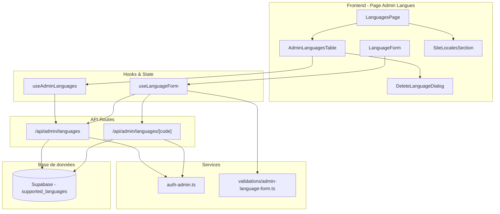

# Document de Conception

## Vue d'ensemble

Cette conception décrit l'interface d'administration pour la gestion des langues
supportées par les jeux (CRUD) et la consultation des locales du site dans
l'application GameUniverse. L'interface suit les patterns existants du module
admin des jeux (Next.js, Supabase, React Hook Form, Zod, shadcn/ui).

La page admin des langues est divisée en deux sections :

1. **Langues supportées par les jeux** : CRUD complet sur la table
   `supported_languages` existante
2. **Locales du site** : section en lecture seule affichant les locales
   configurées dans `src/i18n/routing.ts`

## Architecture



## Composants et Interfaces

### Structure des Routes

```
src/app/[locale]/admin/
└── languages/
    ├── page.tsx            # Liste des langues + locales site
    ├── new/
    │   └── page.tsx        # Création d'une langue
    └── [code]/
        └── edit/
            └── page.tsx    # Modification d'une langue
```

### Routes API

```
src/app/api/admin/languages/
├── route.ts                # GET (liste paginée), POST (création)
└── [code]/
    └── route.ts            # GET (détail), PUT (modification), DELETE (suppression)
```

### Composants Principaux

#### 1. AdminLanguagesTable (`src/components/admin/languages/AdminLanguagesTable.tsx`)

Tableau de liste des langues avec :

- Colonnes : code, nom anglais, nom natif, actions
- Pagination, recherche par code/nom, tri par colonnes
- Actions : modifier, supprimer

```typescript
interface SupportedLanguage {
  code: string;
  name: string;
  native_name: string | null;
}

interface AdminLanguagesTableProps {
  languages: SupportedLanguage[];
  pagination: PaginationInfo;
  onPageChange: (page: number) => void;
  onSearch: (query: string) => void;
  onSort: (field: string, order: "asc" | "desc") => void;
  onEdit: (code: string) => void;
  onDelete: (language: SupportedLanguage) => void;
  isLoading: boolean;
  currentSort: { field: string; order: "asc" | "desc" };
  currentSearch: string;
}
```

#### 2. LanguageForm (`src/components/admin/languages/LanguageForm.tsx`)

Formulaire de création/modification avec :

- Champs : code (désactivé en mode édition), nom anglais, nom natif
- Validation Zod inline
- Mode création et édition

```typescript
interface LanguageFormProps {
  mode: "create" | "edit";
  initialData?: LanguageFormData;
  onSubmit: (data: LanguageFormData) => Promise<void>;
  isSubmitting: boolean;
}

interface LanguageFormData {
  code: string;
  name: string;
  native_name: string;
}
```

#### 3. DeleteLanguageDialog (`src/components/admin/languages/DeleteLanguageDialog.tsx`)

Modale de confirmation de suppression :

- Affichage du nom de la langue
- Avertissement d'action irréversible
- Si la langue est utilisée par des jeux : avertissement supplémentaire avec le
  nombre de jeux concernés

```typescript
interface DeleteLanguageDialogProps {
  language: SupportedLanguage | null;
  isOpen: boolean;
  onClose: () => void;
  onConfirm: () => Promise<void>;
  isDeleting: boolean;
  usageCount?: number;
}
```

#### 4. SiteLocalesSection (`src/components/admin/languages/SiteLocalesSection.tsx`)

Section en lecture seule affichant les locales du site :

- Liste des locales configurées (code, nom, locale par défaut)
- Nombre de clés de traduction par locale
- Message indiquant que la gestion complète sera disponible dans un futur module

```typescript
interface SiteLocale {
  code: string;
  name: string;
  nativeName: string;
  isDefault: boolean;
  translationKeyCount: number;
}

interface SiteLocalesSectionProps {
  locales: SiteLocale[];
}
```

### Hooks Personnalisés

#### 1. useAdminLanguages (`src/hooks/useAdminLanguages.ts`)

```typescript
interface UseAdminLanguagesReturn {
  languages: SupportedLanguage[];
  pagination: PaginationInfo;
  loading: boolean;
  error: Error | null;
  fetchLanguages: (params?: FetchLanguagesParams) => Promise<void>;
  deleteLanguage: (code: string) => Promise<void>;
  checkLanguageUsage: (code: string) => Promise<number>;
  refetch: () => Promise<void>;
}

interface FetchLanguagesParams {
  page?: number;
  limit?: number;
  search?: string;
  sortBy?: string;
  sortOrder?: "asc" | "desc";
}
```

#### 2. useLanguageForm (`src/hooks/useLanguageForm.ts`)

```typescript
interface UseLanguageFormReturn {
  form: UseFormReturn<LanguageFormData>;
  submitLanguage: (data: LanguageFormData) => Promise<void>;
  isSubmitting: boolean;
  submitError: string | null;
}
```

### Schéma de Validation

```typescript
// src/lib/validations/admin-language-form.ts
import { z } from "zod";

export const adminLanguageFormSchema = z.object({
  code: z
    .string()
    .min(2, "Le code doit contenir au moins 2 caractères")
    .max(10, "Le code ne peut pas dépasser 10 caractères")
    .regex(
      /^[a-z]([a-z-]*[a-z])?$/,
      "Le code doit contenir uniquement des lettres minuscules et des tirets"
    ),
  name: z
    .string()
    .min(1, "Le nom est requis")
    .max(100, "Le nom ne peut pas dépasser 100 caractères"),
  native_name: z
    .string()
    .max(100, "Le nom natif ne peut pas dépasser 100 caractères")
    .optional()
    .or(z.literal("")),
});

export type LanguageFormData = z.infer<typeof adminLanguageFormSchema>;
```

## Modèles de Données

### Table Existante : `supported_languages`

```sql
CREATE TABLE public.supported_languages (
  code VARCHAR(10) PRIMARY KEY,
  name VARCHAR(100) NOT NULL,
  native_name VARCHAR(100)
);
```

- RLS activé : SELECT pour tous, ALL pour admins via `public.is_admin()`
- Pas de modification de schéma nécessaire

### Vérification d'Usage (pour la suppression)

Pour vérifier si une langue est utilisée par des jeux avant suppression, on
requête la table `game_languages` :

```sql
SELECT COUNT(DISTINCT game_id)
FROM game_languages
WHERE language_code = $1;
```

### API Endpoints

#### GET `/api/admin/languages`

- Paramètres : `page`, `limit`, `search`, `sort_by`, `sort_order`
- Retourne : `{ languages: SupportedLanguage[], pagination: PaginationInfo }`

#### POST `/api/admin/languages`

- Body : `{ code, name, native_name }`
- Validation Zod côté serveur
- Retourne : `{ language: SupportedLanguage }` ou erreur 409 si code existe

#### GET `/api/admin/languages/[code]`

- Retourne : `{ language: SupportedLanguage }`

#### PUT `/api/admin/languages/[code]`

- Body : `{ name, native_name }` (code non modifiable)
- Retourne : `{ language: SupportedLanguage }`

#### DELETE `/api/admin/languages/[code]`

- Paramètre query optionnel : `force=true` (pour supprimer même si utilisée)
- Retourne : `{ success: true }` ou erreur 409 si utilisée sans `force`

### Locales du Site (Lecture Seule)

Les données des locales du site sont lues directement depuis :

- `src/i18n/routing.ts` pour la liste des locales
- Les fichiers `src/messages/*.json` pour le comptage des clés

Ces données sont exposées via l'API reference-data existante (déjà le cas avec
la clé `languages`).

## Propriétés de Correction

_Une propriété est une caractéristique ou un comportement qui doit rester vrai
pour toutes les exécutions valides d'un système — essentiellement, une
déclaration formelle de ce que le système doit faire. Les propriétés servent de
pont entre les spécifications lisibles par l'humain et les garanties de
correction vérifiables par la machine._

### Property 1: Validation du Schéma de Langue

_Pour toute_ donnée de formulaire de langue, le schéma Zod doit l'accepter si et
seulement si : le code correspond au pattern `^[a-z]([a-z-]*[a-z])?$` avec une
longueur entre 2 et 10 caractères, le nom est non vide et ne dépasse pas 100
caractères, et le nom natif ne dépasse pas 100 caractères. Toute donnée ne
respectant pas ces critères doit être rejetée avec un message d'erreur
descriptif. Cette validation doit produire le même résultat côté client et côté
serveur.

**Validates: Requirements 4.5, 4.6, 8.1, 8.2, 8.3**

### Property 2: Cohérence de la Recherche et du Tri

_Pour toute_ liste de langues et _pour toute_ requête de recherche, tous les
résultats retournés doivent contenir le terme recherché dans leur code ou leur
nom. _Pour tout_ critère de tri appliqué, la liste résultante doit être ordonnée
selon ce critère.

**Validates: Requirements 3.3, 3.4**

### Property 3: Affichage Complet des Informations de Langue

_Pour toute_ langue affichée dans le tableau, les informations suivantes doivent
être présentes : code, nom anglais, et nom natif (ou indicateur d'absence).

**Validates: Requirements 3.2**

### Property 4: Round-Trip de Création

_Pour toute_ donnée de langue valide, créer la langue via l'API puis la
récupérer doit retourner des données équivalentes à celles soumises.

**Validates: Requirements 4.3**

### Property 5: Round-Trip de Modification

_Pour toute_ langue existante, charger ses données dans le formulaire puis
sauvegarder sans modification doit préserver toutes les données de la langue
(propriété d'idempotence).

**Validates: Requirements 5.1, 5.4**

### Property 6: Suppression Effective

_Pour toute_ langue existante non utilisée par des jeux, la supprimer via l'API
puis tenter de la récupérer doit retourner une erreur 404.

**Validates: Requirements 6.3**

### Property 7: Support de l'Internationalisation

_Pour toute_ locale supportée (fr, en), toutes les clés de traduction de
l'interface admin des langues doivent exister dans cette locale.

**Validates: Requirements 2.4**

### Property 8: Feedback Cohérent des Opérations

_Pour toute_ opération (création, modification, suppression) : si l'opération
réussit, une notification de succès doit être affichée ; si l'opération échoue,
une notification d'erreur avec message explicatif doit être affichée.

**Validates: Requirements 9.1, 9.2**

## Gestion des Erreurs

### Types d'Erreurs

| Code HTTP | Type         | Cause                                     | Action UI                        |
| --------- | ------------ | ----------------------------------------- | -------------------------------- |
| 401       | UNAUTHORIZED | Utilisateur non authentifié               | Redirection vers login           |
| 403       | FORBIDDEN    | Utilisateur sans rôle admin               | Message d'erreur 403             |
| 404       | NOT_FOUND    | Langue non trouvée                        | Redirection vers la liste        |
| 400       | VALIDATION   | Données invalides (Zod)                   | Affichage erreurs inline         |
| 409       | DUPLICATE    | Code langue déjà existant                 | Toast erreur + focus sur le code |
| 409       | IN_USE       | Langue utilisée par des jeux (sans force) | Avertissement + confirmation     |
| 500       | SERVER       | Erreur serveur                            | Toast erreur + retry             |

### Stratégie de Gestion

- Les erreurs de validation Zod sont affichées inline dans le formulaire
- Les erreurs API sont affichées via le composant toast existant
- Les erreurs réseau proposent un bouton de retry
- Le composant ErrorBoundary existant capture les erreurs React non gérées

## Stratégie de Tests

### Tests Unitaires

Les tests unitaires vérifient les comportements spécifiques et les cas limites :

- **Hooks** : `useAdminLanguages`, `useLanguageForm`
- **Composants** : `AdminLanguagesTable`, `LanguageForm`,
  `DeleteLanguageDialog`, `SiteLocalesSection`
- **Validation** : Schéma Zod `adminLanguageFormSchema`

Framework : Bun test runner (`bun:test`)

Emplacement : `test/unit/components/admin/languages/` et `test/unit/hooks/`

### Tests Property-Based

Les tests property-based vérifient les propriétés universelles avec des entrées
générées aléatoirement.

Framework : fast-check avec Bun test runner

Configuration : Minimum 100 itérations par test

Emplacement : `test/unit/lib/validations/admin-language-form.property.test.ts`
et `test/unit/hooks/useAdminLanguages.property.test.ts`

Chaque test doit être annoté avec :

```typescript
// Feature: admin-language-management, Property N: [description]
```

### Tests d'Intégration

Tests d'intégration pour les flux complets :

- Flux de création de langue
- Flux de modification de langue
- Flux de suppression de langue (avec et sans usage par des jeux)

Emplacement : `test/integration/admin/languages/`

### Couverture Cible

Objectif : 90% de couverture de code pour les nouveaux composants et hooks.
