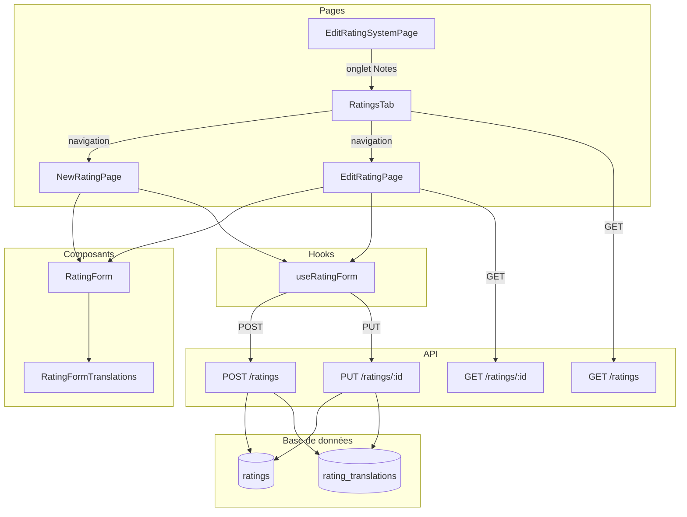

# Document de conception — Pages dédiées pour les notes de classification

## Vue d'ensemble

Cette fonctionnalité apporte deux changements majeurs à la gestion des notes
(ratings) dans l'administration des classifications d'âge :

1. **Pages dédiées** : Remplacement du formulaire inline dans l'onglet Notes par
   des pages dédiées `/ratings/new` et `/ratings/[ratingId]/edit`, suivant le
   même patron que les pages de systèmes de classification.
2. **Traductions de description** : Ajout d'une table `rating_translations` et
   d'une section traductions dans le formulaire, suivant exactement le patron
   des `content_descriptor_translations`.

Le design s'appuie sur les patterns existants du projet pour garantir la
cohérence.

## Architecture



### Flux de navigation

1. L'administrateur accède à la page d'édition d'un système de classification.
2. L'onglet « Notes » affiche la liste des notes via `RatingsTab` (simplifié,
   sans formulaire inline).
3. Le bouton « Nouvelle note » navigue vers
   `/admin/age-classifications/[id]/ratings/new`.
4. Un clic sur une ligne ou le bouton d'édition navigue vers
   `/admin/age-classifications/[id]/ratings/[ratingId]/edit`.
5. Les pages dédiées utilisent `RatingForm` avec la section
   `RatingFormTranslations`.

## Composants et interfaces

### Nouveaux fichiers

| Fichier                                                                            | Rôle                                          |
| ---------------------------------------------------------------------------------- | --------------------------------------------- |
| `supabase/migrations/20240217000001_rating_translations.sql`                       | Migration pour la table `rating_translations` |
| `src/app/[locale]/admin/age-classifications/[id]/ratings/new/page.tsx`             | Page de création d'une note                   |
| `src/app/[locale]/admin/age-classifications/[id]/ratings/[ratingId]/edit/page.tsx` | Page d'édition d'une note                     |
| `src/components/admin/age-classifications/RatingFormTranslations.tsx`              | Section traductions du formulaire             |

### Fichiers modifiés

| Fichier                                                                  | Modification                                                   |
| ------------------------------------------------------------------------ | -------------------------------------------------------------- |
| `src/types/admin-age-classifications.ts`                                 | Ajout `RatingTranslation`, mise à jour `AdminRating`           |
| `src/lib/validations/admin-rating-form.ts`                               | Ajout du champ `translations`, suppression de `description`    |
| `src/hooks/useRatingForm.ts`                                             | Adaptation pour inclure les traductions dans le payload        |
| `src/app/api/admin/age-classifications/[id]/ratings/route.ts`            | GET avec traductions, POST avec traductions                    |
| `src/app/api/admin/age-classifications/[id]/ratings/[ratingId]/route.ts` | GET/PUT/DELETE avec traductions                                |
| `src/components/admin/age-classifications/RatingsTab.tsx`                | Suppression formulaire inline, navigation vers pages dédiées   |
| `src/components/admin/age-classifications/RatingForm.tsx`                | Remplacement du champ description par `RatingFormTranslations` |
| `src/components/admin/age-classifications/RatingsTable.tsx`              | `onEdit` navigue vers la page d'édition                        |

### Interfaces des composants

```typescript
// RatingFormTranslations — calqué sur DescriptorFormTranslations
interface RatingFormTranslationsProps {
  form: UseFormReturn<RatingFormData>;
}

// RatingForm — mise à jour
interface RatingFormProps {
  mode: "create" | "edit";
  form: UseFormReturn<RatingFormData>;
  onSubmit: (data: RatingFormData) => Promise<void>;
  isSubmitting: boolean;
}

// NewRatingPage — pas de props, utilise useParams pour récupérer l'id du système
// EditRatingPage — pas de props, utilise useParams pour récupérer id et ratingId
```

## Modèles de données

### Table `rating_translations` (nouvelle)

```sql
CREATE TABLE public.rating_translations (
  id UUID PRIMARY KEY DEFAULT gen_random_uuid(),
  rating_id UUID REFERENCES ratings(id) ON DELETE CASCADE,
  language_code VARCHAR(2) REFERENCES languages(code),
  description TEXT NOT NULL,
  UNIQUE(rating_id, language_code)
);

CREATE INDEX idx_rating_translations_rating_id ON rating_translations(rating_id);
```

### Interface TypeScript `RatingTranslation` (nouvelle)

```typescript
export interface RatingTranslation {
  language_code: string;
  description: string;
}
```

### Interface `AdminRating` (mise à jour)

```typescript
export interface AdminRating {
  id: string;
  rating_system_id: string;
  code: string;
  display_name: string;
  minimum_age: number;
  color_hex: string | null;
  icon_url: string | null;
  // description: string | null;  ← supprimé
  translations: RatingTranslation[]; // ← ajouté
  sort_order: number;
  gameCount: number;
}
```

### Schéma de validation Zod (mise à jour)

```typescript
const ratingTranslationSchema = z.object({
  language_code: z.string().min(1, "Le code de langue est requis"),
  description: z
    .string()
    .min(1, "La description est requise")
    .max(500, "La description ne peut pas dépasser 500 caractères"),
});

export const adminRatingFormSchema = z.object({
  code: z.string().min(1).max(10),
  display_name: z.string().min(1).max(50),
  minimum_age: z.coerce.number().int().min(0),
  color_hex: z
    .string()
    .regex(/^#[0-9A-Fa-f]{6}$/)
    .optional()
    .or(z.literal("")),
  icon_url: z.string().url().optional().or(z.literal("")),
  // description supprimé
  sort_order: z.coerce.number().int().min(0).default(0),
  translations: z.array(ratingTranslationSchema).default([]),
});
```

### Payload API

**POST/PUT body** :

```json
{
  "code": "PEGI_3",
  "display_name": "PEGI 3",
  "minimum_age": 3,
  "color_hex": "#00FF00",
  "icon_url": "",
  "sort_order": 0,
  "translations": [
    { "language_code": "fr", "description": "Convient à tous les âges" },
    { "language_code": "en", "description": "Suitable for all ages" }
  ]
}
```

**GET response** (liste et individuel) :

```json
{
  "rating": {
    "id": "uuid",
    "rating_system_id": "uuid",
    "code": "PEGI_3",
    "display_name": "PEGI 3",
    "minimum_age": 3,
    "color_hex": "#00FF00",
    "icon_url": null,
    "sort_order": 0,
    "translations": [
      { "language_code": "fr", "description": "Convient à tous les âges" },
      { "language_code": "en", "description": "Suitable for all ages" }
    ],
    "gameCount": 5
  }
}
```

## Propriétés de correction

_Une propriété est une caractéristique ou un comportement qui doit rester vrai
pour toutes les exécutions valides d'un système — essentiellement, une
déclaration formelle de ce que le système doit faire. Les propriétés servent de
pont entre les spécifications lisibles par l'humain et les garanties de
correction vérifiables par la machine._

### Property 1 : Validation du schéma — données valides acceptées, données invalides rejetées

_Pour tout_ objet de formulaire de note généré aléatoirement avec des
traductions valides (language*code non vide, description entre 1 et 500
caractères), le schéma Zod doit accepter l'objet. \_Pour tout* objet avec un
language_code vide ou une description dépassant 500 caractères, le schéma doit
le rejeter.

**Validates: Requirements 2.1**

### Property 2 : Round-trip POST — création avec traductions

_Pour toute_ note valide avec un ensemble de traductions, après un POST suivi
d'un GET sur la note créée, les traductions retournées doivent être équivalentes
aux traductions envoyées (mêmes language_code et description, indépendamment de
l'ordre).

**Validates: Requirements 4.1, 4.2, 4.3**

### Property 3 : Round-trip PUT — mise à jour des traductions

_Pour toute_ note existante avec des traductions, après un PUT avec un nouvel
ensemble de traductions suivi d'un GET, les traductions retournées doivent
correspondre exactement au nouvel ensemble envoyé, sans trace des anciennes
traductions.

**Validates: Requirements 4.4**

### Property 4 : Suppression en cascade — note et traductions

_Pour toute_ note avec des traductions associées, après un DELETE de la note,
une requête GET sur cette note doit retourner une erreur 404, et les traductions
associées ne doivent plus exister en base de données.

**Validates: Requirements 1.2, 4.5**

## Gestion des erreurs

| Scénario                                                    | Comportement attendu                                                            |
| ----------------------------------------------------------- | ------------------------------------------------------------------------------- |
| Système de classification introuvable                       | API retourne 404, page affiche erreur                                           |
| Note introuvable (édition)                                  | API retourne 404, page affiche message d'erreur avec bouton retour              |
| Code de note en doublon dans le même système                | API retourne 409, formulaire affiche le message d'erreur                        |
| Données de formulaire invalides                             | Validation Zod côté client empêche la soumission, API retourne 400 si contourné |
| Échec de création des traductions après création de la note | API supprime la note créée (rollback), retourne 500                             |
| Accès non-admin                                             | API retourne 403                                                                |
| Erreur serveur inattendue                                   | API retourne 500, toast d'erreur côté client                                    |

## Stratégie de tests

### Tests unitaires

Les tests unitaires vérifient des exemples spécifiques et des cas limites :

- **Schéma de validation** : Vérifier que le schéma accepte des données valides,
  rejette des données invalides (language_code vide, description trop longue,
  tableau vide de traductions accepté).
- **Composants** : Vérifier le rendu du formulaire avec et sans traductions,
  l'ajout/suppression de traductions, la navigation depuis l'onglet.

### Tests property-based

Les tests property-based vérifient des propriétés universelles sur des entrées
générées aléatoirement. Utiliser la bibliothèque `fast-check` avec le test
runner Bun.

Configuration :

- Minimum 100 itérations par test
- Chaque test référence sa propriété du document de conception
- Format de tag : **Feature: admin-rating-pages, Property {N}: {titre}**

Chaque propriété de correction ci-dessus doit être implémentée par un seul test
property-based.

### Fichiers de test

Conformément aux règles du projet, tous les tests sont dans le répertoire
`test/` :

```
test/
├── unit/
│   └── lib/
│       └── validations/
│           └── admin-rating-form.test.ts
└── (property tests dans le même répertoire unit ou dédié)
```

### Approche complémentaire

- Les tests unitaires couvrent les exemples concrets, les edge cases et les
  conditions d'erreur
- Les tests property-based couvrent les propriétés universelles sur toutes les
  entrées
- Les deux sont complémentaires et nécessaires pour une couverture complète
