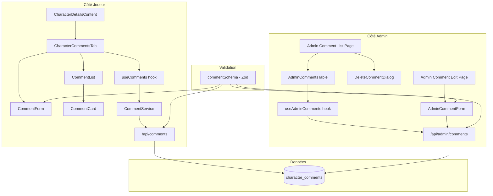
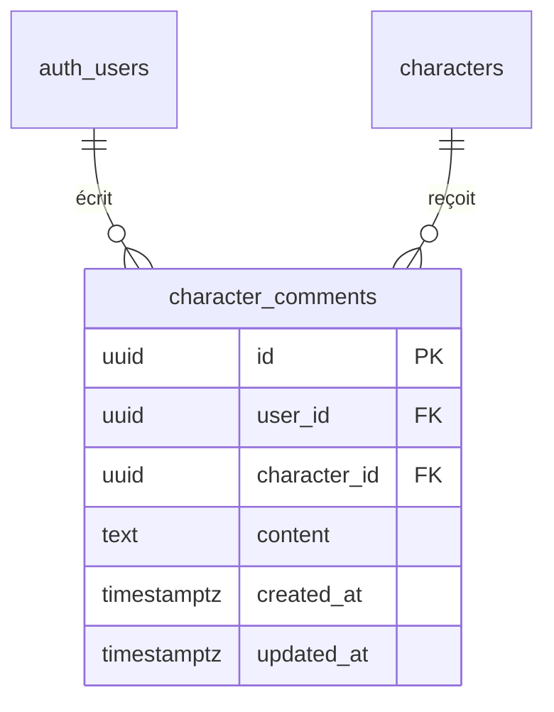

# Document de Design — Commentaires sur les personnages

## Overview

Cette fonctionnalité ajoute un système de commentaires textuels sur les
personnages, côté joueur et côté admin. Le design suit les patterns existants du
projet : les reviews de jeux (côté joueur) et la gestion admin des reviews (côté
admin). Les commentaires sont plus simples que les reviews : texte simple
uniquement, pas de note, pas de points positifs/négatifs, longueur max 1000
caractères, un commentaire par joueur par personnage.

### Décisions de design

- **Texte simple** : Pas de rich text editor (contrairement aux reviews). Un
  simple `<textarea>` suffit.
- **Schéma Zod partagé** : Un seul `commentSchema` utilisé côté joueur et côté
  admin pour garantir la cohérence de validation.
- **Pattern identique aux reviews** : Même architecture (service, hook, API
  routes, composants) pour maintenir la cohérence du codebase.
- **Nouvel onglet** : Ajout d'un onglet "Commentaires" dans
  `CharacterDetailsContent.tsx` avec le type d'onglet étendu.

## Architecture



## Components and Interfaces

### Fichiers à créer

#### Base de données

- `supabase/migrations/20240219000001_character_comments.sql` — Table + index +
  RLS
- `supabase/migrations/20240219000002_admin_comment_rls.sql` — Politiques RLS
  admin

#### Types

- `src/types/comment.ts` — Types joueur (Comment, CommentFormData,
  CommentsResponse)
- `src/types/admin-comments.ts` — Types admin (AdminComment, AdminCommentDetail,
  FetchAdminCommentsParams)

#### Validation

- `src/lib/validations/comment.ts` — Schéma Zod `commentSchema`
- `src/lib/validations/admin-comment-query.ts` — Validation des query params
  admin

#### Services

- `src/lib/services/commentService.ts` — Service API côté joueur

#### Hooks

- `src/hooks/useComments.ts` — Hook pour les commentaires côté joueur
- `src/hooks/useAdminComments.ts` — Hook pour la gestion admin

#### API Routes

- `src/app/api/comments/route.ts` — GET (liste par personnage) + POST (créer) +
  PUT (modifier)
- `src/app/api/admin/comments/route.ts` — GET (liste paginée admin)
- `src/app/api/admin/comments/[id]/route.ts` — GET (détail) + PUT (modifier) +
  DELETE (supprimer)

#### Composants joueur

- `src/components/characters/comments/CharacterCommentsTab.tsx` — Onglet
  principal
- `src/components/characters/comments/CommentForm.tsx` — Formulaire de
  soumission/édition
- `src/components/characters/comments/CommentList.tsx` — Liste des commentaires
- `src/components/characters/comments/CommentCard.tsx` — Carte d'un commentaire

#### Composants admin

- `src/components/admin/comments/AdminCommentsTable.tsx` — Table paginée avec
  recherche/tri
- `src/components/admin/comments/AdminCommentForm.tsx` — Formulaire d'édition
  admin
- `src/components/admin/comments/DeleteCommentDialog.tsx` — Dialogue de
  confirmation de suppression

#### Pages

- `src/app/[locale]/admin/comments/page.tsx` — Page liste admin
- `src/app/[locale]/admin/comments/[id]/edit/page.tsx` — Page édition admin

### Interfaces TypeScript

#### `src/types/comment.ts`

```typescript
export interface Comment {
  id: string;
  userId: string;
  characterId: string;
  content: string;
  createdAt: string;
  updatedAt: string;
  playerName: string | null;
  playerAvatar: string | null;
}

export interface CommentFormData {
  content: string;
}

export interface CommentsResponse {
  comments: Comment[];
  totalCount: number;
  userHasCommented: boolean;
  userComment?: Comment;
}
```

#### `src/types/admin-comments.ts`

```typescript
export interface AdminComment {
  id: string;
  contentExcerpt: string;
  createdAt: string;
  updatedAt: string;
  playerName: string | null;
  playerEmail: string | null;
  characterName: string;
  characterId: string;
}

export interface AdminCommentDetail {
  id: string;
  userId: string;
  characterId: string;
  content: string;
  createdAt: string;
  updatedAt: string;
  playerName: string | null;
  characterName: string;
}

export interface FetchAdminCommentsParams {
  search?: string;
  sortBy?: string;
  sortOrder?: "asc" | "desc";
  page?: number;
  limit?: number;
}
```

### Validation Zod

#### `src/lib/validations/comment.ts`

```typescript
import { z } from "zod";

export const commentSchema = z.object({
  content: z
    .string()
    .min(1, "Le commentaire est requis")
    .refine(
      (val) => val.trim().length > 0,
      "Le commentaire ne peut pas être vide"
    )
    .refine(
      (val) => val.trim().length <= 1000,
      "Le commentaire ne doit pas dépasser 1000 caractères"
    ),
});

export type CommentInput = z.infer<typeof commentSchema>;
```

### API Routes

#### `GET /api/comments?characterId=<uuid>`

- Retourne tous les commentaires d'un personnage, triés par date décroissante
- Inclut le statut de l'utilisateur courant (a déjà commenté ou non)
- Accessible publiquement (lecture)

#### `POST /api/comments`

- Body : `{ characterId, content }`
- Requiert authentification
- Valide avec `commentSchema`
- Vérifie l'unicité (un commentaire par joueur par personnage)

#### `PUT /api/comments`

- Body : `{ characterId, content }`
- Requiert authentification
- Permet au joueur de modifier son propre commentaire

#### `GET /api/admin/comments`

- Liste paginée avec recherche et tri
- Requiert rôle admin

#### `GET /api/admin/comments/[id]`

- Détail d'un commentaire pour édition
- Requiert rôle admin

#### `PUT /api/admin/comments/[id]`

- Body : `{ content }`
- Requiert rôle admin
- Valide avec `commentSchema`

#### `DELETE /api/admin/comments/[id]`

- Requiert rôle admin

## Data Models

### Table `character_comments`

```sql
CREATE TABLE public.character_comments (
  id UUID PRIMARY KEY DEFAULT gen_random_uuid(),
  user_id UUID NOT NULL REFERENCES auth.users(id) ON DELETE CASCADE,
  character_id UUID NOT NULL REFERENCES characters(id) ON DELETE CASCADE,
  content TEXT NOT NULL CHECK (char_length(trim(content)) > 0 AND char_length(content) <= 1000),
  created_at TIMESTAMPTZ NOT NULL DEFAULT now(),
  updated_at TIMESTAMPTZ NOT NULL DEFAULT now(),
  UNIQUE(user_id, character_id)
);
```

### Index

```sql
CREATE INDEX idx_character_comments_character_id ON character_comments(character_id);
CREATE INDEX idx_character_comments_user_id ON character_comments(user_id);
CREATE INDEX idx_character_comments_created_at ON character_comments(created_at DESC);
```

### Politiques RLS

**Migration 1 — Base :**

- Lecture publique : `SELECT` pour tous
- Insertion par l'auteur : `INSERT` avec `auth.uid() = user_id`
- Mise à jour par l'auteur : `UPDATE` avec `auth.uid() = user_id`

**Migration 2 — Admin :**

- Remplacement de la politique UPDATE pour inclure les admins
- Ajout d'une politique DELETE pour les admins uniquement

```sql
-- Admin update
CREATE POLICY "Users can update their own comments or admins can update any"
  ON character_comments FOR UPDATE
  USING (
    auth.uid() = user_id
    OR (auth.jwt() -> 'user_metadata' ->> 'role') = 'admin'
  );

-- Admin delete
CREATE POLICY "Admins can delete any comment"
  ON character_comments FOR DELETE
  USING (
    (auth.jwt() -> 'user_metadata' ->> 'role') = 'admin'
  );
```

### Diagramme ER



## Correctness Properties

_Une propriété est une caractéristique ou un comportement qui doit rester vrai
pour toutes les exécutions valides d'un système — essentiellement, une
déclaration formelle de ce que le système doit faire. Les propriétés servent de
pont entre les spécifications lisibles par un humain et les garanties de
correction vérifiables par une machine._

### Property 1 : Validation du commentaire — acceptation et rejet

_Pour tout_ contenu textuel, le `commentSchema` doit accepter le contenu si et
seulement si le contenu trimé (sans espaces de début/fin) est non-vide et
contient au plus 1000 caractères. Toute chaîne composée uniquement d'espaces ou
dépassant 1000 caractères (après trim) doit être rejetée.

**Validates: Requirements 2.1, 2.2, 5.3, 8.2**

### Property 2 : Unicité joueur/personnage

_Pour tout_ joueur et tout personnage, si un commentaire existe déjà pour cette
paire (joueur, personnage), toute tentative de création d'un second commentaire
doit échouer et le commentaire existant doit rester inchangé.

**Validates: Requirements 1.3**

### Property 3 : Soumission valide crée le commentaire

_Pour tout_ contenu valide (non-vide après trim, ≤1000 caractères) et tout
joueur authentifié n'ayant pas encore commenté un personnage, la soumission doit
réussir et le commentaire doit apparaître dans la liste des commentaires du
personnage avec le contenu soumis.

**Validates: Requirements 1.2**

### Property 4 : Tri par date décroissante

_Pour toute_ liste de commentaires retournée par l'API pour un personnage, les
commentaires doivent être triés par date de création décroissante (le plus
récent en premier).

**Validates: Requirements 3.1**

### Property 5 : Transformation des données inclut tous les champs requis

_Pour tout_ commentaire, la transformation vers le format d'affichage (joueur ou
admin) doit inclure tous les champs requis : côté joueur (nom du joueur,
contenu, date), côté admin (nom du joueur, nom du personnage, extrait du
contenu, date).

**Validates: Requirements 3.2, 4.2**

### Property 6 : Total count correspond à la longueur de la liste

_Pour toute_ réponse de l'API commentaires d'un personnage, le champ
`totalCount` doit être égal au nombre de commentaires dans le tableau
`comments`.

**Validates: Requirements 3.4**

### Property 7 : Non-admin reçoit 403 sur l'API admin

_Pour tout_ utilisateur non-administrateur, toute requête vers les endpoints
`/api/admin/comments` doit retourner une réponse HTTP 403.

**Validates: Requirements 7.1, 7.2**

### Property 8 : Non-authentifié ne peut pas créer ni modifier

_Pour tout_ utilisateur non authentifié, toute requête POST ou PUT vers
`/api/comments` doit être rejetée avec une erreur d'authentification.

**Validates: Requirements 7.4**

## Error Handling

| Situation                                  | Comportement attendu                                         |
| ------------------------------------------ | ------------------------------------------------------------ |
| Contenu vide ou whitespace uniquement      | Erreur de validation Zod, message affiché dans le formulaire |
| Contenu > 1000 caractères                  | Erreur de validation Zod, message affiché dans le formulaire |
| Doublon (joueur a déjà commenté)           | API retourne 409 Conflict, message affiché à l'utilisateur   |
| Utilisateur non authentifié tente POST/PUT | API retourne 401 Unauthorized                                |
| Non-admin tente d'accéder à l'API admin    | API retourne 403 Forbidden                                   |
| Personnage inexistant                      | API retourne 404 Not Found                                   |
| Commentaire inexistant (admin edit/delete) | API retourne 404 Not Found                                   |
| Erreur serveur Supabase                    | API retourne 500, message d'erreur générique affiché         |
| Échec réseau côté client                   | Hook capture l'erreur, message affiché via l'état `error`    |

## Testing Strategy

### Approche duale

- **Tests unitaires** : Cas spécifiques, edge cases, conditions d'erreur
- **Tests property-based** : Propriétés universelles sur toutes les entrées
  valides

### Bibliothèque property-based testing

Le projet utilise **fast-check** pour les tests property-based, avec le test
runner **Bun** (`bun:test`).

### Configuration

- Minimum **100 itérations** par test property-based
- Chaque test property-based référence sa propriété du design via un tag
  commentaire
- Format du tag : `Feature: character-comments, Property N: <titre>`

### Tests property-based prévus

| Propriété  | Fichier de test                                         | Description                                             |
| ---------- | ------------------------------------------------------- | ------------------------------------------------------- |
| Property 1 | `test/unit/lib/validations/comment.property.test.ts`    | Validation commentSchema : accepte/rejette correctement |
| Property 4 | `test/unit/lib/utils/commentSort.property.test.ts`      | Tri par date décroissante                               |
| Property 5 | `test/unit/lib/utils/commentTransform.property.test.ts` | Transformation inclut tous les champs requis            |
| Property 6 | `test/unit/lib/utils/commentTransform.property.test.ts` | Total count = longueur de la liste                      |

### Tests unitaires prévus

| Composant               | Fichier de test                                                | Description                                              |
| ----------------------- | -------------------------------------------------------------- | -------------------------------------------------------- |
| commentSchema           | `test/unit/lib/validations/comment.test.ts`                    | Cas limites : vide, 1000 chars, 1001 chars, espaces      |
| CommentService          | `test/unit/lib/services/commentService.test.ts`                | Appels API, gestion d'erreurs                            |
| useComments             | `test/unit/hooks/useComments.test.ts`                          | États du hook, soumission, mise à jour                   |
| CharacterCommentsTab    | `test/unit/components/characters/CharacterCommentsTab.test.ts` | Rendu conditionnel (auth/non-auth, commentaire existant) |
| API /api/comments       | `test/unit/api/comments.test.ts`                               | GET, POST, PUT, validation, erreurs                      |
| API /api/admin/comments | `test/unit/api/admin-comments.test.ts`                         | CRUD admin, sécurité 403                                 |

### Remarques

- Les propriétés 2, 3, 7, 8 nécessitent une base de données et sont mieux
  couvertes par des tests d'intégration ou des tests unitaires avec mocks
  Supabase.
- Les tests property-based se concentrent sur la logique pure (validation, tri,
  transformation).
- Les tests sont placés dans `test/` conformément aux règles du projet (pas de
  `__tests__/` dans `src/`).
