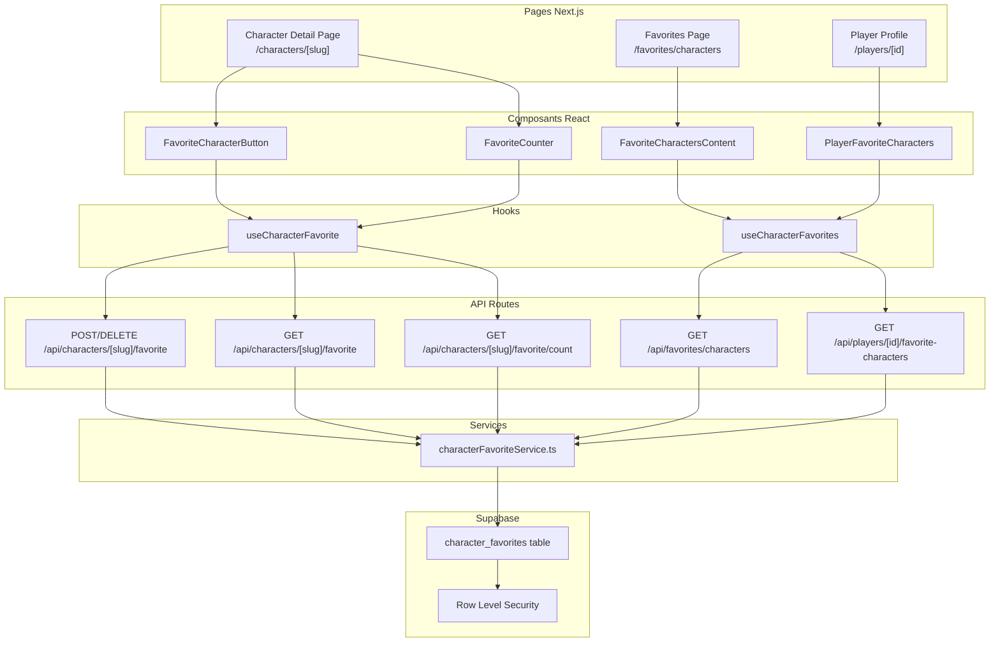

# Document de Design : Favoris de Personnages

## Vue d'ensemble

Le système de favoris de personnages s'inspire directement du pattern existant
de la bibliothèque de jeux (`user_library`). Il repose sur une table
`character_favorites` en base Supabase, des routes API Next.js pour les
opérations CRUD, un hook React `useCharacterFavorite` pour gérer l'état côté
client, et des composants UI intégrés à la fiche personnage et au profil joueur.

L'architecture suit les conventions du projet : services dans
`src/lib/services/`, types partagés dans `src/types/`, composants organisés par
feature dans `src/components/characters/`, et tests dans `test/`.

## Architecture



## Composants et Interfaces

### Routes API

```typescript
// POST /api/characters/[slug]/favorite — Ajouter aux favoris
// Requiert authentification
// Retourne : { success: true } | { error: string }

// DELETE /api/characters/[slug]/favorite — Retirer des favoris
// Requiert authentification
// Retourne : { success: true } | { error: string }

// GET /api/characters/[slug]/favorite — Statut du favori pour l'utilisateur courant
// Requiert authentification
// Retourne : { isFavorite: boolean, favoritedAt?: string }

// GET /api/characters/[slug]/favorite/count — Compteur public de favoris
// Pas d'authentification requise
// Retourne : { count: number }

// GET /api/favorites/characters — Liste des favoris de l'utilisateur courant
// Requiert authentification
// Retourne : { characters: CharacterFavoriteSummary[] }

// GET /api/players/[id]/favorite-characters — Favoris publics d'un joueur
// Pas d'authentification requise
// Retourne : { characters: CharacterFavoriteSummary[] }
```

### Service

```typescript
// src/lib/services/characterFavoriteService.ts

class CharacterFavoriteService {
  // Ajouter un personnage aux favoris
  static async addFavorite(characterId: string, userId: string): Promise<void>;

  // Retirer un personnage des favoris
  static async removeFavorite(
    characterId: string,
    userId: string
  ): Promise<void>;

  // Vérifier si un personnage est en favori pour un utilisateur
  static async isFavorite(
    characterId: string,
    userId: string
  ): Promise<boolean>;

  // Obtenir le nombre total de favoris pour un personnage
  static async getFavoriteCount(characterId: string): Promise<number>;

  // Obtenir la liste des personnages favoris d'un utilisateur
  static async getUserFavorites(
    userId: string,
    locale: string
  ): Promise<CharacterFavoriteSummary[]>;
}
```

### Hook React

```typescript
// src/hooks/useCharacterFavorite.ts

interface UseCharacterFavoriteReturn {
  isFavorite: boolean;
  favoriteCount: number;
  isLoading: boolean;
  isToggling: boolean;
  error: string | null;
  toggleFavorite: () => Promise<void>;
}

function useCharacterFavorite(
  characterSlug: string
): UseCharacterFavoriteReturn;
```

```typescript
// src/hooks/useCharacterFavorites.ts

interface UseCharacterFavoritesReturn {
  characters: CharacterFavoriteSummary[];
  loading: boolean;
  error: string | null;
}

// Pour la page "Mes favoris"
function useCharacterFavorites(): UseCharacterFavoritesReturn;

// Pour le profil joueur
function usePlayerFavoriteCharacters(
  playerId: string
): UseCharacterFavoritesReturn;
```

### Composants UI

```typescript
// src/components/characters/FavoriteCharacterButton.tsx
// Bouton cœur avec compteur, intégré dans le hero de la fiche personnage
interface FavoriteCharacterButtonProps {
  characterSlug: string;
}

// src/components/characters/favorites/FavoriteCharactersContent.tsx
// Contenu de la page "Mes personnages favoris"
// Affiche la grille de personnages favoris ou l'état vide

// src/components/players/PlayerFavoriteCharacters.tsx
// Section des favoris sur le profil joueur
// Affiche un aperçu des personnages favoris avec lien "Voir tous"
interface PlayerFavoriteCharactersProps {
  playerId: string;
  locale: string;
}
```

## Modèles de Données

### Table `character_favorites`

```sql
CREATE TABLE public.character_favorites (
  id UUID PRIMARY KEY DEFAULT gen_random_uuid(),
  user_id UUID REFERENCES auth.users(id) ON DELETE CASCADE NOT NULL,
  character_id UUID REFERENCES characters(id) ON DELETE CASCADE NOT NULL,
  created_at TIMESTAMP DEFAULT NOW(),
  UNIQUE(user_id, character_id)
);
```

Politiques RLS :

- Lecture publique (pour le compteur et les profils joueurs)
- Insertion/suppression limitée à l'utilisateur propriétaire
  (`auth.uid() = user_id`)

Index :

- `idx_character_favorites_user_id` sur `user_id`
- `idx_character_favorites_character_id` sur `character_id`
- `idx_character_favorites_created_at` sur `created_at`

### Fonctions SQL

```sql
-- Compteur de favoris pour un personnage
CREATE FUNCTION get_character_favorite_count(character_uuid UUID)
RETURNS INTEGER;

-- Vérifier si un personnage est en favori
CREATE FUNCTION is_character_favorited(user_uuid UUID, character_uuid UUID)
RETURNS BOOLEAN;
```

### Types TypeScript

```typescript
// Dans src/types/character.ts (extension des types existants)

export interface CharacterFavoriteSummary {
  id: string;
  slug: string;
  name: string;
  role?: string;
  mainImage?: string;
  backgroundColor?: string;
  primaryGame: string;
  favoritedAt: string;
}
```

## Propriétés de Correction

_Une propriété est une caractéristique ou un comportement qui doit rester vrai
pour toutes les exécutions valides d'un système — essentiellement, une
déclaration formelle de ce que le système doit faire. Les propriétés servent de
pont entre les spécifications lisibles par l'humain et les garanties de
correction vérifiables par la machine._

### Propriété 1 : Aller-retour ajout/suppression de favori

_Pour tout_ utilisateur et tout personnage, ajouter le personnage aux favoris
puis le retirer doit restaurer l'état initial (non favori), et `isFavorite` doit
retourner `false` après la suppression.

**Validates: Requirements 1.1, 1.2**

### Propriété 2 : Rollback de la mise à jour optimiste en cas d'erreur

_Pour tout_ état initial du favori (favori ou non), si l'appel API de toggle
échoue, l'état du bouton et du compteur doit revenir à l'état précédent
l'action.

**Validates: Requirements 1.4**

### Propriété 3 : Exactitude du compteur de favoris

_Pour tout_ personnage et tout ensemble d'utilisateurs ayant mis ce personnage
en favori, le compteur retourné par `getFavoriteCount` doit être égal au nombre
exact d'utilisateurs distincts ayant ce personnage en favori.

**Validates: Requirements 2.1, 2.2, 2.3**

### Propriété 4 : Tri des favoris par date décroissante

_Pour toute_ liste de personnages favoris d'un utilisateur, les éléments doivent
être triés par date d'ajout (`created_at`) décroissante — chaque élément doit
avoir une date supérieure ou égale à celle de l'élément suivant.

**Validates: Requirements 3.1**

### Propriété 5 : Complétude de l'affichage des favoris

_Pour tout_ `CharacterFavoriteSummary` affiché (que ce soit sur la page favoris
ou le profil joueur), le rendu doit contenir le nom, l'image, le rôle et le jeu
principal du personnage.

**Validates: Requirements 3.2, 4.1**

### Propriété 6 : Unicité des favoris

_Pour tout_ utilisateur et tout personnage, tenter d'ajouter le même favori deux
fois doit soit échouer avec une erreur appropriée (409 Conflict), soit être un
no-op — le nombre total de favoris ne doit pas augmenter.

**Validates: Requirements 5.2**

### Propriété 7 : Suppression en cascade lors de la suppression d'un personnage

_Pour tout_ personnage ayant des favoris, supprimer le personnage de la base de
données doit entraîner la suppression de tous les enregistrements
`character_favorites` associés à ce personnage.

**Validates: Requirements 5.3**

### Propriété 8 : Suppression en cascade lors de la suppression d'un utilisateur

_Pour tout_ utilisateur ayant des favoris, supprimer l'utilisateur doit
entraîner la suppression de tous ses enregistrements `character_favorites`.

**Validates: Requirements 5.4**

## Gestion des Erreurs

### Erreurs API

| Situation                                   | Code HTTP | Réponse                                                  |
| ------------------------------------------- | --------- | -------------------------------------------------------- |
| Utilisateur non authentifié                 | 401       | `{ error: "Unauthorized" }`                              |
| Personnage introuvable                      | 404       | `{ error: "Character not found" }`                       |
| Favori déjà existant (POST)                 | 409       | `{ error: "Already favorited" }`                         |
| Favori inexistant (DELETE)                  | 404       | `{ error: "Favorite not found" }`                        |
| Table non trouvée (migration non appliquée) | 200       | Réponse dégradée gracieuse (pattern existant `PGRST205`) |
| Erreur serveur                              | 500       | `{ error: "Internal server error" }`                     |

### Erreurs côté client

- Mise à jour optimiste : le bouton et le compteur changent immédiatement, puis
  reviennent en arrière si l'API échoue
- Toast d'erreur via le système de notifications existant
- État de chargement sur le bouton pendant le toggle pour éviter les doubles
  clics

## Stratégie de Tests

### Framework

- **Test runner** : Bun (`bun:test`) — pas de Vitest
- **Tests de propriétés** : `fast-check` pour le property-based testing
- **Emplacement** : `test/` (pas de `__tests__/` dans `src/`)

### Tests de propriétés (property-based)

Chaque propriété de correction doit être implémentée comme un test de propriété
unique avec `fast-check`, configuré pour un minimum de 100 itérations. Chaque
test doit référencer la propriété du design via un commentaire :

```typescript
// Feature: character-favorites, Property 1: Aller-retour ajout/suppression
```

Les tests de propriétés se concentrent sur :

- La logique métier du service (`characterFavoriteService`)
- Les transformations de données (tri, comptage)
- Les invariants (unicité, complétude des champs)

### Tests unitaires

Les tests unitaires complètent les tests de propriétés pour :

- Les cas limites (compteur à zéro, liste vide)
- Les exemples spécifiques (authentification, redirections)
- Les conditions d'erreur (réseau, 401, 404, 409)
- Le comportement des composants React (rendu conditionnel du bouton)

### Organisation des fichiers de test

```
test/
├── unit/
│   ├── hooks/
│   │   ├── useCharacterFavorite.test.ts
│   │   └── useCharacterFavorites.test.ts
│   ├── lib/
│   │   └── services/
│   │       └── characterFavoriteService.test.ts
│   └── components/
│       └── characters/
│           ├── FavoriteCharacterButton.test.tsx
│           └── FavoriteCharactersContent.test.tsx
├── unit/
│   └── lib/
│       └── services/
│           └── characterFavoriteService.property.test.ts
```

### Approche duale

- **Tests unitaires** : exemples spécifiques, cas limites, conditions d'erreur
- **Tests de propriétés** : propriétés universelles sur des entrées générées
  aléatoirement
- Les deux sont complémentaires et nécessaires pour une couverture complète
