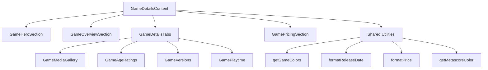

# Design Document: Code Refactoring

## Overview

This design document outlines the technical approach for refactoring the Game
Universe Next.js application to reduce code duplication, improve
maintainability, and establish consistent patterns. The refactoring targets
approximately 2,700 lines of duplicate code across service layers, UI
components, and API routes while maintaining full backward compatibility.

The refactoring follows a phased approach:

1. **Phase 1**: Cleanup and Service Layer Consolidation
2. **Phase 2**: UI Component Consolidation (Cards, Skeletons, Grids)
3. **Phase 3**: Shared Components (Pagination, Search, Filters)
4. **Phase 4**: API Route Utilities and Type Centralization
5. **Phase 5**: GameDetailsContent Decomposition

## Architecture

### Current Architecture Issues

```mermaid
graph TB
    subgraph "Current State - High Duplication"
        GS[GameService] --> |"~150 lines"| API1[/api/games]
        PS[PlayerService] --> |"~300 lines"| API2[/api/players]
        CS[CharacterService] --> |"~400 lines"| API3[/api/characters]

        GC[GameCard] --> |"~180 lines"| UI1[Games Page]
        PC[PlayerCard] --> |"~120 lines"| UI2[Players Page]
        CC[CharacterCard] --> |"~130 lines"| UI3[Characters Page]

        GP[GamePagination] --> |"~200 lines"| UI1
        PP[PlayerPagination] --> |"~200 lines"| UI2
        CP[CharacterPagination] --> |"~200 lines"| UI3
    end
```

### Target Architecture

```mermaid
graph TB
    subgraph "Target State - Consolidated"
        BS[BaseService&lt;T&gt;] --> GS2[GameService]
        BS --> PS2[PlayerService]
        BS --> CS2[CharacterService]
```

        EC[EntityCard&lt;T&gt;] --> UI1[Games Page]
        EC --> UI2[Players Page]
        EC --> UI3[Characters Page]

        PC2[Pagination] --> UI1
        PC2 --> UI2
        PC2 --> UI3

        AU[API Utilities] --> API1[/api/games]
        AU --> API2[/api/players]
        AU --> API3[/api/characters]
    end

````

### Component Dependency Diagram

```mermaid
graph LR
    subgraph "Shared Layer"
        BS[BaseService]
        EC[EntityCard]
        ES[EntitySkeleton]
        GS[GridSkeleton]
        PC[Pagination]
        SB[SearchBar]
        FP[FilterPanel]
        AU[API Utilities]
        ST[Shared Types]
    end

    subgraph "Entity Services"
        GameS[GameService] --> BS
        PlayerS[PlayerService] --> BS
        CharS[CharacterService] --> BS
    end

    subgraph "UI Components"
        GamesPage --> EC
        GamesPage --> PC
        GamesPage --> SB
        GamesPage --> FP
        PlayersPage --> EC
        PlayersPage --> PC
        PlayersPage --> SB
        PlayersPage --> FP
        CharsPage --> EC
        CharsPage --> PC
        CharsPage --> SB
        CharsPage --> FP
    end

    subgraph "API Routes"
        GamesAPI --> AU
        GamesAPI --> ST
        PlayersAPI --> AU
        PlayersAPI --> ST
        CharsAPI --> AU
        CharsAPI --> ST
    end
````

## Components and Interfaces

### Phase 1: Service Layer Consolidation

#### BaseService Generic Class

```typescript
// src/lib/services/baseService.ts

interface FetchOptions {
  search?: string;
  page?: number;
  limit?: number;
  locale?: string;
  [key: string]: unknown;
}

interface PaginatedResponse<T> {
  items: T[];
  pagination: {
    currentPage: number;
    totalPages: number;
    totalCount: number;
    hasNextPage: boolean;
    hasPreviousPage: boolean;
  };
}

interface EntityMetadata {
  title: string;
  description?: string;
  openGraph?: {
    title: string;
    description?: string;
    images?: string[];
  };
}

abstract class BaseService<TDetails, TSummary> {
  protected abstract readonly entityName: string;
  protected abstract readonly apiPath: string;

  protected static getBaseUrl(): string {
    return process.env.NEXT_PUBLIC_BASE_URL || "http://localhost:3000";
  }

  async fetchDetails(
    identifier: string,
    locale: string = "fr"
  ): Promise<TDetails | null>;

  async fetchList(options: FetchOptions): Promise<PaginatedResponse<TSummary>>;

  async exists(identifier: string, locale: string = "fr"): Promise<boolean>;

  async generateMetadata(
    identifier: string,
    locale: string = "fr"
  ): Promise<EntityMetadata>;
}
```

#### Entity Service Extensions

```typescript
// src/lib/services/gameService.ts
class GameService extends BaseService<GameDetails, GameSummary> {
  protected readonly entityName = "game";
  protected readonly apiPath = "/api/games";
  // Inherits: fetchDetails, fetchList, exists, generateMetadata
}

// src/lib/services/playerService.ts
class PlayerService extends BaseService<PlayerDetails, PlayerSummary> {
  protected readonly entityName = "player";
  protected readonly apiPath = "/api/players";
  // Inherits base methods
  // Retains: calculateStats, validatePlayerId, fetchPlayersFromDB, fetchPlayerDetailsFromDB
}

// src/lib/services/characterService.ts
class CharacterService extends BaseService<CharacterDetails, CharacterSummary> {
  protected readonly entityName = "character";
  protected readonly apiPath = "/api/characters";
  // Inherits base methods
  // Retains: fetchCharactersFromDB, fetchCharacterDetailsFromDB
}
```

### Phase 2: UI Component Consolidation

#### EntityCard Generic Component

```typescript
// src/components/shared/EntityCard.tsx

interface EntityCardConfig<T> {
  // Display configuration
  aspectRatio: "3:4" | "1:1";
  imageField: keyof T;
  titleField: keyof T;
  subtitleField?: keyof T;
  descriptionField?: keyof T;
  backgroundColorField?: keyof T;

  // Badge configuration
  badge?: {
    field: keyof T;
    position: "top-left" | "top-right";
    variant: "metascore" | "count" | "role";
    colorFn?: (value: number) => string;
  };

  // Hover overlay configuration
  hoverOverlay?: {
    enabled: boolean;
    fields: Array<{
      field: keyof T;
      label: string;
      icon?: React.ComponentType;
    }>;
  };

  // Action buttons
  actions?: {
    libraryToggle?: boolean;
    share?: boolean;
  };

  // Link configuration
  linkTemplate: (entity: T, locale: string) => string;
}

interface EntityCardProps<T> {
  entity: T;
  config: EntityCardConfig<T>;
  locale?: string;
  priority?: boolean;
  onAction?: (action: string, entity: T) => void;
}

function EntityCard<T>({
  entity,
  config,
  locale = "fr",
  priority = false,
  onAction,
}: EntityCardProps<T>): JSX.Element;
```

#### Preset Configurations

```typescript
// src/components/shared/entityCardPresets.ts

export const gameCardConfig: EntityCardConfig<GameSummary> = {
  aspectRatio: "3:4",
  imageField: "coverImage",
  titleField: "title",
  descriptionField: "description",
  backgroundColorField: "backgroundColor",
  badge: {
    field: "metascore",
    position: "top-right",
    variant: "metascore",
    colorFn: getMetascoreColor,
  },
  hoverOverlay: {
    enabled: true,
    fields: [
      { field: "developer", label: "game.developerShort", icon: Users },
      { field: "publisher", label: "game.publisherShort", icon: Globe },
      { field: "releaseDate", label: "game.releaseDate", icon: Calendar },
    ],
  },
  actions: { libraryToggle: true },
  linkTemplate: (game, locale) => `/${locale}/games/${game.slug}`,
};

export const playerCardConfig: EntityCardConfig<PlayerSummary> = {
  aspectRatio: "1:1",
  imageField: "avatarUrl",
  titleField: "fullName",
  badge: {
    field: "gamesCount",
    position: "top-right",
    variant: "count",
  },
  hoverOverlay: { enabled: true, fields: [] },
  linkTemplate: (player, locale) => `/${locale}/players/${player.id}`,
};

export const characterCardConfig: EntityCardConfig<CharacterSummary> = {
  aspectRatio: "3:4",
  imageField: "mainImage",
  titleField: "name",
  descriptionField: "description",
  backgroundColorField: "backgroundColor",
  badge: {
    field: "role",
    position: "top-right",
    variant: "role",
  },
  hoverOverlay: {
    enabled: true,
    fields: [
      { field: "primaryGame", label: "characters.card.game" },
      { field: "gamesCount", label: "characters.card.games" },
    ],
  },
  linkTemplate: (char, locale) => `/${locale}/characters/${char.slug}`,
};
```

#### EntitySkeleton Component

```typescript
// src/components/shared/EntitySkeleton.tsx

interface EntitySkeletonConfig {
  aspectRatio: "3:4" | "1:1";
  showBadge?: boolean;
  badgePosition?: "top-left" | "top-right";
  showInfoSection?: boolean;
  infoLines?: number;
}

interface EntitySkeletonProps {
  config: EntitySkeletonConfig;
  className?: string;
}

function EntitySkeleton({
  config,
  className,
}: EntitySkeletonProps): JSX.Element;

// Preset configurations
export const gameSkeletonConfig: EntitySkeletonConfig = {
  aspectRatio: "3:4",
  showBadge: true,
  badgePosition: "top-right",
  showInfoSection: false,
};

export const playerSkeletonConfig: EntitySkeletonConfig = {
  aspectRatio: "1:1",
  showBadge: true,
  badgePosition: "top-right",
  showInfoSection: true,
  infoLines: 1,
};

export const characterSkeletonConfig: EntitySkeletonConfig = {
  aspectRatio: "3:4",
  showBadge: true,
  badgePosition: "top-right",
  showInfoSection: false,
};
```

#### GridSkeleton Component

```typescript
// src/components/shared/GridSkeleton.tsx

interface GridSkeletonProps {
  skeletonConfig: EntitySkeletonConfig;
  count?: number;
  className?: string;
}

function GridSkeleton({
  skeletonConfig,
  count = 20,
  className,
}: GridSkeletonProps): JSX.Element;
```

### Phase 3: Shared Components

#### Pagination Component

```typescript
// src/components/shared/Pagination.tsx

interface PaginationProps {
  currentPage: number;
  totalPages: number;
  totalCount: number;
  onPageChange: (page: number) => void;
  loading?: boolean;
  translationNamespace?: string; // e.g., "pagination", "players.pagination"
}

function Pagination({
  currentPage,
  totalPages,
  totalCount,
  onPageChange,
  loading = false,
  translationNamespace = "pagination",
}: PaginationProps): JSX.Element | null;
```

#### SearchBar Component

```typescript
// src/components/shared/SearchBar.tsx

interface HybridSearchConfig {
  enabled: true;
  searchFn: (query: string) => Promise<SearchResult[]>;
  onImport: (result: SearchResult) => void;
  resultRenderer: (result: SearchResult) => JSX.Element;
}

interface SearchBarProps {
  onSearch: (query: string) => void;
  placeholder?: string;
  debounceMs?: number;
  hybridConfig?: HybridSearchConfig;
  initialValue?: string;
  className?: string;
}

function SearchBar({
  onSearch,
  placeholder,
  debounceMs = 300,
  hybridConfig,
  initialValue = "",
  className,
}: SearchBarProps): JSX.Element;
```

#### FilterPanel Component

```typescript
// src/components/shared/FilterPanel.tsx

interface FilterOption {
  id: string;
  label: string;
  count?: number;
}

interface FilterConfig {
  id: string;
  label: string;
  type: "checkbox" | "radio" | "range";
  options: FilterOption[];
  collapsible?: boolean;
  defaultExpanded?: boolean;
}

interface FilterPanelProps {
  filters: FilterConfig[];
  activeFilters: Record<string, string[]>;
  onFilterChange: (filterId: string, values: string[]) => void;
  onClearAll: () => void;
  className?: string;
}

function FilterPanel({
  filters,
  activeFilters,
  onFilterChange,
  onClearAll,
  className,
}: FilterPanelProps): JSX.Element;
```

### Phase 4: API Route Utilities

#### API Utilities Module

```typescript
// src/lib/api-utils.ts

interface PaginationParams {
  page: number;
  limit: number;
}

interface PaginatedApiResponse<T> {
  data: T[];
  pagination: {
    currentPage: number;
    totalPages: number;
    totalCount: number;
    hasNextPage: boolean;
    hasPreviousPage: boolean;
  };
  filters?: Record<string, unknown>;
}

interface ApiErrorResponse {
  error: string;
  code?: string;
  details?: unknown;
}

// Parse pagination parameters with defaults
function parsePaginationParams(
  searchParams: URLSearchParams,
  defaults?: { page?: number; limit?: number }
): PaginationParams;

// Parse comma-separated array parameter
function parseArrayParam(value: string | null): string[];

// Create standardized paginated response
function createPaginatedResponse<T>(
  data: T[],
  pagination: PaginationParams & { totalCount: number },
  filters?: Record<string, unknown>
): PaginatedApiResponse<T>;

// Handle API errors consistently
function handleApiError(
  error: unknown,
  defaultMessage?: string
): ApiErrorResponse;

// Validate required parameters
function validateRequiredParams(
  params: Record<string, unknown>,
  required: string[]
): { valid: boolean; missing: string[] };
```

#### Shared Supabase Types

```typescript
// src/lib/types/supabase-queries.ts

// Game-related types
export interface GameRow {
  id: string;
  slug: string;
  cover_image_url: string | null;
  background_image_url: string | null;
  background_color: string | null;
  release_date: string | null;
  metascore: number | null;
  created_at: string;
  updated_at: string;
}

export interface GameTranslationRow {
  game_id: string;
  language_code: string;
  title: string;
  description: string | null;
}

export interface GenreTranslationRow {
  genre_id: string;
  language_code: string;
  name: string;
}

export interface GameGenreRow {
  game_id: string;
  genre_id: string;
}

export interface GameCompanyRow {
  game_id: string;
  company_id: string;
  role: "developer" | "publisher";
}

// Character-related types
export interface CharacterRow {
  id: string;
  slug: string;
  main_image: string | null;
  background_image: string | null;
  background_color: string | null;
  created_at: string;
  updated_at: string;
}

export interface CharacterTranslationRow {
  character_id: string;
  language_code: string;
  name: string;
  role: string | null;
  description: string | null;
  biography: string | null;
  weapons: string | null;
}

export interface CharacterGameRow {
  character_id: string;
  game_id: string;
  is_primary: boolean;
}

// Profile-related types
export interface ProfileRow {
  id: string;
  username: string | null;
  avatar_url: string | null;
  preferred_locale: string | null;
  created_at: string | null;
  updated_at: string | null;
}

export interface LibraryEntryRow {
  id: string;
  user_id: string;
  game_id: string;
  status: string;
  play_time_hours: number | null;
  rating: number | null;
  added_at: string;
}
```

### Phase 5: GameDetailsContent Decomposition

#### Component Structure



#### Sub-Component Interfaces

```typescript
// src/components/games/details/GameHeroSection.tsx
interface GameHeroSectionProps {
  game: GameDetails;
  locale: string;
  colors: GameColors;
  isWishlisted: boolean;
  onWishlistToggle: () => void;
}

// src/components/games/details/GameOverviewSection.tsx
interface GameOverviewSectionProps {
  game: GameDetails;
  colors: GameColors;
}

// src/components/games/details/GameDetailsTabs.tsx
interface GameDetailsTabsProps {
  game: GameDetails;
  colors: GameColors;
  activeTab: TabType;
  onTabChange: (tab: TabType) => void;
}

// src/components/games/details/GameMediaGallery.tsx
interface GameMediaGalleryProps {
  media: GameMedia;
  gameTitle: string;
}

// src/components/games/details/GamePricingSection.tsx
interface GamePricingSectionProps {
  pricing: GamePricing[];
  colors: GameColors;
  locale: string;
}
```

#### Shared Utilities

```typescript
// src/lib/utils/game-utils.ts

interface GameColors {
  primary: string;
  secondary: string;
  accent: string;
  bg: string;
}

function getGameColors(gameTitle: string, genres: string[]): GameColors;

function formatReleaseDate(
  dateString: string | undefined,
  locale: string
): string | null;

function formatPrice(price: number, currency: string, locale: string): string;

function getMetascoreColor(score: number | undefined): string;
```

## Data Models

### Entity Type Hierarchy

```typescript
// Base entity interface
interface BaseEntity {
  id: string;
  createdAt: string;
  updatedAt?: string;
}

// Summary types (for list views)
interface EntitySummary extends BaseEntity {
  // Minimal fields for card display
}

// Details types (for detail views)
interface EntityDetails extends EntitySummary {
  // Full entity data
}
```

### Existing Types (Unchanged)

The following types from `src/types/` remain unchanged to maintain backward
compatibility:

- `GameDetails`, `GameSummary` from `game.ts`
- `PlayerDetails`, `PlayerSummary` from `player.ts`
- `CharacterDetails`, `CharacterSummary` from `character.ts`

## Correctness Properties

_A property is a characteristic or behavior that should hold true across all
valid executions of a system—essentially, a formal statement about what the
system should do. Properties serve as the bridge between human-readable
specifications and machine-verifiable correctness guarantees._

### Property 1: Service Backward Compatibility

_For any_ entity service method call (fetchDetails, fetchList, exists,
generateMetadata) with valid inputs, the refactored implementation SHALL return
data structures equivalent to the original implementation.

**Validates: Requirements 3.3, 3.4, 4.5, 5.4, 15.1, 15.3**

### Property 2: EntityCard Configuration Rendering

_For any_ valid entity and EntityCardConfig combination, the EntityCard
component SHALL render with the correct aspect ratio, display the configured
badge (if present), and show action buttons according to the configuration.

**Validates: Requirements 6.1, 6.2, 6.3, 6.5**

### Property 3: EntitySkeleton Configuration Rendering

_For any_ valid EntitySkeletonConfig, the EntitySkeleton component SHALL render
with the correct aspect ratio, badge skeleton (if configured), and info section
skeleton (if configured).

**Validates: Requirements 7.1, 7.2, 7.3**

### Property 4: GridSkeleton Item Count

_For any_ skeleton configuration and item count, the GridSkeleton component
SHALL render exactly the specified number of skeleton items using the provided
skeleton configuration.

**Validates: Requirements 8.1, 8.2**

### Property 5: Pagination State Management

_For any_ pagination state (currentPage, totalPages, totalCount), the Pagination
component SHALL correctly display navigation controls, show page numbers with
ellipsis when totalPages > 5, and invoke onPageChange with the correct page
number when navigation buttons are clicked.

**Validates: Requirements 9.1, 9.2, 9.3, 9.5, 9.7**

### Property 6: SearchBar Debouncing

_For any_ sequence of search inputs, the SearchBar component SHALL debounce
queries according to the configured delay (default 300ms), call onSearch only
after the debounce period, and display/hide the clear button based on whether
the input is empty.

**Validates: Requirements 10.1, 10.3, 10.4, 10.5, 10.6**

### Property 7: FilterPanel State Consistency

_For any_ filter configuration and active filter state, the FilterPanel
component SHALL render checkboxes for all filter options, display active filters
with remove buttons, and correctly update the filter state when checkboxes are
toggled or filters are removed.

**Validates: Requirements 11.1, 11.2, 11.3, 11.4, 11.5**

### Property 8: API Utilities Parameter Parsing

_For any_ URLSearchParams input, parsePaginationParams SHALL return valid page
and limit values (defaulting to page=1, limit=20 for invalid inputs), and
parseArrayParam SHALL correctly split comma-separated strings into arrays
(returning empty array for null/empty input).

**Validates: Requirements 12.1, 12.2, 12.5**

### Property 9: API Response Formatting

_For any_ data array and pagination metadata, createPaginatedResponse SHALL
produce a response object with the correct structure containing data, pagination
(currentPage, totalPages, totalCount, hasNextPage, hasPreviousPage), and
optional filters.

**Validates: Requirements 12.3, 12.4**

### Property 10: Game Color Scheme Generation

_For any_ game title and genre list, getGameColors SHALL return a valid
GameColors object with primary, secondary, accent, and bg properties that are
valid CSS color values or Tailwind gradient classes.

**Validates: Requirements 14.6**

### Property 11: Formatting Utilities Correctness

_For any_ valid date string and locale, formatReleaseDate SHALL return a
locale-formatted date string. _For any_ price and currency, formatPrice SHALL
return a properly formatted currency string. _For any_ metascore value,
getMetascoreColor SHALL return the appropriate Tailwind color class based on
score ranges.

**Validates: Requirements 14.7**

## Error Handling

### Service Layer Errors

```typescript
// Error types for service layer
class EntityNotFoundError extends Error {
  constructor(entityType: string, identifier: string) {
    super(`${entityType} not found: ${identifier}`);
    this.name = "EntityNotFoundError";
  }
}

class ServiceFetchError extends Error {
  constructor(entityType: string, operation: string, cause?: Error) {
    super(`Failed to ${operation} ${entityType}`);
    this.name = "ServiceFetchError";
    this.cause = cause;
  }
}
```

### API Error Responses

All API routes will use the `handleApiError` utility to ensure consistent error
responses:

```typescript
// Standard error response format
{
  error: string;      // Human-readable error message
  code?: string;      // Error code for programmatic handling
  details?: unknown;  // Additional error details (dev mode only)
}
```

### Component Error Boundaries

UI components will gracefully handle missing or invalid data:

- EntityCard: Display placeholder image if imageField is undefined
- Pagination: Return null if totalPages <= 1
- FilterPanel: Skip rendering filters with empty options arrays

## Testing Strategy

### Unit Tests

Unit tests will focus on specific examples and edge cases:

1. **Service Layer**
   - Test BaseService methods with mock fetch responses
   - Test entity-specific service methods (calculateStats, validatePlayerId)
   - Test error handling for network failures and invalid responses

2. **UI Components**
   - Snapshot tests for EntityCard with each preset configuration
   - Test Pagination button states at boundary conditions (page 1, last page)
   - Test SearchBar clear button visibility
   - Test FilterPanel checkbox interactions

3. **API Utilities**
   - Test parsePaginationParams with valid, invalid, and edge case inputs
   - Test parseArrayParam with various string formats
   - Test createPaginatedResponse structure

4. **Formatting Utilities**
   - Test formatReleaseDate with various locales
   - Test formatPrice with different currencies
   - Test getMetascoreColor at score boundaries (39, 40, 59, 60, 74, 75, 89, 90)

### Property-Based Tests

Property-based tests will use `fast-check` library with minimum 100 iterations
per test.

1. **Feature: code-refactoring, Property 1: Service Backward Compatibility**
   - Generate random valid identifiers and locales
   - Compare refactored service output with original implementation

2. **Feature: code-refactoring, Property 2: EntityCard Configuration Rendering**
   - Generate random entity objects and configurations
   - Verify rendered output matches configuration

3. **Feature: code-refactoring, Property 4: GridSkeleton Item Count**
   - Generate random item counts (1-100)
   - Verify exact number of skeleton items rendered

4. **Feature: code-refactoring, Property 5: Pagination State Management**
   - Generate random pagination states
   - Verify correct button states and page number display

5. **Feature: code-refactoring, Property 6: SearchBar Debouncing**
   - Generate random input sequences with timing
   - Verify debounce behavior

6. **Feature: code-refactoring, Property 8: API Utilities Parameter Parsing**
   - Generate random URLSearchParams
   - Verify valid output for all inputs

7. **Feature: code-refactoring, Property 10: Game Color Scheme Generation**
   - Generate random game titles and genre lists
   - Verify valid color objects returned

8. **Feature: code-refactoring, Property 11: Formatting Utilities Correctness**
   - Generate random dates, prices, and scores
   - Verify correct formatting output

### Integration Tests

1. **Visual Regression Tests**
   - Compare EntityCard output with original GameCard, PlayerCard, CharacterCard
   - Compare EntitySkeleton output with original skeleton components
   - Compare refactored GameDetailsContent with original

2. **API Response Tests**
   - Verify refactored API routes return identical response formats
   - Test pagination across all entity types

### Test Configuration

```typescript
// bun.config.ts - Bun uses bunfig.toml for test configuration
// See bunfig.toml for test settings
// Example test configuration:
    // Property-based test configuration
    testTimeout: 30000, // Allow time for 100+ iterations
    coverage: {
      include: [
        "src/lib/services/**",
        "src/components/shared/**",
        "src/lib/api-utils.ts",
        "src/lib/utils/game-utils.ts",
      ],
    },
  },
});
```
