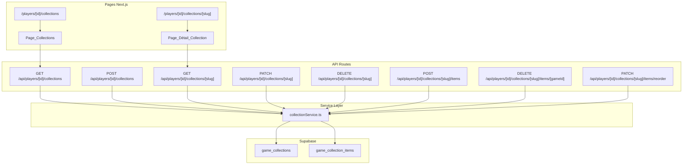

# Document de Design : Collections de Jeux

## Vue d'ensemble

La fonctionnalité « Collections de jeux » permet aux joueurs de créer des listes
thématiques de jeux, de les organiser, et de les partager publiquement via un
lien. L'architecture s'appuie sur les patterns existants du projet : service
layer avec Supabase, API routes Next.js, composants React organisés par feature,
et validation Zod.

Les collections sont stockées dans deux tables Supabase (`game_collections` et
`game_collection_items`) avec des politiques RLS pour le contrôle d'accès. Le
partage public repose sur le flag `is_public` de la collection : les collections
publiques sont accessibles via leur URL canonique sans authentification.

## Architecture



## Composants et Interfaces

### Pages (App Router)

- `src/app/[locale]/players/[id]/collections/page.tsx` — Page liste des
  collections d'un joueur
- `src/app/[locale]/players/[id]/collections/[slug]/page.tsx` — Page détail
  d'une collection

### Composants React (`src/components/collections/`)

- `CollectionList.tsx` — Grille de cartes de collections
- `CollectionCard.tsx` — Carte résumé d'une collection (nom, description
  tronquée, nombre de jeux, visibilité)
- `CollectionDetail.tsx` — Affichage détaillé d'une collection avec ses jeux
- `CollectionGameCard.tsx` — Carte d'un jeu dans une collection (couverture,
  titre, genres, note)
- `CollectionForm.tsx` — Formulaire de création/édition d'une collection
- `CollectionActions.tsx` — Actions du propriétaire (modifier, supprimer,
  basculer visibilité, copier lien)
- `AddGameToCollection.tsx` — Interface d'ajout d'un jeu à une collection
  (recherche + sélection)
- `CollectionSkeleton.tsx` — Skeleton de chargement

### Hooks (`src/hooks/`)

- `useCollections.ts` — Récupération et gestion des collections d'un joueur
- `useCollectionDetail.ts` — Récupération du détail d'une collection
- `useCollectionMutations.ts` — Mutations CRUD (création, édition, suppression,
  ajout/retrait de jeux, réordonnancement)

### Service (`src/lib/services/`)

- `collectionService.ts` — Logique métier : requêtes Supabase, transformations,
  génération de slugs

### Validation (`src/lib/validations/`)

- `collection.ts` — Schémas Zod pour la création/édition de collections et
  l'ajout d'éléments

### Types (`src/types/`)

- `collection.ts` — Types TypeScript pour les collections

### API Routes (`src/app/api/players/[id]/collections/`)

| Route                                                 | Méthode | Description                        |
| ----------------------------------------------------- | ------- | ---------------------------------- |
| `/api/players/[id]/collections`                       | GET     | Lister les collections d'un joueur |
| `/api/players/[id]/collections`                       | POST    | Créer une collection               |
| `/api/players/[id]/collections/[slug]`                | GET     | Détail d'une collection            |
| `/api/players/[id]/collections/[slug]`                | PATCH   | Modifier une collection            |
| `/api/players/[id]/collections/[slug]`                | DELETE  | Supprimer une collection           |
| `/api/players/[id]/collections/[slug]/items`          | POST    | Ajouter un jeu                     |
| `/api/players/[id]/collections/[slug]/items/[gameId]` | DELETE  | Retirer un jeu                     |
| `/api/players/[id]/collections/[slug]/items/reorder`  | PATCH   | Réordonner les jeux                |

## Modèles de Données

### Migration SQL (`supabase/migrations/20240221000001_game_collections.sql`)

```sql
-- Table game_collections
CREATE TABLE public.game_collections (
  id UUID PRIMARY KEY DEFAULT gen_random_uuid(),
  user_id UUID REFERENCES auth.users(id) ON DELETE CASCADE NOT NULL,
  name VARCHAR(100) NOT NULL,
  slug VARCHAR(120) NOT NULL,
  description TEXT CHECK (char_length(description) <= 500),
  is_public BOOLEAN DEFAULT false,
  created_at TIMESTAMP DEFAULT NOW(),
  updated_at TIMESTAMP DEFAULT NOW(),
  UNIQUE(user_id, slug)
);

COMMENT ON TABLE public.game_collections IS 'Collections thématiques de jeux créées par les joueurs';
COMMENT ON COLUMN public.game_collections.slug IS 'Slug unique par utilisateur, généré à partir du nom';
COMMENT ON COLUMN public.game_collections.is_public IS 'Visibilité : true = publique, false = privée';

-- Table game_collection_items
CREATE TABLE public.game_collection_items (
  id UUID PRIMARY KEY DEFAULT gen_random_uuid(),
  collection_id UUID REFERENCES game_collections(id) ON DELETE CASCADE NOT NULL,
  game_id UUID REFERENCES games(id) ON DELETE CASCADE NOT NULL,
  position INTEGER NOT NULL DEFAULT 0,
  note TEXT CHECK (char_length(note) <= 250),
  added_at TIMESTAMP DEFAULT NOW(),
  UNIQUE(collection_id, game_id)
);

COMMENT ON TABLE public.game_collection_items IS 'Jeux contenus dans une collection, avec ordre et note optionnelle';
COMMENT ON COLUMN public.game_collection_items.position IS 'Ordre d''affichage du jeu dans la collection';
COMMENT ON COLUMN public.game_collection_items.note IS 'Note textuelle optionnelle du propriétaire sur ce jeu';

-- Index
CREATE INDEX idx_game_collections_user_id ON game_collections(user_id);
CREATE INDEX idx_game_collections_is_public ON game_collections(is_public);
CREATE INDEX idx_game_collection_items_collection_id ON game_collection_items(collection_id);
CREATE INDEX idx_game_collection_items_game_id ON game_collection_items(game_id);
CREATE INDEX idx_game_collection_items_position ON game_collection_items(position);

-- RLS
ALTER TABLE game_collections ENABLE ROW LEVEL SECURITY;
ALTER TABLE game_collection_items ENABLE ROW LEVEL SECURITY;

-- Politiques RLS pour game_collections
CREATE POLICY "Public collections are viewable by anyone"
  ON game_collections FOR SELECT
  USING (is_public = true);

CREATE POLICY "Owners can view all own collections"
  ON game_collections FOR SELECT
  USING (auth.uid() = user_id);

CREATE POLICY "Owners can insert own collections"
  ON game_collections FOR INSERT
  WITH CHECK (auth.uid() = user_id);

CREATE POLICY "Owners can update own collections"
  ON game_collections FOR UPDATE
  USING (auth.uid() = user_id);

CREATE POLICY "Owners can delete own collections"
  ON game_collections FOR DELETE
  USING (auth.uid() = user_id);

-- Politiques RLS pour game_collection_items
CREATE POLICY "Items of public collections are viewable by anyone"
  ON game_collection_items FOR SELECT
  USING (
    EXISTS (
      SELECT 1 FROM game_collections
      WHERE game_collections.id = game_collection_items.collection_id
      AND game_collections.is_public = true
    )
  );

CREATE POLICY "Owners can view items of own collections"
  ON game_collection_items FOR SELECT
  USING (
    EXISTS (
      SELECT 1 FROM game_collections
      WHERE game_collections.id = game_collection_items.collection_id
      AND game_collections.user_id = auth.uid()
    )
  );

CREATE POLICY "Owners can insert items into own collections"
  ON game_collection_items FOR INSERT
  WITH CHECK (
    EXISTS (
      SELECT 1 FROM game_collections
      WHERE game_collections.id = game_collection_items.collection_id
      AND game_collections.user_id = auth.uid()
    )
  );

CREATE POLICY "Owners can update items in own collections"
  ON game_collection_items FOR UPDATE
  USING (
    EXISTS (
      SELECT 1 FROM game_collections
      WHERE game_collections.id = game_collection_items.collection_id
      AND game_collections.user_id = auth.uid()
    )
  );

CREATE POLICY "Owners can delete items from own collections"
  ON game_collection_items FOR DELETE
  USING (
    EXISTS (
      SELECT 1 FROM game_collections
      WHERE game_collections.id = game_collection_items.collection_id
      AND game_collections.user_id = auth.uid()
    )
  );

-- Fonction updated_at trigger
CREATE OR REPLACE FUNCTION update_game_collection_updated_at()
RETURNS TRIGGER AS $$
BEGIN
  NEW.updated_at = NOW();
  RETURN NEW;
END;
$$ LANGUAGE plpgsql;

CREATE TRIGGER trigger_update_game_collection_updated_at
  BEFORE UPDATE ON game_collections
  FOR EACH ROW
  EXECUTE FUNCTION update_game_collection_updated_at();
```

### Types TypeScript (`src/types/collection.ts`)

```typescript
/** Résumé d'une collection pour l'affichage en liste */
export interface CollectionSummary {
  id: string;
  name: string;
  slug: string;
  description: string | null;
  isPublic: boolean;
  gamesCount: number;
  updatedAt: string;
  coverImages: string[]; // Jusqu'à 4 couvertures pour la carte
}

/** Détail complet d'une collection */
export interface CollectionDetail {
  id: string;
  userId: string;
  name: string;
  slug: string;
  description: string | null;
  isPublic: boolean;
  createdAt: string;
  updatedAt: string;
  owner: {
    id: string;
    fullName: string | null;
    avatarUrl: string | null;
  };
  items: CollectionItem[];
}

/** Jeu dans une collection */
export interface CollectionItem {
  id: string;
  gameId: string;
  slug: string;
  title: string;
  coverImage: string | null;
  genres: Array<{ name: string }>;
  note: string | null;
  position: number;
  addedAt: string;
}

/** Payload de création d'une collection */
export interface CreateCollectionInput {
  name: string;
  description?: string;
  isPublic?: boolean;
}

/** Payload de modification d'une collection */
export interface UpdateCollectionInput {
  name?: string;
  description?: string;
  isPublic?: boolean;
}

/** Payload d'ajout d'un jeu à une collection */
export interface AddCollectionItemInput {
  gameId: string;
  note?: string;
}

/** Payload de réordonnancement */
export interface ReorderCollectionItemsInput {
  items: Array<{ gameId: string; position: number }>;
}
```

### Validation Zod (`src/lib/validations/collection.ts`)

```typescript
import { z } from "zod";

export const createCollectionSchema = z.object({
  name: z
    .string()
    .min(1, "Le nom est requis")
    .max(100, "Le nom ne doit pas dépasser 100 caractères")
    .refine((val) => val.trim().length > 0, "Le nom ne peut pas être vide"),
  description: z
    .string()
    .max(500, "La description ne doit pas dépasser 500 caractères")
    .optional(),
  isPublic: z.boolean().optional().default(false),
});

export const updateCollectionSchema = z.object({
  name: z
    .string()
    .min(1, "Le nom est requis")
    .max(100, "Le nom ne doit pas dépasser 100 caractères")
    .refine((val) => val.trim().length > 0, "Le nom ne peut pas être vide")
    .optional(),
  description: z
    .string()
    .max(500, "La description ne doit pas dépasser 500 caractères")
    .nullable()
    .optional(),
  isPublic: z.boolean().optional(),
});

export const addCollectionItemSchema = z.object({
  gameId: z.string().uuid("ID de jeu invalide"),
  note: z
    .string()
    .max(250, "La note ne doit pas dépasser 250 caractères")
    .optional(),
});

export const reorderCollectionItemsSchema = z.object({
  items: z.array(
    z.object({
      gameId: z.string().uuid("ID de jeu invalide"),
      position: z.number().int().min(0),
    })
  ),
});
```

## Propriétés de Correction

_Une propriété est une caractéristique ou un comportement qui doit rester vrai
pour toutes les exécutions valides d'un système — essentiellement, une
déclaration formelle sur ce que le système doit faire. Les propriétés servent de
pont entre les spécifications lisibles par l'humain et les garanties de
correction vérifiables par la machine._

### Property 1 : Création avec valeurs par défaut

_Pour toute_ chaîne de caractères non vide et non composée uniquement d'espaces
d'au plus 100 caractères, la création d'une collection avec ce nom doit produire
une collection associée au joueur connecté, avec `is_public` à `false` par
défaut.

**Validates: Requirements 1.1, 1.4**

### Property 2 : Validation des entrées

_Pour toute_ chaîne de caractères, la validation de création de collection doit
rejeter : les noms vides ou composés uniquement d'espaces, les noms de plus de
100 caractères, les descriptions de plus de 500 caractères, et les notes
d'éléments de plus de 250 caractères. Elle doit accepter toutes les entrées
conformes à ces contraintes.

**Validates: Requirements 1.2, 1.5, 2.5**

### Property 3 : Génération de slug

_Pour tout_ nom de collection valide, le slug généré doit être une chaîne
URL-safe (composée uniquement de caractères alphanumériques minuscules et de
tirets), non vide, et déterministe (le même nom produit toujours le même slug).

**Validates: Requirements 1.3**

### Property 4 : Position d'ajout séquentielle

_Pour toute_ collection contenant N éléments, l'ajout d'un nouveau jeu doit
créer un élément avec une position égale à N, et la collection doit ensuite
contenir N+1 éléments.

**Validates: Requirements 2.1**

### Property 5 : Rejet des doublons

_Pour toute_ collection et tout jeu déjà présent dans cette collection, une
tentative d'ajout du même jeu doit échouer, et le nombre d'éléments de la
collection doit rester inchangé.

**Validates: Requirements 2.2**

### Property 6 : Réordonnancement des positions après suppression

_Pour toute_ collection contenant N éléments, après la suppression d'un élément,
la collection doit contenir N-1 éléments et les positions doivent former une
séquence contiguë de 0 à N-2.

**Validates: Requirements 2.3**

### Property 7 : Mise à jour des positions après réordonnancement

_Pour toute_ collection et toute permutation valide de ses éléments, après
réordonnancement, les positions des éléments doivent correspondre exactement à
la permutation demandée.

**Validates: Requirements 2.4**

### Property 8 : Stabilité du slug lors de la modification

_Pour toute_ collection existante, la modification du nom ou de la description
ne doit pas modifier le slug de la collection.

**Validates: Requirements 3.1**

### Property 9 : Suppression en cascade

_Pour toute_ collection contenant des éléments, la suppression de la collection
doit également supprimer tous ses éléments associés.

**Validates: Requirements 3.2**

### Property 10 : Aller-retour de la visibilité

_Pour toute_ collection, basculer la visibilité de privée à publique puis de
publique à privée doit ramener la collection à son état de visibilité initial
(`is_public = false`).

**Validates: Requirements 3.3**

### Property 11 : Rejet des mutations par un non-propriétaire

_Pour toute_ collection et tout utilisateur qui n'en est pas le propriétaire,
les opérations de modification, suppression, ajout ou retrait de jeux doivent
échouer.

**Validates: Requirements 3.4**

### Property 12 : Contrôle d'accès basé sur la visibilité

_Pour tout_ joueur possédant un ensemble de collections publiques et privées, un
utilisateur non-propriétaire (authentifié ou non) ne doit voir que les
collections publiques, tandis que le propriétaire doit voir toutes ses
collections.

**Validates: Requirements 4.1, 4.2, 5.4, 6.3, 6.4**

### Property 13 : Ordre d'affichage des éléments

_Pour toute_ collection, les éléments retournés par l'API de détail doivent être
triés par position croissante.

**Validates: Requirements 5.1**

### Property 14 : Format du lien de partage

_Pour toute_ collection publique, le lien de partage doit correspondre au format
`/[locale]/players/[id]/collections/[slug]` où `id` est l'identifiant du
propriétaire et `slug` est le slug de la collection.

**Validates: Requirements 6.1, 6.2**

## Gestion des Erreurs

| Situation                              | Comportement                                                           |
| -------------------------------------- | ---------------------------------------------------------------------- |
| Erreur réseau (fetch échoue)           | Afficher un message d'erreur avec bouton « Réessayer »                 |
| Collection non trouvée (404)           | Afficher la page 404 standard                                          |
| Collection privée (non-propriétaire)   | Retourner 404 (ne pas révéler l'existence)                             |
| Validation échouée (Zod)               | Afficher les messages d'erreur inline sous les champs                  |
| Doublon de jeu dans une collection     | Afficher un toast d'information « Ce jeu est déjà dans la collection » |
| Jeu supprimé de la base (CASCADE)      | Suppression automatique de l'élément, pas d'erreur visible             |
| Utilisateur non authentifié (mutation) | Rediriger vers la page de connexion                                    |

## Stratégie de Tests

### Framework

- **Bun test** (`bun:test`) exclusivement — pas de Vitest
- Tests dans le répertoire centralisé `test/`
- Property-based tests avec la bibliothèque `fast-check`

### Tests unitaires

Placés dans `test/unit/lib/services/` et `test/unit/lib/validations/` :

- `collectionService.test.ts` — Tests du service (slug generation, position
  calculation, data transformation)
- `collection.test.ts` — Tests des schémas Zod (validation des entrées)

### Tests property-based

Placés dans `test/unit/lib/services/` :

- `collectionService.property.test.ts` — Propriétés de correction

Chaque test property-based doit :

- Exécuter au minimum 100 itérations
- Référencer la propriété du design avec un commentaire :
  `// Feature: game-collections, Property N: [titre]`
- Utiliser `fast-check` pour la génération d'entrées aléatoires

### Tests de composants

Placés dans `test/unit/components/collections/` :

- `CollectionCard.test.tsx` — Rendu de la carte
- `CollectionForm.test.tsx` — Validation du formulaire
- `CollectionList.test.tsx` — Affichage de la liste et état vide

### Couverture

Les property-based tests couvrent les propriétés universelles (validation,
positions, slug, visibilité). Les tests unitaires couvrent les cas spécifiques,
les edge cases et les conditions d'erreur. Les deux approches sont
complémentaires.
