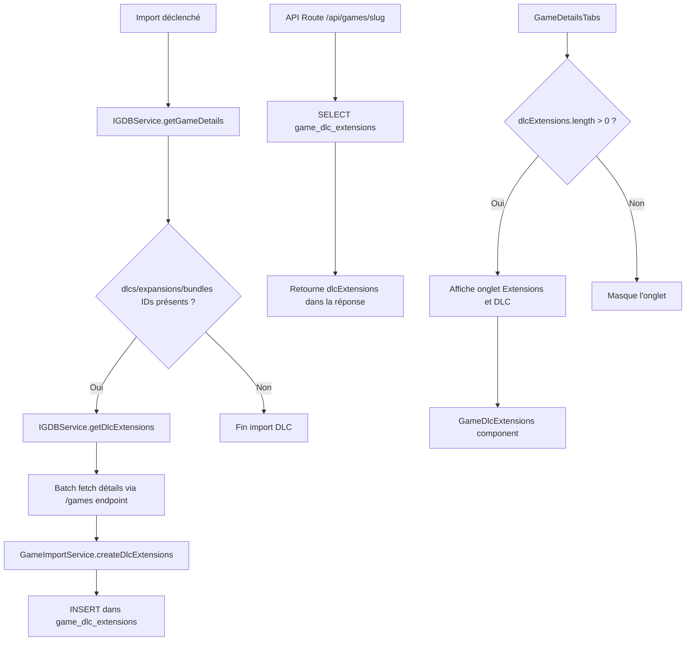

# Document de conception — Extensions et DLC de jeux

## Vue d'ensemble

Cette fonctionnalité étend le système d'import de jeux et la page de détail pour
supporter les DLC (addons), expansions et bundles liés à un jeu principal. Le
flux suit le pattern existant des `game_versions` : les identifiants sont
récupérés depuis l'API IGDB, les détails sont chargés en batch, puis persistés
dans une table dédiée `game_dlc_extensions`. Un nouvel onglet conditionnel «
Extensions et DLC » est ajouté à la page de détail.

## Architecture

Le design s'intègre dans l'architecture existante sans modifier les flux
principaux :



## Composants et interfaces

### 1. Types IGDB (`src/types/igdb.ts`)

Ajout des champs manquants à l'interface `IGDBGame` :

```typescript
export interface IGDBGame {
  // ... champs existants ...
  category?: number; // 0=Main, 1=DLC, 2=Expansion, 3=Standalone, 4=Bundle
  dlcs?: number[]; // IDs des DLC associés
  expansions?: number[]; // IDs des expansions associées
  bundles?: number[]; // IDs des bundles associés
}
```

Nouvelle interface pour les détails d'un contenu additionnel retourné par IGDB :

```typescript
export interface IGDBDlcExtension {
  id: number;
  name: string;
  slug: string;
  summary?: string;
  category?: number;
  first_release_date?: number;
  cover?: { image_id: string };
}
```

### 2. Types applicatifs (`src/types/game.ts`)

Nouvelle interface pour le frontend :

```typescript
export type DlcExtensionCategory = "dlc" | "expansion" | "bundle";

export interface GameDlcExtension {
  id: string;
  igdbId: number;
  name: string;
  slug: string;
  summary: string | null;
  category: DlcExtensionCategory;
  coverImageUrl: string | null;
  releaseDate: string | null;
  gameSlug: string | null; // slug du jeu local si importé, pour le lien
}
```

Ajout à `GameDetails` :

```typescript
export interface GameDetails {
  // ... champs existants ...
  dlcExtensions?: GameDlcExtension[];
}
```

### 3. Service IGDB (`src/lib/services/igdbService.ts`)

Modification de `getGameDetails` pour inclure `dlcs`, `expansions`, `bundles`
dans la requête.

Nouvelle méthode statique :

```typescript
static async getDlcExtensions(ids: number[]): Promise<IGDBDlcExtension[]>
```

Cette méthode effectue une requête batch vers `/games` avec
`where id = (id1, id2, ...)` pour récupérer les détails de tous les contenus
additionnels en une seule requête. L'API IGDB supporte jusqu'à 500 IDs par
requête, ce qui est suffisant pour la plupart des jeux.

### 4. Service d'import (`src/lib/services/gameImportService.ts`)

Nouvelles méthodes privées suivant le pattern de
`createVersions`/`updateVersions` :

```typescript
private static async createDlcExtensions(gameId: string, igdbGame: IGDBGame): Promise<void>
private static async updateDlcExtensions(gameId: string, igdbGame: IGDBGame): Promise<void>
```

La méthode `createDlcExtensions` :

1. Collecte tous les IDs depuis `igdbGame.dlcs`, `igdbGame.expansions`,
   `igdbGame.bundles`
2. Appelle `IGDBService.getDlcExtensions(allIds)`
3. Mappe chaque résultat avec sa catégorie (basée sur le champ source ou
   `category` IGDB)
4. Insère dans `game_dlc_extensions`

La méthode `updateDlcExtensions` supprime les entrées existantes puis appelle
`createDlcExtensions`.

### 5. Script d'import en masse (`scripts/igdb-import/game-importer.ts`)

Nouvelle fonction suivant le pattern de `importGameVersions` :

```typescript
async function importDlcExtensions(
  gameId: string,
  igdbGame: IGDBGame,
  verbose: boolean,
  dryRun: boolean
): Promise<number>;
```

### 6. API Route (`src/app/api/games/[slug]/route.ts`)

Ajout d'une requête séparée (comme pour `game_versions`) :

```typescript
const { data: dlcData } = await supabase
  .from("game_dlc_extensions")
  .select(
    "id, igdb_id, name, slug, summary, category, cover_image_url, release_date"
  )
  .eq("game_id", game.id)
  .order("category", { ascending: true })
  .order("release_date", { ascending: true, nullsFirst: false });
```

Pour le lien vers un jeu local, une sous-requête vérifie si un jeu avec le même
`igdb_id` existe dans la table `games` :

```typescript
// Vérifier quels DLC/extensions sont aussi des jeux importés
const igdbIds = dlcData.map((d) => d.igdb_id);
const { data: localGames } = await supabase
  .from("games")
  .select("igdb_id, slug")
  .in("igdb_id", igdbIds);
const localGameMap = new Map(localGames?.map((g) => [g.igdb_id, g.slug]) ?? []);
```

### 7. Composant d'affichage (`src/components/games/GameDlcExtensions.tsx`)

Composant qui reçoit `dlcExtensions: GameDlcExtension[]` et
`accentColor: string`.

Affiche les contenus regroupés par catégorie (DLC, Expansion, Bundle) avec :

- Titre de la catégorie traduit
- Grille de cartes avec image de couverture, nom, résumé tronqué, date de sortie
- Lien vers la page du jeu si `gameSlug` est défini

Le composant suit le pattern visuel de `GameVersions.tsx` (cartes avec
couverture + texte).

### 8. Onglet dans `GameDetailsTabs`

Ajout de `"dlcExtensions"` au type `TabType` et d'un bouton conditionnel (comme
`versions`) :

```typescript
{game.dlcExtensions && game.dlcExtensions.length > 0 && (
  <button onClick={() => onTabChange("dlcExtensions")} ...>
    <Puzzle className="mr-2 inline h-4 w-4" />
    {tDetails("tabs.dlcExtensions")}
  </button>
)}
```

### 9. Traductions (`src/messages/fr.json` et `en.json`)

Ajout sous `gameDetails.tabs` et `gameDetails.dlcExtensions` :

```json
{
  "tabs": {
    "dlcExtensions": "Extensions et DLC"
  },
  "dlcExtensions": {
    "title": "Extensions et DLC",
    "noData": "Aucune extension ou DLC disponible",
    "categories": {
      "dlc": "DLC",
      "expansion": "Extensions",
      "bundle": "Bundles"
    },
    "viewGame": "Voir la fiche"
  }
}
```

## Modèle de données

### Table `game_dlc_extensions`

```sql
CREATE TABLE public.game_dlc_extensions (
  id UUID PRIMARY KEY DEFAULT gen_random_uuid(),
  game_id UUID NOT NULL REFERENCES games(id) ON DELETE CASCADE,
  igdb_id INTEGER NOT NULL,
  name VARCHAR(500) NOT NULL,
  slug VARCHAR(500),
  summary TEXT,
  category VARCHAR(50) NOT NULL CHECK (category IN ('dlc', 'expansion', 'bundle')),
  cover_image_url TEXT,
  release_date DATE,
  display_order INTEGER DEFAULT 0,
  created_at TIMESTAMP DEFAULT NOW(),
  UNIQUE(game_id, igdb_id)
);
```

Index :

- `idx_game_dlc_extensions_game_id` sur `game_id`
- `idx_game_dlc_extensions_igdb_id` sur `igdb_id`

RLS :

- Lecture publique (SELECT) pour tous
- Écriture complète pour `service_role`

Migration : `supabase/migrations/20240301000001_game_dlc_extensions.sql`

### Mapping catégorie IGDB → catégorie locale

| Champ source IGDB | Catégorie IGDB (`category`) | Catégorie locale |
| ----------------- | --------------------------- | ---------------- |
| `dlcs`            | 1 (DLC/Addon)               | `dlc`            |
| `expansions`      | 2 (Expansion)               | `expansion`      |
| `bundles`         | 4 (Bundle)                  | `bundle`         |

La catégorie est déterminée par le champ source (`dlcs`, `expansions`,
`bundles`) du jeu parent, pas par le champ `category` du contenu additionnel
lui-même (qui peut être incohérent dans IGDB).

## Propriétés de correction

_Une propriété est une caractéristique ou un comportement qui doit rester vrai
pour toutes les exécutions valides d'un système — essentiellement, une
déclaration formelle de ce que le système doit faire. Les propriétés servent de
pont entre les spécifications lisibles par l'humain et les garanties de
correction vérifiables par la machine._

### Property 1: Transformation IGDB → base de données complète et correcte

_For any_ valid `IGDBDlcExtension` object with a known source category (`dlc`,
`expansion`, or `bundle`), the transformation function should produce a database
row containing: a non-null `igdb_id` matching the input ID, a non-empty `name`,
a `category` value that is one of `dlc`, `expansion`, or `bundle`, and a
`cover_image_url` that is either null or a valid IGDB image URL when the input
has a cover image_id.

**Validates: Requirements 3.1, 3.2**

### Property 2: Tri des contenus additionnels par catégorie puis par date

_For any_ list of DLC extensions with mixed categories and release dates,
sorting by category (dlc < expansion < bundle) then by release date ascending
should produce a list where: all items of the same category are contiguous,
categories appear in the defined order, and within each category group items are
ordered by release date.

**Validates: Requirements 6.1**

### Property 3: Regroupement par catégorie

_For any_ list of DLC extensions, grouping by category should produce groups
where: every item in a group has the matching category, the union of all groups
equals the original list (no items lost or duplicated), and only non-empty
groups are returned.

**Validates: Requirements 7.3**

### Property 4: Complétude du rendu par carte

_For any_ `GameDlcExtension` object with a non-null name and non-null summary,
the rendered card component should contain the extension name and summary text
in its output.

**Validates: Requirements 7.4**

## Gestion des erreurs

| Scénario                                        | Comportement                                                     |
| ----------------------------------------------- | ---------------------------------------------------------------- |
| API IGDB indisponible lors du fetch des DLC     | Log l'erreur, import du jeu principal continue sans DLC          |
| Certains IDs de DLC introuvables dans IGDB      | Ignore les IDs manquants, importe les DLC trouvés                |
| Échec d'insertion en base (game_dlc_extensions) | Log l'erreur, import du jeu principal continue                   |
| Table game_dlc_extensions inexistante           | Try/catch avec log warning (pattern existant pour game_versions) |
| Aucun DLC/expansion/bundle pour un jeu          | Tableau vide retourné, onglet masqué                             |

## Stratégie de test

### Tests unitaires

- Transformation `IGDBDlcExtension` → row de base de données (champs, catégorie,
  URL image)
- Tri des extensions par catégorie puis date
- Regroupement par catégorie
- Rendu conditionnel de l'onglet (présent/absent selon données)
- Rendu du composant `GameDlcExtensions` avec données variées

### Tests property-based

Bibliothèque : `fast-check` (déjà utilisée dans le projet via Vitest)

Configuration : minimum 100 itérations par test.

Chaque test doit être annoté avec un commentaire référençant la propriété du
design :

```
// Feature: game-dlc-extensions, Property 1: Transformation IGDB → base de données complète et correcte
```

Fichier : `test/unit/lib/services/gameDlcExtensions.property.test.ts`

Les 4 propriétés identifiées ci-dessus seront implémentées comme tests
property-based avec `fast-check`. Les tests unitaires couvriront les cas limites
(tableau vide, IDs manquants, erreurs API) et les exemples spécifiques (rendu
conditionnel de l'onglet, lien vers jeu local).
