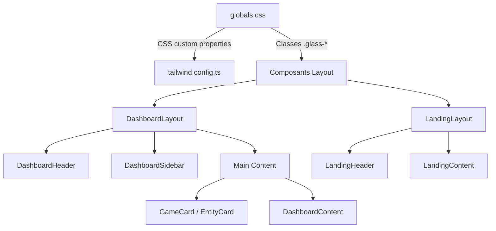
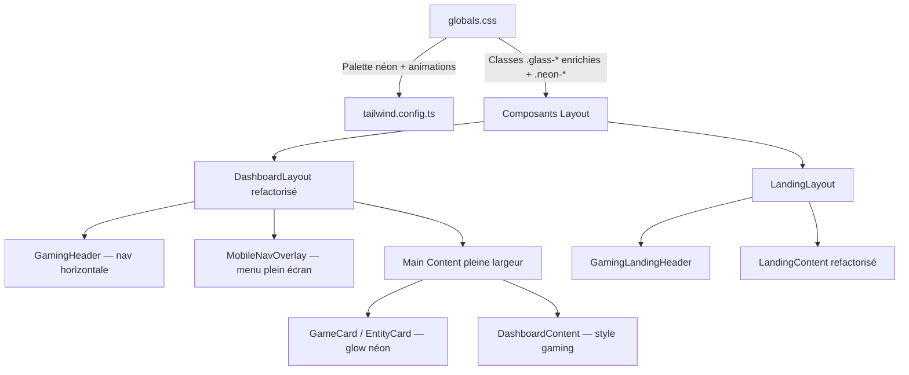
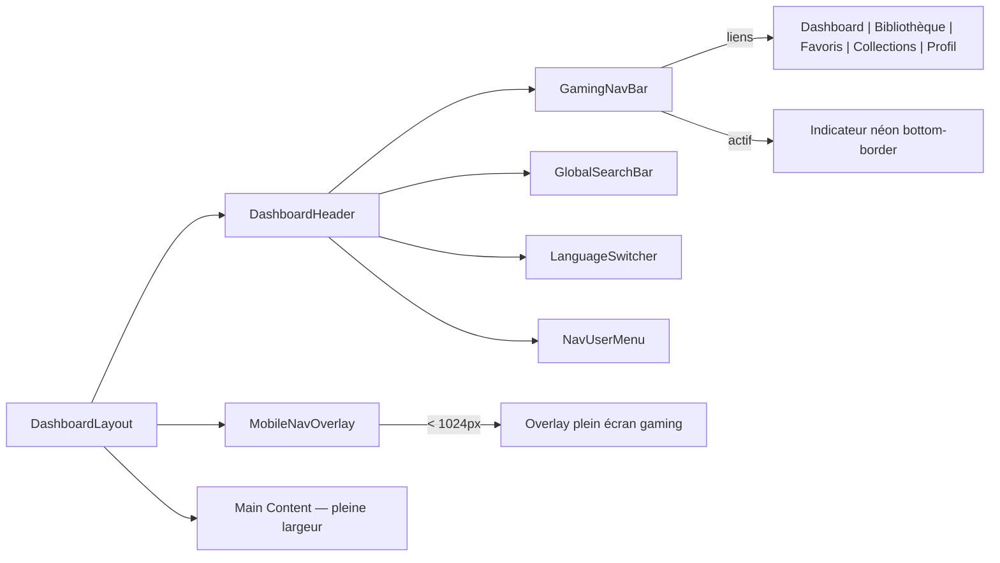

# Document de Design — Refonte UI Gaming

## Vue d'ensemble

Ce document décrit la transformation visuelle de Game Universe, d'un dashboard
d'entreprise glassmorphism vers une interface immersive orientée gaming. La
refonte porte exclusivement sur la couche CSS/composants UI — aucune
modification de la logique métier, des API ou du schéma de base de données n'est
nécessaire.

### Principes directeurs

1. **Évolution, pas révolution** : le système glassmorphism existant est
   enrichi, pas remplacé
2. **CSS-first** : la majorité des changements passent par `globals.css` et les
   CSS custom properties, minimisant les modifications de composants
3. **Accessibilité préservée** : respect de `prefers-reduced-motion`, contrastes
   WCAG AA, focus visible néon
4. **Compatibilité thème** : les modes clair/sombre restent fonctionnels via
   `next-themes`

### Périmètre

- Palette de couleurs et fond animé (CSS custom properties + `dashboard-bg`)
- Navigation : sidebar → barre horizontale (composants layout/dashboard)
- Panneaux glassmorphism : bordures et glow néon (classes CSS `.glass-*`)
- Cartes de jeux : effets de survol néon (GameCard, EntityCard)
- Landing page : hero gaming, CTA néon, particules
- Dashboard connecté : typographie gaming, stats néon
- Typographie et animations globales

## Architecture

### Architecture actuelle



### Architecture cible



### Stratégie de modification

La refonte suit une approche en couches :

1. **Couche 1 — CSS tokens** : nouvelles custom properties néon dans `:root` et
   `.dark`
2. **Couche 2 — Classes utilitaires** : nouvelles classes `.neon-glow`,
   `.neon-border`, `.neon-text` dans `globals.css`
3. **Couche 3 — Classes glass enrichies** : modification des `.glass-*`
   existantes pour intégrer les bordures/glow néon
4. **Couche 4 — Composants** : refactorisation des composants layout et cartes

## Composants et Interfaces

### 1. Tokens CSS néon (globals.css)

Nouvelles custom properties ajoutées à `:root` et `.dark` :

```css
:root {
  /* Tokens néon gaming */
  --neon-violet: 139 92 246; /* violet-500 */
  --neon-cyan: 6 182 212; /* cyan-500 */
  --neon-magenta: 236 72 153; /* pink-500 */
  --neon-glow-opacity: 0.15;
  --neon-border-opacity: 0.3;
}

.dark {
  --neon-glow-opacity: 0.25; /* +20% en mode sombre, cf. Exigence 1.3 */
  --neon-border-opacity: 0.5;
}
```

### 2. Classes utilitaires néon (globals.css)

| Classe         | Rôle                                        | Utilisée par           |
| -------------- | ------------------------------------------- | ---------------------- |
| `.neon-glow`   | `box-shadow` violet/cyan à opacité variable | Panneaux glass, cartes |
| `.neon-border` | `border-image` dégradé violet→cyan          | Panneaux glass         |
| `.neon-text`   | `text-shadow` glow néon sur titres h1       | Titres de pages        |
| `.neon-focus`  | Anneau de focus violet accessible           | Éléments interactifs   |
| `.neon-btn`    | Bordure lumineuse + glow au survol          | Boutons CTA            |

### 3. Refactorisation de la navigation

**Fichiers supprimés :**

- `src/components/layout/dashboard/DashboardSidebar.tsx`
- `src/components/layout/dashboard/SidebarContent.tsx`

**Fichiers créés :**

| Fichier                                                | Responsabilité                                                                | Lignes max |
| ------------------------------------------------------ | ----------------------------------------------------------------------------- | ---------- |
| `src/components/layout/dashboard/GamingNavBar.tsx`     | Barre de navigation horizontale avec liens icône+label, indicateur actif néon | ~120       |
| `src/components/layout/dashboard/MobileNavOverlay.tsx` | Overlay plein écran mobile (<1024px) avec liens gaming stylisés               | ~100       |
| `src/components/layout/dashboard/NavUserMenu.tsx`      | Menu utilisateur (thème, paramètres, déconnexion) — extrait de SidebarContent | ~80        |

**Fichiers modifiés :**

| Fichier               | Modification                                                                            |
| --------------------- | --------------------------------------------------------------------------------------- |
| `DashboardLayout.tsx` | Suppression sidebar, intégration `GamingNavBar` dans le header, contenu pleine largeur  |
| `DashboardHeader.tsx` | Intégration de `GamingNavBar` et `NavUserMenu`, suppression du bouton hamburger sidebar |

### 4. Composants de la landing page

**Fichiers modifiés :**

| Fichier              | Modification                                                                            |
| -------------------- | --------------------------------------------------------------------------------------- |
| `LandingContent.tsx` | Hero sombre avec grille animée, CTA néon, cartes features glass gaming, stats avec glow |
| `LandingLayout.tsx`  | Fond sombre au lieu de `slate-50`                                                       |
| `LandingHeader.tsx`  | Style gaming cohérent avec le header connecté                                           |

### 5. Composants cartes

**Fichiers modifiés :**

| Fichier          | Modification                                                    |
| ---------------- | --------------------------------------------------------------- |
| `GameCard.tsx`   | Ajout glow néon au survol, bordure animée, badge metascore néon |
| `EntityCard.tsx` | Mêmes effets néon que GameCard pour cohérence                   |

### Diagramme de composants — Navigation



## Modèles de données

Cette refonte est purement visuelle — aucun modèle de données n'est modifié.
Aucune migration Supabase n'est nécessaire.

Les seules « données » impactées sont les tokens CSS (custom properties) qui
définissent la palette de couleurs. Ces tokens sont stockés dans `globals.css`
et consommés via `tailwind.config.ts`.

### Tokens CSS — Structure

```
:root / .dark
├── Tokens existants (inchangés dans leur mécanisme)
│   ├── --background, --foreground
│   ├── --primary, --primary-foreground
│   ├── --accent, --accent-foreground
│   ├── --border, --input, --ring
│   └── --radius
├── Tokens existants (valeurs modifiées)
│   ├── --primary → teinte violet néon en dark
│   ├── --accent → teinte cyan néon en dark
│   ├── --ring → violet-500 pour focus néon
│   └── --background → slate-950 en dark
└── Nouveaux tokens
    ├── --neon-violet (RGB)
    ├── --neon-cyan (RGB)
    ├── --neon-magenta (RGB)
    ├── --neon-glow-opacity
    └── --neon-border-opacity
```

### Mapping Tailwind

Les nouveaux tokens sont exposés dans `tailwind.config.ts` via l'extension
`colors` :

```typescript
// tailwind.config.ts — extend.colors
neon: {
  violet: "rgb(var(--neon-violet) / <alpha-value>)",
  cyan: "rgb(var(--neon-cyan) / <alpha-value>)",
  magenta: "rgb(var(--neon-magenta) / <alpha-value>)",
}
```

Cela permet l'utilisation de classes comme `text-neon-violet`,
`border-neon-cyan/30`, `shadow-neon-magenta/20` directement dans les composants.

## Propriétés de Correction

_Une propriété est une caractéristique ou un comportement qui doit rester vrai
dans toutes les exécutions valides d'un système — essentiellement, une
déclaration formelle de ce que le système doit faire. Les propriétés servent de
pont entre les spécifications lisibles par l'humain et les garanties de
correction vérifiables par la machine._

### Propriété 1 : Présence des tokens néon dans les deux thèmes

_Pour tout_ mode de thème (clair ou sombre), les CSS custom properties
`--neon-violet`, `--neon-cyan`, `--neon-magenta`, `--neon-glow-opacity` et
`--neon-border-opacity` doivent être définies avec des valeurs RGB valides, et
la classe `.dashboard-bg` doit contenir des références aux couleurs néon
(violet, cyan, magenta) dans ses dégradés.

**Validates: Requirements 1.1, 1.2, 1.5**

### Propriété 2 : Intensification néon en mode sombre

_Pour tout_ token d'opacité néon (`--neon-glow-opacity`,
`--neon-border-opacity`), la valeur en mode sombre (`.dark`) doit être
supérieure d'au moins 15% à la valeur en mode clair (`:root`). Cela garantit que
le mode sombre intensifie les accents néon conformément à l'exigence de +20%.

**Validates: Requirements 1.3, 1.5**

### Propriété 3 : Indicateur actif de navigation

_Pour tout_ chemin de navigation valide parmi ["/dashboard", "/library",
"/favorites/characters", "/collections", "/profile"], le lien correspondant dans
la barre de navigation doit recevoir la classe d'indicateur actif (bordure
inférieure néon), et aucun autre lien ne doit avoir cette classe active
simultanément.

**Validates: Requirements 2.3**

### Propriété 4 : Propriétés néon des classes glass

_Pour toute_ classe glass parmi [`.glass`, `.glass-card`, `.glass-header`,
`.glass-dropdown`, `.glass-input`], la définition CSS doit inclure une bordure
avec dégradé néon (violet/cyan) et un `box-shadow` avec couleur néon à opacité
contrôlée par `--neon-glow-opacity`.

**Validates: Requirements 3.1, 3.2**

### Propriété 5 : Intensification du glow au survol des panneaux glass

_Pour toute_ classe glass ayant un état `:hover`, l'opacité du `box-shadow` néon
en état hover doit être strictement supérieure à l'opacité en état par défaut.

**Validates: Requirements 3.3**

### Propriété 6 : Préservation du backdrop-filter et des coins arrondis

_Pour toute_ classe glass parmi [`.glass`, `.glass-card`, `.glass-header`,
`.glass-dropdown`], la propriété `backdrop-filter` avec `blur()` doit être
présente, et tous les composants utilisant ces classes doivent appliquer
`rounded-2xl` (16px).

**Validates: Requirements 3.4, 3.5**

### Propriété 7 : Badge metascore avec style néon

_Pour tout_ score metascore (entier de 0 à 100), le rendu du badge doit inclure
un effet de glow néon (`box-shadow` coloré) en plus de la couleur de fond
conditionnelle existante.

**Validates: Requirements 4.3**

### Propriété 8 : Typographie gaming des titres

_Pour tout_ titre de page (h1) utilisant la classe `.neon-text`, un
`text-shadow` néon doit être appliqué. _Pour tout_ titre de section, la taille
de police doit être au minimum `text-2xl` (1.5rem) et la graisse `font-bold`
(700).

**Validates: Requirements 7.2, 7.4**

### Propriété 9 : Respect de prefers-reduced-motion

_Pour toute_ classe d'animation définie dans `globals.css` (incluant
`.neon-glow`, `.neon-border` animée, animations de particules, et toutes les
classes `.animate-*`), une règle `@media (prefers-reduced-motion: reduce)` doit
exister qui désactive l'animation (`animation: none` ou `transition: none`).

**Validates: Requirements 4.5, 5.6, 8.4**

### Propriété 10 : Durée maximale des transitions

_Pour toute_ déclaration `transition` dans les nouvelles classes CSS gaming
(`.neon-*`, `.glass-*` modifiées), la durée ne doit pas dépasser 300ms.

**Validates: Requirements 8.5**

### Propriété 11 : Anneau de focus néon accessible

_Pour tout_ élément interactif utilisant la classe `.neon-focus` ou le style de
focus global, l'anneau de focus doit utiliser la couleur violet néon
(`--neon-violet`) avec un `outline-offset` d'au moins 2px, garantissant la
visibilité pour la navigation clavier.

**Validates: Requirements 8.3**

### Propriété 12 : Message de bienvenue personnalisé gaming

_Pour tout_ nom d'utilisateur (chaîne non vide), le message de bienvenue du
dashboard doit contenir ce nom et le conteneur du message doit utiliser les
classes de typographie gaming (`.neon-text` ou équivalent avec `font-bold`).

**Validates: Requirements 6.1**

## Gestion des erreurs

Cette refonte étant purement visuelle (CSS + composants UI), les scénarios
d'erreur sont limités :

### Dégradation gracieuse CSS

| Scénario                                      | Comportement attendu                                                                     |
| --------------------------------------------- | ---------------------------------------------------------------------------------------- |
| Navigateur sans support `backdrop-filter`     | Les panneaux glass affichent un fond opaque de fallback (`background` sans transparence) |
| Navigateur sans support CSS custom properties | Les couleurs de fallback codées en dur dans les classes sont utilisées                   |
| `prefers-reduced-motion: reduce` activé       | Toutes les animations néon, particules et transitions sont désactivées                   |
| Écran < 1024px                                | La barre de navigation horizontale est masquée, le menu hamburger + overlay est affiché  |

### Fallbacks de composants

| Composant          | Fallback                                                                                                     |
| ------------------ | ------------------------------------------------------------------------------------------------------------ |
| `GamingNavBar`     | Si le chargement des traductions échoue, les labels de navigation affichent les clés brutes                  |
| `MobileNavOverlay` | Si l'overlay ne se ferme pas (erreur JS), un clic sur le fond semi-transparent ferme l'overlay via `onClick` |
| Fond animé mesh    | Si les animations CSS sont désactivées, le dégradé statique reste visible                                    |

### Accessibilité

- Les contrastes de texte doivent respecter WCAG AA (ratio 4.5:1 minimum) même
  avec les effets de glow néon
- L'anneau de focus néon doit être visible sur tous les fonds (clair et sombre)
- Les animations respectent `prefers-reduced-motion`

## Stratégie de tests

### Approche duale

Cette refonte utilise deux types de tests complémentaires :

- **Tests unitaires** : vérifient des exemples spécifiques, cas limites et
  conditions d'erreur
- **Tests de propriétés** : vérifient des propriétés universelles sur toutes les
  entrées possibles

### Bibliothèque de tests de propriétés

- **fast-check** (déjà installé, v4.5.3) avec **Vitest** comme runner
- Minimum **100 itérations** par test de propriété
- Chaque test de propriété référence sa propriété du document de design

### Format de tag des tests de propriétés

```
Feature: gaming-ui-redesign, Property {N}: {titre de la propriété}
```

### Tests unitaires (exemples et cas limites)

| Test                                                             | Fichier                                                    | Valide       |
| ---------------------------------------------------------------- | ---------------------------------------------------------- | ------------ |
| La navigation horizontale rend les 5 liens avec icônes et labels | `test/unit/components/layout/GamingNavBar.test.tsx`        | Req 2.2      |
| Le menu hamburger est visible sous 1024px                        | `test/unit/components/layout/MobileNavOverlay.test.tsx`    | Req 2.5      |
| GlobalSearchBar est présent dans le header                       | `test/unit/components/layout/DashboardHeader.test.tsx`     | Req 2.6      |
| LanguageSwitcher et NavUserMenu sont dans le header              | `test/unit/components/layout/DashboardHeader.test.tsx`     | Req 2.7      |
| Le hero de la landing a un fond sombre et une typo bold          | `test/unit/components/landing/LandingContent.test.tsx`     | Req 5.1      |
| Les CTA de la landing ont un style néon                          | `test/unit/components/landing/LandingContent.test.tsx`     | Req 5.2      |
| Les cartes features utilisent glass gaming                       | `test/unit/components/landing/LandingContent.test.tsx`     | Req 5.3      |
| Les stats ont des compteurs avec glow                            | `test/unit/components/landing/LandingContent.test.tsx`     | Req 5.4      |
| La structure responsive est préservée                            | `test/unit/components/landing/LandingContent.test.tsx`     | Req 5.5      |
| Les boutons d'action rapide ont un style gaming                  | `test/unit/components/dashboard/DashboardContent.test.tsx` | Req 6.3      |
| Le layout n'a pas de sidebar                                     | `test/unit/components/layout/DashboardLayout.test.tsx`     | Req 6.4, 6.5 |
| La police Inter est configurée                                   | `test/unit/components/layout/RootLayout.test.tsx`          | Req 7.1      |
| L'animation fade-in + slide-up est appliquée au contenu          | `test/unit/components/layout/DashboardLayout.test.tsx`     | Req 8.1      |
| Le ThemeProvider est toujours présent                            | `test/unit/components/layout/RootLayout.test.tsx`          | Req 1.4      |

### Tests de propriétés

| Propriété                                  | Fichier                                                            | Tag                                                                                            |
| ------------------------------------------ | ------------------------------------------------------------------ | ---------------------------------------------------------------------------------------------- |
| P1 : Tokens néon dans les deux thèmes      | `test/unit/lib/utils/neonTokens.property.test.ts`                  | Feature: gaming-ui-redesign, Property 1: Présence des tokens néon dans les deux thèmes         |
| P2 : Intensification néon mode sombre      | `test/unit/lib/utils/neonTokens.property.test.ts`                  | Feature: gaming-ui-redesign, Property 2: Intensification néon en mode sombre                   |
| P3 : Indicateur actif navigation           | `test/unit/components/layout/GamingNavBar.property.test.ts`        | Feature: gaming-ui-redesign, Property 3: Indicateur actif de navigation                        |
| P4 : Propriétés néon des classes glass     | `test/unit/lib/utils/glassNeon.property.test.ts`                   | Feature: gaming-ui-redesign, Property 4: Propriétés néon des classes glass                     |
| P5 : Intensification glow au survol        | `test/unit/lib/utils/glassNeon.property.test.ts`                   | Feature: gaming-ui-redesign, Property 5: Intensification du glow au survol                     |
| P6 : Préservation backdrop-filter et coins | `test/unit/lib/utils/glassNeon.property.test.ts`                   | Feature: gaming-ui-redesign, Property 6: Préservation du backdrop-filter et des coins arrondis |
| P7 : Badge metascore néon                  | `test/unit/components/games/GameCard.property.test.ts`             | Feature: gaming-ui-redesign, Property 7: Badge metascore avec style néon                       |
| P8 : Typographie gaming titres             | `test/unit/lib/utils/neonTypography.property.test.ts`              | Feature: gaming-ui-redesign, Property 8: Typographie gaming des titres                         |
| P9 : Respect prefers-reduced-motion        | `test/unit/lib/utils/reducedMotion.property.test.ts`               | Feature: gaming-ui-redesign, Property 9: Respect de prefers-reduced-motion                     |
| P10 : Durée max transitions                | `test/unit/lib/utils/transitionDuration.property.test.ts`          | Feature: gaming-ui-redesign, Property 10: Durée maximale des transitions                       |
| P11 : Focus néon accessible                | `test/unit/lib/utils/neonFocus.property.test.ts`                   | Feature: gaming-ui-redesign, Property 11: Anneau de focus néon accessible                      |
| P12 : Message bienvenue gaming             | `test/unit/components/dashboard/DashboardContent.property.test.ts` | Feature: gaming-ui-redesign, Property 12: Message de bienvenue personnalisé gaming             |

### Configuration des tests de propriétés

```typescript
// Exemple de configuration fast-check dans un test
import fc from "fast-check";

// Minimum 100 itérations par propriété
const FC_OPTIONS = { numRuns: 100 };

// Chaque test référence sa propriété
// Feature: gaming-ui-redesign, Property N: {titre}
```

### Exécution

```bash
# Tous les tests
bun run test:all

# Tests de propriétés uniquement
bunx vitest run test/unit/lib/utils/*.property.test.ts
bunx vitest run test/unit/components/**/*.property.test.ts
```
