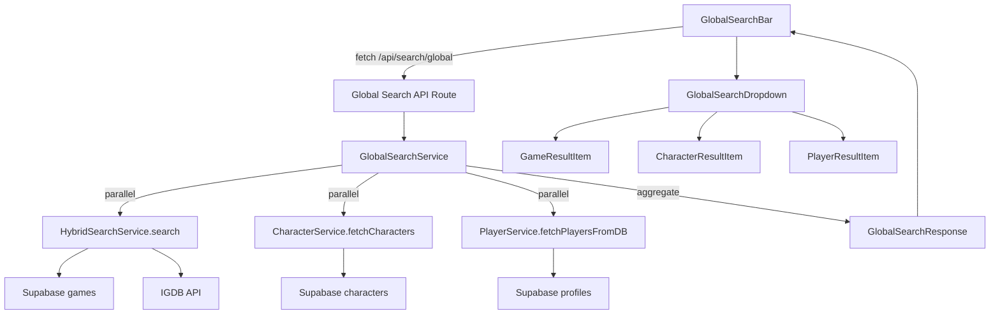

# Design — Recherche globale

## Overview

La recherche globale étend le système de recherche hybride existant (jeux
uniquement) pour couvrir trois entités : jeux, personnages et joueurs.
L'architecture repose sur un nouveau service `GlobalSearchService` qui orchestre
les recherches en parallèle, un endpoint API unifié `/api/search/global`, et un
composant `GlobalSearchBar` avec dropdown groupé par catégorie et navigation au
clavier.

L'approche privilégie la réutilisation des services existants
(`HybridSearchService`, `CharacterService`, `PlayerService`) plutôt que de
reconstruire la logique de recherche.

## Architecture



Le flux est le suivant :

1. L'utilisateur saisit du texte dans `GlobalSearchBar`
2. Après 300 ms de debounce, un appel GET est envoyé à
   `/api/search/global?query=...&locale=...`
3. `GlobalSearchService` lance les trois recherches en parallèle via
   `Promise.allSettled`
4. Les résultats sont agrégés dans un objet typé `GlobalSearchResponse` avec
   trois tableaux distincts
5. Le dropdown affiche les résultats groupés par catégorie avec navigation au
   clavier

## Components and Interfaces

### Backend

**`GlobalSearchService`** (`src/lib/services/globalSearchService.ts`)

- Orchestre les recherches parallèles sur les trois entités
- Réutilise `HybridSearchService` pour les jeux (conserve l'intégration IGDB)
- Réutilise `CharacterService.fetchCharacters` pour les personnages
- Réutilise `PlayerService.fetchPlayersFromDB` pour les joueurs
- Gère la tolérance aux pannes : si une source échoue, les autres continuent

```typescript
class GlobalSearchService {
  static async search(
    options: GlobalSearchOptions
  ): Promise<GlobalSearchResult>;
  static toGlobalSearchResponse(
    result: GlobalSearchResult
  ): GlobalSearchResponse;
}
```

**`Global Search API Route`** (`src/app/api/search/global/route.ts`)

- GET endpoint avec paramètres : `query`, `locale`, `gamesLimit`,
  `charactersLimit`, `playersLimit`
- Validation : query ≥ 2 caractères
- Retourne `GlobalSearchResponse`

### Frontend

**`GlobalSearchBar`** (`src/components/shared/GlobalSearchBar.tsx`)

- Composant principal : champ de saisie + gestion du debounce + état de la
  recherche
- Remplace `GameSearchBar` dans le `DashboardHeader`
- Délègue l'affichage du dropdown à `GlobalSearchDropdown`
- Gère la navigation au clavier (flèches, Entrée, Échap)
- < 150 lignes — la logique de recherche est extraite dans un hook

**`useGlobalSearch`** (`src/hooks/useGlobalSearch.ts`)

- Hook custom encapsulant la logique de recherche : debounce, fetch, abort, état
- Retourne :
  `{ query, setQuery, results, isLoading, isOpen, setIsOpen, activeIndex, handlers }`

**`GlobalSearchDropdown`** (`src/components/shared/GlobalSearchDropdown.tsx`)

- Affiche les résultats groupés par catégorie (jeux, personnages, joueurs)
- Masque les catégories vides
- Affiche un message « aucun résultat » si toutes les catégories sont vides
- Gère le highlight de l'élément actif (navigation clavier)

**`GlobalSearchGameItem`** (`src/components/shared/GlobalSearchGameItem.tsx`)

- Affiche un résultat de type jeu : couverture, titre, développeur, année, badge
  source

**`GlobalSearchCharacterItem`**
(`src/components/shared/GlobalSearchCharacterItem.tsx`)

- Affiche un résultat de type personnage : image, nom, rôle, jeu principal

**`GlobalSearchPlayerItem`**
(`src/components/shared/GlobalSearchPlayerItem.tsx`)

- Affiche un résultat de type joueur : avatar, nom d'utilisateur

### Interactions clavier

| Touche | Action                                         |
| ------ | ---------------------------------------------- |
| ↓      | Sélection suivante (traverse les catégories)   |
| ↑      | Sélection précédente (traverse les catégories) |
| Entrée | Naviguer vers l'entité sélectionnée            |
| Échap  | Fermer le dropdown                             |

L'index actif est un entier unique sur la liste aplatie de tous les résultats
(jeux + personnages + joueurs). La navigation traverse les catégories de manière
transparente.

## Data Models

### Types partagés (`src/types/global-search.ts`)

```typescript
/** Requête de recherche globale */
interface GlobalSearchRequest {
  query: string;
  locale?: string;
  gamesLimit?: number;
  charactersLimit?: number;
  playersLimit?: number;
}

/** Réponse de la recherche globale */
interface GlobalSearchResponse {
  games: GlobalSearchGameItem[];
  characters: GlobalSearchCharacterItem[];
  players: GlobalSearchPlayerItem[];
  counts: {
    games: number;
    characters: number;
    players: number;
  };
}

/** Résultat jeu dans la recherche globale */
interface GlobalSearchGameItem {
  id: string;
  igdbId?: number;
  slug: string;
  title: string;
  coverUrl?: string;
  developer?: string;
  releaseYear?: number;
  source: "local" | "igdb";
}

/** Résultat personnage dans la recherche globale */
interface GlobalSearchCharacterItem {
  id: string;
  slug: string;
  name: string;
  mainImage?: string;
  role?: string;
  primaryGame?: string;
}

/** Résultat joueur dans la recherche globale */
interface GlobalSearchPlayerItem {
  id: string;
  username: string;
  avatarUrl?: string;
}
```

### Résultat interne du service (`GlobalSearchResult`)

```typescript
/** Résultat brut avant transformation en réponse API */
interface GlobalSearchResult {
  games: { local: GameSummary[]; igdb: IGDBSearchResult[] };
  characters: CharacterSummary[];
  players: PlayerSummary[];
  errors: string[]; // sources ayant échoué, pour logging
}
```

Aucune migration de base de données n'est nécessaire. Les recherches utilisent
les tables et index existants (`games`, `characters`, `profiles`).

### Clés i18n (`src/messages/fr.json` et `en.json`)

Nouvelles clés sous `"globalSearch"` :

```json
{
  "globalSearch": {
    "placeholder": "Rechercher jeux, personnages, joueurs...",
    "noResults": "Aucun résultat trouvé",
    "loading": "Recherche en cours...",
    "categories": {
      "games": "Jeux",
      "characters": "Personnages",
      "players": "Joueurs"
    },
    "source": {
      "local": "En bibliothèque",
      "igdb": "IGDB"
    }
  }
}
```

## Correctness Properties

_A property is a characteristic or behavior that should hold true across all
valid executions of a system — essentially, a formal statement about what the
system should do. Properties serve as the bridge between human-readable
specifications and machine-verifiable correctness guarantees._

### Property 1: Multi-entity search aggregation

_For any_ query string of 2+ characters and any backing data across games,
characters, and players, the `GlobalSearchService.search` result SHALL contain
arrays for all three categories, and each array SHALL only contain entities
whose name/title matches the query.

**Validates: Requirements 1.1**

### Property 2: Short query rejection

_For any_ string of length 0 or 1 (including whitespace-only strings trimmed to
< 2 chars), the `Global_Search_API` SHALL return a 400 error and SHALL NOT
execute any search.

**Validates: Requirements 1.4**

### Property 3: Fault tolerance with partial results

_For any_ combination of source failures (games, characters, players — 1, 2, or
all 3 failing), the `GlobalSearchService.search` SHALL return results from the
non-failing sources and empty arrays for the failing sources, without throwing
an error.

**Validates: Requirements 1.5**

### Property 4: Per-category limit enforcement

_For any_ query and any limit configuration (gamesLimit, charactersLimit,
playersLimit), the number of results in each category of the response SHALL be
less than or equal to the configured limit for that category.

**Validates: Requirements 2.5**

### Property 5: Keyboard navigation index management

_For any_ flat list of N results (N > 0) and any current active index, pressing
Arrow Down SHALL move the index to `(current + 1)` clamped to `N - 1`, and
pressing Arrow Up SHALL move the index to `(current - 1)` clamped to `0`. The
index SHALL always remain in the range `[-1, N - 1]` where -1 means no
selection.

**Validates: Requirements 4.1, 4.2**

### Property 6: Result-to-URL mapping

_For any_ search result item and any locale, the generated navigation URL SHALL
match the expected pattern:

- Game (local): `/{locale}/games/{slug}`
- Character: `/{locale}/characters/{slug}`
- Player: `/{locale}/players/{id}`

**Validates: Requirements 4.3, 5.1, 5.3, 5.4**

### Property 7: Entity transformation completeness

_For any_ `GameSummary` (or `IGDBSearchResult`), `CharacterSummary`, or
`PlayerSummary`, the transformation to `GlobalSearchGameItem`,
`GlobalSearchCharacterItem`, or `GlobalSearchPlayerItem` SHALL preserve all
required display fields (title/name, image, and type-specific fields like
developer, role, primaryGame, username).

**Validates: Requirements 6.1, 6.2, 6.3**

### Property 8: Response counts consistency

_For any_ valid `GlobalSearchResponse`, the `counts.games` SHALL equal
`games.length`, `counts.characters` SHALL equal `characters.length`, and
`counts.players` SHALL equal `players.length`.

**Validates: Requirements 8.2**

### Property 9: Response serialization round-trip

_For any_ valid `GlobalSearchResponse` object,
`JSON.parse(JSON.stringify(response))` SHALL produce an object deeply equal to
the original.

**Validates: Requirements 8.4**

## Error Handling

| Scénario                                 | Comportement                                                                                 |
| ---------------------------------------- | -------------------------------------------------------------------------------------------- |
| Query < 2 caractères                     | API retourne 400 avec message d'erreur                                                       |
| Une source échoue (ex: IGDB timeout)     | Les autres sources retournent leurs résultats normalement ; l'erreur est loguée côté serveur |
| Toutes les sources échouent              | API retourne 200 avec des tableaux vides et counts à 0                                       |
| Requête réseau annulée (AbortController) | Le fetch est annulé silencieusement, pas d'erreur affichée                                   |
| Erreur serveur inattendue                | API retourne 500 avec message générique ; le dropdown affiche un état d'erreur               |

Le `GlobalSearchService` utilise `Promise.allSettled` pour garantir que la
défaillance d'une source n'affecte pas les autres. Les erreurs sont collectées
dans le champ `errors` du résultat interne pour le logging.

## Testing Strategy

### Property-Based Tests

Bibliothèque : **fast-check** (compatible Bun test runner)

Chaque propriété du design est implémentée comme un test property-based avec
minimum 100 itérations. Les tests sont placés dans
`test/unit/lib/services/globalSearchService.property.test.ts` et
`test/unit/hooks/useGlobalSearch.property.test.ts`.

Format de tag : `Feature: global-search, Property N: <titre>`

| Property                        | Fichier de test                        | Générateurs                                              |
| ------------------------------- | -------------------------------------- | -------------------------------------------------------- |
| 1 — Multi-entity aggregation    | `globalSearchService.property.test.ts` | Requêtes aléatoires, données de jeux/personnages/joueurs |
| 2 — Short query rejection       | `globalSearchService.property.test.ts` | Chaînes de 0-1 caractères                                |
| 3 — Fault tolerance             | `globalSearchService.property.test.ts` | Combinaisons de sources en échec                         |
| 4 — Limit enforcement           | `globalSearchService.property.test.ts` | Requêtes avec limites aléatoires                         |
| 5 — Keyboard navigation         | `useGlobalSearch.property.test.ts`     | Listes de taille aléatoire, index aléatoires             |
| 6 — URL mapping                 | `useGlobalSearch.property.test.ts`     | Résultats de types variés, locales aléatoires            |
| 7 — Transformation completeness | `globalSearchService.property.test.ts` | Entités aléatoires de chaque type                        |
| 8 — Counts consistency          | `globalSearchService.property.test.ts` | Réponses avec nombres aléatoires de résultats            |
| 9 — Serialization round-trip    | `globalSearchService.property.test.ts` | Réponses GlobalSearchResponse aléatoires                 |

### Unit Tests

Les tests unitaires couvrent les cas spécifiques et edge cases :

- `test/unit/lib/services/globalSearchService.test.ts` : transformation des
  entités, déduplication IGDB, gestion des champs optionnels manquants
- `test/unit/hooks/useGlobalSearch.test.ts` : logique de debounce, gestion de
  l'état open/close
- `test/unit/components/shared/GlobalSearchDropdown.test.tsx` : rendu des
  catégories, masquage des catégories vides, message « aucun résultat »

### Approche complémentaire

- Les **property tests** vérifient les invariants universels (limites,
  transformations, navigation)
- Les **unit tests** vérifient les exemples concrets, les edge cases (champs
  null, tableaux vides) et les intégrations de composants
- Ensemble, ils assurent une couverture complète de la logique métier et de
  l'interface
