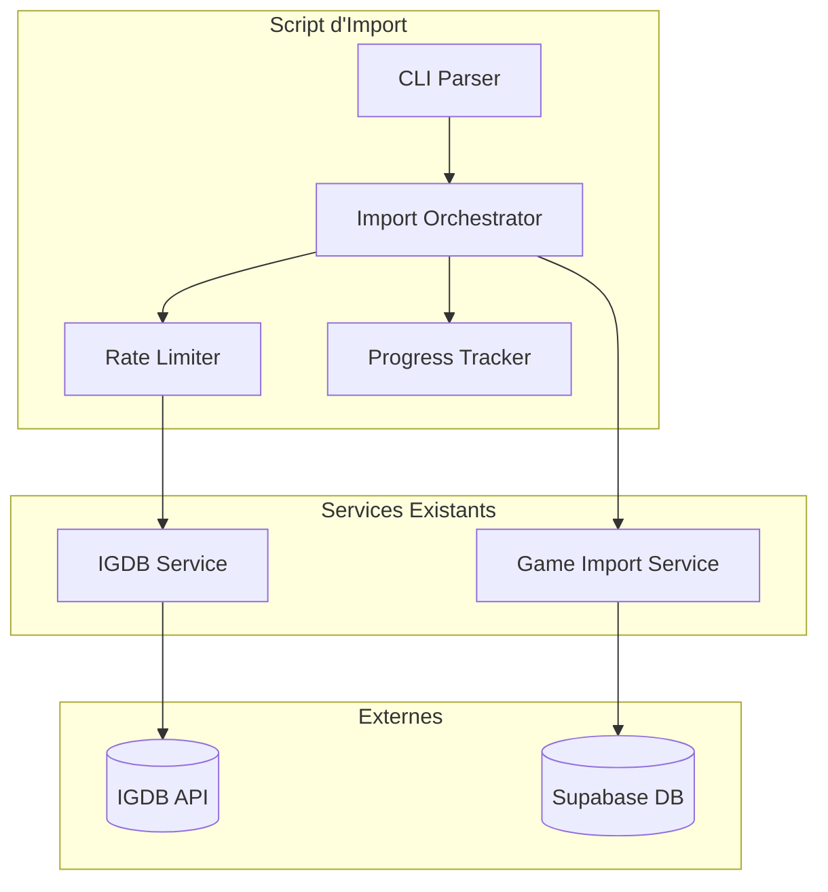

# Document de Conception

## Vue d'ensemble

Ce document décrit la conception technique du script d'import en masse des jeux
IGDB. Le script sera un fichier TypeScript standalone exécutable avec Bun,
réutilisant les services existants (`IGDBService`, `GameImportService`) tout en
ajoutant la logique de pagination, rate limiting et gestion des erreurs
nécessaire pour un import en masse.

## Architecture



## Composants et Interfaces

### 1. CLI Parser

Gère les arguments de ligne de commande.

```typescript
interface CLIOptions {
  dryRun: boolean; // Simulation sans écriture
  limit?: number; // Nombre max de jeux à importer
  offset?: number; // Offset de départ pour la pagination
  verbose: boolean; // Mode verbeux
}

function parseArgs(args: string[]): CLIOptions;
```

### 2. Rate Limiter

Contrôle le débit des requêtes vers l'API IGDB (max 4 req/s).

```typescript
class RateLimiter {
  private requestTimes: number[] = [];
  private readonly maxRequests: number = 4;
  private readonly windowMs: number = 1000;

  async throttle(): Promise<void>;
}
```

### 3. Import Orchestrator

Coordonne l'ensemble du processus d'import.

```typescript
interface ImportStats {
  total: number;
  imported: number;
  skipped: number;
  errors: number;
  startTime: Date;
  endTime?: Date;
}

class ImportOrchestrator {
  private stats: ImportStats;
  private rateLimiter: RateLimiter;

  async run(options: CLIOptions): Promise<ImportStats>;
  private async fetchGamesBatch(
    offset: number,
    limit: number
  ): Promise<IGDBGame[]>;
  private async processGame(game: IGDBGame, dryRun: boolean): Promise<void>;
}
```

### 4. Progress Tracker

Affiche la progression en temps réel.

```typescript
class ProgressTracker {
  private current: number = 0;
  private total: number;
  private startTime: Date;

  update(
    current: number,
    stats: { imported: number; skipped: number; errors: number }
  ): void;
  finish(stats: ImportStats): void;
}
```

## Modèles de Données

### Requête IGDB pour les jeux des 10 dernières années

```
fields name, slug, summary, storyline, first_release_date, aggregated_rating,
       cover.image_id,
       screenshots.image_id,
       artworks.image_id,
       genres.id, genres.name, genres.slug,
       involved_companies.company.id, involved_companies.company.name, involved_companies.company.slug,
       involved_companies.developer, involved_companies.publisher,
       language_supports.language.id, language_supports.language.name, language_supports.language.native_name, language_supports.language.locale,
       language_supports.language_support_type.id, language_supports.language_support_type.name,
       age_ratings.id, age_ratings.organization, age_ratings.rating_category, age_ratings.synopsis,
       age_ratings.rating_content_descriptions;
where first_release_date >= {timestamp_10_years_ago} & first_release_date <= {timestamp_now};
sort first_release_date desc;
limit 500;
offset {offset};
```

### Structure de sauvegarde de progression

```typescript
interface CheckpointData {
  lastOffset: number;
  lastIgdbId: number;
  stats: ImportStats;
  timestamp: Date;
}
```

## Propriétés de Correction

_Une propriété est une caractéristique ou un comportement qui doit rester vrai
pour toutes les exécutions valides d'un système - essentiellement, une
déclaration formelle de ce que le système doit faire. Les propriétés servent de
pont entre les spécifications lisibles par l'humain et les garanties de
correction vérifiables par la machine._

### Property 1: Rate Limiting Respecté

_Pour toute_ séquence de N requêtes effectuées par le RateLimiter, le temps
écoulé entre la première et la dernière requête doit être au moins (N-1) / 4
secondes.

**Validates: Requirements 2.4**

### Property 2: Retry avec Backoff Exponentiel

_Pour toute_ requête qui échoue, le nombre de tentatives ne doit pas dépasser 3,
et le délai entre chaque tentative doit suivre un backoff exponentiel
(délai_n >= délai_n-1 \* 2).

**Validates: Requirements 2.5**

### Property 3: Gestion des Doublons

_Pour tout_ jeu avec un igdb_id déjà présent dans la base de données, l'import
doit incrémenter le compteur "skipped" et ne pas créer de nouvelle entrée.

**Validates: Requirements 3.8**

### Property 4: Résilience aux Erreurs

_Pour toute_ erreur survenant lors de l'import d'un jeu, le script doit
continuer avec le jeu suivant et incrémenter le compteur "errors".

**Validates: Requirements 4.1**

### Property 5: Invariant des Statistiques

_Pour toute_ exécution du script, la somme (imported + skipped + errors) doit
être égale au nombre total de jeux traités.

**Validates: Requirements 4.4, 5.2, 5.4**

### Property 6: Mode Dry-Run

_Pour toute_ exécution avec l'option --dry-run, aucune écriture ne doit être
effectuée dans la base de données et le compteur "imported" doit rester à 0.

**Validates: Requirements 6.2**

### Property 7: Option Limit

_Pour toute_ exécution avec l'option --limit=N, le nombre total de jeux traités
ne doit pas dépasser N.

**Validates: Requirements 6.3**

### Property 8: Option Offset

_Pour toute_ exécution avec l'option --offset=M, les M premiers jeux de la liste
IGDB doivent être ignorés.

**Validates: Requirements 6.4**

## Gestion des Erreurs

### Erreurs d'Authentification

- Si les credentials sont manquants : afficher un message explicite et terminer
  avec code 1
- Si l'authentification Twitch échoue : afficher l'erreur et terminer avec code
  1

### Erreurs de Requête IGDB

- Timeout : retry avec backoff exponentiel (max 3 tentatives)
- Rate limit (429) : attendre et réessayer
- Erreur serveur (5xx) : retry avec backoff exponentiel
- Erreur client (4xx autre que 429) : logger et passer au batch suivant

### Erreurs d'Insertion Supabase

- Contrainte de clé unique (jeu existant) : incrémenter "skipped", continuer
- Erreur de connexion : retry avec backoff
- Autre erreur : logger avec contexte, incrémenter "errors", continuer

### Interruption du Script

- Signal SIGINT/SIGTERM : sauvegarder le checkpoint et terminer proprement
- Crash inattendu : le checkpoint permet de reprendre

## Stratégie de Test

### Tests Unitaires

1. **CLIParser** : Tester le parsing des arguments (--dry-run, --limit,
   --offset)
2. **RateLimiter** : Tester que le throttling respecte les limites
3. **ProgressTracker** : Tester le calcul des statistiques

### Tests Property-Based

Utiliser `fast-check` pour les tests property-based avec minimum 100 itérations
par test.

1. **Property 1** : Générer des séquences de requêtes et vérifier le timing
2. **Property 5** : Générer des scénarios d'import avec succès/échecs/doublons
   et vérifier l'invariant des stats
3. **Property 7** : Générer des valeurs de limit et vérifier le nombre de jeux
   traités

### Tests d'Intégration

1. **Import complet** : Tester l'import d'un petit batch de jeux réels
2. **Reprise après interruption** : Tester la sauvegarde et le rechargement du
   checkpoint
3. **Mode dry-run** : Vérifier qu'aucune donnée n'est écrite

### Configuration des Tests

```typescript
// Tag format pour les tests property-based
// Feature: igdb-bulk-import, Property N: {property_text}

import fc from "fast-check";

// Exemple de test pour Property 5
fc.assert(
  fc.property(
    fc.array(fc.constantFrom("success", "skip", "error"), {
      minLength: 1,
      maxLength: 100,
    }),
    (outcomes) => {
      const stats = simulateImport(outcomes);
      return stats.imported + stats.skipped + stats.errors === outcomes.length;
    }
  ),
  { numRuns: 100 }
);
```
