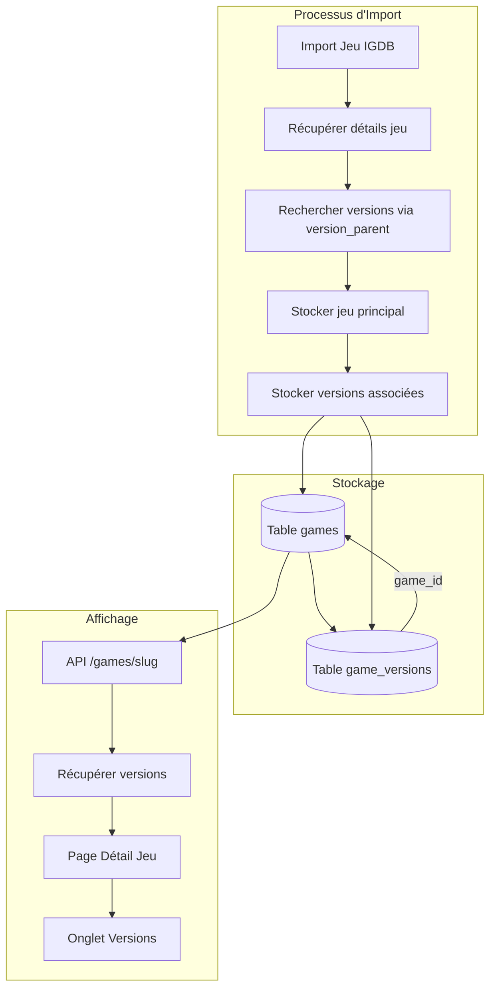

# Document de Conception

## Vue d'ensemble

Cette fonctionnalité étend le système d'import IGDB existant pour récupérer et
stocker les différentes versions (éditions) d'un jeu. Les versions sont des
variantes d'un même jeu de base, comme les éditions Collector, Deluxe, GOTY,
Complete Edition, etc.

Sur l'API IGDB, les versions sont identifiées via :

- `version_parent` : l'ID du jeu parent (le jeu de base)
- `version_title` : le nom de la version (ex: "Collector's Edition")

L'approche consiste à :

1. Lors de l'import d'un jeu, rechercher tous les jeux qui ont ce jeu comme
   `version_parent`
2. Stocker ces versions dans une table dédiée `game_versions`
3. Afficher les versions dans un nouvel onglet sur la page de détail du jeu

## Architecture



## Composants et Interfaces

### 1. Extension du Service IGDB

Ajouter une méthode pour récupérer les versions d'un jeu :

```typescript
// src/lib/services/igdbService.ts

interface IGDBGameVersion {
  id: number;
  name: string;
  slug: string;
  version_title: string | null;
  cover?: { image_id: string };
}

class IGDBService {
  /**
   * Récupère toutes les versions d'un jeu depuis IGDB
   * @param igdbId L'ID IGDB du jeu parent
   * @returns Liste des versions trouvées
   */
  static async getGameVersions(igdbId: number): Promise<IGDBGameVersion[]> {
    const accessToken = await this.getAccessToken();
    const clientId = process.env.IGDB_CLIENT_ID;

    const body = `
      fields id, name, slug, version_title, cover.image_id;
      where version_parent = ${igdbId};
      limit 50;
    `;

    const response = await fetch(`${this.IGDB_API_URL}/games`, {
      method: "POST",
      headers: {
        "Client-ID": clientId,
        Authorization: `Bearer ${accessToken}`,
        "Content-Type": "text/plain",
      },
      body,
    });

    if (!response.ok) {
      return [];
    }

    return response.json();
  }
}
```

### 2. Extension du Game Importer

Modifier `game-importer.ts` pour importer les versions :

```typescript
// scripts/igdb-import/game-importer.ts

async function importGameVersions(
  gameId: string,
  igdbId: number,
  verbose: boolean
): Promise<number> {
  const versions = await IGDBService.getGameVersions(igdbId);

  if (versions.length === 0) {
    return 0;
  }

  const supabase = createScriptClient();
  let importedCount = 0;

  for (let i = 0; i < versions.length; i++) {
    const version = versions[i];
    const coverUrl = version.cover?.image_id
      ? IGDBService.buildImageUrl(version.cover.image_id, "cover_big")
      : null;

    const { error } = await supabase.from("game_versions").upsert(
      {
        game_id: gameId,
        igdb_id: version.id,
        version_title: version.version_title || version.name,
        cover_image_url: coverUrl,
        display_order: i,
      },
      {
        onConflict: "game_id,igdb_id",
      }
    );

    if (!error) {
      importedCount++;
    }
  }

  return importedCount;
}
```

### 3. Extension de l'API de détail du jeu

Modifier `/api/games/[slug]/route.ts` pour inclure les versions :

```typescript
// Récupérer les versions
const { data: versions } = await supabase
  .from("game_versions")
  .select("id, igdb_id, version_title, cover_image_url, display_order")
  .eq("game_id", game.id)
  .order("display_order", { ascending: true });

// Ajouter au résultat
const transformedGame = {
  // ... autres champs existants
  versions:
    versions?.map((v) => ({
      id: v.id,
      igdbId: v.igdb_id,
      title: v.version_title,
      coverImageUrl: v.cover_image_url,
    })) || [],
};
```

### 4. Composant React pour l'affichage

```typescript
// src/components/games/GameVersions.tsx

interface GameVersion {
  id: string;
  igdbId: number;
  title: string;
  coverImageUrl: string | null;
}

interface GameVersionsProps {
  versions: GameVersion[];
  accentColor: string;
}

export function GameVersions({ versions, accentColor }: GameVersionsProps) {
  if (!versions || versions.length === 0) {
    return null;
  }

  return (
    <div className="space-y-4">
      <div className="grid grid-cols-2 gap-4 md:grid-cols-3 lg:grid-cols-4">
        {versions.map((version) => (
          <div
            key={version.id}
            className="rounded-xl border border-slate-700 bg-slate-800/50 p-4"
          >
            {version.coverImageUrl && (
              <div className="relative aspect-3/4 mb-3 overflow-hidden rounded-lg">
                <Image
                  src={version.coverImageUrl}
                  alt={version.title}
                  fill
                  className="object-cover"
                />
              </div>
            )}
            <h4 className="text-sm font-medium text-white truncate">
              {version.title}
            </h4>
          </div>
        ))}
      </div>
    </div>
  );
}
```

## Modèles de Données

### Table `game_versions`

```sql
CREATE TABLE public.game_versions (
  id UUID PRIMARY KEY DEFAULT gen_random_uuid(),
  game_id UUID NOT NULL REFERENCES games(id) ON DELETE CASCADE,
  igdb_id INTEGER NOT NULL,
  version_title VARCHAR(255) NOT NULL,
  cover_image_url TEXT,
  display_order INTEGER DEFAULT 0,
  created_at TIMESTAMP DEFAULT NOW(),
  UNIQUE(game_id, igdb_id)
);

-- Index pour les performances
CREATE INDEX idx_game_versions_game_id ON game_versions(game_id);
CREATE INDEX idx_game_versions_igdb_id ON game_versions(igdb_id);

-- RLS Policies
ALTER TABLE game_versions ENABLE ROW LEVEL SECURITY;

CREATE POLICY "Allow public read access to game_versions"
  ON game_versions FOR SELECT
  USING (true);

CREATE POLICY "Allow service role full access to game_versions"
  ON game_versions FOR ALL
  USING (auth.role() = 'service_role');
```

### Extension du type TypeScript

```typescript
// src/types/game.ts

export interface GameVersion {
  id: string;
  igdbId: number;
  title: string;
  coverImageUrl: string | null;
}

export interface GameDetails {
  // ... champs existants
  versions?: GameVersion[];
}
```

### Extension du type IGDB

```typescript
// src/types/igdb.ts

export interface IGDBGameVersion {
  id: number;
  name: string;
  slug: string;
  version_title: string | null;
  cover?: { image_id: string };
}
```

## Propriétés de Correction

_Une propriété est une caractéristique ou un comportement qui doit rester vrai
pour toutes les exécutions valides d'un système - essentiellement, une
déclaration formelle de ce que le système doit faire. Les propriétés servent de
pont entre les spécifications lisibles par l'humain et les garanties de
correction vérifiables par la machine._

### Property 1: Extraction correcte des données de version

_Pour toute_ réponse IGDB contenant des versions de jeu, l'extraction doit
produire des objets avec les champs `igdb_id`, `version_title` (ou `name` si
`version_title` est null), et `cover_image_url` (ou null si pas de cover).

**Validates: Requirements 1.2**

### Property 2: Idempotence de l'import des versions

_Pour tout_ jeu avec des versions, importer les versions deux fois
consécutivement doit produire le même nombre de versions en base de données
qu'un seul import (pas de doublons créés).

**Validates: Requirements 2.4**

### Property 3: Association et ordonnancement des versions

_Pour toute_ liste de versions importées pour un jeu, chaque version doit être
associée au jeu parent via `game_id`, et les versions doivent être ordonnées par
`display_order` croissant correspondant à leur ordre d'apparition dans la
réponse IGDB.

**Validates: Requirements 2.2, 2.3**

### Property 4: Affichage correct des versions

_Pour tout_ jeu ayant des versions, le composant d'affichage doit rendre chaque
version avec son titre et son image de couverture, dans l'ordre défini par
`display_order`.

**Validates: Requirements 3.2, 3.4**

### Property 5: Structure complète de la réponse API

_Pour tout_ appel à l'API de détail d'un jeu, la réponse doit contenir un champ
`versions` qui est un tableau, et chaque élément du tableau doit contenir les
champs `id`, `title`, et `coverImageUrl`.

**Validates: Requirements 5.1, 5.2**

## Gestion des Erreurs

### Erreurs API IGDB

| Erreur                                       | Comportement                                              |
| -------------------------------------------- | --------------------------------------------------------- |
| Timeout lors de la récupération des versions | Logger l'erreur, continuer l'import du jeu sans versions  |
| Réponse invalide de l'API                    | Logger l'erreur, retourner un tableau vide de versions    |
| Rate limit atteint                           | Attendre et réessayer (géré par le rate limiter existant) |

### Erreurs Base de Données

| Erreur                         | Comportement                                        |
| ------------------------------ | --------------------------------------------------- |
| Violation de contrainte unique | Ignorer (version déjà existante)                    |
| Erreur d'insertion             | Logger l'erreur, continuer avec les autres versions |
| Jeu parent inexistant          | Ne pas importer les versions (contrainte FK)        |

### Erreurs Frontend

| Erreur                        | Comportement                               |
| ----------------------------- | ------------------------------------------ |
| Versions undefined            | Afficher rien (composant retourne null)    |
| Image de couverture manquante | Afficher un placeholder ou masquer l'image |

## Stratégie de Test

### Tests Unitaires

Les tests unitaires couvriront :

- Transformation des données IGDB vers le format interne
- Comportement du composant GameVersions avec différentes props
- Cas limites : versions vides, données manquantes

### Tests Property-Based

Utiliser `fast-check` pour les tests property-based avec minimum 100 itérations
par test.

**Configuration** :

```typescript
import fc from "fast-check";

// Générateur de version IGDB
const igdbVersionArb = fc.record({
  id: fc.integer({ min: 1 }),
  name: fc.string({ minLength: 1, maxLength: 100 }),
  slug: fc.string({ minLength: 1, maxLength: 100 }),
  version_title: fc.option(fc.string({ minLength: 1, maxLength: 100 })),
  cover: fc.option(
    fc.record({ image_id: fc.string({ minLength: 5, maxLength: 20 }) })
  ),
});

// Générateur de liste de versions
const igdbVersionsArb = fc.array(igdbVersionArb, {
  minLength: 0,
  maxLength: 20,
});
```

**Tests à implémenter** :

1. **Property 1** : Tester `extractVersionData()` avec des réponses IGDB
   générées
2. **Property 2** : Tester l'import deux fois et vérifier le count en base
3. **Property 3** : Tester que les versions sont bien liées et ordonnées
4. **Property 4** : Tester le rendu du composant avec des versions générées
5. **Property 5** : Tester la structure de la réponse API

### Tests d'Intégration

- Import d'un jeu avec versions via le script
- Appel API et vérification de la réponse complète
- Affichage sur la page de détail (test E2E optionnel)
