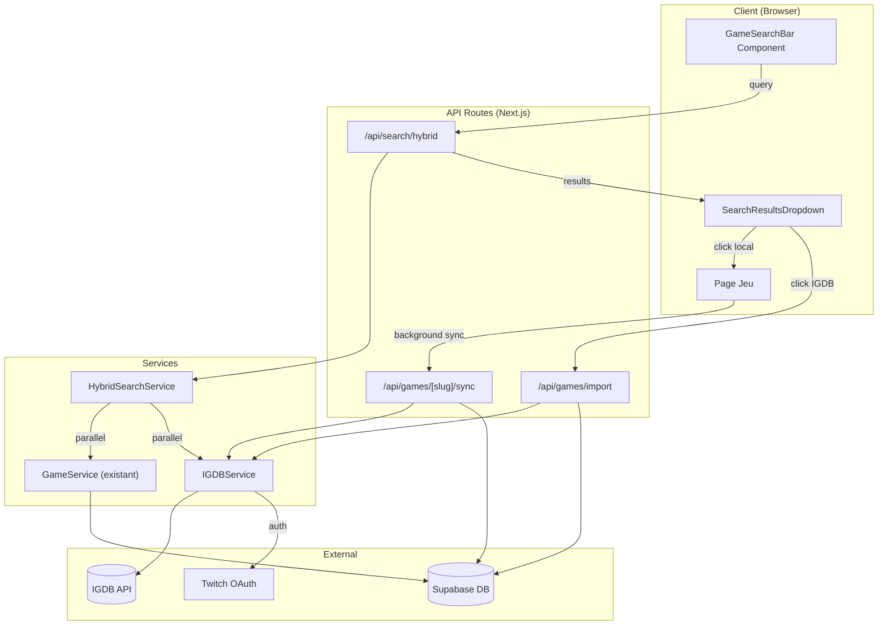

# Document de Design : Recherche Hybride IGDB

## Vue d'ensemble

Cette fonctionnalité implémente un système de recherche hybride qui combine les
résultats de la base de données Supabase locale avec l'API IGDB externe.
L'architecture suit un pattern de recherche parallèle avec agrégation et
déduplication des résultats, permettant une expérience utilisateur fluide tout
en enrichissant progressivement la base de données locale.

### Principes de Design

1. **Recherche Parallèle** : Les deux sources sont interrogées simultanément
   pour minimiser la latence
2. **Priorité Locale** : Les jeux existants en base sont toujours affichés en
   premier
3. **Enrichissement Progressif** : La base locale s'enrichit automatiquement via
   les interactions utilisateur
4. **Résilience** : Le système reste fonctionnel même si une source est
   indisponible

## Architecture



## Composants et Interfaces

### 1. IGDBService

Service responsable de toute communication avec l'API IGDB.

```typescript
// src/lib/services/igdbService.ts

interface IGDBAuthToken {
  access_token: string;
  expires_in: number;
  token_type: string;
  expires_at: number; // timestamp calculé
}

interface IGDBGame {
  id: number;
  name: string;
  slug: string;
  summary?: string;
  storyline?: string;
  first_release_date?: number; // Unix timestamp
  cover?: { image_id: string };
  screenshots?: Array<{ image_id: string }>;
  artworks?: Array<{ image_id: string }>;
  genres?: Array<{ id: number; name: string; slug: string }>;
  involved_companies?: Array<{
    company: { id: number; name: string; slug: string };
    developer: boolean;
    publisher: boolean;
  }>;
  aggregated_rating?: number;
}

interface IGDBSearchResult {
  id: number;
  name: string;
  slug: string;
  cover_url?: string;
  release_year?: number;
  developer?: string;
}

class IGDBService {
  private static tokenCache: IGDBAuthToken | null = null;

  // Authentification via Twitch OAuth
  static async getAccessToken(): Promise<string>;

  // Recherche de jeux par nom
  static async searchGames(
    query: string,
    limit?: number
  ): Promise<IGDBSearchResult[]>;

  // Récupération des détails complets d'un jeu
  static async getGameDetails(igdbId: number): Promise<IGDBGame | null>;

  // Construction des URLs d'images IGDB
  static buildImageUrl(imageId: string, size: IGDBImageSize): string;
}

type IGDBImageSize =
  | "cover_small" // 90x128
  | "cover_big" // 264x374
  | "screenshot_big" // 889x500
  | "1080p" // 1920x1080
  | "720p"; // 1280x720
```

### 2. HybridSearchService

Service orchestrant la recherche parallèle et l'agrégation des résultats.

```typescript
// src/lib/services/hybridSearchService.ts

interface HybridSearchResult {
  localGames: GameSummary[];
  igdbGames: IGDBSearchResult[];
  hasMore: boolean;
}

interface SearchOptions {
  query: string;
  locale?: string;
  localLimit?: number;
  igdbLimit?: number;
}

class HybridSearchService {
  // Recherche parallèle dans les deux sources
  static async search(options: SearchOptions): Promise<HybridSearchResult>;

  // Déduplication basée sur l'ID IGDB
  private static deduplicateResults(
    localGames: GameSummary[],
    igdbGames: IGDBSearchResult[]
  ): IGDBSearchResult[];
}
```

### 3. GameImportService

Service gérant l'import et la synchronisation des jeux depuis IGDB.

```typescript
// src/lib/services/gameImportService.ts

interface ImportResult {
  success: boolean;
  game?: GameDetails;
  error?: string;
}

class GameImportService {
  // Importe un nouveau jeu depuis IGDB vers Supabase
  static async importFromIGDB(igdbId: number): Promise<ImportResult>;

  // Met à jour un jeu existant avec les données IGDB
  static async syncWithIGDB(
    gameId: string,
    igdbId: number
  ): Promise<ImportResult>;

  // Transforme les données IGDB vers le format Supabase
  private static transformIGDBToSupabase(igdbGame: IGDBGame): GameInsertData;

  // Gère la création/association des entités liées (genres, companies)
  private static ensureRelatedEntities(
    igdbGame: IGDBGame
  ): Promise<RelatedEntities>;
}
```

### 4. Composants UI

#### SearchResultsDropdown

```typescript
// src/components/games/SearchResultsDropdown.tsx

interface SearchResultItem {
  id: string;
  igdbId?: number;
  slug: string;
  title: string;
  coverUrl?: string;
  developer?: string;
  releaseYear?: number;
  source: "local" | "igdb";
}

interface SearchResultsDropdownProps {
  results: SearchResultItem[];
  isLoading: boolean;
  hasMore: boolean;
  onSelectGame: (item: SearchResultItem) => void;
  onSeeAll: () => void;
  onClose: () => void;
}
```

#### GameSearchBar (mise à jour)

```typescript
// src/components/games/GameSearchBar.tsx (modifié)

interface GameSearchBarProps {
  placeholder?: string;
  initialValue?: string;
  debounceMs?: number;
  locale?: string;
  onNavigateToGame?: (slug: string) => void;
}

// Le composant gère maintenant:
// - L'état de recherche hybride
// - L'affichage du dropdown
// - La navigation vers les jeux
// - L'import des jeux IGDB
```

## Modèles de Données

### Extension du schéma Supabase

```sql
-- Ajout de la colonne igdb_id à la table games
ALTER TABLE games ADD COLUMN IF NOT EXISTS igdb_id INTEGER UNIQUE;
CREATE INDEX IF NOT EXISTS idx_games_igdb_id ON games(igdb_id);

-- Table pour le cache des tokens IGDB (optionnel, peut être en mémoire)
CREATE TABLE IF NOT EXISTS igdb_auth_cache (
  id UUID PRIMARY KEY DEFAULT gen_random_uuid(),
  access_token TEXT NOT NULL,
  expires_at TIMESTAMPTZ NOT NULL,
  created_at TIMESTAMPTZ DEFAULT NOW()
);
```

### Types TypeScript étendus

```typescript
// src/types/game.ts (extensions)

export interface GameSummary {
  // ... champs existants ...
  igdbId?: number;
  source?: "local" | "igdb";
}

export interface GameDetails {
  // ... champs existants ...
  igdbId?: number;
  lastSyncedAt?: string;
}
```

### Types pour l'API de recherche

```typescript
// src/types/search.ts

export interface HybridSearchRequest {
  query: string;
  locale?: string;
  localLimit?: number;
  igdbLimit?: number;
}

export interface HybridSearchResponse {
  results: SearchResultItem[];
  localCount: number;
  igdbCount: number;
  hasMore: boolean;
}

export interface SearchResultItem {
  id: string;
  igdbId?: number;
  slug: string;
  title: string;
  coverUrl?: string;
  developer?: string;
  releaseYear?: number;
  source: "local" | "igdb";
}
```

## Propriétés de Correction

_Une propriété est une caractéristique ou un comportement qui doit rester vrai
pour toutes les exécutions valides d'un système - essentiellement, une
déclaration formelle de ce que le système doit faire. Les propriétés servent de
pont entre les spécifications lisibles par l'humain et les garanties de
correction vérifiables par la machine._

### Property 1: Recherche parallèle déclenchée

_Pour toute_ requête de recherche de 2 caractères ou plus, le système doit
déclencher une recherche à la fois dans Supabase et dans l'API IGDB.

**Valide: Exigences 1.1, 1.2**

### Property 2: Résilience aux erreurs de source

_Pour toute_ recherche où une source (Supabase ou IGDB) échoue, le système doit
retourner les résultats de l'autre source disponible sans erreur.

**Valide: Exigences 1.4**

### Property 3: Informations de jeu dans le rendu

_Pour tout_ résultat de recherche affiché, le rendu doit contenir le titre du
jeu, l'image de couverture (si disponible) et le nom du développeur.

**Valide: Exigences 2.1**

### Property 4: Ordre des résultats (local d'abord)

_Pour toute_ liste de résultats contenant des jeux des deux sources, tous les
jeux locaux doivent apparaître avant tous les jeux IGDB dans l'ordre
d'affichage.

**Valide: Exigences 2.2**

### Property 5: Indicateur de source présent

_Pour tout_ élément de résultat affiché, l'indicateur de source ('local' ou
'igdb') doit être présent et correspondre à l'origine réelle du jeu.

**Valide: Exigences 2.3**

### Property 6: Déduplication par identifiant IGDB

_Pour toute_ combinaison de résultats locaux et IGDB où un jeu existe dans les
deux sources (même igdbId), seule la version locale doit apparaître dans les
résultats finaux.

**Valide: Exigences 3.1, 3.2**

### Property 7: Mise à jour background déclenchée pour jeux locaux

_Pour tout_ clic sur un jeu local possédant un igdbId, une requête de
synchronisation vers l'API IGDB doit être déclenchée.

**Valide: Exigences 4.2**

### Property 8: Préservation des données en cas d'erreur de synchronisation

_Pour toute_ erreur lors de la mise à jour background d'un jeu, les données
existantes du jeu doivent rester intactes et inchangées.

**Valide: Exigences 4.4**

### Property 9: Import complet depuis IGDB

_Pour tout_ jeu importé depuis IGDB, le jeu créé en base doit contenir : les
données de base (titre, slug, description), les traductions disponibles (FR/EN),
et les associations aux genres et companies.

**Valide: Exigences 5.1, 5.2, 5.3, 5.4**

### Property 10: Cache du token IGDB

_Pour toute_ séquence de requêtes IGDB effectuées avant l'expiration du token,
le même token d'authentification doit être réutilisé.

**Valide: Exigences 6.3**

### Property 11: Transformation données IGDB valide

_Pour toute_ donnée IGDB récupérée, la transformation vers le format
GameSummary/GameDetails doit produire un objet valide conforme aux types
TypeScript définis.

**Valide: Exigences 6.4**

### Property 12: Limite d'affichage respectée

_Pour toute_ liste de résultats, le nombre de jeux locaux affichés ne doit pas
dépasser 5 et le nombre de jeux IGDB affichés ne doit pas dépasser 5.

**Valide: Exigences 7.3**

## Gestion des Erreurs

### Erreurs d'Authentification IGDB

| Erreur                | Cause                       | Action                                        |
| --------------------- | --------------------------- | --------------------------------------------- |
| Token expiré          | Token IGDB expiré           | Rafraîchir automatiquement le token           |
| Credentials invalides | Client ID/Secret incorrects | Logger l'erreur, désactiver la recherche IGDB |
| Rate limit atteint    | Trop de requêtes            | Implémenter backoff exponentiel               |

### Erreurs de Recherche

| Erreur           | Cause                 | Action                            |
| ---------------- | --------------------- | --------------------------------- |
| Timeout Supabase | Base de données lente | Retourner résultats IGDB seuls    |
| Timeout IGDB     | API externe lente     | Retourner résultats locaux seuls  |
| Requête invalide | Query malformée       | Retourner liste vide avec message |

### Erreurs d'Import

| Erreur                  | Cause                   | Action                        |
| ----------------------- | ----------------------- | ----------------------------- |
| Jeu non trouvé IGDB     | ID invalide             | Afficher erreur utilisateur   |
| Échec création Supabase | Contrainte DB violée    | Rollback, afficher erreur     |
| Données incomplètes     | Champs requis manquants | Créer avec valeurs par défaut |

### Stratégie de Retry

```typescript
const retryConfig = {
  maxRetries: 3,
  baseDelay: 1000, // ms
  maxDelay: 10000, // ms
  backoffMultiplier: 2,
};
```

## Stratégie de Tests

### Approche Duale

Cette fonctionnalité utilise une approche de test duale :

- **Tests unitaires** : Vérifient des exemples spécifiques, cas limites et
  conditions d'erreur
- **Tests de propriétés** : Vérifient les propriétés universelles sur de
  nombreuses entrées générées

Les deux sont complémentaires et nécessaires pour une couverture complète.

### Configuration des Tests de Propriétés

- **Bibliothèque** : fast-check (TypeScript)
- **Minimum d'itérations** : 100 par test de propriété
- **Format de tag** :
  `Feature: igdb-hybrid-search, Property {number}: {property_text}`

### Tests Unitaires

Les tests unitaires doivent couvrir :

1. **IGDBService**
   - Authentification réussie avec credentials valides
   - Gestion du cache de token
   - Transformation des URLs d'images
   - Parsing des réponses IGDB

2. **HybridSearchService**
   - Recherche avec résultats des deux sources
   - Recherche avec une source en erreur
   - Déduplication de résultats
   - Cas limite : requête vide, requête trop courte

3. **GameImportService**
   - Import d'un jeu complet
   - Gestion des entités liées existantes
   - Gestion des entités liées à créer
   - Rollback en cas d'erreur

4. **Composants UI**
   - Affichage du dropdown avec résultats
   - Fermeture du dropdown (clic extérieur, Échap)
   - Navigation vers jeu local
   - Import de jeu IGDB

### Tests de Propriétés

Chaque propriété de correction doit être implémentée comme un test de propriété
:

| Propriété                  | Générateur                  | Assertion                       |
| -------------------------- | --------------------------- | ------------------------------- |
| P1: Recherche parallèle    | Strings de 2+ chars         | Les deux services sont appelés  |
| P2: Résilience erreurs     | Combinaisons succès/échec   | Résultats partiels retournés    |
| P4: Ordre résultats        | Listes mixtes local/IGDB    | Index local < Index IGDB        |
| P6: Déduplication          | Listes avec doublons igdbId | Pas de doublons dans sortie     |
| P8: Préservation données   | Erreurs simulées            | Données inchangées après erreur |
| P11: Transformation valide | Objets IGDBGame aléatoires  | Sortie conforme au type         |
| P12: Limite affichage      | Listes de taille variable   | Max 5 local + 5 IGDB            |

### Structure des Fichiers de Test

```
src/
├── lib/
│   └── services/
│       └── __tests__/
│           ├── igdbService.test.ts
│           ├── igdbService.property.test.ts
│           ├── hybridSearchService.test.ts
│           ├── hybridSearchService.property.test.ts
│           ├── gameImportService.test.ts
│           └── gameImportService.property.test.ts
└── components/
    └── games/
        └── __tests__/
            ├── SearchResultsDropdown.test.tsx
            └── GameSearchBar.test.tsx
```

### Mocking Strategy

- **IGDB API** : Mock complet avec MSW (Mock Service Worker)
- **Supabase** : Mock du client avec données de test
- **Navigation** : Mock de `useRouter` de Next.js
