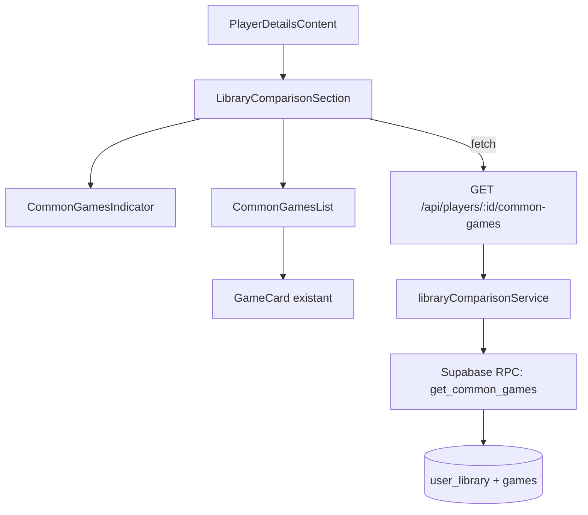

# Document de Design : Comparaison de bibliothèques entre joueurs

## Vue d'ensemble

Cette fonctionnalité permet à un utilisateur connecté de comparer sa
bibliothèque de jeux avec celle d'un autre joueur. Le système calcule
l'intersection des deux bibliothèques via une requête SQL optimisée et affiche
un indicateur sur le profil du joueur cible, ainsi qu'une liste détaillée des
jeux en commun.

L'architecture s'appuie sur les patterns existants du projet : API Route
Next.js, service dédié, composants React intégrés dans la page profil joueur, et
fonction SQL Supabase pour le calcul côté base de données.

## Architecture



### Flux de données

1. `PlayerDetailsContent` rend `LibraryComparisonSection` si l'utilisateur est
   authentifié et consulte un profil différent du sien
2. `LibraryComparisonSection` appelle l'API `/api/players/[id]/common-games`
3. L'API route utilise `libraryComparisonService` qui appelle la fonction SQL
   `get_common_games`
4. La fonction SQL effectue l'intersection des deux tables `user_library` et
   retourne les jeux en commun avec leurs métadonnées

## Composants et Interfaces

### API Route

**`GET /api/players/[id]/common-games`**

- Authentification requise (401 si non connecté)
- Validation UUID du paramètre `id` (400 si invalide)
- Vérification que le joueur cible existe (404 si inexistant)
- Rejet si le joueur courant = joueur cible (400)
- Paramètre query optionnel : `locale` (défaut : `fr`), `page` (défaut : `1`)

Réponse succès (200) :

```typescript
{
  commonGamesCount: number;
  commonGames: CommonGame[];
  pagination: {
    currentPage: number;
    totalPages: number;
    hasNextPage: boolean;
  };
}
```

### Service

**`libraryComparisonService.ts`** dans `src/lib/services/`

```typescript
export class LibraryComparisonService {
  static async getCommonGames(
    currentUserId: string,
    targetPlayerId: string,
    locale: string,
    page: number
  ): Promise<CommonGamesResult>;
}
```

### Composants React

**`LibraryComparisonSection`** — Composant principal, gère le fetch et
l'orchestration. Affiché uniquement si l'utilisateur est authentifié et consulte
un autre profil.

**`CommonGamesIndicator`** — Badge/carte affichant "X jeux en commun". Gère les
états : chargement (skeleton), zéro jeux, N jeux.

**`CommonGamesList`** — Grille de jeux en commun avec pagination. Réutilise le
pattern de `PlayerLibraryGrid` existant.

### Fonction SQL Supabase

**`get_common_games`** — Fonction RPC qui effectue l'intersection :

```sql
CREATE OR REPLACE FUNCTION get_common_games(
  current_user_id UUID,
  target_player_id UUID,
  game_locale TEXT DEFAULT 'fr',
  page_number INT DEFAULT 1,
  page_size INT DEFAULT 12
)
RETURNS TABLE (
  game_id UUID,
  slug TEXT,
  cover_image_url TEXT,
  title TEXT,
  genre_names TEXT[],
  total_count BIGINT
)
```

Cette fonction :

- Joint `user_library` sur elle-même pour trouver les `game_id` communs
- Joint `games` et `game_translations` pour les métadonnées
- Joint `game_genres` + `genre_translations` pour les noms de genres
- Pagine les résultats (LIMIT/OFFSET)
- Retourne `total_count` via une window function pour éviter une seconde requête

## Modèles de données

### Types TypeScript

Dans `src/types/player.ts` :

```typescript
/** Jeu en commun entre deux joueurs */
export interface CommonGame {
  gameId: string;
  slug: string;
  title: string;
  coverImage: string | null;
  genres: string[];
}

/** Résultat de la comparaison de bibliothèques */
export interface CommonGamesResult {
  commonGamesCount: number;
  commonGames: CommonGame[];
  pagination: {
    currentPage: number;
    totalPages: number;
    hasNextPage: boolean;
  };
}
```

### Migration SQL

Fichier : `supabase/migrations/20240221000001_library_comparison.sql`

Contenu : création de la fonction `get_common_games` et d'un index sur
`user_library(game_id)` pour optimiser l'intersection.

## Propriétés de Correction

_Une propriété est une caractéristique ou un comportement qui doit rester vrai
pour toutes les exécutions valides d'un système — essentiellement, une
déclaration formelle de ce que le système doit faire. Les propriétés servent de
pont entre les spécifications lisibles par l'humain et les garanties de
correction vérifiables par la machine._

### Property 1 : Correction de l'intersection

_Pour toute_ paire de bibliothèques (ensembles de game_id), l'ensemble des jeux
en commun retourné doit contenir exactement les game_id présents dans les deux
bibliothèques et aucun autre.

**Validates: Requirements 1.1, 1.3, 1.4**

### Property 2 : Invariant du compteur

_Pour tout_ résultat de comparaison, `commonGamesCount` doit être égal au nombre
total de jeux en commun (somme sur toutes les pages), et la longueur de la liste
`commonGames` sur la page courante doit être inférieure ou égale à la taille de
page (12).

**Validates: Requirements 1.2**

### Property 3 : Visibilité de l'indicateur

_Pour toute_ combinaison d'état d'authentification et d'identifiants
utilisateur, l'indicateur de jeux en commun doit être visible si et seulement si
l'utilisateur est authentifié ET l'identifiant courant est différent de
l'identifiant cible.

**Validates: Requirements 2.1, 2.2, 2.3**

### Property 4 : Complétude des données de jeux en commun

_Pour tout_ jeu en commun retourné, l'objet doit contenir un `gameId` non vide,
un `slug` non vide, un `title` non vide, et un tableau `genres`. Le lien de
navigation doit correspondre au pattern `/{locale}/games/{slug}`.

**Validates: Requirements 3.1, 3.2**

### Property 5 : Calcul de pagination

_Pour tout_ nombre total de jeux en commun et taille de page de 12, `totalPages`
doit être égal à `ceil(totalCount / 12)`, et `hasNextPage` doit être vrai si et
seulement si `currentPage < totalPages`.

**Validates: Requirements 3.4**

### Property 6 : Validation UUID

_Pour toute_ chaîne qui n'est pas un UUID v4 valide, l'API doit retourner une
erreur 400. _Pour toute_ chaîne qui est un UUID v4 valide, l'API ne doit pas
retourner d'erreur 400 liée au format.

**Validates: Requirements 4.3**

### Property 7 : Sélection du titre selon la locale

_Pour tout_ jeu ayant des traductions dans plusieurs locales, quand la locale
demandée est disponible, le titre retourné doit correspondre à la traduction de
cette locale. Quand la locale demandée n'est pas disponible, le titre doit
correspondre à la première traduction disponible (fallback).

**Validates: Requirements 6.3**

## Gestion des erreurs

| Situation                           | Code HTTP | Comportement                                       |
| ----------------------------------- | --------- | -------------------------------------------------- |
| Utilisateur non authentifié         | 401       | Message "Unauthorized"                             |
| ID joueur cible invalide (non-UUID) | 400       | Message "Invalid player ID format"                 |
| Joueur cible inexistant             | 404       | Message "Player not found"                         |
| Comparaison avec soi-même           | 400       | Message "Cannot compare with yourself"             |
| Erreur base de données              | 500       | Message "Internal server error", log côté serveur  |
| Erreur réseau côté client           | —         | Message d'erreur avec bouton "Réessayer"           |
| Échec silencieux                    | —         | Masquer l'indicateur, ne pas casser la page profil |

## Stratégie de tests

### Tests unitaires

- Validation des paramètres API (UUID, auth, self-comparison)
- Transformation des données brutes SQL en types TypeScript
- Logique de visibilité de l'indicateur
- Calcul de pagination
- Sélection de la locale pour les titres

### Tests property-based

Bibliothèque : `fast-check` (déjà utilisée dans le projet) Configuration :
minimum 100 itérations par test Framework : `bun:test` Emplacement :
`test/unit/lib/services/libraryComparison.property.test.ts`

Chaque test property-based doit être annoté avec un commentaire référençant la
propriété du design :

```
// Feature: library-comparison, Property N: <titre de la propriété>
```

Les 7 propriétés identifiées ci-dessus seront implémentées comme des tests
property-based individuels. Les tests unitaires couvriront les exemples
spécifiques (erreurs 401, 404, etc.) et les cas limites.
