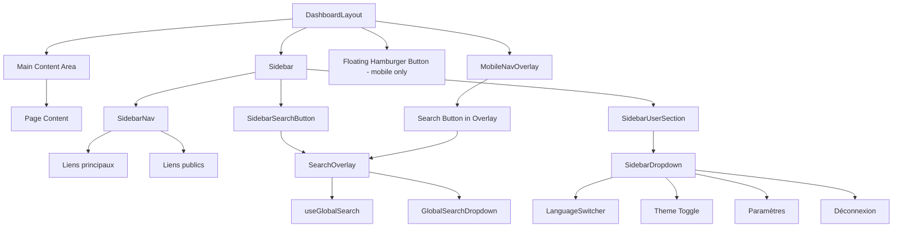
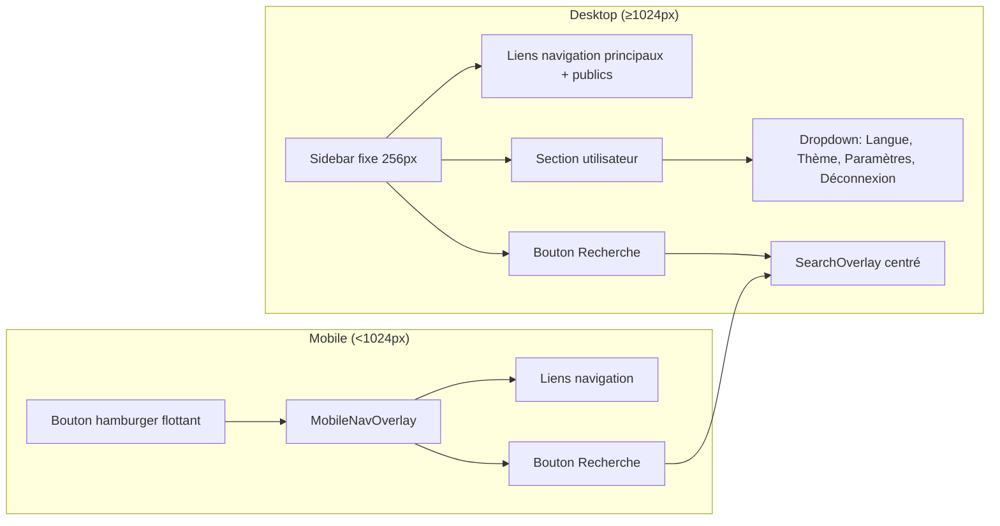

# Document de Conception — Navigation Sidebar

## Vue d'ensemble

Cette conception transforme la navigation horizontale actuelle (`GamingNavBar`)
en une sidebar latérale fixe à gauche de l'écran, tout en conservant
l'esthétique gaming/néon existante. La sidebar intègre les liens de navigation
(principaux et publics), un bouton de recherche globale (overlay), et une
section utilisateur en bas incluant le changement de langue dans son dropdown.
Le header connecté (`DashboardHeader`) est entièrement supprimé. Sur mobile
(<1024px), la sidebar est remplacée par un overlay plein écran, et un bouton
hamburger flottant (position fixe, coin supérieur gauche) permet d'ouvrir
l'overlay.

### Décisions de conception clés

1. **Réutilisation de `SidebarContent.tsx` et `DashboardSidebar.tsx`** : ces
   composants existants (pré-refonte gaming) contiennent déjà la structure
   sidebar + section utilisateur. Ils seront refactorisés plutôt que réécrits.
2. **Extraction de `isActive` en utilitaire partagé** : la fonction est
   dupliquée dans `GamingNavBar.tsx` et `MobileNavOverlay.tsx`. Elle sera
   extraite dans `src/lib/utils/navigation-utils.ts`.
3. **Nouvel overlay de recherche** : un composant `SearchOverlay.tsx` remplace
   `GlobalSearchBar`. Il réutilise le hook `useGlobalSearch` et le composant
   `GlobalSearchDropdown` existants.
4. **Hook `useSearchOverlay`** : gère l'état ouvert/fermé de l'overlay, le
   raccourci Ctrl+K/Cmd+K, et le focus trap.
5. **Suppression complète du header** : `DashboardHeader.tsx` est supprimé. Le
   LanguageSwitcher est intégré dans le dropdown de la section utilisateur de la
   sidebar. Les liens publics sont ajoutés dans la sidebar.
6. **Bouton hamburger flottant** : sur mobile, un bouton en position fixe (coin
   supérieur gauche) remplace le bouton hamburger qui était dans le header.
7. **Pas de changement de base de données** : cette feature est purement
   front-end.

## Architecture

### Diagramme de composants



### Flux de navigation



## Composants et Interfaces

### Fichiers à créer

| Fichier                                                     | Responsabilité                                                                  |
| ----------------------------------------------------------- | ------------------------------------------------------------------------------- |
| `src/components/layout/dashboard/Sidebar.tsx`               | Sidebar desktop : logo, navigation, bouton recherche, section utilisateur       |
| `src/components/layout/dashboard/SidebarNav.tsx`            | Liste des liens de navigation (principaux + publics) avec indicateur actif néon |
| `src/components/layout/dashboard/SidebarSearchButton.tsx`   | Bouton recherche avec icône loupe entre nav et section utilisateur              |
| `src/components/layout/dashboard/SidebarUserSection.tsx`    | Section utilisateur en bas (avatar, nom, dropdown avec langue/thème/paramètres) |
| `src/components/layout/dashboard/SearchOverlay.tsx`         | Overlay modal de recherche globale (glass, centré, focus trap)                  |
| `src/components/layout/dashboard/MobileHamburgerButton.tsx` | Bouton hamburger flottant en position fixe (coin supérieur gauche), mobile only |
| `src/hooks/useSearchOverlay.ts`                             | Hook gérant état overlay, raccourci Ctrl+K/Cmd+K, fermeture Escape              |
| `src/lib/utils/navigation-utils.ts`                         | Fonctions utilitaires partagées (`isActive`, `NAV_LINKS`, `PUBLIC_LINKS`)       |

### Fichiers à modifier

| Fichier                | Modification                                                                                       |
| ---------------------- | -------------------------------------------------------------------------------------------------- |
| `DashboardLayout.tsx`  | Layout flex horizontal : sidebar à gauche, contenu principal pleine hauteur à droite (sans header) |
| `MobileNavOverlay.tsx` | Ajouter bouton « Recherche », utiliser `NAV_LINKS` partagé, ouvrir `SearchOverlay`                 |

### Fichiers à supprimer (après migration)

| Fichier                | Raison                                                                                          |
| ---------------------- | ----------------------------------------------------------------------------------------------- |
| `GamingNavBar.tsx`     | Remplacé par `SidebarNav.tsx`                                                                   |
| `DashboardSidebar.tsx` | Remplacé par `Sidebar.tsx`                                                                      |
| `SidebarContent.tsx`   | Logique redistribuée dans `SidebarNav.tsx`, `SidebarUserSection.tsx`, `SidebarSearchButton.tsx` |
| `DashboardHeader.tsx`  | Supprimé : le header connecté n'existe plus, ses fonctionnalités sont dans la sidebar           |

### Interfaces des composants

```typescript
// src/lib/utils/navigation-utils.ts
interface NavLink {
  href: string;
  icon: IconType;
  labelKey: string;
}

function isActive(pathname: string, linkPath: string): boolean;
const NAV_LINKS: NavLink[];
const PUBLIC_LINKS: NavLink[];

// src/components/layout/dashboard/Sidebar.tsx
interface SidebarProps {
  user: User;
  signOut: () => Promise<void>;
  onSearchOpen: () => void;
}

// src/components/layout/dashboard/SidebarNav.tsx
interface SidebarNavProps {
  onLinkClick?: () => void;
}

// src/components/layout/dashboard/SidebarSearchButton.tsx
interface SidebarSearchButtonProps {
  onClick: () => void;
}

// src/components/layout/dashboard/SidebarUserSection.tsx
interface SidebarUserSectionProps {
  user: User;
  signOut: () => Promise<void>;
  locale: string;
}

// src/components/layout/dashboard/SearchOverlay.tsx
interface SearchOverlayProps {
  isOpen: boolean;
  onClose: () => void;
}

// src/components/layout/dashboard/MobileHamburgerButton.tsx
interface MobileHamburgerButtonProps {
  onClick: () => void;
}

// src/hooks/useSearchOverlay.ts
interface UseSearchOverlayReturn {
  isOpen: boolean;
  open: () => void;
  close: () => void;
}
```

## Modèle de données

Aucun changement de modèle de données. Cette feature est purement front-end et
réutilise les types existants :

- `User` de `@supabase/supabase-js` pour la section utilisateur
- `GlobalSearchResponse`, `FlatSearchItem` pour l'overlay de recherche
- `NavLink` (nouveau type local dans `navigation-utils.ts`)

L'API de recherche existante (`/api/search/global`) est réutilisée telle quelle
via le hook `useGlobalSearch`.

## Propriétés de Correction

_Une propriété est une caractéristique ou un comportement qui doit rester vrai
pour toutes les exécutions valides d'un système — essentiellement, une
déclaration formelle sur ce que le système doit faire. Les propriétés servent de
pont entre les spécifications lisibles par l'humain et les garanties de
correction vérifiables par la machine._

### Propriété 1 : Unicité et exactitude du lien actif

_Pour tout_ pathname valide et la liste `NAV_LINKS`, la fonction `isActive` doit
retourner `true` pour au plus un seul lien de navigation. De plus, si le
pathname commence par le `href` d'un lien (après suppression du préfixe locale),
`isActive` doit retourner `true` pour ce lien.

**Valide : Exigences 2.1, 2.4**

### Propriété 2 : Fermeture de l'overlay mobile au clic sur un lien

_Pour tout_ lien de navigation dans `NAV_LINKS`, lorsqu'il est cliqué dans
l'overlay mobile ouvert, le callback `onClose` doit être appelé exactement une
fois, fermant l'overlay.

**Valide : Exigence 5.5**

### Propriété 3 : Résolution du nom d'affichage utilisateur

_Pour tout_ objet `User`, la section utilisateur de la sidebar doit afficher :
le `username` des métadonnées si présent, sinon la partie avant `@` de l'email,
sinon un fallback par défaut. Le résultat ne doit jamais être vide.

**Valide : Exigence 6.2**

### Propriété 4 : Raccourcis clavier de l'overlay de recherche

_Pour tout_ événement clavier, le hook `useSearchOverlay` doit : (a) ouvrir
l'overlay quand Ctrl+K (ou Cmd+K sur macOS) est pressé et l'overlay est fermé,
(b) fermer l'overlay quand Escape est pressé et l'overlay est ouvert. Aucune
autre touche ne doit modifier l'état de l'overlay.

**Valide : Exigences 9.7, 9.10**

## Gestion des erreurs

| Scénario                       | Comportement attendu                                                                                                     |
| ------------------------------ | ------------------------------------------------------------------------------------------------------------------------ |
| Échec de l'API de recherche    | Le hook `useGlobalSearch` existant gère déjà les erreurs (affiche un état vide). L'overlay affiche « Aucun résultat ».   |
| Utilisateur non authentifié    | `DashboardLayout` redirige vers `/auth?mode=signin` (comportement existant inchangé).                                    |
| Données utilisateur manquantes | La section utilisateur utilise le fallback `email.split('@')[0]` puis « Utilisateur » si aucune donnée n'est disponible. |
| Erreur de déconnexion          | Le catch silencieux existant dans `SidebarDropdown` est conservé.                                                        |

## Stratégie de tests

### Approche duale

Cette feature nécessite à la fois des tests unitaires (exemples spécifiques, cas
limites) et des tests property-based (propriétés universelles).

### Tests unitaires

Les tests unitaires vérifient les exemples concrets et les cas limites :

- **`test/unit/lib/utils/navigation-utils.test.ts`** : Tests de `isActive` avec
  des cas spécifiques (chemin exact, sous-chemin, chemin non-correspondant,
  chemin racine)
- **`test/unit/components/layout/Sidebar.test.tsx`** : Rendu des 5 liens
  principaux + 3 liens publics, logo, section utilisateur, bouton recherche
- **`test/unit/components/layout/SidebarUserSection.test.tsx`** : Dropdown avec
  LanguageSwitcher, changement de thème, paramètres, déconnexion
- **`test/unit/components/layout/SearchOverlay.test.tsx`** :
  Ouverture/fermeture, attributs ARIA, focus initial sur le champ de saisie
- **`test/unit/components/layout/MobileNavOverlay.test.tsx`** : Bouton
  recherche, fermeture au clic sur un lien, attributs dialog/aria-modal
- **`test/unit/hooks/useSearchOverlay.test.ts`** : États open/close, raccourci
  Ctrl+K/Cmd+K

### Tests property-based

Chaque propriété de correction est implémentée par un seul test property-based
avec la bibliothèque `fast-check` (déjà installée dans le projet). Chaque test
exécute un minimum de 100 itérations.

- **`test/unit/lib/utils/navigation-utils.property.test.ts`** :
  - Feature: navigation-sidebar, Propriété 1 : Unicité et exactitude du lien
    actif
  - Feature: navigation-sidebar, Propriété 2 : Fermeture de l'overlay mobile au
    clic sur un lien

- **`test/unit/lib/utils/user-display.property.test.ts`** :
  - Feature: navigation-sidebar, Propriété 3 : Résolution du nom d'affichage
    utilisateur

- **`test/unit/hooks/useSearchOverlay.property.test.ts`** :
  - Feature: navigation-sidebar, Propriété 4 : Raccourcis clavier de l'overlay
    de recherche

### Configuration

- Framework : **Vitest** (seul runner autorisé)
- PBT : **fast-check** (déjà dans `node_modules`)
- Emplacement : `test/unit/` (jamais dans `src/`)
- Nommage : `*.property.test.ts` pour les tests PBT, `*.test.ts` / `*.test.tsx`
  pour les tests unitaires
- Imports : `import { describe, it, expect, vi } from "vitest"` +
  `import fc from "fast-check"`
