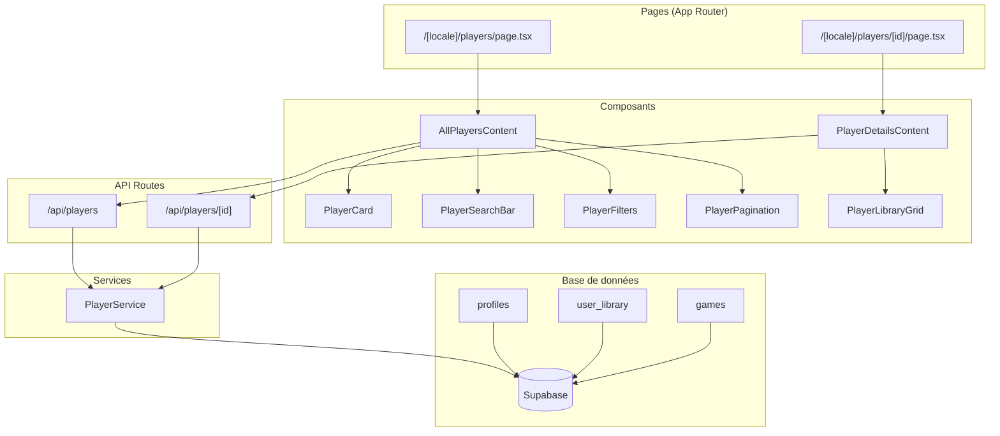

# Document de Conception

## Vue d'ensemble

Cette conception décrit l'implémentation des pages joueurs pour la plateforme
Game Universe. La fonctionnalité suit les patterns existants établis pour les
pages de jeux et de personnages, en utilisant l'architecture Next.js App Router
avec internationalisation, Supabase comme backend, et les composants UI
existants.

L'implémentation comprend :

- Une page de liste des joueurs avec recherche, filtres et pagination
- Une page de profil individuel avec informations et bibliothèque de jeux
- Un service dédié pour la gestion des données joueurs
- Des composants réutilisables suivant les patterns existants

## Architecture



## Composants et Interfaces

### Structure des fichiers

```
src/
├── app/
│   └── [locale]/
│       └── players/
│           ├── page.tsx              # Page liste des joueurs
│           ├── error.tsx             # Gestion d'erreur
│           └── [id]/
│               └── page.tsx          # Page profil joueur
├── components/
│   └── players/
│       ├── AllPlayersContent.tsx     # Contenu principal liste
│       ├── PlayerCard.tsx            # Carte joueur
│       ├── PlayerCardSkeleton.tsx    # Skeleton carte
│       ├── PlayerDetailsContent.tsx  # Contenu profil
│       ├── PlayerSearchBar.tsx       # Barre de recherche
│       ├── PlayerFilters.tsx         # Filtres
│       ├── PlayerFilterButton.tsx    # Bouton filtres mobile
│       ├── PlayerPagination.tsx      # Pagination
│       ├── PlayerGridSkeleton.tsx    # Skeleton grille
│       └── PlayerLibraryGrid.tsx     # Grille bibliothèque
├── lib/
│   └── services/
│       └── playerService.ts          # Service données joueurs
├── types/
│   └── player.ts                     # Types TypeScript
└── app/
    └── api/
        └── players/
            ├── route.ts              # API liste joueurs
            └── [id]/
                └── route.ts          # API détails joueur
```

### Interfaces des composants

```typescript
// PlayerCard
interface PlayerCardProps {
  player: PlayerSummary;
  locale: string;
  priority?: boolean;
}

// AllPlayersContent
interface AllPlayersContentProps {
  locale?: string;
}

// PlayerDetailsContent
interface PlayerDetailsContentProps {
  player: PlayerDetails;
  locale: string;
}

// PlayerSearchBar
interface PlayerSearchBarProps {
  onSearch: (query: string) => void;
  initialValue?: string;
  placeholder?: string;
}

// PlayerFilters
interface PlayerFiltersProps {
  selectedGameCounts: string[];
  onGameCountChange: (counts: string[]) => void;
  onClearFilters: () => void;
  showAllFilters: boolean;
}

// PlayerPagination
interface PlayerPaginationProps {
  currentPage: number;
  totalPages: number;
  totalCount: number;
  onPageChange: (page: number) => void;
  loading?: boolean;
}

// PlayerLibraryGrid
interface PlayerLibraryGridProps {
  games: PlayerLibraryGame[];
  locale: string;
}
```

## Modèles de données

### Types TypeScript

```typescript
// types/player.ts

export interface PlayerSummary {
  id: string;
  fullName: string | null;
  avatarUrl: string | null;
  gamesCount: number;
  createdAt: string;
}

export interface PlayerDetails {
  id: string;
  email: string;
  fullName: string | null;
  avatarUrl: string | null;
  preferredLocale: string;
  createdAt: string;
  updatedAt: string;
  stats: PlayerStats;
  library: PlayerLibraryGame[];
}

export interface PlayerStats {
  totalGames: number;
  ownedGames: number;
  completedGames: number;
  totalPlayTime: number;
  averageRating: number | null;
}

export interface PlayerLibraryGame {
  id: string;
  gameId: string;
  slug: string;
  title: string;
  coverImage: string | null;
  status: "owned" | "wishlist" | "completed" | "playing";
  playTimeHours: number;
  rating: number | null;
  addedAt: string;
}

export interface PlayerFilters {
  search?: string;
  gameCountRange?: string; // '0' | '1-5' | '6-20' | '20+'
}

export interface PlayersResponse {
  players: PlayerSummary[];
  pagination: {
    currentPage: number;
    totalPages: number;
    totalCount: number;
    hasNextPage: boolean;
    hasPreviousPage: boolean;
  };
}
```

### Requêtes Supabase

```typescript
// Requête liste des joueurs avec comptage de jeux
const { data, error } = await supabase
  .from("profiles")
  .select(
    `
    id,
    full_name,
    avatar_url,
    created_at,
    user_library(count)
  `
  )
  .order("created_at", { ascending: false })
  .range(offset, offset + limit - 1);

// Requête détails joueur avec bibliothèque
const { data, error } = await supabase
  .from("profiles")
  .select(
    `
    id,
    email,
    full_name,
    avatar_url,
    preferred_locale,
    created_at,
    updated_at,
    user_library(
      id,
      game_id,
      status,
      play_time_hours,
      rating,
      added_at,
      games(
        id,
        slug,
        cover_image_url,
        game_translations(title)
      )
    )
  `
  )
  .eq("id", playerId)
  .single();
```

### Politiques RLS requises

Les politiques RLS existantes sur `profiles` permettent uniquement aux
utilisateurs de voir leur propre profil. Pour cette fonctionnalité, nous devons
ajouter une politique permettant la lecture publique des profils (informations
non sensibles).

```sql
-- Politique pour permettre la lecture publique des profils (informations limitées)
CREATE POLICY "Public profiles are viewable by everyone" ON profiles
  FOR SELECT USING (true);

-- Note: L'email ne sera pas exposé dans l'API publique
```

## Propriétés de Correction

_Une propriété est une caractéristique ou un comportement qui doit être vrai
pour toutes les exécutions valides d'un système - essentiellement, une
déclaration formelle de ce que le système doit faire. Les propriétés servent de
pont entre les spécifications lisibles par l'humain et les garanties de
correction vérifiables par la machine._

### Property 1: Rendu des informations joueur

_Pour tout_ joueur valide, le rendu de sa carte ou de son profil doit contenir :
son nom (ou un placeholder si null), son avatar (ou un avatar par défaut), et
son nombre de jeux dans la bibliothèque.

**Validates: Requirements 1.2, 5.2**

### Property 2: Pagination correcte

_Pour toute_ liste de joueurs avec un total supérieur à la limite par page (20),
la réponse de pagination doit inclure : le nombre total de joueurs, la page
courante, le nombre total de pages, et les indicateurs
hasNextPage/hasPreviousPage cohérents avec la position actuelle.

**Validates: Requirements 2.1, 2.3**

### Property 3: Recherche par nom insensible à la casse

_Pour tout_ texte de recherche non vide et _pour toute_ liste de joueurs, tous
les joueurs retournés doivent avoir un nom contenant le texte de recherche
(comparaison insensible à la casse). De plus, aucun joueur dont le nom contient
le texte ne doit être exclu des résultats.

**Validates: Requirements 3.2**

### Property 4: Filtrage par plage de nombre de jeux

_Pour tout_ filtre de plage de jeux sélectionné ('0', '1-5', '6-20', '20+') et
_pour toute_ liste de joueurs, tous les joueurs retournés doivent avoir un
nombre de jeux dans la plage spécifiée.

**Validates: Requirements 4.1**

### Property 5: Indicateur de filtres actifs

_Pour tout_ état de filtres où au moins un filtre est actif, l'indicateur de
filtres doit afficher le nombre exact de filtres actifs. Si aucun filtre n'est
actif, l'indicateur ne doit pas être visible.

**Validates: Requirements 4.4**

### Property 6: Affichage de la bibliothèque

_Pour tout_ joueur avec une bibliothèque non vide, chaque jeu affiché doit
contenir : le titre du jeu, l'image de couverture (ou placeholder), et le statut
du jeu. L'ordre d'affichage doit être cohérent (par date d'ajout décroissante).

**Validates: Requirements 6.1, 6.2**

### Property 7: Calcul des statistiques

_Pour tout_ joueur, les statistiques affichées doivent être mathématiquement
correctes :

- totalGames = nombre d'entrées dans user_library
- completedGames = nombre d'entrées avec status = 'completed'
- totalPlayTime = somme de play_time_hours
- averageRating = moyenne des ratings non-null (ou null si aucun rating)

**Validates: Requirements 6.4**

### Property 8: Internationalisation

_Pour toute_ locale supportée ('fr', 'en') et _pour tout_ texte de l'interface,
une traduction doit exister. De plus, _pour tout_ jeu affiché, le titre doit
correspondre à la traduction dans la locale demandée.

**Validates: Requirements 8.1, 8.3, 8.4**

## Gestion des erreurs

### Erreurs réseau

```typescript
// Pattern de gestion d'erreur avec retry
const fetchPlayers = async () => {
  try {
    const result = await apiClient.get("/api/players", {
      retryConfig: {
        maxAttempts: 3,
        baseDelay: 1000,
      },
    });
    return result;
  } catch (error) {
    // Conserver les données précédentes
    toast({
      variant: "destructive",
      title: t("players.errors.loadingTitle"),
      description: t("players.errors.loadingDescription"),
    });
    return null;
  }
};
```

### Erreurs de validation

```typescript
// Validation des paramètres de requête
const validatePlayerId = (id: string): boolean => {
  const uuidRegex =
    /^[0-9a-f]{8}-[0-9a-f]{4}-[0-9a-f]{4}-[0-9a-f]{4}-[0-9a-f]{12}$/i;
  return uuidRegex.test(id);
};

// Dans l'API route
if (!validatePlayerId(id)) {
  return NextResponse.json(
    { error: "Invalid player ID format" },
    { status: 400 }
  );
}
```

### Erreurs de composants

```typescript
// Utilisation de ErrorBoundary
<ErrorBoundary
  fallback={
    <ErrorFallback
      title={t('players.errors.loadingTitle')}
      description={t('players.errors.loadingDescription')}
      showRefresh={true}
      showBackButton={true}
      backUrl={`/${locale}/players`}
    />
  }
>
  <PlayerDetailsContent player={player} locale={locale} />
</ErrorBoundary>
```

### Codes d'erreur

| Code          | Description        | Action utilisateur   |
| ------------- | ------------------ | -------------------- |
| 400           | ID joueur invalide | Vérifier l'URL       |
| 404           | Joueur non trouvé  | Retourner à la liste |
| 500           | Erreur serveur     | Réessayer plus tard  |
| NETWORK_ERROR | Erreur réseau      | Vérifier connexion   |

## Stratégie de test

### Tests unitaires

Les tests unitaires vérifient des exemples spécifiques et des cas limites :

- **PlayerCard** : Rendu avec données complètes, données partielles (nom null),
  avatar par défaut
- **PlayerSearchBar** : Debounce fonctionne, effacement de la recherche
- **PlayerFilters** : Sélection/désélection de filtres, effacement de tous les
  filtres
- **PlayerPagination** : Navigation entre pages, désactivation aux limites
- **PlayerService** : Transformation des données Supabase, gestion des erreurs

### Tests property-based

Les tests property-based utilisent **fast-check** pour valider les propriétés
universelles :

```typescript
import fc from "fast-check";

// Configuration : minimum 100 itérations par test
const fcConfig = { numRuns: 100 };
```

Chaque propriété de correction sera implémentée comme un test property-based
distinct :

1. **Property 1** : Générer des joueurs aléatoires, vérifier le rendu
2. **Property 2** : Générer des listes de tailles variables, vérifier la
   pagination
3. **Property 3** : Générer des noms et recherches aléatoires, vérifier le
   filtrage
4. **Property 4** : Générer des joueurs avec différents nombres de jeux,
   vérifier les plages
5. **Property 5** : Générer des combinaisons de filtres, vérifier l'indicateur
6. **Property 6** : Générer des bibliothèques aléatoires, vérifier l'affichage
7. **Property 7** : Générer des données de bibliothèque, vérifier les calculs
8. **Property 8** : Générer des textes et locales, vérifier les traductions

### Format des tags de test

```typescript
/**
 * Feature: player-pages, Property 3: Recherche par nom insensible à la casse
 * Validates: Requirements 3.2
 */
test.prop([fc.string(), fc.array(playerArbitrary)])('search filters correctly', ...);
```

### Couverture de test

| Composant         | Unit Tests | Property Tests |
| ----------------- | ---------- | -------------- |
| PlayerCard        | ✓          | Property 1     |
| PlayerSearchBar   | ✓          | Property 3     |
| PlayerFilters     | ✓          | Property 4, 5  |
| PlayerPagination  | ✓          | Property 2     |
| PlayerService     | ✓          | Property 7     |
| PlayerLibraryGrid | ✓          | Property 6     |
| i18n              | ✓          | Property 8     |
