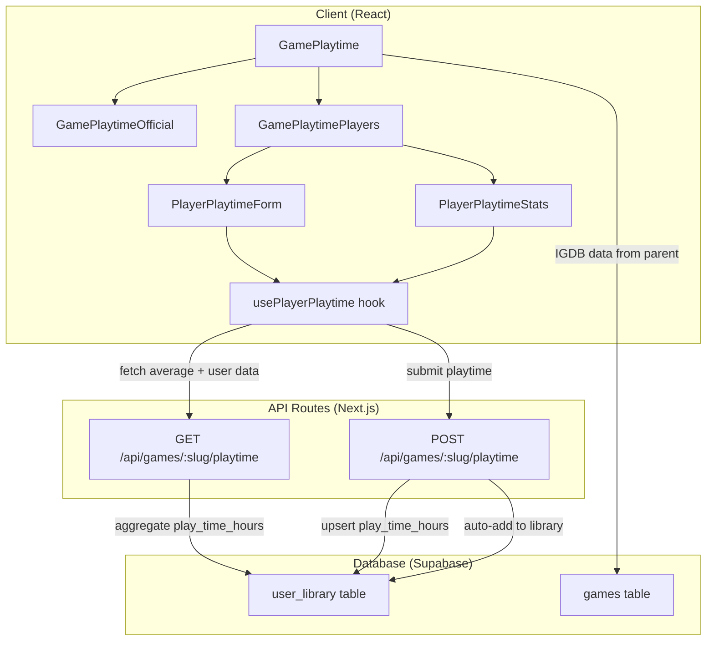

# Design Document: Player Playtime

## Overview

Cette fonctionnalité enrichit l'onglet "Temps de jeu" existant sur la page de
détails d'un jeu. L'onglet actuel affiche uniquement les données IGDB
(rapidement, normalement, complètement). Le design ajoute une section
communautaire permettant aux joueurs authentifiés de soumettre leur temps de
jeu, avec calcul et affichage d'une moyenne globale.

L'architecture s'appuie sur l'infrastructure existante : la table `user_library`
possède déjà une colonne `play_time_hours`, et les patterns API/hooks du projet
sont réutilisés.

## Architecture



## Components and Interfaces

### Composants React

Le composant `GamePlaytime` existant est refactorisé en sous-composants pour
respecter la règle des 150 lignes max :

1. **GamePlaytime** (orchestrateur) — Reçoit les données IGDB du parent + le
   `gameId`. Affiche les deux sections.
2. **GamePlaytimeOfficial** — Affiche les 3 cartes IGDB existantes (rapidement,
   normalement, complètement) avec attribution IGDB. Extraction directe du code
   actuel.
3. **GamePlaytimePlayers** — Section communautaire : affiche la moyenne, le
   nombre de contributeurs, le temps personnel du joueur, et le formulaire de
   soumission.
4. **PlayerPlaytimeForm** — Formulaire de saisie du temps de jeu (input
   numérique en heures, bouton soumettre). Visible uniquement pour les joueurs
   authentifiés.

### API Routes

**GET `/api/games/[slug]/playtime`**

- Public (pas d'auth requise pour la moyenne)
- Retourne : `{ average, count, userPlaytime? }`
- Si l'utilisateur est authentifié, inclut son `userPlaytime`
- Calcule la moyenne via une requête Supabase sur `user_library` filtrée par
  `game_id` et `play_time_hours > 0`

**POST `/api/games/[slug]/playtime`**

- Auth requise
- Body : `{ playTimeHours: number }`
- Validation Zod du body
- Logique :
  1. Vérifier que le jeu existe (via slug → game id)
  2. Upsert dans `user_library` :
     - Si l'entrée existe : UPDATE `play_time_hours`
     - Si l'entrée n'existe pas : INSERT avec `status = "playing"` et
       `play_time_hours`
  3. Retourner les nouvelles stats (average, count, userPlaytime)

### Hook React

**`usePlayerPlaytime(gameId: string)`**

- Utilise `useAuth()` pour l'état d'authentification
- State : `{ average, count, userPlaytime, loading, error, submitting }`
- Méthodes : `submitPlaytime(hours: number)`, `refresh()`
- Fetch initial au mount, re-fetch après soumission

### Schéma de validation Zod

```typescript
// src/lib/validations/player-playtime.ts
import { z } from "zod";

export const playerPlaytimeSchema = z.object({
  playTimeHours: z
    .number()
    .positive("Le temps de jeu doit être strictement positif")
    .max(50000, "Le temps de jeu ne peut pas dépasser 50 000 heures")
    .refine(
      (val) => Math.round(val * 10) / 10 === val,
      "Le temps de jeu doit être arrondi à une décimale (0.1h)"
    ),
});

export type PlayerPlaytimeInput = z.infer<typeof playerPlaytimeSchema>;
```

## Data Models

### Types TypeScript

```typescript
// Ajouts dans src/types/game.ts

/** Statistiques de temps de jeu des joueurs pour un jeu */
export interface PlayerPlaytimeStats {
  average: number | null;
  count: number;
  userPlaytime: number | null;
}
```

### Table Supabase existante

La table `user_library` possède déjà la colonne `play_time_hours` (type
`numeric`, nullable). Aucune migration n'est nécessaire.

```
user_library
├── id (uuid, PK)
├── user_id (uuid, FK → auth.users)
├── game_id (uuid, FK → games)
├── status (text: owned | wishlist | completed | playing)
├── added_at (timestamptz)
├── play_time_hours (numeric, nullable)
├── rating (numeric, nullable)
└── notes (text, nullable)
```

### Requête d'agrégation

```sql
SELECT
  AVG(play_time_hours) as average,
  COUNT(*) as count
FROM user_library
WHERE game_id = :gameId
  AND play_time_hours > 0;
```

## Correctness Properties

_A property is a characteristic or behavior that should hold true across all
valid executions of a system — essentially, a formal statement about what the
system should do. Properties serve as the bridge between human-readable
specifications and machine-verifiable correctness guarantees._

### Property 1: Validation schema accepts valid inputs and rejects invalid inputs

_For any_ number that is strictly positive, at most 50,000, and has at most one
decimal place, the `playerPlaytimeSchema` SHALL accept it. _For any_ number that
is zero, negative, greater than 50,000, or has more than one decimal place, the
schema SHALL reject it.

**Validates: Requirements 6.1, 6.2, 6.3, 2.2**

### Property 2: Playtime upsert stores the correct value

_For any_ authenticated user and _for any_ valid playtime value, submitting that
value (whether it's a first submission or an update) SHALL result in the user's
`play_time_hours` for that game being exactly equal to the submitted value.

**Validates: Requirements 2.1, 2.3**

### Property 3: Playtime submission preserves existing library entry fields

_For any_ existing library entry with arbitrary `status`, `rating`, and `notes`
values, submitting a new playtime value SHALL update only `play_time_hours`
while leaving `status`, `rating`, and `notes` unchanged.

**Validates: Requirements 3.2**

### Property 4: Average calculation correctness

_For any_ non-empty set of strictly positive playtime values for a game, the
returned average SHALL equal the arithmetic mean of those values (within
floating-point tolerance), and the count SHALL equal the number of values in the
set.

**Validates: Requirements 4.1**

## Error Handling

| Scénario                                               | Code HTTP | Message                         |
| ------------------------------------------------------ | --------- | ------------------------------- |
| Utilisateur non authentifié tente de soumettre         | 401       | "Unauthorized"                  |
| Jeu introuvable (slug invalide)                        | 404       | "Game not found"                |
| Validation Zod échoue (valeur invalide)                | 400       | Message d'erreur Zod descriptif |
| Erreur Supabase inattendue                             | 500       | "Internal server error"         |
| Table `user_library` absente (migration non appliquée) | 503       | "Feature not available"         |

Côté client, le hook `usePlayerPlaytime` expose un état `error` qui est affiché
par le composant `PlayerPlaytimeForm` sous forme de message d'erreur inline. Les
erreurs réseau sont capturées par un try/catch dans le hook.

## Testing Strategy

### Tests unitaires (Bun test runner)

- **Validation Zod** : Tests du schéma `playerPlaytimeSchema` avec cas limites
  (0, négatif, > 50000, décimales multiples)
- **Calcul de moyenne** : Tests de la logique d'agrégation avec des jeux de
  données connus
- **Composants React** : Tests de rendu conditionnel (authentifié vs
  non-authentifié, données présentes vs absentes)

### Tests property-based (fast-check + Bun)

Fichier : `test/unit/lib/validations/player-playtime.property.test.ts`

Chaque propriété du design est implémentée comme un test property-based distinct
avec minimum 100 itérations :

- **Property 1** : Génération de nombres aléatoires, vérification que le schéma
  Zod accepte/rejette correctement
  - Tag:
    `Feature: player-playtime, Property 1: Validation schema accepts valid inputs and rejects invalid inputs`
- **Property 2** : Génération de valeurs de playtime valides, vérification que
  l'upsert stocke la valeur exacte
  - Tag:
    `Feature: player-playtime, Property 2: Playtime upsert stores the correct value`
- **Property 3** : Génération d'entrées bibliothèque avec champs aléatoires,
  vérification que seul play_time_hours change
  - Tag:
    `Feature: player-playtime, Property 3: Playtime submission preserves existing library entry fields`
- **Property 4** : Génération de tableaux de nombres positifs, vérification que
  la moyenne calculée correspond
  - Tag: `Feature: player-playtime, Property 4: Average calculation correctness`

### Configuration

- Framework : Bun test runner
  (`import { describe, it, expect } from "bun:test"`)
- PBT library : `fast-check` (déjà installé dans le projet)
- Emplacement tests : `test/unit/lib/validations/` pour les property tests du
  schéma, `test/unit/lib/services/` pour les property tests de la logique métier
- Minimum 100 itérations par property test
- Chaque test référence sa propriété du design via un commentaire tag
