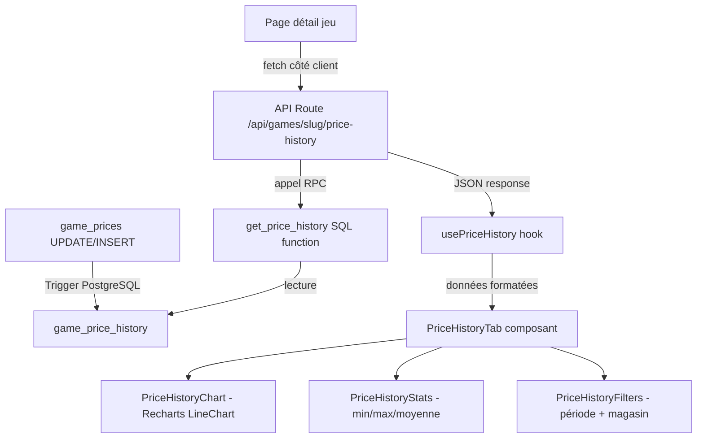

# Design Document — Historique de Prix

## Overview

Cette conception ajoute un système d'historique de prix au système de pricing
existant (`stores` + `game_prices`). Chaque modification de prix dans
`game_prices` déclenche automatiquement la création d'un snapshot horodaté dans
une nouvelle table `game_price_history`. Un composant graphique côté client,
basé sur la bibliothèque Recharts, affiche l'évolution des prix dans le temps
sur la page de détail d'un jeu, avec filtrage par période et par magasin.

### Décisions de conception clés

1. **Trigger PostgreSQL** pour la capture automatique des snapshots — aucune
   logique applicative nécessaire pour l'enregistrement
2. **Recharts** comme bibliothèque de graphiques — légère, basée sur React/SVG,
   bien maintenue, compatible avec le stack Next.js/React existant
3. **Nouvel onglet "Prix"** dans `GameDetailsTabs` plutôt qu'une section séparée
   — cohérent avec le pattern d'onglets existant
4. **API Route** dédiée `/api/games/[slug]/price-history` pour le chargement
   côté client des données d'historique

## Architecture



### Flux de données

1. **Capture** : Un trigger `AFTER INSERT OR UPDATE` sur `game_prices` insère un
   snapshot dans `game_price_history` à chaque changement de prix ou création
   d'entrée
2. **Stockage** : La table `game_price_history` stocke le prix, la devise, le
   magasin, la plateforme et l'horodatage
3. **Récupération** : Une fonction SQL `get_price_history` retourne les
   snapshots filtrés par jeu, période, magasin et plateforme
4. **API** : Une route Next.js expose les données d'historique en JSON
5. **Affichage** : Un hook `usePriceHistory` charge les données, et le composant
   `PriceHistoryTab` orchestre le graphique, les filtres et les statistiques

## Components and Interfaces

### 1. Migration SQL — Table `game_price_history`

Fichier : `supabase/migrations/20240221000001_game_price_history.sql`

```sql
CREATE TABLE public.game_price_history (
  id UUID PRIMARY KEY DEFAULT gen_random_uuid(),
  game_id UUID REFERENCES games(id) ON DELETE CASCADE NOT NULL,
  store_id UUID REFERENCES stores(id) ON DELETE CASCADE NOT NULL,
  price DECIMAL(10,2) NOT NULL,
  currency VARCHAR(3) NOT NULL DEFAULT 'EUR',
  platform VARCHAR(50) NOT NULL,
  recorded_at TIMESTAMP DEFAULT NOW() NOT NULL
);
```

### 2. Trigger PostgreSQL

```sql
CREATE OR REPLACE FUNCTION record_price_history()
RETURNS TRIGGER AS $
BEGIN
  -- Sur INSERT : enregistrer le prix initial
  IF TG_OP = 'INSERT' THEN
    INSERT INTO game_price_history (game_id, store_id, price, currency, platform, recorded_at)
    VALUES (NEW.game_id, NEW.store_id, NEW.price, NEW.currency, NEW.platform, NOW());
    RETURN NEW;
  END IF;

  -- Sur UPDATE : enregistrer seulement si le prix a changé
  IF TG_OP = 'UPDATE' AND OLD.price IS DISTINCT FROM NEW.price THEN
    INSERT INTO game_price_history (game_id, store_id, price, currency, platform, recorded_at)
    VALUES (NEW.game_id, NEW.store_id, NEW.price, NEW.currency, NEW.platform, NOW());
  END IF;

  RETURN NEW;
END;
$ LANGUAGE plpgsql;
```

### 3. Fonction SQL `get_price_history`

```sql
CREATE OR REPLACE FUNCTION public.get_price_history(
  game_uuid UUID,
  start_date TIMESTAMP DEFAULT NULL,
  end_date TIMESTAMP DEFAULT NULL,
  store_filter TEXT DEFAULT NULL,
  platform_filter TEXT DEFAULT NULL
)
RETURNS TABLE (
  id UUID,
  game_id UUID,
  store_id UUID,
  store_name TEXT,
  store_logo_url TEXT,
  price DECIMAL(10,2),
  currency VARCHAR(3),
  platform VARCHAR(50),
  recorded_at TIMESTAMP
)
```

Retourne les snapshots triés par `recorded_at ASC`, filtrés par période, magasin
et plateforme. Par défaut, retourne les 12 derniers mois.

### 4. Fonction SQL `get_price_history_stats`

```sql
CREATE OR REPLACE FUNCTION public.get_price_history_stats(game_uuid UUID)
RETURNS TABLE (
  min_price DECIMAL(10,2),
  max_price DECIMAL(10,2),
  avg_price DECIMAL(10,2),
  currency VARCHAR(3),
  total_snapshots INTEGER
)
```

### 5. API Route

Fichier : `src/app/api/games/[slug]/price-history/route.ts`

- **GET** `/api/games/{slug}/price-history`
- Query params : `period` (1m, 3m, 6m, 1y, all), `store`, `platform`
- Retourne : `{ history: PriceSnapshot[], stats: PriceHistoryStats }`

### 6. Composants React

```
src/components/games/details/
├── PriceHistoryTab.tsx          # Orchestrateur (graphique + stats + filtres)
├── PriceHistoryChart.tsx        # Graphique Recharts LineChart
├── PriceHistoryStats.tsx        # Cartes min/max/moyenne
└── PriceHistoryFilters.tsx      # Sélecteurs période + magasin
```

### 7. Hook personnalisé

Fichier : `src/hooks/usePriceHistory.ts`

```typescript
function usePriceHistory(
  gameSlug: string,
  filters: PriceHistoryFilters
): {
  history: PriceSnapshot[];
  stats: PriceHistoryStats | null;
  isLoading: boolean;
  error: string | null;
};
```

### 8. Intégration dans GameDetailsTabs

Ajout d'un nouvel onglet `"priceHistory"` dans le `TabType` existant et rendu
conditionnel du `PriceHistoryTab` quand l'onglet est actif.

## Data Models

### Types TypeScript

Fichier : `src/types/price-history.ts`

```typescript
/** Un snapshot de prix enregistré dans l'historique */
export interface PriceSnapshot {
  id: string;
  game_id: string;
  store_id: string;
  store_name: string;
  store_logo_url: string | null;
  price: number;
  currency: string;
  platform: string;
  recorded_at: string;
}

/** Statistiques agrégées de l'historique de prix */
export interface PriceHistoryStats {
  min_price: number;
  max_price: number;
  avg_price: number;
  currency: string;
  total_snapshots: number;
}

/** Filtres pour la requête d'historique */
export interface PriceHistoryFilters {
  period: PriceHistoryPeriod;
  store?: string;
  platform?: string;
}

/** Périodes prédéfinies pour le filtre */
export type PriceHistoryPeriod = "1m" | "3m" | "6m" | "1y" | "all";

/** Réponse de l'API d'historique de prix */
export interface PriceHistoryResponse {
  history: PriceSnapshot[];
  stats: PriceHistoryStats;
}

/** Données formatées pour le graphique (un point par date) */
export interface PriceChartDataPoint {
  date: string;
  [storeName: string]: number | string;
}
```

### Schéma de la table `game_price_history`

| Colonne     | Type          | Contraintes                       |
| ----------- | ------------- | --------------------------------- |
| id          | UUID          | PK, gen_random_uuid()             |
| game_id     | UUID          | FK → games(id) ON DELETE CASCADE  |
| store_id    | UUID          | FK → stores(id) ON DELETE CASCADE |
| price       | DECIMAL(10,2) | NOT NULL, CHECK >= 0              |
| currency    | VARCHAR(3)    | NOT NULL, DEFAULT 'EUR'           |
| platform    | VARCHAR(50)   | NOT NULL                          |
| recorded_at | TIMESTAMP     | NOT NULL, DEFAULT NOW()           |

### Index

- `idx_price_history_game_id` sur `(game_id)`
- `idx_price_history_game_date` sur `(game_id, recorded_at DESC)`
- `idx_price_history_game_store` sur `(game_id, store_id)`

## Correctness Properties

_A property is a characteristic or behavior that should hold true across all
valid executions of a system — essentially, a formal statement about what the
system should do. Properties serve as the bridge between human-readable
specifications and machine-verifiable correctness guarantees._

### Property 1 : Création de snapshot lors d'un changement de prix

_For any_ entrée `game_prices` et toute modification de prix (insertion ou mise
à jour avec prix différent), un `Price_Snapshot` correspondant doit être créé
dans `game_price_history` avec le même `game_id`, `store_id`, `price`,
`currency`, `platform` et un `recorded_at` valide.

**Validates: Requirements 1.1, 1.2**

### Property 2 : Filtrage par magasin

_For any_ ensemble de snapshots d'historique de prix et tout filtre de magasin
appliqué, tous les snapshots retournés doivent appartenir exclusivement au
magasin spécifié dans le filtre.

**Validates: Requirements 2.2**

### Property 3 : Tri chronologique

_For any_ ensemble de snapshots retournés par `get_price_history`, les
timestamps `recorded_at` doivent être en ordre croissant (non-décroissant).

**Validates: Requirements 2.3**

### Property 4 : Période par défaut de 12 mois

_For any_ appel à `get_price_history` sans dates de début/fin spécifiées, tous
les snapshots retournés doivent avoir un `recorded_at` compris dans les 12
derniers mois à partir de la date courante.

**Validates: Requirements 2.4**

### Property 5 : Exactitude des statistiques min/max/moyenne

_For any_ ensemble non-vide de snapshots de prix pour un jeu, le `min_price`
retourné par `get_price_history_stats` doit être inférieur ou égal à tous les
prix de l'ensemble, le `max_price` doit être supérieur ou égal à tous les prix,
et `avg_price` doit être égal à la moyenne arithmétique des prix (à l'arrondi
près).

**Validates: Requirements 2.5, 5.1**

### Property 6 : Filtrage par période

_For any_ sélection de période (1m, 3m, 6m, 1y) et tout ensemble de données,
tous les snapshots affichés doivent avoir un `recorded_at` compris dans la
période sélectionnée.

**Validates: Requirements 4.2**

### Property 7 : Indicateurs de prix

_For any_ prix courant et statistiques historiques, l'indicateur "prix au plus
bas" doit être affiché si et seulement si le prix courant est égal au
`min_price` historique, et l'indicateur "en dessous de la moyenne" doit être
affiché si et seulement si le prix courant est strictement inférieur au
`avg_price` historique.

**Validates: Requirements 5.2, 5.3**

## Error Handling

### Trigger PostgreSQL

- Le trigger utilise un bloc `BEGIN...EXCEPTION` pour capturer les erreurs
  d'insertion dans `game_price_history` et les journaliser via `RAISE WARNING`
  sans bloquer la transaction principale sur `game_prices`
- Si la table `game_price_history` est indisponible, la mise à jour du prix
  courant continue normalement

### API Route

- Retourne `404` si le jeu n'existe pas (slug invalide)
- Retourne `400` si les paramètres de période sont invalides
- Retourne `200` avec un tableau vide si aucun historique n'est disponible
- Retourne `500` avec message d'erreur générique en cas d'erreur serveur

### Composant client

- Affiche un skeleton loader pendant le chargement des données
- Affiche un message d'état vide si aucun historique n'est disponible
- Affiche un message d'erreur avec possibilité de réessayer en cas d'échec de
  chargement
- Gère gracieusement les données manquantes (prix null, magasin supprimé)

## Testing Strategy

### Tests unitaires

- **Service de formatage** : Tester la transformation des snapshots bruts en
  `PriceChartDataPoint[]` pour Recharts
- **Calcul des indicateurs** : Tester la logique de comparaison prix courant vs
  min/moyenne historique
- **Filtrage par période** : Tester le calcul des dates de début/fin pour chaque
  période prédéfinie
- **API Route** : Tester les réponses pour les cas nominaux, erreurs de
  validation, et jeu inexistant

### Tests property-based

Bibliothèque : `fast-check` (déjà installée dans le projet)

Chaque propriété du design doit être implémentée comme un test property-based
distinct avec minimum 100 itérations. Les tests utilisent le runner `bun:test`
et sont placés dans `test/unit/lib/services/`.

Convention de nommage : `priceHistory.property.test.ts`

Chaque test doit être annoté avec un commentaire référençant la propriété du
design :

```
// Feature: price-history, Property N: [titre de la propriété]
```

### Approche duale

- Les **tests unitaires** vérifient des exemples spécifiques, des cas limites et
  des conditions d'erreur
- Les **tests property-based** vérifient les propriétés universelles sur des
  entrées générées aléatoirement
- Les deux approches sont complémentaires et nécessaires pour une couverture
  complète
