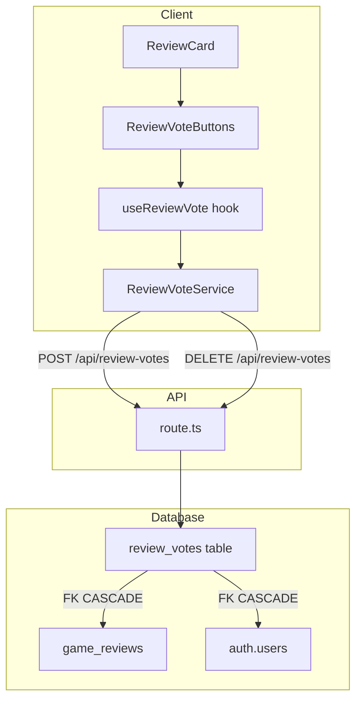

# Document de conception — Review Votes

## Vue d'ensemble

Le système de votes sur les avis permet aux joueurs authentifiés d'indiquer si
un avis est « utile » ou « pas utile ». Chaque avis affiche un compteur de votes
utiles et pas utiles. Le mécanisme suit un pattern toggle : cliquer sur le même
vote l'annule, cliquer sur le vote opposé le remplace.

L'architecture s'appuie sur les patterns existants du projet : table Supabase
avec RLS, API route Next.js, service client, hook React avec mise à jour
optimiste, et composant UI intégré dans la ReviewCard existante.

## Architecture



Le flux de données suit le pattern établi par `useCharacterFavorite` :

1. Le hook charge l'état initial (vote actuel de l'utilisateur + compteurs) via
   les données déjà présentes dans la réponse GET /api/reviews
2. L'utilisateur clique → mise à jour optimiste immédiate de l'UI
3. Appel API en arrière-plan → en cas d'erreur, rollback vers l'état précédent

## Composants et interfaces

### 1. Migration Supabase — `review_votes`

Table `review_votes` avec contrainte d'unicité `(user_id, review_id)` :

```sql
CREATE TABLE public.review_votes (
  id UUID PRIMARY KEY DEFAULT gen_random_uuid(),
  user_id UUID NOT NULL REFERENCES auth.users(id) ON DELETE CASCADE,
  review_id UUID NOT NULL REFERENCES game_reviews(id) ON DELETE CASCADE,
  vote_type TEXT NOT NULL CHECK (vote_type IN ('helpful', 'not_helpful')),
  created_at TIMESTAMPTZ NOT NULL DEFAULT now(),
  UNIQUE(user_id, review_id)
);
```

Politiques RLS :

- SELECT : lecture publique (pour les compteurs)
- INSERT : `auth.uid() = user_id`
- UPDATE : `auth.uid() = user_id`
- DELETE : `auth.uid() = user_id`

### 2. Types — `src/types/review.ts`

Extension des types existants :

```typescript
export type VoteType = "helpful" | "not_helpful";

export interface ReviewVoteCounts {
  helpful: number;
  notHelpful: number;
}

export interface ReviewWithVotes extends Review {
  voteCounts: ReviewVoteCounts;
  userVote: VoteType | null;
}
```

La réponse `ReviewsResponse` sera étendue pour retourner `ReviewWithVotes[]` au
lieu de `Review[]`.

### 3. API Route — `src/app/api/review-votes/route.ts`

**POST /api/review-votes** — Créer ou modifier un vote :

- Body : `{ reviewId: string, voteType: "helpful" | "not_helpful" }`
- Authentification requise (401 si absent)
- Vérifie que la review existe (404 sinon)
- Vérifie que le voter n'est pas l'auteur de la review (403 sinon)
- Upsert : si un vote existe déjà pour ce couple (user_id, review_id), met à
  jour le `vote_type`
- Si le `voteType` envoyé est identique au vote existant, supprime le vote
  (toggle)
- Retourne `{ success: true, vote: { voteType } | null }` (null si supprimé)

**DELETE /api/review-votes** — Supprimer un vote :

- Body : `{ reviewId: string }`
- Authentification requise
- Supprime le vote de l'utilisateur courant sur la review
- Retourne `{ success: true }`

### 4. Fonctions utilitaires pures — `src/lib/utils/reviewVotes.ts`

Fonctions pures extraites pour la testabilité :

```typescript
/**
 * Calcule les nouveaux compteurs après un changement de vote.
 * Fonction pure, sans effet de bord.
 */
export function computeVoteCountsAfterChange(
  currentCounts: ReviewVoteCounts,
  previousVote: VoteType | null,
  newVote: VoteType | null
): ReviewVoteCounts;

/**
 * Détermine le nouveau vote après un clic sur un bouton.
 * Si le vote actuel est le même que le clic → null (toggle off).
 * Sinon → le nouveau type de vote.
 */
export function resolveVoteAfterClick(
  currentVote: VoteType | null,
  clickedType: VoteType
): VoteType | null;
```

### 5. Service client — `src/lib/services/reviewVoteService.ts`

```typescript
export class ReviewVoteService {
  static async submitVote(
    reviewId: string,
    voteType: VoteType
  ): Promise<{ vote: VoteType | null }>;
  static async removeVote(reviewId: string): Promise<void>;
}
```

Suit le pattern de `ReviewService` : méthodes statiques, gestion d'erreurs
centralisée.

### 6. Hook — `src/hooks/useReviewVote.ts`

```typescript
export interface UseReviewVoteReturn {
  voteCounts: ReviewVoteCounts;
  userVote: VoteType | null;
  isVoting: boolean;
  error: string | null;
  handleVote: (voteType: VoteType) => Promise<void>;
}

export function useReviewVote(
  reviewId: string,
  reviewUserId: string,
  initialCounts: ReviewVoteCounts,
  initialUserVote: VoteType | null
): UseReviewVoteReturn;
```

Le hook reçoit les données initiales depuis le parent (pas de fetch séparé au
mount). Il gère :

- La mise à jour optimiste via `computeVoteCountsAfterChange` et
  `resolveVoteAfterClick`
- Le rollback en cas d'erreur API
- Le blocage du vote sur sa propre review (comparaison
  `user.id === reviewUserId`)

### 7. Composant UI — `src/components/games/reviews/ReviewVoteButtons.tsx`

Boutons « utile / pas utile » avec compteurs, intégrés dans le footer de
`ReviewCard` :

```typescript
interface ReviewVoteButtonsProps {
  reviewId: string;
  reviewUserId: string;
  initialCounts: ReviewVoteCounts;
  initialUserVote: VoteType | null;
}
```

- Affiche deux boutons (ThumbsUp / ThumbsDown de lucide-react) avec compteurs
- Le bouton actif est visuellement mis en surbrillance
- Désactivé si l'utilisateur n'est pas authentifié ou est l'auteur de la review
- Utilise le hook `useReviewVote` pour la logique

### 8. Intégration dans la ReviewCard existante

Modification de `ReviewCard.tsx` pour ajouter `ReviewVoteButtons` dans le
footer, après les points positifs/négatifs. Les données de vote sont passées via
les props (le type `Review` est étendu en `ReviewWithVotes`).

### 9. Extension de l'API GET /api/reviews

La route GET existante est étendue pour :

- Joindre les compteurs de votes (agrégation SQL ou post-traitement)
- Inclure le vote de l'utilisateur courant pour chaque review
- Retourner `ReviewWithVotes[]` au lieu de `Review[]`

## Modèles de données

### Table `review_votes`

| Colonne    | Type        | Contraintes                                       |
| ---------- | ----------- | ------------------------------------------------- |
| id         | UUID        | PK, DEFAULT gen_random_uuid()                     |
| user_id    | UUID        | NOT NULL, FK → auth.users(id) ON DELETE CASCADE   |
| review_id  | UUID        | NOT NULL, FK → game_reviews(id) ON DELETE CASCADE |
| vote_type  | TEXT        | NOT NULL, CHECK IN ('helpful', 'not_helpful')     |
| created_at | TIMESTAMPTZ | NOT NULL, DEFAULT now()                           |

Contrainte unique : `UNIQUE(user_id, review_id)`

Index :

- `idx_review_votes_review_id` sur `review_id` (pour l'agrégation des compteurs)
- `idx_review_votes_user_id` sur `user_id` (pour les lookups par utilisateur)

### Extension du type Review

```typescript
// Avant
export interface ReviewsResponse {
  reviews: Review[];
  // ...
}

// Après
export interface ReviewsResponse {
  reviews: ReviewWithVotes[];
  // ...
}
```

## Propriétés de correction

_Une propriété est une caractéristique ou un comportement qui doit rester vrai
pour toutes les exécutions valides d'un système — essentiellement, une
déclaration formelle de ce que le système doit faire. Les propriétés servent de
pont entre les spécifications lisibles par un humain et les garanties de
correction vérifiables par une machine._

### Property 1 : Cohérence des transitions de vote

_For any_ état de vote initial (null, "helpful", ou "not*helpful"), \_for any*
type de vote cliqué, et _for any_ compteurs initiaux non-négatifs :

- `resolveVoteAfterClick(currentVote, clickedType)` retourne null si
  `currentVote === clickedType` (toggle off), sinon retourne `clickedType`
- `computeVoteCountsAfterChange(counts, previousVote, newVote)` produit des
  compteurs non-négatifs qui reflètent exactement la transition : décrémente
  l'ancien type (si non-null) et incrémente le nouveau type (si non-null)
- La somme totale des compteurs change de manière cohérente : +1 pour un ajout,
  -1 pour une suppression, 0 pour un changement de type

**Validates: Requirements 1.1, 1.2, 1.3, 2.1, 2.2, 2.3**

### Property 2 : Prévention du vote sur son propre avis

_For any_ identifiant utilisateur et _for any_ review, si l'identifiant de
l'auteur de la review est égal à l'identifiant du voter, alors le système refuse
le vote.

**Validates: Requirements 3.2**

### Property 3 : Complétude des données de vote dans la réponse GET

_For any_ ensemble de reviews avec des votes associés, la transformation en
`ReviewWithVotes[]` inclut pour chaque review un objet `voteCounts` avec des
compteurs `helpful` et `notHelpful` non-négatifs, et un champ `userVote` qui est
soit null soit un `VoteType` valide.

**Validates: Requirements 5.5**

## Gestion des erreurs

| Situation                   | Code HTTP | Comportement                                                    |
| --------------------------- | --------- | --------------------------------------------------------------- |
| Utilisateur non authentifié | 401       | Retourne `{ error: "Unauthorized" }`                            |
| Review inexistante          | 404       | Retourne `{ error: "Review not found" }`                        |
| Vote sur sa propre review   | 403       | Retourne `{ error: "Cannot vote on own review" }`               |
| vote_type invalide          | 400       | Retourne `{ error: "Invalid vote type" }`                       |
| Erreur serveur              | 500       | Retourne `{ error: "Internal server error" }`, log côté serveur |
| Erreur réseau (côté client) | —         | Rollback optimiste, affichage du message d'erreur dans le hook  |

## Stratégie de tests

### Tests unitaires (Bun test runner)

- **Fonctions pures** (`reviewVotes.ts`) : tester `resolveVoteAfterClick` et
  `computeVoteCountsAfterChange` avec des cas spécifiques et des edge cases
  (compteurs à zéro, transitions identiques)
- **API route** : tester les cas d'erreur (401, 403, 404, 400) avec des mocks
  Supabase
- **Hook** : tester la logique de mise à jour optimiste et de rollback

### Tests property-based (fast-check)

Chaque propriété de correction est implémentée comme un test property-based
distinct :

- **Property 1** : Générer des états de vote aléatoires (currentVote ∈ {null,
  "helpful", "not_helpful"}, clickedType ∈ {"helpful", "not_helpful"}, compteurs
  aléatoires non-négatifs). Vérifier la cohérence des transitions.
  - Tag : `Feature: review-votes, Property 1: Vote state transition consistency`
  - Minimum 100 itérations

- **Property 2** : Générer des paires (userId, reviewUserId) aléatoires. Quand
  ils sont égaux, vérifier le rejet.
  - Tag : `Feature: review-votes, Property 2: Self-vote prevention`
  - Minimum 100 itérations

- **Property 3** : Générer des ensembles aléatoires de reviews et votes.
  Vérifier la complétude de la transformation.
  - Tag : `Feature: review-votes, Property 3: Vote response completeness`
  - Minimum 100 itérations

### Emplacement des tests

Conformément aux règles du projet :

- `test/unit/lib/utils/reviewVotes.property.test.ts` — Property tests pour les
  fonctions pures
- `test/unit/lib/utils/reviewVotes.test.ts` — Unit tests pour les fonctions
  pures
- `test/unit/lib/services/reviewVoteService.test.ts` — Unit tests pour le
  service
- `test/unit/hooks/useReviewVote.test.ts` — Unit tests pour le hook

### Bibliothèque PBT

Le projet utilise déjà `fast-check`. Les tests property-based suivront le même
pattern que les tests existants (ex: `review.property.test.ts`).
