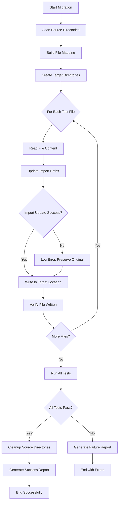

# Design Document: Test Reorganization

## Overview

This design document outlines the architecture and implementation strategy for
reorganizing the GameUniverse test suite. The reorganization centralizes all
tests in a single `test/` directory, establishes a clear folder structure
mirroring the source code, and provides a strategy for improving code coverage
from 81.55% to 95%.

The project uses Bun's built-in test runner exclusively with fast-check for
property-based testing. All tests use `bun:test` imports and Bun's mocking
utilities (`mock()`, `spyOn()`, `mock.module()`).

## Architecture

### Current Test Distribution

```
Current Structure (Scattered):
├── test/
│   ├── setup.ts                    # Global setup
│   └── setup.test.ts               # Setup verification
├── src/
│   ├── test/                       # Integration tests (4 files)
│   ├── lib/
│   │   ├── promotions.test.ts      # Misplaced test
│   │   ├── __tests__/              # Lib tests (2 files)
│   │   ├── services/__tests__/     # Service tests (6 files)
│   │   └── utils/__tests__/        # Utils tests (1 file)
│   ├── hooks/__tests__/            # Hook tests (3 files)
│   └── components/
│       ├── __tests__/              # Root component tests (3 files)
│       ├── characters/__tests__/   # Character tests (11 files)
│       ├── games/__tests__/        # Game tests (7 files)
│       ├── library/__tests__/      # Library tests (6 files)
│       ├── players/__tests__/      # Player tests (3 files)
│       ├── settings/__tests__/     # Settings tests (4 files)
│       └── shared/__tests__/       # Shared tests (7 files)
└── scripts/
    └── igdb-import/__tests__/      # Script tests (8 files)
```

### Target Test Structure

```
Target Structure (Centralized):
test/
├── setup.ts                        # Global setup (unchanged)
├── setup.test.ts                   # Setup verification (unchanged)
├── unit/
│   ├── hooks/
│   │   ├── useAuth.test.ts
│   │   ├── useAuth.property.test.ts
│   │   ├── useProfile.test.ts
│   │   ├── useUserLibrary.test.ts
│   │   ├── useGameLibraryStatus.test.ts
│   │   ├── useImageLoading.test.ts
│   │   └── use-toast.test.ts
│   ├── lib/
│   │   ├── promotions.test.ts
│   │   ├── api-response-compatibility.test.ts
│   │   ├── api-utils.property.test.ts
│   │   ├── supabase.test.ts
│   │   ├── supabase-server.test.ts
│   │   ├── auth-utils.test.ts
│   │   ├── api-client.test.ts
│   │   ├── error-handling.test.ts
│   │   ├── realtime-updates.test.ts
│   │   ├── services/
│   │   │   ├── baseService.property.test.ts
│   │   │   ├── characterService.property.test.ts
│   │   │   ├── gameImportService.property.test.ts
│   │   │   ├── hybridSearchService.property.test.ts
│   │   │   ├── igdbService.property.test.ts
│   │   │   ├── playerService.stats.property.test.ts
│   │   │   ├── gameService.test.ts
│   │   │   ├── playerService.test.ts
│   │   │   └── characterService.test.ts
│   │   └── utils/
│   │       └── game-utils.property.test.ts
│   └── components/
│       ├── AuthForm.test.tsx
│       ├── GameLibrary.property.test.ts
│       ├── Navigation.test.tsx
│       ├── characters/
│       │   └── [11 character test files]
│       ├── games/
│       │   └── [7 game test files]
│       ├── library/
│       │   └── [6 library test files]
│       ├── players/
│       │   └── [3 player test files]
│       ├── settings/
│       │   └── [4 settings test files]
│       └── shared/
│           └── [7 shared test files]
├── integration/
│   ├── auth/
│   │   └── auth-integration.test.ts
│   ├── i18n/
│   │   └── i18n.test.ts
│   └── middleware/
│       ├── middleware.test.ts
│       └── navigation-redirections.test.tsx
└── scripts/
    └── igdb-import/
        └── [8 igdb import test files]
```

## Components and Interfaces

### Test File Migration Component

```typescript
interface TestFileMigration {
  sourcePath: string;
  targetPath: string;
  importUpdates: ImportUpdate[];
}

interface ImportUpdate {
  originalImport: string;
  updatedImport: string;
  type: "relative" | "alias" | "package";
}

interface MigrationResult {
  success: boolean;
  movedFiles: string[];
  failedFiles: { path: string; error: string }[];
  importUpdates: number;
}
```

### Import Path Calculator

The import path calculator determines the correct relative path from the new
test location to the source file:

```typescript
// Example: Moving src/hooks/__tests__/useAuth.test.ts to test/unit/hooks/useAuth.test.ts
// Original import: import { useAuth } from "../useAuth"
// New import: import { useAuth } from "../../../src/hooks/useAuth"

function calculateNewImportPath(
  oldTestPath: string,
  newTestPath: string,
  importPath: string
): string {
  // Preserve @/ alias imports
  if (importPath.startsWith("@/")) return importPath;

  // Preserve package imports
  if (!importPath.startsWith(".")) return importPath;

  // Calculate new relative path
  const oldDir = path.dirname(oldTestPath);
  const newDir = path.dirname(newTestPath);
  const absoluteTarget = path.resolve(oldDir, importPath);
  return path.relative(newDir, absoluteTarget);
}
```

### Test Coverage Analyzer

```typescript
interface CoverageReport {
  file: string;
  lines: { covered: number; total: number; percentage: number };
  functions: { covered: number; total: number; percentage: number };
  branches: { covered: number; total: number; percentage: number };
}

interface CoverageGap {
  file: string;
  currentCoverage: number;
  targetCoverage: number;
  missingTests: TestSuggestion[];
}

interface TestSuggestion {
  type: "unit" | "property" | "integration";
  description: string;
  targetFunction?: string;
}
```

## Data Models

### File Mapping Configuration

```typescript
const FILE_MAPPINGS: Record<string, string> = {
  // Integration tests
  "src/test/auth-integration.test.ts":
    "test/integration/auth/auth-integration.test.ts",
  "src/test/i18n.test.ts": "test/integration/i18n/i18n.test.ts",
  "src/test/middleware.test.ts":
    "test/integration/middleware/middleware.test.ts",
  "src/test/navigation-redirections.test.tsx":
    "test/integration/middleware/navigation-redirections.test.tsx",

  // Misplaced test
  "src/lib/promotions.test.ts": "test/unit/lib/promotions.test.ts",

  // Pattern-based mappings
  "src/hooks/__tests__/*": "test/unit/hooks/*",
  "src/lib/__tests__/*": "test/unit/lib/*",
  "src/lib/services/__tests__/*": "test/unit/lib/services/*",
  "src/lib/utils/__tests__/*": "test/unit/lib/utils/*",
  "src/components/__tests__/*": "test/unit/components/*",
  "src/components/characters/__tests__/*": "test/unit/components/characters/*",
  "src/components/games/__tests__/*": "test/unit/components/games/*",
  "src/components/library/__tests__/*": "test/unit/components/library/*",
  "src/components/players/__tests__/*": "test/unit/components/players/*",
  "src/components/settings/__tests__/*": "test/unit/components/settings/*",
  "src/components/shared/__tests__/*": "test/unit/components/shared/*",
  "scripts/igdb-import/__tests__/*": "test/scripts/igdb-import/*",
};
```

### Coverage Targets

```typescript
const COVERAGE_TARGETS: CoverageGap[] = [
  // Hooks with low coverage
  { file: "src/hooks/useAuth.ts", currentCoverage: 2.37, targetCoverage: 95 },
  {
    file: "src/hooks/useGameLibraryStatus.ts",
    currentCoverage: 2.88,
    targetCoverage: 95,
  },
  {
    file: "src/hooks/useImageLoading.ts",
    currentCoverage: 2.33,
    targetCoverage: 95,
  },
  {
    file: "src/hooks/use-toast.ts",
    currentCoverage: 14.39,
    targetCoverage: 95,
  },

  // Library utilities with low coverage
  { file: "src/lib/supabase.ts", currentCoverage: 15, targetCoverage: 95 },
  {
    file: "src/lib/supabase-server.ts",
    currentCoverage: 11.63,
    targetCoverage: 95,
  },
  { file: "src/lib/auth-utils.ts", currentCoverage: 4.76, targetCoverage: 95 },
  { file: "src/lib/api-client.ts", currentCoverage: 9.22, targetCoverage: 95 },
  {
    file: "src/lib/error-handling.ts",
    currentCoverage: 19.72,
    targetCoverage: 95,
  },
  {
    file: "src/lib/realtime-updates.ts",
    currentCoverage: 26.23,
    targetCoverage: 95,
  },

  // Services with low coverage
  {
    file: "src/lib/services/gameService.ts",
    currentCoverage: 9.78,
    targetCoverage: 95,
  },
  {
    file: "src/lib/services/playerService.ts",
    currentCoverage: 9.01,
    targetCoverage: 95,
  },
  {
    file: "src/lib/services/characterService.ts",
    currentCoverage: 6.82,
    targetCoverage: 95,
  },

  // Components with low coverage
  {
    file: "src/components/shared/ErrorBoundary.tsx",
    currentCoverage: 9.68,
    targetCoverage: 95,
  },
  {
    file: "src/components/shared/SearchBar.tsx",
    currentCoverage: 7.42,
    targetCoverage: 95,
  },
  {
    file: "src/components/shared/FilterPanel.tsx",
    currentCoverage: 9.74,
    targetCoverage: 95,
  },
  {
    file: "src/components/games/GameSearchBar.tsx",
    currentCoverage: 40.81,
    targetCoverage: 95,
  },
  {
    file: "src/components/games/SearchResultsDropdown.tsx",
    currentCoverage: 2.99,
    targetCoverage: 95,
  },
];
```

## Correctness Properties

_A property is a characteristic or behavior that should hold true across all
valid executions of a system—essentially, a formal statement about what the
system should do. Properties serve as the bridge between human-readable
specifications and machine-verifiable correctness guarantees._

Based on the prework analysis, the following properties have been identified for
testing:

### Property 1: File Migration Completeness

_For any_ test file in the source locations (`src/**/__tests__/`, `src/test/`,
`scripts/igdb-import/__tests__/`), after migration, the file SHALL exist at the
corresponding target location in `test/` and SHALL NOT exist at the original
location.

**Validates: Requirements 1.1, 1.2, 1.3, 1.4**

### Property 2: Import Path Transformation Correctness

_For any_ import statement in a migrated test file:

- If the import is a relative path (starts with `./` or `../`), the transformed
  path SHALL resolve to the same absolute file as the original
- If the import is an alias path (starts with `@/`), it SHALL remain unchanged
- If the import is a package import (`bun:test`, `fast-check`, etc.), it SHALL
  remain unchanged

**Validates: Requirements 3.1, 3.2, 3.3, 3.4**

### Property 3: Test Content Preservation

_For any_ migrated test file, the test logic (excluding import statements) SHALL
be identical before and after migration. This ensures no accidental
modifications to test behavior.

**Validates: Requirements 1.6**

### Property 4: Directory Structure Mirroring

_For any_ source directory containing test files, there SHALL exist a
corresponding directory in `test/unit/` or `test/integration/` that mirrors the
source structure. Specifically:

- `src/hooks/__tests__/` → `test/unit/hooks/`
- `src/lib/__tests__/` → `test/unit/lib/`
- `src/components/{category}/__tests__/` → `test/unit/components/{category}/`

**Validates: Requirements 2.4, 8.2**

### Property 5: Test Discovery Preservation

_For any_ test run before and after migration, the total number of discovered
test files SHALL be equal. This ensures no tests are lost during migration.

**Validates: Requirements 4.2**

### Property 6: Cleanup Completeness

_For any_ `__tests__/` directory in `src/` after successful migration, the
directory SHALL NOT exist (shall be removed). The only exception is if the
directory contains non-test files.

**Validates: Requirements 10.1**

## Error Handling

### Migration Errors

| Error Type                 | Handling Strategy                                          |
| -------------------------- | ---------------------------------------------------------- |
| File not found             | Log warning, continue with remaining files                 |
| Permission denied          | Log error, mark file as failed, continue                   |
| Import resolution failure  | Log error with details, preserve original import, continue |
| Directory creation failure | Log error, abort migration for affected files              |

### Import Update Errors

```typescript
interface ImportUpdateError {
  file: string;
  originalImport: string;
  attemptedUpdate: string;
  error: string;
}

// Error handling preserves original import on failure
function updateImport(
  importStatement: string,
  oldPath: string,
  newPath: string
): { result: string; error?: ImportUpdateError } {
  try {
    const updated = calculateNewImportPath(oldPath, newPath, importStatement);
    return { result: updated };
  } catch (e) {
    return {
      result: importStatement, // Preserve original
      error: {
        file: newPath,
        originalImport: importStatement,
        attemptedUpdate: "",
        error: e instanceof Error ? e.message : "Unknown error",
      },
    };
  }
}
```

### Test Execution Errors

After migration, if any test fails:

1. Log the failing test file and error message
2. Generate a report of all failures
3. Suggest rollback if critical tests fail
4. Continue execution to identify all failures

## Testing Strategy

### Test Framework

- **Framework**: Bun's built-in test runner (`bun:test`)
- **Property Testing**: fast-check library
- **Component Testing**: @testing-library/react
- **Mocking**: Bun's `mock()`, `spyOn()`, `mock.module()`

### Unit Tests

Unit tests verify specific examples and edge cases:

1. **File Migration Tests**
   - Verify specific file moves (e.g., `src/lib/promotions.test.ts` →
     `test/unit/lib/promotions.test.ts`)
   - Verify directory creation
   - Verify cleanup of empty directories

2. **Import Update Tests**
   - Test relative path transformation with various depths
   - Test alias preservation
   - Test package import preservation
   - Test error handling for invalid imports

3. **Coverage Improvement Tests**
   - Verify new test files are created in correct locations
   - Verify test file naming conventions

### Property-Based Tests

Property tests verify universal properties across all inputs:

1. **Property 1: File Migration Completeness**
   - Generate random test file paths
   - Verify migration mapping is correct
   - Minimum 100 iterations

2. **Property 2: Import Path Transformation**
   - Generate random import statements
   - Verify transformation correctness
   - Minimum 100 iterations

3. **Property 3: Test Content Preservation**
   - Generate random test file content
   - Verify content unchanged after migration
   - Minimum 100 iterations

4. **Property 4: Directory Structure Mirroring**
   - Generate random source directory structures
   - Verify target structure matches
   - Minimum 100 iterations

5. **Property 5: Test Discovery Preservation**
   - Count tests before migration
   - Count tests after migration
   - Verify counts match

6. **Property 6: Cleanup Completeness**
   - Generate random directory structures
   - Verify all **tests** directories removed
   - Minimum 100 iterations

### Test Configuration

```typescript
// test/setup.ts remains unchanged
// bunfig.toml configuration:
[test];
preload = ["./test/setup.ts"];
timeout = 30000;
coverage = true;
bail = false;
parallel = true;
```

### Coverage Improvement Strategy

For each file with low coverage, create tests following this pattern:

```typescript
// Example: test/unit/hooks/useAuth.test.ts
import { describe, it, expect, mock, beforeEach } from "bun:test";
import * as fc from "fast-check";

describe("useAuth", () => {
  // Unit tests for specific scenarios
  describe("signIn", () => {
    it("should return user on successful sign in", async () => {
      // Mock Supabase client
      // Test specific scenario
    });
  });

  // Property tests for state transitions
  describe("Property: State Transitions", () => {
    it("for any valid credentials, signIn should transition to authenticated state", () => {
      fc.assert(
        fc.property(
          fc.emailAddress(),
          fc.string({ minLength: 6 }),
          (email, password) => {
            // Verify state transition
          }
        ),
        { numRuns: 100 }
      );
    });
  });
});
```

### Mermaid Diagram: Migration Flow


