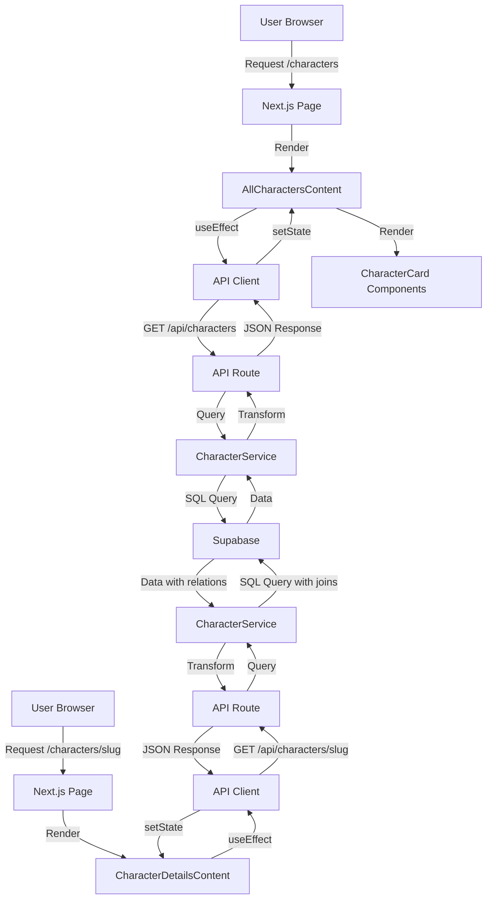

# Design Document - Character Pages

## Overview

Cette fonctionnalité ajoute deux pages dédiées aux personnages de jeux vidéo
dans l'application Next.js existante. L'implémentation suit strictement les
patterns établis par les pages de jeux (AllGamesContent et GameDetailsContent)
pour garantir la cohérence architecturale et l'expérience utilisateur.

**Pages à implémenter:**

1. **Page de liste** (`/[locale]/characters`) - Affiche tous les personnages
   avec recherche, filtres et pagination
2. **Page de détails** (`/[locale]/characters/[slug]`) - Affiche les
   informations complètes d'un personnage avec galerie média

**Principes de design:**

- Réutilisation maximale des composants UI existants (Badge, Card, Button,
  LazyImage, etc.)
- Architecture identique aux pages de jeux pour faciliter la maintenance
- Support i18n complet (français/anglais) avec next-intl
- Gestion d'erreurs robuste avec ErrorBoundary
- États de chargement avec skeletons
- API REST avec pagination côté serveur

## Architecture

### Structure des fichiers

```
src/
├── app/
│   ├── [locale]/
│   │   └── characters/
│   │       ├── page.tsx                    # Page de liste
│   │       └── [slug]/
│   │           └── page.tsx                # Page de détails
│   └── api/
│       └── characters/
│           ├── route.ts                    # GET /api/characters (liste)
│           └── [slug]/
│               └── route.ts                # GET /api/characters/[slug] (détails)
├── components/
│   └── characters/
│       ├── AllCharactersContent.tsx        # Composant principal liste
│       ├── CharacterDetailsContent.tsx     # Composant principal détails
│       ├── CharacterCard.tsx               # Card personnage
│       ├── CharacterSearchBar.tsx          # Barre de recherche
│       ├── CharacterFilters.tsx            # Filtres (jeu, rôle)
│       ├── CharacterFilterButton.tsx       # Bouton toggle filtres
│       ├── CharacterPagination.tsx         # Pagination
│       └── CharacterGridSkeleton.tsx       # Skeleton loading
├── lib/
│   └── services/
│       └── characterService.ts             # Service métier
└── types/
    └── character.ts                        # Types TypeScript
```

### Base de données Supabase

**Table `characters`:**

```sql
CREATE TABLE public.characters (
  id UUID PRIMARY KEY DEFAULT gen_random_uuid(),
  slug VARCHAR(255) UNIQUE NOT NULL,
  main_image TEXT,
  background_image TEXT,
  background_color TEXT DEFAULT '#0f172a',
  created_at TIMESTAMP DEFAULT NOW(),
  updated_at TIMESTAMP DEFAULT NOW()
);

CREATE INDEX idx_characters_slug ON characters(slug);
```

**Table `character_translations`:**

```sql
CREATE TABLE public.character_translations (
  id UUID PRIMARY KEY DEFAULT gen_random_uuid(),
  character_id UUID REFERENCES characters(id) ON DELETE CASCADE,
  language_code VARCHAR(2) REFERENCES languages(code),
  name VARCHAR(255) NOT NULL,
  role VARCHAR(100),
  description TEXT,
  biography TEXT,
  UNIQUE(character_id, language_code)
);

CREATE INDEX idx_character_translations_character_id ON character_translations(character_id);
CREATE INDEX idx_character_translations_language ON character_translations(language_code);

-- Recherche full-text multilingue
CREATE INDEX idx_character_translations_name_search ON character_translations
  USING gin(to_tsvector('french', name));
CREATE INDEX idx_character_translations_name_search_en ON character_translations
  USING gin(to_tsvector('english', name));
```

**Table `character_games` (junction table):**

```sql
CREATE TABLE public.character_games (
  character_id UUID REFERENCES characters(id) ON DELETE CASCADE,
  game_id UUID REFERENCES games(id) ON DELETE CASCADE,
  is_primary BOOLEAN DEFAULT false,
  created_at TIMESTAMP DEFAULT NOW(),
  PRIMARY KEY (character_id, game_id)
);

CREATE INDEX idx_character_games_character_id ON character_games(character_id);
CREATE INDEX idx_character_games_game_id ON character_games(game_id);
```

**Table `character_media`:**

```sql
CREATE TABLE public.character_media (
  id UUID PRIMARY KEY DEFAULT gen_random_uuid(),
  character_id UUID REFERENCES characters(id) ON DELETE CASCADE,
  type TEXT NOT NULL CHECK (type IN ('screenshot', 'artwork', 'video')),
  url TEXT NOT NULL,
  thumbnail_url TEXT,
  title TEXT,
  description TEXT,
  alt_text TEXT,
  is_featured BOOLEAN DEFAULT false,
  display_order INTEGER DEFAULT 0,
  created_at TIMESTAMP DEFAULT NOW()
);

CREATE INDEX idx_character_media_character_id ON character_media(character_id);
CREATE INDEX idx_character_media_type ON character_media(type);
```

### Flux de données



## Components and Interfaces

### 1. AllCharactersContent Component

**Responsabilité:** Composant principal de la page de liste des personnages.

**Pattern:** Réplique exacte de `AllGamesContent` avec adaptation pour les
personnages.

**Props:**

```typescript
interface AllCharactersContentProps {
  locale?: string; // 'fr' | 'en'
}
```

**État interne:**

```typescript
const [characters, setCharacters] = useState<CharacterSummary[]>([]);
const [games, setGames] = useState<Game[]>([]); // Pour les filtres
const [pagination, setPagination] = useState<Pagination | null>(null);
const [loading, setLoading] = useState(true);
const [initialLoading, setInitialLoading] = useState(true);
const [searchQuery, setSearchQuery] = useState("");
const [selectedGames, setSelectedGames] = useState<string[]>([]);
const [selectedRoles, setSelectedRoles] = useState<string[]>([]);
const [showFilters, setShowFilters] = useState(false);
```

**Hooks utilisés:**

- `useApiClient()` - Client API avec retry et gestion d'erreurs
- `useAsyncError()` - Gestion d'erreurs avec ErrorBoundary
- `useTranslations()` - Internationalisation

**Fonctions principales:**

- `fetchCharacters(search, games, roles, page)` - Récupère les personnages avec
  filtres
- `fetchGames()` - Récupère la liste des jeux pour les filtres
- `handleSearch(query)` - Gère la recherche
- `handleGameFilter(games)` - Gère le filtre par jeu
- `handleRoleFilter(roles)` - Gère le filtre par rôle
- `handlePageChange(page)` - Gère le changement de page
- `handleClearFilters()` - Réinitialise tous les filtres

**Structure JSX:**

```jsx
<div className="min-h-screen bg-gradient-to-br from-slate-50 via-blue-50 to-indigo-100">
  {/* Hero Section */}
  <div className="hero-section">
    <h1>Découvrez des Personnages Extraordinaires</h1>
    <p>Explorez notre collection de personnages de jeux vidéo</p>
    <div>Total: {pagination.totalCount} personnages</div>
  </div>

  <div className="container">
    {/* Search and Filters */}
    <div className="search-filters">
      <CharacterSearchBar onSearch={handleSearch} />
      <CharacterFilterButton onClick={toggleFilters} />
    </div>

    <CharacterFilters
      games={games}
      selectedGames={selectedGames}
      selectedRoles={selectedRoles}
      onGameChange={handleGameFilter}
      onRoleChange={handleRoleFilter}
      onClearFilters={handleClearFilters}
      showAllFilters={showFilters}
    />

    {/* Results info */}
    <div className="results-info">{pagination.totalCount} résultat(s)</div>

    {/* Loading state */}
    {loading && <CharacterGridSkeleton count={20} />}

    {/* Characters grid */}
    {!loading && (
      <div className="grid grid-cols-1 gap-4 xs:grid-cols-2 md:grid-cols-3 lg:grid-cols-4">
        {characters.map((character) => (
          <CharacterCard
            key={character.id}
            character={character}
            locale={locale}
          />
        ))}
      </div>
    )}

    {/* Pagination */}
    {pagination && pagination.totalPages > 1 && (
      <CharacterPagination
        currentPage={pagination.currentPage}
        totalPages={pagination.totalPages}
        onPageChange={handlePageChange}
      />
    )}
  </div>
</div>
```

### 2. CharacterDetailsContent Component

**Responsabilité:** Composant principal de la page de détails d'un personnage.

**Pattern:** Réplique exacte de `GameDetailsContent` avec adaptation pour les
personnages.

**Props:**

```typescript
interface CharacterDetailsContentProps {
  character: CharacterDetails;
  locale: string;
}
```

**État interne:**

```typescript
const [selectedScreenshotIndex, setSelectedScreenshotIndex] = useState(0);
const [selectedArtworkIndex, setSelectedArtworkIndex] = useState(0);
const [selectedVideoIndex, setSelectedVideoIndex] = useState(0);
const [activeTab, setActiveTab] = useState<"media" | "games" | "bio">("media");
const [isFavorited, setIsFavorited] = useState(false);
```

**Fonctions utilitaires:**

- `getCharacterColors(name, role)` - Génère un thème de couleurs dynamique
- `formatDate(dateString)` - Formate les dates selon la locale

**Structure JSX:**

```jsx
<div style={{ backgroundColor: character.backgroundColor }}>
  {/* Sticky Header */}
  <div className="sticky-header">
    <Button onClick={goBack}>Retour</Button>
    <Button onClick={toggleFavorite}>Favoris</Button>
  </div>

  {/* Hero Section avec background image */}
  <div className="hero-section">
    <div className="background-image">
      <LazyImage src={character.backgroundImage} />
      <div className="gradient-overlay" />
    </div>

    <div className="container grid lg:grid-cols-12">
      {/* Left column - Main image */}
      <div className="lg:col-span-4">
        <div className="character-cover">
          <LazyImage src={character.mainImage} alt={character.name} />
        </div>
      </div>

      {/* Right column - Info */}
      <div className="lg:col-span-8">
        <div className="badges">
          {character.role && <Badge>{character.role}</Badge>}
        </div>

        <h1>{character.name}</h1>

        <div className="metadata">
          <div>Jeu(x): {character.games.map((g) => g.title).join(", ")}</div>
        </div>

        <p className="description">{character.description}</p>

        {/* Overview cards */}
        <div className="overview-grid">
          <Card>Jeu principal: {character.primaryGame}</Card>
          <Card>Rôle: {character.role}</Card>
          <Card>Apparitions: {character.games.length} jeux</Card>
        </div>

        {/* Tabs */}
        <div className="tabs">
          <button onClick={() => setActiveTab("media")}>Médias</button>
          <button onClick={() => setActiveTab("games")}>Jeux</button>
          <button onClick={() => setActiveTab("bio")}>Biographie</button>
        </div>

        {/* Tab content */}
        {activeTab === "media" && (
          <div>
            {/* Screenshots gallery */}
            {/* Artwork gallery */}
            {/* Videos */}
          </div>
        )}

        {activeTab === "games" && (
          <div>
            {/* List of games featuring this character */}
            {character.games.map((game) => (
              <GameCard key={game.id} game={game} />
            ))}
          </div>
        )}

        {activeTab === "bio" && (
          <div>
            <h2>Biographie</h2>
            <p>{character.biography}</p>
          </div>
        )}
      </div>
    </div>
  </div>
</div>
```

### 3. CharacterCard Component

**Responsabilité:** Affiche une card de personnage dans la grille.

**Pattern:** Réplique de `GameCard` avec adaptation.

**Props:**

```typescript
interface CharacterCardProps {
  character: CharacterSummary;
  locale: string;
  priority?: boolean; // Pour lazy loading
}
```

**Structure JSX:**

```jsx
<Link href={`/${locale}/characters/${character.slug}`}>
  <Card className="character-card group">
    <div className="relative aspect-[3/4]">
      <LazyImage
        src={character.mainImage}
        alt={character.name}
        fill
        className="object-cover group-hover:scale-105"
        priority={priority}
      />

      {/* Role badge */}
      {character.role && (
        <Badge className="absolute right-2 top-2">{character.role}</Badge>
      )}
    </div>

    <CardContent>
      <h3 className="font-bold">{character.name}</h3>
      <p className="text-sm text-muted">{character.primaryGame}</p>

      {/* Games count */}
      <div className="text-xs text-muted">{character.gamesCount} jeu(x)</div>
    </CardContent>
  </Card>
</Link>
```

### 4. CharacterSearchBar Component

**Responsabilité:** Barre de recherche avec debounce.

**Pattern:** Réplique de `GameSearchBar`.

**Props:**

```typescript
interface CharacterSearchBarProps {
  onSearch: (query: string) => void;
  initialValue?: string;
}
```

**Implémentation:**

```typescript
export function CharacterSearchBar({ onSearch, initialValue = "" }: CharacterSearchBarProps) {
  const [value, setValue] = useState(initialValue);
  const t = useTranslations();

  useEffect(() => {
    const timeoutId = setTimeout(() => {
      onSearch(value);
    }, 300); // Debounce 300ms

    return () => clearTimeout(timeoutId);
  }, [value, onSearch]);

  return (
    <div className="relative">
      <Search className="absolute left-3 top-1/2 -translate-y-1/2" />
      <Input
        type="text"
        placeholder={t('characters.searchPlaceholder')}
        value={value}
        onChange={(e) => setValue(e.target.value)}
        className="pl-10"
      />
      {value && (
        <Button
          variant="ghost"
          size="sm"
          onClick={() => setValue("")}
          className="absolute right-2 top-1/2 -translate-y-1/2"
        >
          <X className="h-4 w-4" />
        </Button>
      )}
    </div>
  );
}
```

### 5. CharacterFilters Component

**Responsabilité:** Affiche les filtres par jeu et par rôle.

**Pattern:** Réplique de `GameFilters` avec adaptation.

**Props:**

```typescript
interface CharacterFiltersProps {
  games: Game[];
  selectedGames: string[];
  selectedRoles: string[];
  onGameChange: (games: string[]) => void;
  onRoleChange: (roles: string[]) => void;
  onClearFilters: () => void;
  showAllFilters: boolean;
}
```

**Rôles disponibles:**

```typescript
const AVAILABLE_ROLES = [
  { value: "protagonist", label_fr: "Protagoniste", label_en: "Protagonist" },
  { value: "antagonist", label_fr: "Antagoniste", label_en: "Antagonist" },
  { value: "supporting", label_fr: "Secondaire", label_en: "Supporting" },
  { value: "npc", label_fr: "PNJ", label_en: "NPC" },
  { value: "playable", label_fr: "Jouable", label_en: "Playable" },
];
```

**Structure JSX:**

```jsx
<div className={`filters ${showAllFilters ? "expanded" : "collapsed"}`}>
  {/* Game filters */}
  <div className="filter-section">
    <h3>Filtrer par jeu</h3>
    <div className="filter-chips">
      {games.map((game) => (
        <Badge
          key={game.id}
          variant={selectedGames.includes(game.id) ? "default" : "outline"}
          onClick={() => toggleGameFilter(game.id)}
          className="cursor-pointer"
        >
          {game.title}
        </Badge>
      ))}
    </div>
  </div>

  {/* Role filters */}
  <div className="filter-section">
    <h3>Filtrer par rôle</h3>
    <div className="filter-chips">
      {AVAILABLE_ROLES.map((role) => (
        <Badge
          key={role.value}
          variant={selectedRoles.includes(role.value) ? "default" : "outline"}
          onClick={() => toggleRoleFilter(role.value)}
          className="cursor-pointer"
        >
          {locale === "fr" ? role.label_fr : role.label_en}
        </Badge>
      ))}
    </div>
  </div>

  {/* Clear filters button */}
  {(selectedGames.length > 0 || selectedRoles.length > 0) && (
    <Button variant="outline" onClick={onClearFilters}>
      Effacer les filtres
    </Button>
  )}
</div>
```

### 6. CharacterService

**Responsabilité:** Service métier pour les opérations sur les personnages.

**Pattern:** Réplique de `GameService` avec adaptation.

**Méthodes:**

```typescript
export class CharacterService {
  private static getBaseUrl(): string {
    return process.env.NEXT_PUBLIC_BASE_URL || "http://localhost:3000";
  }

  /**
   * Récupère les détails d'un personnage par son slug
   */
  static async fetchCharacterDetails(
    slug: string,
    locale: string = "fr"
  ): Promise<CharacterDetails | null> {
    try {
      const baseUrl = this.getBaseUrl();
      const response = await fetch(
        `${baseUrl}/api/characters/${slug}?locale=${locale}`,
        { cache: "no-store" }
      );

      if (!response.ok) {
        if (response.status === 404) return null;
        throw new Error(`Failed to fetch character: ${response.status}`);
      }

      return await response.json();
    } catch (error) {
      console.error("Error fetching character details:", error);
      throw error;
    }
  }

  /**
   * Récupère la liste des personnages avec pagination et filtres
   */
  static async fetchCharacters(
    options: {
      search?: string;
      games?: string[];
      roles?: string[];
      page?: number;
      limit?: number;
      locale?: string;
    } = {}
  ): Promise<{
    characters: CharacterSummary[];
    pagination: Pagination;
  }> {
    try {
      const baseUrl = this.getBaseUrl();
      const params = new URLSearchParams();

      if (options.search) params.set("search", options.search);
      if (options.games?.length) params.set("games", options.games.join(","));
      if (options.roles?.length) params.set("roles", options.roles.join(","));
      if (options.page) params.set("page", options.page.toString());
      if (options.limit) params.set("limit", options.limit.toString());
      if (options.locale) params.set("locale", options.locale);

      const response = await fetch(
        `${baseUrl}/api/characters?${params.toString()}`,
        { cache: "no-store" }
      );

      if (!response.ok) {
        throw new Error(`Failed to fetch characters: ${response.status}`);
      }

      return await response.json();
    } catch (error) {
      console.error("Error fetching characters:", error);
      throw error;
    }
  }

  /**
   * Vérifie si un personnage existe
   */
  static async characterExists(
    slug: string,
    locale: string = "fr"
  ): Promise<boolean> {
    try {
      const character = await this.fetchCharacterDetails(slug, locale);
      return character !== null;
    } catch {
      return false;
    }
  }

  /**
   * Génère les métadonnées SEO pour un personnage
   */
  static async generateCharacterMetadata(slug: string, locale: string = "fr") {
    try {
      const character = await this.fetchCharacterDetails(slug, locale);

      if (!character) {
        return {
          title:
            locale === "fr" ? "Personnage non trouvé" : "Character not found",
        };
      }

      return {
        title: `${character.name} - Game Universe`,
        description:
          character.description ||
          (locale === "fr"
            ? `Découvrez ${character.name}, personnage de ${character.primaryGame}`
            : `Discover ${character.name}, character from ${character.primaryGame}`),
        openGraph: {
          title: character.name,
          description: character.description,
          images: character.mainImage ? [character.mainImage] : [],
        },
      };
    } catch (error) {
      console.error("Error generating character metadata:", error);
      return {
        title: locale === "fr" ? "Erreur" : "Error",
      };
    }
  }
}
```

## Data Models

### TypeScript Types

**Fichier: `src/types/character.ts`**

```typescript
export interface CharacterMedia {
  mainImage?: string;
  backgroundImage?: string;
  screenshots: Array<{
    id: string;
    url: string;
    altText?: string;
    caption?: string;
    isFeatured?: boolean;
  }>;
  artwork: Array<{
    id: string;
    url: string;
    altText?: string;
    caption?: string;
    type?: string;
    isFeatured?: boolean;
  }>;
  videos: Array<{
    id: string;
    title: string;
    description?: string;
    url: string;
    thumbnailUrl?: string;
    type?: string;
    duration?: number;
    isFeatured?: boolean;
  }>;
}

export interface CharacterGame {
  id: string;
  slug: string;
  title: string;
  coverImage?: string;
  releaseYear?: number;
  isPrimary: boolean;
}

export interface CharacterDetails {
  id: string;
  slug: string;
  name: string;
  role?: string;
  description?: string;
  biography?: string;
  backgroundColor?: string;
  games: CharacterGame[];
  primaryGame: string; // Nom du jeu principal
  media: CharacterMedia;
  createdAt: string;
  updatedAt: string;
}

export interface CharacterSummary {
  id: string;
  slug: string;
  name: string;
  role?: string;
  description?: string;
  mainImage?: string;
  backgroundColor?: string;
  primaryGame: string;
  gamesCount: number;
}

export interface Pagination {
  currentPage: number;
  totalPages: number;
  totalCount: number;
  hasNextPage: boolean;
  hasPreviousPage: boolean;
}

export interface CharacterFilters {
  search?: string;
  games?: string[];
  roles?: string[];
}
```

### API Response Formats

**GET /api/characters (Liste)**

```typescript
{
  characters: CharacterSummary[];
  pagination: {
    currentPage: number;
    totalPages: number;
    totalCount: number;
    hasNextPage: boolean;
    hasPreviousPage: boolean;
  };
}
```

**GET /api/characters/[slug] (Détails)**

```typescript
CharacterDetails;
```

**Query Parameters pour /api/characters:**

- `locale`: 'fr' | 'en' (défaut: 'fr')
- `page`: number (défaut: 1)
- `limit`: number (défaut: 20)
- `search`: string (optionnel)
- `games`: string (comma-separated game IDs, optionnel)
- `roles`: string (comma-separated role values, optionnel)

### Database Queries

**Requête pour la liste des personnages (avec filtres):**

```sql
WITH filtered_characters AS (
  SELECT DISTINCT c.id
  FROM characters c
  LEFT JOIN character_translations ct ON c.id = ct.character_id
  LEFT JOIN character_games cg ON c.id = cg.character_id
  WHERE
    ($1::text IS NULL OR ct.name ILIKE '%' || $1 || '%')
    AND ($2::uuid[] IS NULL OR cg.game_id = ANY($2))
    AND ($3::text[] IS NULL OR ct.role = ANY($3))
    AND ct.language_code = $4
)
SELECT
  c.id,
  c.slug,
  ct.name,
  ct.role,
  ct.description,
  c.main_image,
  c.background_color,
  (SELECT gt.title
   FROM games g
   JOIN game_translations gt ON g.id = gt.game_id
   JOIN character_games cg ON g.id = cg.game_id
   WHERE cg.character_id = c.id
     AND cg.is_primary = true
     AND gt.language_code = $4
   LIMIT 1) as primary_game,
  (SELECT COUNT(*) FROM character_games WHERE character_id = c.id) as games_count
FROM characters c
JOIN character_translations ct ON c.id = ct.character_id
WHERE c.id IN (SELECT id FROM filtered_characters)
  AND ct.language_code = $4
ORDER BY ct.name ASC
LIMIT $5 OFFSET $6;
```

**Requête pour les détails d'un personnage:**

```sql
SELECT
  c.id,
  c.slug,
  ct.name,
  ct.role,
  ct.description,
  ct.biography,
  c.main_image,
  c.background_image,
  c.background_color,
  c.created_at,
  c.updated_at,
  -- Games (as JSON array)
  COALESCE(
    (SELECT json_agg(
      json_build_object(
        'id', g.id,
        'slug', g.slug,
        'title', gt.title,
        'coverImage', g.cover_image_url,
        'releaseYear', EXTRACT(YEAR FROM g.release_date),
        'isPrimary', cg.is_primary
      ) ORDER BY cg.is_primary DESC, gt.title ASC
    )
    FROM games g
    JOIN game_translations gt ON g.id = gt.game_id
    JOIN character_games cg ON g.id = cg.game_id
    WHERE cg.character_id = c.id AND gt.language_code = $2),
    '[]'::json
  ) as games,
  -- Media (as JSON object)
  json_build_object(
    'mainImage', c.main_image,
    'backgroundImage', c.background_image,
    'screenshots', COALESCE(
      (SELECT json_agg(
        json_build_object(
          'id', cm.id,
          'url', cm.url,
          'altText', cm.alt_text,
          'caption', cm.description,
          'isFeatured', cm.is_featured
        ) ORDER BY cm.display_order ASC
      )
      FROM character_media cm
      WHERE cm.character_id = c.id AND cm.type = 'screenshot'),
      '[]'::json
    ),
    'artwork', COALESCE(
      (SELECT json_agg(
        json_build_object(
          'id', cm.id,
          'url', cm.url,
          'altText', cm.alt_text,
          'caption', cm.description,
          'type', cm.title,
          'isFeatured', cm.is_featured
        ) ORDER BY cm.display_order ASC
      )
      FROM character_media cm
      WHERE cm.character_id = c.id AND cm.type = 'artwork'),
      '[]'::json
    ),
    'videos', COALESCE(
      (SELECT json_agg(
        json_build_object(
          'id', cm.id,
          'title', cm.title,
          'description', cm.description,
          'url', cm.url,
          'thumbnailUrl', cm.thumbnail_url,
          'isFeatured', cm.is_featured
        ) ORDER BY cm.display_order ASC
      )
      FROM character_media cm
      WHERE cm.character_id = c.id AND cm.type = 'video'),
      '[]'::json
    )
  ) as media
FROM characters c
JOIN character_translations ct ON c.id = ct.character_id
WHERE c.slug = $1 AND ct.language_code = $2;
```

## Correctness Properties

_Une propriété est une caractéristique ou un comportement qui doit être vrai
pour toutes les exécutions valides d'un système - essentiellement, une
déclaration formelle sur ce que le système doit faire. Les propriétés servent de
pont entre les spécifications lisibles par l'homme et les garanties de
correction vérifiables par machine._

### Property 1: Character Card Rendering Completeness

_For any_ list of characters, when rendering character cards, each card should
display all required fields: main image, character name, and primary game name.

**Validates: Requirements 1.1, 1.2**

### Property 2: Case-Insensitive Search Filtering

_For any_ search term (in any case combination), the filtered character results
should only include characters whose names contain that search term
(case-insensitive matching).

**Validates: Requirements 2.1, 2.4**

### Property 3: Multi-Filter Conjunction

_For any_ combination of filters (games and/or roles), the displayed characters
should match ALL selected filter criteria (AND logic, not OR).

**Validates: Requirements 3.1, 3.2, 3.3**

### Property 4: Filter Clear Round-Trip

_For any_ initial character list state, applying filters then clearing all
filters should return to displaying the same complete character list.

**Validates: Requirements 3.4**

### Property 5: Pagination Visibility Threshold

_For any_ character list where the total count exceeds the page size limit,
pagination controls should be visible and functional.

**Validates: Requirements 4.1**

### Property 6: Pagination State Preservation

_For any_ active search and filter state, navigating between pages should
preserve all search terms and selected filters.

**Validates: Requirements 4.3**

### Property 7: API Pagination Metadata Completeness

_For any_ paginated API response from /api/characters, the response should
include complete pagination metadata: currentPage, totalPages, totalCount,
hasNextPage, and hasPreviousPage.

**Validates: Requirements 4.4, 8.4**

### Property 8: Character Details Completeness

_For any_ valid character slug, the details page should display all available
character information: hero section with main image and name, origin games,
role, description, and biography (when present).

**Validates: Requirements 5.1, 5.2, 5.3, 5.4**

### Property 9: Media Gallery Completeness

_For any_ character with media items, all media items (screenshots, artwork,
videos) should appear in the respective gallery sections.

**Validates: Requirements 6.1**

### Property 10: Database Query Relation Loading

_For any_ valid character slug queried from the database, the returned data
should include all related entities: associated games (with primary game flag)
and all media items.

**Validates: Requirements 7.4**

### Property 11: API Filter Application

_For any_ combination of query parameters (search, games, roles) sent to
/api/characters, the API should return only characters matching all specified
criteria.

**Validates: Requirements 8.3**

### Property 12: Locale-Based Content Display

_For any_ locale setting (fr or en), all displayed character information (names,
descriptions, roles) should be in the selected language.

**Validates: Requirements 9.2**

## Error Handling

### Client-Side Error Handling

**1. API Errors avec useAsyncError:**

```typescript
const { executeAsync } = useAsyncError();

const fetchCharacters = async () => {
  const result = await executeAsync(async () => {
    const data = await apiClient.get("/api/characters", {
      retryConfig: {
        maxAttempts: 3,
        baseDelay: 1000,
      },
    });
    return data;
  }, "fetchCharacters");

  if (result) {
    setCharacters(result.characters);
  } else {
    // Error handled by ErrorBoundary
    toast({
      variant: "destructive",
      title: "Erreur de chargement",
      description: "Impossible de charger les personnages.",
    });
  }
};
```

**2. 404 Character Not Found:**

```typescript
// Dans la page [slug]/page.tsx
export default async function CharacterPage({ params }: { params: { slug: string, locale: string } }) {
  const character = await CharacterService.fetchCharacterDetails(params.slug, params.locale);

  if (!character) {
    notFound(); // Déclenche la page 404 de Next.js
  }

  return <CharacterDetailsContent character={character} locale={params.locale} />;
}
```

**3. Loading States:**

```typescript
// Initial loading - Full skeleton
if (initialLoading) {
  return <CharacterGridSkeleton count={20} />;
}

// Subsequent loading - Skeleton over existing content
{loading && <CharacterGridSkeleton count={20} />}

// Empty state
{!loading && characters.length === 0 && (
  <div className="empty-state">
    <p>Aucun personnage trouvé</p>
    {hasActiveFilters && (
      <Button onClick={handleClearFilters}>
        Effacer les filtres
      </Button>
    )}
  </div>
)}
```

### Server-Side Error Handling

**API Route Error Responses:**

```typescript
// /api/characters/route.ts
export async function GET(request: Request) {
  try {
    const { searchParams } = new URL(request.url);
    const locale = searchParams.get("locale") || "fr";
    const page = parseInt(searchParams.get("page") || "1");
    const limit = parseInt(searchParams.get("limit") || "20");

    // Validation
    if (page < 1 || limit < 1 || limit > 100) {
      return NextResponse.json(
        { error: "Invalid pagination parameters" },
        { status: 400 }
      );
    }

    const result = await CharacterService.fetchCharacters({
      locale,
      page,
      limit,
      search: searchParams.get("search") || undefined,
      games: searchParams.get("games")?.split(",") || undefined,
      roles: searchParams.get("roles")?.split(",") || undefined,
    });

    return NextResponse.json(result);
  } catch (error) {
    console.error("Error in /api/characters:", error);
    return NextResponse.json(
      { error: "Internal server error" },
      { status: 500 }
    );
  }
}
```

```typescript
// /api/characters/[slug]/route.ts
export async function GET(
  request: Request,
  { params }: { params: { slug: string } }
) {
  try {
    const { searchParams } = new URL(request.url);
    const locale = searchParams.get("locale") || "fr";

    const character = await CharacterService.fetchCharacterDetails(
      params.slug,
      locale
    );

    if (!character) {
      return NextResponse.json(
        { error: "Character not found" },
        { status: 404 }
      );
    }

    return NextResponse.json(character);
  } catch (error) {
    console.error(`Error fetching character ${params.slug}:`, error);
    return NextResponse.json(
      { error: "Internal server error" },
      { status: 500 }
    );
  }
}
```

### Error Boundary Integration

```typescript
// app/[locale]/characters/error.tsx
'use client';

import { useEffect } from 'react';
import { Button } from '@/components/ui/button';

export default function Error({
  error,
  reset,
}: {
  error: Error & { digest?: string };
  reset: () => void;
}) {
  useEffect(() => {
    console.error('Characters page error:', error);
  }, [error]);

  return (
    <div className="flex min-h-screen items-center justify-center">
      <div className="text-center">
        <h2 className="mb-4 text-2xl font-bold">
          Une erreur est survenue
        </h2>
        <p className="mb-6 text-muted-foreground">
          Impossible de charger les personnages
        </p>
        <Button onClick={reset}>Réessayer</Button>
      </div>
    </div>
  );
}
```

## Testing Strategy

### Dual Testing Approach

Cette fonctionnalité utilise une approche de test duale combinant:

1. **Tests unitaires** - Pour les cas spécifiques, les cas limites et les
   conditions d'erreur
2. **Tests basés sur les propriétés** - Pour vérifier les propriétés
   universelles sur tous les inputs

Les deux types de tests sont complémentaires et nécessaires pour une couverture
complète:

- Les tests unitaires capturent les bugs concrets et les cas spécifiques
- Les tests basés sur les propriétés vérifient la correction générale

### Property-Based Testing Configuration

**Bibliothèque:** `fast-check` (pour TypeScript/JavaScript)

**Installation:**

```bash
npm install --save-dev fast-check @types/fast-check
```

**Configuration des tests:**

- Minimum 100 itérations par test de propriété (en raison de la randomisation)
- Chaque test de propriété doit référencer sa propriété du document de design
- Format du tag: `Feature: character-pages, Property {number}: {property_text}`

**Exemple de test de propriété:**

```typescript
import fc from "fast-check";
import { describe, it, expect } from "bun:test";

describe("Character Pages - Property Tests", () => {
  // Feature: character-pages, Property 2: Case-Insensitive Search Filtering
  it("should filter characters case-insensitively", () => {
    fc.assert(
      fc.property(
        fc.array(
          fc.record({
            id: fc.uuid(),
            name: fc.string({ minLength: 1 }),
            slug: fc.string({ minLength: 1 }),
          })
        ),
        fc.string({ minLength: 1 }),
        (characters, searchTerm) => {
          const filtered = filterCharactersBySearch(characters, searchTerm);

          // All filtered results should contain the search term (case-insensitive)
          return filtered.every((char) =>
            char.name.toLowerCase().includes(searchTerm.toLowerCase())
          );
        }
      ),
      { numRuns: 100 }
    );
  });

  // Feature: character-pages, Property 3: Multi-Filter Conjunction
  it("should apply multiple filters with AND logic", () => {
    fc.assert(
      fc.property(
        fc.array(
          fc.record({
            id: fc.uuid(),
            name: fc.string(),
            games: fc.array(fc.uuid()),
            role: fc.constantFrom("protagonist", "antagonist", "supporting"),
          })
        ),
        fc.array(fc.uuid()),
        fc.constantFrom("protagonist", "antagonist", "supporting"),
        (characters, selectedGames, selectedRole) => {
          const filtered = applyFilters(characters, {
            games: selectedGames,
            roles: [selectedRole],
          });

          // All results should match ALL filter criteria
          return filtered.every(
            (char) =>
              char.games.some((g) => selectedGames.includes(g)) &&
              char.role === selectedRole
          );
        }
      ),
      { numRuns: 100 }
    );
  });
});
```

### Unit Testing Strategy

**Tests unitaires à écrire:**

1. **Composants UI:**
   - CharacterCard affiche correctement les données
   - CharacterSearchBar déclenche onSearch avec debounce
   - CharacterFilters gère les sélections multiples
   - Skeleton components s'affichent pendant le chargement

2. **Service Layer:**
   - CharacterService.fetchCharacters construit les bons paramètres d'URL
   - CharacterService.fetchCharacterDetails gère les 404
   - Gestion des erreurs réseau avec retry

3. **API Routes:**
   - /api/characters retourne le bon format de réponse
   - /api/characters/[slug] retourne 404 pour slug invalide
   - Validation des paramètres de pagination
   - Filtres appliqués correctement

4. **Edge Cases:**
   - Liste vide de personnages
   - Personnage sans média
   - Recherche sans résultats
   - Erreurs API
   - Slug invalide

**Exemple de test unitaire:**

```typescript
import { describe, it, expect, mock } from 'bun:test';
import { render, screen, waitFor } from '@testing-library/react';
import { CharacterCard } from '@/components/characters/CharacterCard';

describe('CharacterCard', () => {
  it('should display character name, image, and primary game', () => {
    const character = {
      id: '123',
      slug: 'mario',
      name: 'Mario',
      mainImage: '/mario.jpg',
      primaryGame: 'Super Mario Bros',
      role: 'Protagonist',
      gamesCount: 50,
    };

    render(<CharacterCard character={character} locale="fr" />);

    expect(screen.getByText('Mario')).toBeInTheDocument();
    expect(screen.getByText('Super Mario Bros')).toBeInTheDocument();
    expect(screen.getByText('50 jeu(x)')).toBeInTheDocument();
    expect(screen.getByAltText('Mario')).toHaveAttribute('src', '/mario.jpg');
  });

  it('should handle missing role gracefully', () => {
    const character = {
      id: '123',
      slug: 'npc',
      name: 'Generic NPC',
      mainImage: '/npc.jpg',
      primaryGame: 'Some Game',
      gamesCount: 1,
    };

    render(<CharacterCard character={character} locale="fr" />);

    expect(screen.getByText('Generic NPC')).toBeInTheDocument();
    expect(screen.queryByRole('badge')).not.toBeInTheDocument();
  });
});
```

### Integration Testing

**Tests d'intégration à écrire:**

1. **Page de liste complète:**
   - Chargement initial des personnages
   - Recherche met à jour les résultats
   - Filtres mettent à jour les résultats
   - Pagination fonctionne
   - Combinaison recherche + filtres + pagination

2. **Page de détails complète:**
   - Chargement des détails d'un personnage
   - Affichage de la galerie média
   - Navigation entre les onglets
   - Gestion du 404

3. **Navigation entre pages:**
   - Clic sur une card redirige vers les détails
   - Bouton retour fonctionne
   - État de recherche/filtres préservé

**Exemple de test d'intégration:**

```typescript
import { describe, it, expect, beforeEach } from 'bun:test';
import { render, screen, fireEvent, waitFor } from '@testing-library/react';
import { AllCharactersContent } from '@/components/characters/AllCharactersContent';

describe('AllCharactersContent Integration', () => {
  beforeEach(() => {
    // Mock API responses
    global.fetch = vi.fn();
  });

  it('should load characters and allow search', async () => {
    const mockCharacters = [
      { id: '1', name: 'Mario', slug: 'mario', primaryGame: 'SMB', gamesCount: 50 },
      { id: '2', name: 'Luigi', slug: 'luigi', primaryGame: 'SMB', gamesCount: 40 },
    ];

    (global.fetch as any).mockResolvedValueOnce({
      ok: true,
      json: async () => ({
        characters: mockCharacters,
        pagination: { currentPage: 1, totalPages: 1, totalCount: 2 },
      }),
    });

    render(<AllCharactersContent locale="fr" />);

    // Wait for initial load
    await waitFor(() => {
      expect(screen.getByText('Mario')).toBeInTheDocument();
      expect(screen.getByText('Luigi')).toBeInTheDocument();
    });

    // Search for "Mario"
    const searchInput = screen.getByPlaceholderText(/rechercher/i);
    fireEvent.change(searchInput, { target: { value: 'Mario' } });

    // Wait for debounce and API call
    await waitFor(() => {
      expect(global.fetch).toHaveBeenCalledWith(
        expect.stringContaining('search=Mario'),
        expect.any(Object)
      );
    });
  });
});
```

### Test Coverage Goals

- **Couverture de code:** Minimum 80% pour les composants et services
- **Couverture des propriétés:** 100% des propriétés de correction doivent avoir
  un test
- **Couverture des edge cases:** Tous les cas limites identifiés doivent être
  testés
- **Couverture des erreurs:** Tous les chemins d'erreur doivent être testés
