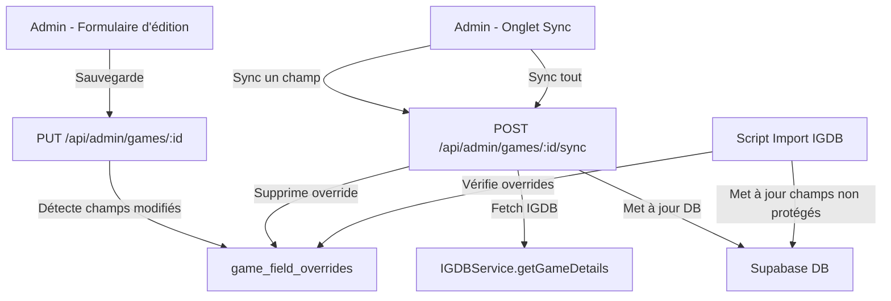

# Document de Design : IGDB Field Tracking

## Vue d'ensemble

Ce système permet de suivre les modifications manuelles effectuées par les
administrateurs sur les champs de jeux importés depuis IGDB. Lors d'une
synchronisation ou d'un nouvel import, les champs modifiés manuellement sont
protégés. Un nouvel onglet « Synchronisation IGDB » dans le formulaire d'édition
admin permet de visualiser l'état de chaque champ et de forcer la
re-synchronisation.

L'architecture repose sur une table `game_field_overrides` qui enregistre les
champs modifiés manuellement. Le processus d'import/sync consulte cette table
avant d'écraser un champ. L'onglet sync utilise une API dédiée pour récupérer
les données IGDB et mettre à jour sélectivement les champs.

## Architecture



### Flux principaux

1. **Édition admin** : Quand un admin sauvegarde un jeu, le PUT compare les
   valeurs soumises avec les valeurs actuelles en DB. Les champs modifiés sont
   enregistrés dans `game_field_overrides`.

2. **Import/Sync IGDB** : Avant de mettre à jour un champ, le script vérifie si
   un override existe. Si oui, le champ est ignoré.

3. **Sync forcée** : L'onglet sync appelle l'API dédiée qui récupère les données
   IGDB, met à jour le(s) champ(s) et supprime le(s) override(s)
   correspondant(s).

## Composants et Interfaces

### Catégories de champs suivis

Les champs sont regroupés en catégories logiques correspondant aux données
synchronisables depuis IGDB :

```typescript
const TRACKABLE_FIELDS = [
  "translations", // titre et description (toutes langues)
  "cover_image", // URL de la cover
  "background_image", // URL de l'image de fond
  "release_date", // date de sortie
  "metascore", // note agrégée
  "genres", // genres liés
  "companies", // développeurs et éditeurs
  "screenshots", // captures d'écran
  "artworks", // artworks
  "age_ratings", // classifications d'âge
  "versions", // éditions du jeu
  "languages", // langues supportées
  "playtime", // temps de jeu (hastily, normally, completely)
] as const;
```

### Composants UI

1. **GameFormSyncTab.tsx** : Nouvel onglet dans le formulaire d'édition. Affiche
   la liste des champs avec leur état (override ou synced) et les boutons de
   synchronisation.

2. **useGameSync.ts** : Hook custom gérant l'état de synchronisation, les appels
   API et le rafraîchissement des données.

### API Routes

1. **GET /api/admin/games/:id/overrides** : Retourne la liste des overrides pour
   un jeu.

2. **POST /api/admin/games/:id/sync** : Synchronise un ou tous les champs depuis
   IGDB.
   - Body : `{ field?: string }` — si `field` est absent, synchronise tout.
   - Retourne les données mises à jour.

### Service de détection des modifications

Un utilitaire `field-tracking.ts` dans `src/lib/utils/` qui :

- Compare les données soumises avec les données actuelles en DB
- Détermine quels champs ont changé
- Insère/met à jour les overrides dans `game_field_overrides`

### Service de synchronisation

Un utilitaire `igdb-sync.ts` dans `src/lib/services/` qui :

- Récupère les données IGDB via `IGDBService.getGameDetails`
- Transforme les données IGDB au format Supabase (réutilise la logique de
  `game-importer.ts`)
- Met à jour sélectivement les champs dans la DB
- Supprime les overrides pour les champs synchronisés

## Modèle de données

### Table `game_field_overrides`

```sql
CREATE TABLE public.game_field_overrides (
  id UUID PRIMARY KEY DEFAULT gen_random_uuid(),
  game_id UUID NOT NULL REFERENCES games(id) ON DELETE CASCADE,
  field_name TEXT NOT NULL,
  modified_by UUID REFERENCES auth.users(id) ON DELETE SET NULL,
  modified_at TIMESTAMPTZ NOT NULL DEFAULT NOW(),
  UNIQUE(game_id, field_name)
);
```

### Index

```sql
CREATE INDEX idx_game_field_overrides_game_id ON game_field_overrides(game_id);
```

### Politiques RLS

```sql
ALTER TABLE game_field_overrides ENABLE ROW LEVEL SECURITY;

-- Lecture admin uniquement
CREATE POLICY "Admins can manage game field overrides"
  ON game_field_overrides FOR ALL USING (public.is_admin());
```

### Types TypeScript

```typescript
// src/types/admin-games.ts (ajouts)

interface GameFieldOverride {
  id: string;
  gameId: string;
  fieldName: string;
  modifiedBy: string | null;
  modifiedAt: string;
}

type TrackableField =
  | "translations"
  | "cover_image"
  | "background_image"
  | "release_date"
  | "metascore"
  | "genres"
  | "companies"
  | "screenshots"
  | "artworks"
  | "age_ratings"
  | "versions"
  | "languages"
  | "playtime";
```

## Propriétés de Correctness

_Une propriété est une caractéristique ou un comportement qui doit rester vrai
pour toutes les exécutions valides d'un système — essentiellement, une
déclaration formelle de ce que le système doit faire. Les propriétés servent de
pont entre les spécifications lisibles par un humain et les garanties de
correction vérifiables par une machine._

### Property 1 : Détection des modifications de champs

_Pour tout_ état de jeu en base de données et toute soumission de formulaire
admin, l'ensemble des overrides enregistrés dans `game_field_overrides` doit
correspondre exactement à l'ensemble des catégories de champs dont les valeurs
diffèrent entre la soumission et l'état actuel.

**Validates: Requirements 1.1, 1.2**

### Property 2 : Idempotence de l'upsert des overrides

_Pour tout_ jeu et tout champ, enregistrer un override deux fois pour la même
combinaison (game_id, field_name) doit résulter en exactement une entrée dans
`game_field_overrides`, avec la date de modification mise à jour.

**Validates: Requirements 1.3, 5.2**

### Property 3 : La synchronisation respecte les overrides

_Pour tout_ jeu ayant un ensemble d'overrides O et un ensemble de champs
synchronisables S, après une synchronisation IGDB, les champs dans O doivent
conserver leurs valeurs pré-sync, et les champs dans S \ O doivent être mis à
jour avec les valeurs IGDB.

**Validates: Requirements 2.2, 2.3**

### Property 4 : La synchronisation forcée supprime les overrides

_Pour tout_ champ synchronisé de force (individuel ou global), l'entrée
correspondante dans `game_field_overrides` doit être supprimée après la
synchronisation.

**Validates: Requirements 3.5, 4.1**

## Extensibilité : ajout de nouveaux champs

Quand un nouveau champ synchronisable depuis IGDB est ajouté au schéma d'un jeu,
les étapes suivantes sont requises :

1. Ajouter le nom du champ dans la constante `TRACKABLE_FIELDS` dans
   `src/lib/utils/field-tracking.ts`
2. Ajouter la logique de comparaison dans `detectChangedFields()` pour ce champ
3. Ajouter la logique de synchronisation dans `igdb-sync.ts` pour mapper la
   donnée IGDB vers le format Supabase
4. Mettre à jour le composant `GameFormSyncTab.tsx` pour afficher le nouveau
   champ avec son libellé traduit

Un fichier steering `.kiro/steering/igdb-field-tracking.md` sera créé pour
rappeler cette procédure à tout agent ou développeur ajoutant un nouveau champ.

## Gestion des erreurs

| Scénario                                            | Comportement                                                  |
| --------------------------------------------------- | ------------------------------------------------------------- |
| Jeu sans `igdb_id` — tentative de sync              | API retourne 400 avec message « Ce jeu n'est pas lié à IGDB » |
| Échec de l'appel IGDB (timeout, 5xx)                | API retourne 502 avec détail de l'erreur IGDB                 |
| Champ inconnu dans la requête de sync               | API retourne 400 avec message « Champ invalide »              |
| Utilisateur non-admin tente d'accéder aux overrides | RLS bloque la requête (403 implicite)                         |
| Jeu introuvable                                     | API retourne 404                                              |

## Stratégie de tests

### Tests unitaires

- Vérifier que `detectChangedFields()` identifie correctement les champs
  modifiés pour des cas spécifiques (aucun changement, un changement, tous les
  changements)
- Vérifier que la liste `TRACKABLE_FIELDS` contient exactement les 13 catégories
  attendues
- Vérifier les cas d'erreur de l'API sync (jeu sans igdb_id, échec IGDB, champ
  invalide)
- Vérifier que le composant `GameFormSyncTab` affiche un message quand le jeu
  n'a pas d'igdb_id

### Tests property-based

Utiliser `fast-check` comme bibliothèque de property-based testing avec Bun test
runner.

Chaque test property-based doit :

- Exécuter un minimum de 100 itérations
- Référencer la propriété du design via un commentaire tag
- Format du tag : **Feature: igdb-field-tracking, Property {N}: {titre}**

Les 4 propriétés identifiées ci-dessus seront implémentées comme des tests
property-based dans `test/unit/lib/utils/field-tracking.property.test.ts` et
`test/unit/lib/services/igdb-sync.property.test.ts`.

### Tests d'intégration

- Tester le flux complet : édition → override créé → sync → override supprimé
- Tester l'API sync avec mock IGDB pour vérifier la mise à jour sélective
