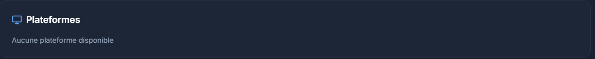

# Features
* Comparaison de bibliothèques entre joueurs — "X jeux en commun avec ce joueur". Sympa pour le côté social.
* Notifications (in-app ou email via Resend, que vous avez déjà configuré) — notifier quand quelqu'un commente un personnage qu'on a aussi commenté, ou quand un admin répond à une review.
* Système de session de jeu - Le joueur rentre ses sessions de jeu avec le temps passé, la date et le ou les jeux auxquels il a joué
* Système d'Objectifs - Un joueur se fixe des objectifs dans un temps imparti et peu les marquer comme complété un peu à la manière d'une todo un peu plus ciblé gaming
* Système de connexion aux différents comptes pour récupérer les jeux possédés
* Système pour proposer la création de collection selon les infos du joueur
* Mettre en place un système de publicité
* Système de rajout de jeu ou de personnage qui n'existe pas.

# Idées
* Elaborer le côté social
* Elaborer le magasin
* Elaborer l'esport
* Elaborer le training des joueurs
* Mettre en place un système de paiement pour débloquer des avatars et des bannières et en débloquer avec des succès

# Corrections
* Refaire une passe pour optimiser les requêtes et faire du lazy loading
* Intégrer les vidéos IGDB dans la synchronistation

* Dans la page des joueurs l'image de banner de chaque joueur doit apparaitre
* Mettre à jour vers NextJS 16.2 avant de mettre en ligne
* Changer le gradient pour que ce soit celui du cyan au violet plutot que celui du header actuel
* Changer couleur des boutons quand appuie sur filtre et du bouton annuler les filtres
* Améliorer la recherche qui n'affiche pas tous les jeux
